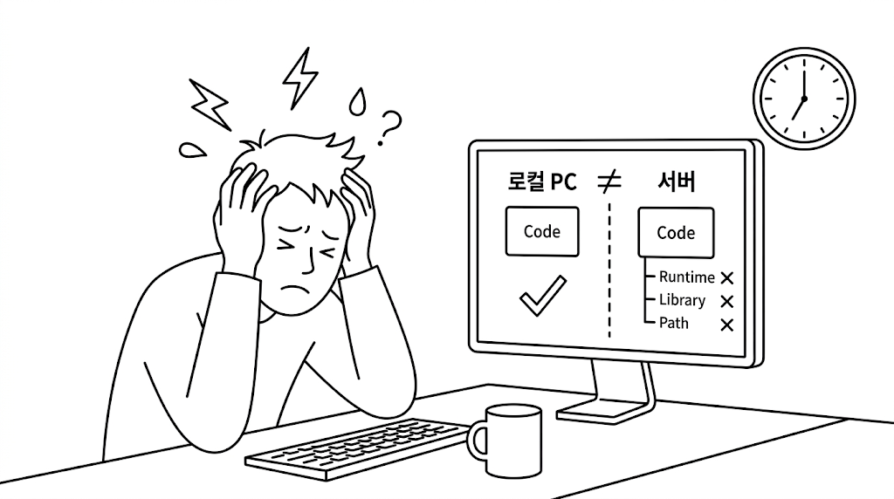
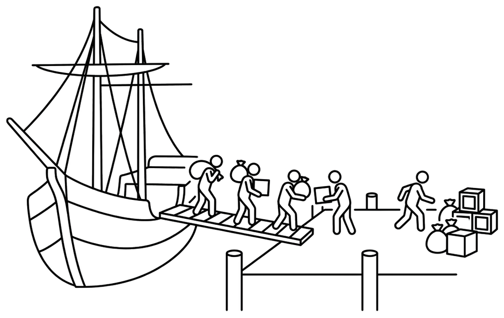
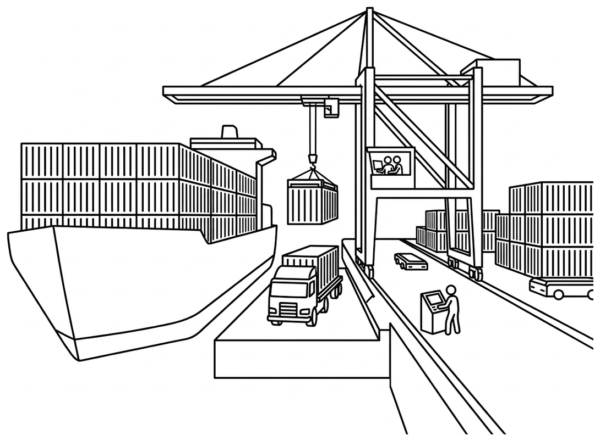

# Ch.1 왜 컨테이너인가

## 1.1 환경 불일치 - 같은 코드, 다른 결과

금요일 오후 일곱 시였습니다. 입사 3개월 차 오픈이는 사내 관리 도구의 화면 한 자리를 손보고 있었습니다. 변경 분량은 30줄 남짓. 로컬 PC에서 새 화면이 깔끔하게 떴고, 테스트도 모두 통과했습니다. 마감 전에 개발 서버에 올려 두면 끝나는 일이었습니다.

빌드 산출물을 서버에 올리고 실행 명령을 입력했습니다. 터미널이 한 박자 멈춘 뒤 빨간 글씨가 화면을 채웠습니다. 첫 줄은 런타임 버전이 맞지 않는다는 안내였습니다.

서버의 런타임 버전을 로컬에 맞춰 다시 명령을 쳤습니다. 이번에는 다른 줄에서 멈췄습니다. 의존하는 라이브러리 하나가 시스템 파일 위에서 동작하는데, 그 파일이 서버에 깔려 있지 않다는 메시지가 올라왔습니다. 부족한 파일을 채우자 곧바로 또 다른 에러가 떴습니다. 이번에는 로컬 경로 기준으로 적힌 설정 파일이 서버의 디렉터리 구조와 어긋나 있었습니다.

옆자리 동료에게 도움을 청했습니다.

**동료**: "제 PC에선 어제 잘 떴는데요. 환경 변수부터 다시 한번 살펴봐요."

오픈이는 환경 변수를 한 줄씩 비교했습니다. 서로 같았습니다. 그런데 서버에서는 여전히 같은 자리에서 멈췄습니다.

*'내 PC에선 분명히 됐는데.'*

한 줄을 고치면 다음 줄에서 또 다른 에러가 터졌습니다. 코드는 같은데 런타임 버전, 시스템 파일, 디렉터리 구조가 조금씩 어긋나 있었습니다.

*그림 1-1. 환경 불일치로 막힌 오픈이*

한참을 헤매고 있을 때, 휴게실에서 커피를 들고 돌아오던 선배가 모니터를 잠깐 들여다봤습니다.

**선배**: "환경이 달라서 그래요. Docker 한번 알아봐요."

오픈이는 퇴근 후 휴대폰으로 유튜브에 **도커(Docker)** 를 검색했습니다. 여러 영상 중 도커와 컨테이너의 역사라는 영상이 눈에 들어왔습니다.

## 1.2 컨테이너 - 항구에서 빌려온 이름

### 1.2.1 하역 인력이 배 한 척을 묶던 시절

*그림 1-2. 컨테이너가 없던 시절의 해상 물류*

1950년대 미국 동부의 한 항구. 수십 명의 인부가 화물 하나하나를 어깨에 메고 부두로 옮기고 있었습니다. 자루에 담긴 곡물, 묶음 단위의 나무 상자, 무거운 드럼통, 길이가 제각각인 철근 다발. 짐의 모양이 한결같지 않았습니다.

배 한 척을 다 비우는 데 며칠이 걸리던 시절이었습니다. 짐을 분류하고 트럭에 다시 실어 보내는 일까지 모두 사람의 손을 거쳤습니다. 기계를 쓸 수 있으면 좋았겠지만 짐의 규격이 제각각이라 크레인 한 종류로는 어림없었습니다. 화물을 받아 가야 할 트럭 운전사들은 길게 늘어선 줄 끝에서 며칠씩 차례를 기다렸습니다.

그 줄 한가운데에 미국 노스캐롤라이나의 트럭 운전사 **말콤 맥린**이 있었습니다. 매번 항구에서 흘려보내야 했던 시간을 두고 그가 품은 질문은 하나였습니다. 왜 짐을 통째로 옮기지 않을까.

### 1.2.2 표준 상자가 항구를 바꾼 날

*그림 1-3. 표준 컨테이너와 크레인으로 바뀐 현대 항구*

말콤 맥린이 꺼낸 답은 **표준 규격의 상자 하나**였습니다. 화물을 낱개로 다루지 말고 규격이 같은 상자에 통째로 담자는 것입니다. 상자의 규격만 정해두면 배든 기차든 트럭이든 그 상자에 맞춰 설계하면 됐습니다.

규격이 정해지자 항구가 바뀌었습니다. 크레인 하나가 상자를 통째로 들어 배에 올리고, 도착지에서도 같은 방식으로 내렸습니다. 안에 뭐가 들었는지 항구는 신경 쓰지 않았습니다. 규격이 같았기 때문입니다. 말콤 맥린은 전용 선박까지 직접 만들었고, '담는 그릇'이라는 뜻의 **컨테이너**(Container)가 이 분야의 표준 용어로 자리 잡았습니다.

며칠 걸리던 하역이 몇 시간으로 줄었습니다. 세계 물류가 통째로 바뀌었습니다.

영상이 끝났을 때 지하철 창밖으로 한강이 지나가고 있었습니다. '규격'이라는 단어가 머릿속에 잠시 떠올랐습니다. 오늘 낮의 에러도 결국 규격이 안 맞아서 생긴 일이었습니다.

*'런타임 버전, 시스템 패키지, 설정 경로가 한 상자에 통째로 들어 있었다면 두 시간을 그렇게 흘려보내지 않았을 텐데.'*

### 1.2.3 IT로 건너온 컨테이너

<svg viewBox="0 0 720 280" xmlns="http://www.w3.org/2000/svg" role="img" aria-label="표준 컨테이너에 담은 소프트웨어가 Windows·macOS·Linux에서 동일한 구성으로 실행">
  <defs>
    <marker id="g13-ar" markerWidth="10" markerHeight="10" refX="8" refY="3" orient="auto"><path d="M0,0 L0,6 L8,3 z" fill="#475569"/></marker>
  </defs>
  <text x="140" y="28" font-size="12" font-weight="700" fill="#7b341e" text-anchor="middle">표준 컨테이너</text>
  <rect x="20" y="40" width="240" height="200" rx="6" fill="#fff" stroke="#ff7849" stroke-width="2"/>
  <rect x="36" y="56" width="208" height="36" rx="3" fill="#fff7ed" stroke="#fed7aa"/>
  <text x="140" y="78" font-size="12" fill="#7b341e" text-anchor="middle">App (애플리케이션 코드)</text>
  <rect x="36" y="98" width="208" height="36" rx="3" fill="#fff7ed" stroke="#fed7aa"/>
  <text x="140" y="120" font-size="12" fill="#7b341e" text-anchor="middle">Libraries (의존 라이브러리)</text>
  <rect x="36" y="140" width="208" height="36" rx="3" fill="#fff7ed" stroke="#fed7aa"/>
  <text x="140" y="162" font-size="12" fill="#7b341e" text-anchor="middle">Config (설정·환경 변수)</text>
  <rect x="36" y="182" width="208" height="36" rx="3" fill="#fff7ed" stroke="#fed7aa"/>
  <text x="140" y="204" font-size="12" fill="#7b341e" text-anchor="middle">Runtime (런타임·시스템 파일)</text>
  <line x1="260" y1="140" x2="395" y2="65" stroke="#475569" stroke-width="1.5" marker-end="url(#g13-ar)"/>
  <line x1="260" y1="140" x2="395" y2="145" stroke="#475569" stroke-width="1.5" marker-end="url(#g13-ar)"/>
  <line x1="260" y1="140" x2="395" y2="225" stroke="#475569" stroke-width="1.5" marker-end="url(#g13-ar)"/>
  <rect x="400" y="30" width="300" height="70" rx="6" fill="#fff" stroke="#cbd5e1"/>
  <g transform="translate(440, 65)">
    <rect x="-14" y="-14" width="12" height="12" fill="#0078d4"/>
    <rect x="2" y="-14" width="12" height="12" fill="#0078d4"/>
    <rect x="-14" y="2" width="12" height="12" fill="#0078d4"/>
    <rect x="2" y="2" width="12" height="12" fill="#0078d4"/>
  </g>
  <text x="470" y="71" font-size="13" font-weight="700" fill="#1e293b">Windows</text>
  <rect x="560" y="48" width="130" height="34" rx="4" fill="#fff" stroke="#ff7849" stroke-width="1.5"/>
  <text x="625" y="69" font-size="11" fill="#7b341e" text-anchor="middle">동일한 컨테이너</text>
  <rect x="400" y="110" width="300" height="70" rx="6" fill="#fff" stroke="#cbd5e1"/>
  <g transform="translate(440, 145)">
    <path d="M1,-13 Q5,-17 8,-14 Q5,-12 1,-12 Z" fill="#475569"/>
    <path d="M-3,-12 C-10,-12 -13,-5 -12,2 C-10,10 -5,14 -2,13 C0,12 2,12 3,13 C6,14 10,10 12,2 C13,-5 10,-12 3,-12 C2,-13 1,-13 0,-12 Z" fill="#475569"/>
    <circle cx="10" cy="-3" r="3" fill="#fff"/>
  </g>
  <text x="470" y="151" font-size="13" font-weight="700" fill="#1e293b">macOS</text>
  <rect x="560" y="128" width="130" height="34" rx="4" fill="#fff" stroke="#ff7849" stroke-width="1.5"/>
  <text x="625" y="149" font-size="11" fill="#7b341e" text-anchor="middle">동일한 컨테이너</text>
  <rect x="400" y="190" width="300" height="70" rx="6" fill="#fff" stroke="#cbd5e1"/>
  <g transform="translate(440, 225)">
    <ellipse cx="0" cy="3" rx="9" ry="11" fill="#1e293b"/>
    <ellipse cx="0" cy="5" rx="5" ry="7" fill="#fff"/>
    <circle cx="0" cy="-7" r="6.5" fill="#1e293b"/>
    <circle cx="-2.5" cy="-8" r="1.5" fill="#fff"/>
    <circle cx="2.5" cy="-8" r="1.5" fill="#fff"/>
    <circle cx="-2" cy="-8" r="0.7" fill="#1e293b"/>
    <circle cx="3" cy="-8" r="0.7" fill="#1e293b"/>
    <path d="M-2.5,-5 L2.5,-5 L0,-2.5 Z" fill="#fbbf24"/>
    <ellipse cx="-4" cy="14" rx="3" ry="1.5" fill="#fbbf24"/>
    <ellipse cx="4" cy="14" rx="3" ry="1.5" fill="#fbbf24"/>
  </g>
  <text x="470" y="231" font-size="13" font-weight="700" fill="#1e293b">Linux</text>
  <rect x="560" y="208" width="130" height="34" rx="4" fill="#fff" stroke="#ff7849" stroke-width="1.5"/>
  <text x="625" y="229" font-size="11" fill="#7b341e" text-anchor="middle">동일한 컨테이너</text>
</svg>

*그림 1-4. 소프트웨어도 똑같이 표준 컨테이너에 담아 어디서든 같은 구성으로 실행*

집에 도착해 노트북을 펼쳤습니다. 영상 후반에 잠깐 다뤘던 IT의 컨테이너가 무엇인지 궁금해 검색을 이어 갔습니다. 항구의 사례와 IT의 사례는 닮은 점이 있었습니다.

애플리케이션이 돌아가려면 런타임, 라이브러리, 설정, 시스템 파일이 모두 필요합니다. 그런데 이 환경이 자리마다 조금씩 달라서 한쪽에서 실행되던 코드가 다른 쪽에서는 오류를 냅니다. 오픈이가 오늘 낮 두 시간을 흘려보낸 이유가 정확히 그 자리에 있었습니다.

해결 방식도 비슷했습니다. 애플리케이션과 **그 앱에 필요한 모든 것**을 한 상자에 담아두면, 안에 뭐가 들었든 규격이 같으니 어디서 실행해도 같은 결과가 나옵니다. IT에서 이 상자의 이름도 **컨테이너**입니다.

:::term-box
**컨테이너(Container)**: 애플리케이션과 그 애플리케이션이 필요로 하는 모든 것(라이브러리, 설정, 시스템 파일)을 하나의 상자에 담아, 어디서 실행해도 같은 결과를 내는 실행 단위입니다.
:::

IT에서 이 컨테이너를 만들고 다루는 도구는 따로 있었습니다.

## 1.3 Docker와 Kubernetes - 공장과 관제 센터

항구에서 표준 컨테이너가 자리 잡으려면 그 컨테이너를 찍어낼 **공장**이 필요했듯, IT의 컨테이너에도 그런 공장처럼 컨테이너를 찍어내는 도구가 있었습니다. 그 도구가 **Docker**입니다.

공장에는 설계도 한 장이 있고, 같은 설계도로 같은 모양의 컨테이너를 계속 찍어냅니다. Docker에서는 **이미지**가 설계도이고, 설계도에서 찍혀 나온 결과물이 **컨테이너**입니다. 이미지 하나로 같은 환경의 컨테이너를 여러 개 찍어낼 수 있습니다.

:::term-box
**Docker**: 컨테이너를 만들고 실행하는 도구입니다. 이미지를 빌드하고, 그 이미지로 컨테이너를 띄우고, 띄운 컨테이너를 종료하는 일까지 한 손에서 처리합니다.

**이미지(Image)**: 컨테이너를 찍어내는 설계도입니다. 애플리케이션 코드와 실행에 필요한 모든 것이 정지된 상태로 묶여 있습니다. 이미지 하나로 같은 환경의 컨테이너를 여러 개 만들 수 있습니다.
:::

공장이 같은 컨테이너를 부지런히 찍어내고 나면 다음 단계는 그 많은 컨테이너를 누가 관리하느냐입니다. 말콤 맥린의 시대에도 컨테이너가 수백, 수천 개가 되자 "**어느 배에 뭘 실을지, 고장 나면 누가 대체할지**"를 사람이 다 관리할 수 없었습니다. 결국 항만은 전체를 조율할 **관제 시스템**을 들여야 했습니다.

IT에서 그 일을 하는 도구가 **쿠버네티스(Kubernetes)** 입니다. "**이 서비스 몇 개를 항상 떠 있게 해줘**" 같은 **원하는 상태**만 선언해 두면, 하나가 죽었을 때 알아서 살리고, 숫자를 바꾸면 그에 맞춰 늘려줍니다.

:::term-box
**Kubernetes**: 다수의 컨테이너를 자동으로 관리하는 운영 도구입니다. 사람이 "원하는 상태"를 선언해 두면, 시스템이 그 상태를 24시간 유지하기 위해 컨테이너를 살리고, 늘리고, 교체합니다.
:::

*'공장이 생산하고, 관제 센터가 관리한다.'*

두 도구의 역할이 어떻게 갈리는지 표로 정리하면 다음과 같습니다.

| 구분 | Docker | Kubernetes |
|:----:|:-------|:-----------|
| 역할 | 컨테이너 만들고 실행 | 컨테이너 운영 자동화 |
| 비유 | 표준 컨테이너를 찍는 공장 | 수많은 배를 관리하는 항만 관제 센터 |
| 핵심 기능 | 이미지 빌드, 컨테이너 실행 | 자동 복구, 스케일링, 무중단 배포 |

## 1.4 학습 지도 - Docker에서 Kubernetes까지

이 책의 학습 여정은 다섯 챕터로 이어집니다.

  

    
1

    
CH02 · Docker

    
이해하기

    
컨테이너를 띄운다

  

  
→

  

    
2

    
CH03 · Docker

    
다루기

    
여러 개를 한 번에 묶는다

  

  
→

  

    
3

    
CH04 · Kubernetes

    
시작하기

    
자동으로 복구·확장한다

  

  
→

  

    
4

    
CH05 · Kubernetes

    
네트워킹

    
주소를 고정해 길을 낸다

  

  
→

  

    
5

    
CH06 · Kubernetes

    
운영하기

    
비밀·데이터를 지키고 통합 운영

  

*그림 1-5. 책 한 권 분량의 학습 여정. 한 단계씩 다음 챕터로 진화합니다*

각 챕터에서 다루는 내용은 다음과 같습니다.

- 챕터 2에서는 Docker가 격리된 공간을 만드는 원리를 짚습니다. 컨테이너 하나를 띄워 안을 들여다보고, 직접 이미지를 만들어 올립니다.
- 챕터 3은 웹 서버, 백엔드, 데이터베이스 여러 컨테이너를 한 번에 다룹니다. Dockerfile과 Docker Compose가 이번 도구입니다.
- 챕터 4부터는 Kubernetes로 넘어갑니다. 컨테이너를 한 단위로 묶고, 그 묶음의 개수를 자동으로 유지하는 매니저로 컨테이너가 죽거나 트래픽이 열 배가 될 때 대응합니다.
- 챕터 5에서는 컨테이너 주소가 매번 바뀌는 문제를 안정 진입점과 외부 진입 라우터로 잡습니다. 주소를 고정하고 길을 냅니다.
- 챕터 6은 비밀번호를 어디에 두고 데이터를 어떻게 보존하는지를 다룹니다. 챕터 3에서 만든 서비스를 Kubernetes 위에 얹어 마무리합니다.

이 책은 모든 코드와 명령어 옵션을 빠짐없이 다루기보다, **하나의 문제를 인식하고 어떤 도구가 그 문제를 푸는지** 그 개념과 흐름을 잡는 데 무게를 둡니다. GitHub에 올려둔 예제 코드를 직접 실행해 보면서 Docker와 Kubernetes의 개념을 함께 익혀 갑니다.

## 이것만은 기억하자

이번 챕터에서 짚은 내용을 세 줄로 정리하면 다음과 같습니다.

- **컨테이너는 표준 상자입니다.** 말콤 맥린이 화물을 표준 컨테이너에 담아 어디든 같은 방식으로 옮긴 것처럼, IT 컨테이너도 애플리케이션과 그것이 필요로 하는 모든 것을 한 상자에 담아 어디서든 같은 결과를 냅니다.
- **Docker는 공장, 이미지는 설계도, 컨테이너는 찍혀 나온 결과물입니다.** 이미지 하나로 같은 모양의 컨테이너를 여러 개 찍어낼 수 있습니다.
- **Kubernetes는 항만 관제 센터입니다.** 수많은 컨테이너를 자동으로 관리합니다. 사람이 "원하는 상태"만 선언하면 시스템이 그 상태를 유지합니다.

여기까지가 오픈이가 오늘 정리한 내용입니다.

다음 챕터에서는 Docker가 한 서버 안에서 여러 컨테이너를 서로 보이지 않게 쪼개는 원리, 그 컨테이너를 찍어내는 **이미지**가 무엇인지, 컨테이너 하나를 띄우고 안으로 들어가 보는 첫 실습까지 이어집니다.
