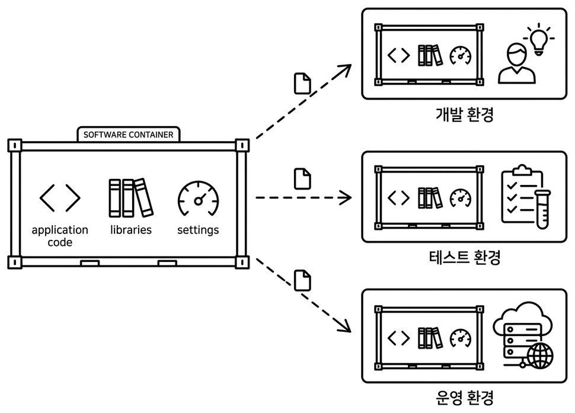
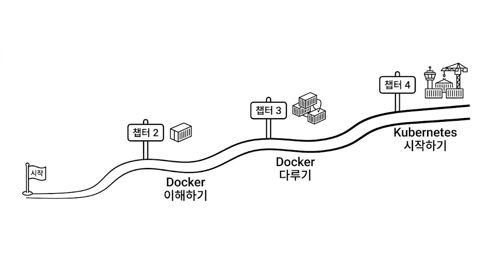

# Ch.1 왜 컨테이너인가

> 한 줄 요약: 컨테이너는 환경을 통째로 포장해서 어디서든 똑같이 실행하는 기술이다
> 핵심 개념: 컨테이너, Docker, Kubernetes

## 1.1 내 PC에선 됐는데 서버에선 안 됐다

입사 3개월 차 오픈이는 맡고 있는 서비스에서 기능 하나를 수정했습니다. 로컬에서 테스트까지 끝났고, 남은 건 개발 서버에 반영하는 일뿐이었습니다.

빌드한 결과물을 서버에 올리고 실행 명령을 쳤습니다. 터미널이 잠깐 멈춘 뒤 에러 로그가 쏟아졌습니다. 실행 파일이 서버의 런타임 버전과 맞지 않는다는 에러였습니다.

서버 쪽 런타임을 맞춰 다시 실행했습니다. 이번엔 다른 에러였습니다. 프로젝트가 쓰는 라이브러리 하나가 시스템 패키지에 의존하는데, 그 패키지가 서버에 깔려 있지 않다는 메시지였습니다. 패키지를 깔자 또 다른 스택 트레이스가 올라왔습니다. 설정 파일이 로컬 경로 기준으로 적혀 있어서 서버의 디렉터리 구조와 맞지 않았습니다.

*'내 PC에선 분명히 됐는데.'*

한 줄을 고치면 다음 줄에서 또 다른 에러가 터졌습니다. 로컬과 서버는 코드가 같은데 런타임 버전, 시스템 패키지, 파일 경로가 조금씩 달랐습니다. 같은 자리에서 벌써 두 시간째였습니다.

퇴근 시간이 가까워졌을 때, 옆자리 선배가 지나가다 모니터를 슬쩍 봤습니다.

**선배**: "환경이 달라서 그래. Docker 한번 알아봐."

오픈이는 노트에 'Docker' 한 단어를 적었습니다. 가방을 챙겨 사무실을 나왔습니다.

집에 돌아와 노트북을 켰습니다. 공식 소개 페이지 첫 문단이 낯선 단어로 시작했습니다. **컨테이너**. 해운 용어인 건 알고 있었는데 개발 도구에 왜 이 이름이 붙었는지는 몰랐습니다. 페이지 구석의 역사 소개 링크를 눌렀습니다.

## 1.2 항구에서 빌려온 이름

### 1.2.1 하역 인력이 배 한 척을 묶던 시절

*그림 1-1. 컨테이너가 없던 시절의 해상 물류*

스크롤을 내리자 1950년대의 오래된 흑백 사진이 글 옆에 실려 있었습니다. 배에서 내리는 화물을 수십 명이 어깨에 메고 부두로 옮기는 장면이었습니다. 자루, 나무 상자, 드럼통, 철근 다발. 짐의 크기와 모양이 전부 제각각이었습니다.

이 시절엔 배가 항구에 며칠씩 서 있었다고 적혀 있었습니다. 수백 명의 노동자가 화물을 하나씩 내리고 분류하고 트럭에 다시 옮겨 실었습니다. 기계를 쓰려 해도 짐의 규격이 제각각이라 쓸 수가 없었습니다. 트럭 운전사들은 화물을 기다리느라 항구에서 며칠씩 대기했습니다.

이 비효율을 가장 가까이서 본 사람이 있었습니다. 미국의 트럭 운전사 **말콤 맥린**. 그의 물음은 하나였습니다. 왜 짐을 통째로 옮기지 않을까.

### 1.2.2 표준 상자가 항구를 바꾼 날

*그림 1-2. 표준 컨테이너와 크레인으로 바뀐 현대 항구*

맥린이 꺼낸 답은 **표준 규격의 상자 하나**였습니다. 화물을 낱개로 다루지 말고 규격이 같은 상자에 통째로 담자는 것. 상자의 규격만 정해두면 배든 기차든 트럭이든 그 상자에 맞춰 설계하면 됐습니다.

규격이 정해지자 항구가 바뀌었습니다. 크레인 하나가 상자를 통째로 들어 배에 올리고, 도착지에서도 같은 방식으로 내렸습니다. 안에 뭐가 들었는지 항구는 신경 쓰지 않았습니다. 규격이 같았기 때문입니다. 맥린은 전용 선박까지 직접 만들었고, '담는 그릇'이라는 뜻의 **컨테이너**(Container)가 이 분야의 표준 용어로 자리를 잡았습니다.

며칠 걸리던 하역이 몇 시간으로 줄었습니다. 세계 물류가 통째로 바뀌었습니다.

'규격'이라는 단어에 오픈이는 손끝이 잠깐 멈췄습니다. 오늘 낮의 에러도 결국 규격이 안 맞아서였습니다.

### 1.2.3 IT로 건너온 컨테이너

*그림 1-3. 소프트웨어도 똑같이 표준 컨테이너에 담아 어디서든 같은 구성으로 실행*

IT에도 똑같은 문제가 있었습니다. 애플리케이션이 돌아가려면 런타임, 라이브러리, 설정, 시스템 파일이 모두 필요합니다. 이 묶음이 자리마다 조금씩 달라서 한쪽에서 되던 코드가 다른 쪽에서는 멈춥니다. 짐 모양이 제각각이라 배에 못 싣던 시대와 같은 문제였습니다.

답도 닮아 있었습니다. 애플리케이션과 **그 앱에 필요한 모든 것**을 한 상자에 담아두면, 안에 뭐가 들었든 규격이 같으니 어디서 실행해도 같은 결과가 나옵니다. IT에서 이 상자의 이름도 **컨테이너**였습니다.

:::term-box
**컨테이너(Container)**: 애플리케이션과 그 애플리케이션이 필요로 하는 모든 것(라이브러리, 설정, 시스템 파일)을 하나의 박스에 담아, 어디서 실행해도 같은 결과를 내는 실행 단위입니다. OS 전체를 복사해 넣는 것은 아니고, 리눅스 커널 자체는 호스트와 공유합니다. 이 구분은 챕터 2에서 다시 짚습니다.
:::

오픈이는 노트를 꺼내 오늘 낮에 겪은 에러를 옆에 적었습니다. 런타임 버전, 시스템 패키지, 설정 경로. 세 줄이 나란히 놓였습니다. 그 아래에 화살표를 그리고 **한 상자에 담기**라고 썼습니다.

## 1.3 Docker와 Kubernetes — 공장과 관제 센터

맥린의 아이디어가 실제로 움직이려면 표준 규격의 컨테이너를 찍어낼 **공장**이 있어야 했습니다.

그 공장을 IT에서 맡은 것이 **Docker**입니다. 공장에는 설계도 하나가 있고, 설계도로 같은 모양의 컨테이너를 계속 찍어냅니다. Docker의 **이미지**가 설계도이고, 설계도에서 찍혀 나온 것이 **컨테이너**입니다. 이미지 하나로 같은 환경의 컨테이너를 여러 개 찍어낼 수 있습니다.

컨테이너 수는 빠르게 늘어납니다. 맥린의 시대에도 그랬습니다. 수백, 수천 개가 되자 "어느 배에 뭘 실을지, 고장 나면 누가 대체할지"를 사람이 다 챙길 수 없었습니다. 항만은 전체를 조율할 **관제 시스템**을 들여야 했습니다.

IT에서 그 역할이 **Kubernetes**입니다. "이 서비스 몇 개를 항상 떠 있게 해줘" 같은 **원하는 상태**만 선언하면, 하나가 죽으면 알아서 살리고, 숫자를 바꾸면 그에 맞춰 늘려줍니다.

*'공장이 생산하고, 관제 센터가 관리한다.'*

오픈이는 노트에 Docker와 Kubernetes를 나란히 쓰고 두 이름 사이에 화살표를 그렸습니다.

| 구분 | Docker | Kubernetes |
|------|--------|------------|
| 역할 | 컨테이너 만들고 실행 | 컨테이너 운영 자동화 |
| 비유 | 표준 컨테이너를 찍는 공장 | 수많은 배를 관리하는 항만 관제 센터 |
| 핵심 기능 | 이미지 빌드, 컨테이너 실행 | 자동 복구, 스케일링, 무중단 배포 |

'관제 센터'는 K8s의 큰 그림을 잡기에 좋습니다. 다만 챕터 4부터는 한 가지 비유를 더 곁들입니다. **프랜차이즈 본사**입니다. 본사는 가맹점 한 곳 한 곳에 들어가 요리하지 않고, "서울 지역에 매장 50개 유지" 같은 지침만 내려보냅니다. K8s가 정확히 이 방식으로 움직입니다. 이름과 짝을 미리 맞춰 두면 챕터 4 이후가 한결 가볍습니다.

| 프랜차이즈 | Kubernetes | 역할 |
|------------|-----------|------|
| 본사 관리팀 | 컨트롤 플레인 | 전체를 관리·조율 |
| 가맹점 | Pod | 실제 서비스가 도는 단위 |
| 메뉴판 | ConfigMap | 공용 설정값 |
| 금고 속 레시피 | Secret | 비밀번호·키 같은 민감 정보 |

## 1.4 이 책의 학습 지도

*그림 1-4. 책 한 권 분량의 학습 여정*

창밖은 이미 깜깜했습니다. 오픈이는 노트에 챕터 번호를 적어 내려갔습니다.

- **챕터 2** — Docker가 격리된 공간을 만드는 원리. 컨테이너 하나 띄워서 안을 들여다보기. 직접 이미지 만들어 올려보기.
- **챕터 3** — 웹 서버, 백엔드, 데이터베이스 여러 컨테이너를 한 번에. Dockerfile과 Docker Compose.
- **챕터 4** — 하나 죽으면 누가 살리나. 트래픽 열 배 되면 누가 맞추나. Pod와 Deployment.
- **챕터 5** — Pod IP가 매번 바뀐다. Service와 Ingress로 주소 고정하고 길 내주기.
- **챕터 6** — 비밀번호는 어디에, 데이터는 어떻게 보존하나. 챕터 3에서 만든 서비스를 Kubernetes 위에 얹기.

각 챕터는 앞 챕터의 한계에서 시작합니다. 해결하면 새 한계가 나타나고, 그게 다음 챕터의 문제가 됩니다. 옵션을 외우기보다 **어떤 문제를 어떤 도구가 푸는지** 지도를 그리는 게 이 책이 하려는 일입니다.

*'내일 저녁부터 하나씩.'*

## 이것만은 기억하자

- **컨테이너는 표준 상자입니다.** 맥린이 화물을 표준 컨테이너에 담아 어디든 같은 방식으로 옮긴 것처럼, Docker 컨테이너도 애플리케이션과 그것이 필요로 하는 모든 것을 한 상자에 담아 어디서든 같은 결과를 냅니다.
- **Docker는 공장, 이미지는 설계도, 컨테이너는 찍혀 나온 결과물입니다.** 이미지 하나로 같은 모양의 컨테이너를 여러 개 찍어낼 수 있습니다.
- **Kubernetes는 항만 관제 센터입니다.** 수많은 컨테이너(배)를 자동으로 관리합니다. "원하는 상태"만 선언하면 시스템이 그 상태를 유지합니다.

다음 챕터에서는 그 상자가 실제로 어떻게 만들어지는지 봅니다. Docker가 한 서버 안에서 여러 상자를 서로 보이지 않게 쪼개는 원리, 그 상자를 찍어내는 **이미지**의 정체, 상자 하나를 띄우고 안으로 들어가 보는 첫 실습까지 이어집니다.
