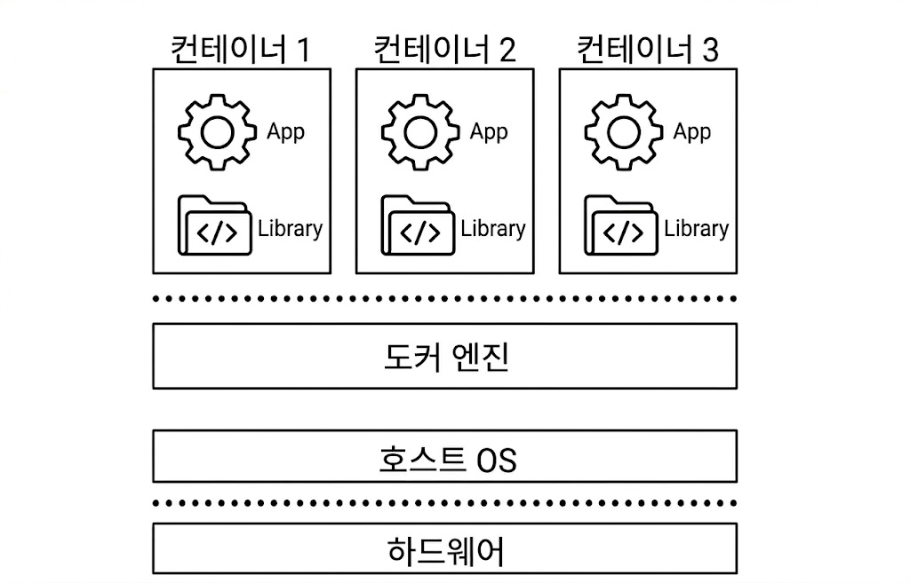
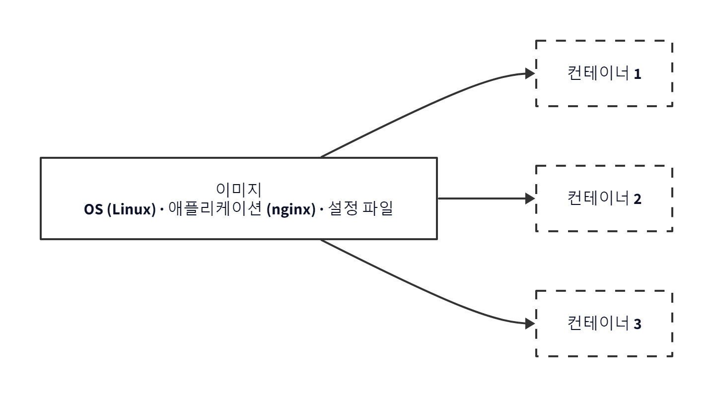
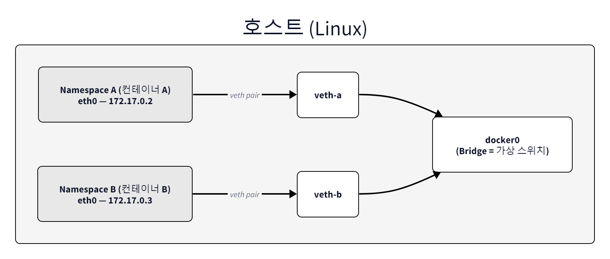
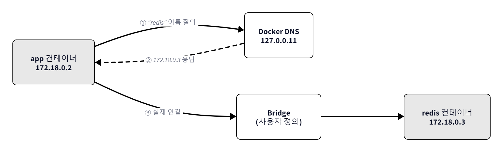

# Ch.2 Docker 이해하기

> 한 줄 요약: Docker는 이미지로 환경을 찍고 컨테이너로 실행한다
> 핵심 개념: 가상화, 컨테이너, 이미지, Docker CLI, 마운트

## 2.1 Docker 작동 원리

오픈이는 입사 3개월 차 주니어 개발자입니다. 컨테이너의 개념을 접한 뒤 한 가지 질문이 머릿속을 떠나지 않았습니다. 옆자리 선배에게 물었습니다.

> **오픈이**: "Docker가 뭔데 환경을 통째로 옮길 수 있는 거예요?"
>
> **선배**: "가상화부터 알아야 돼. 그래야 Docker가 보여."

### 2.1.1 가상화 : 하나의 컴퓨터를 여러 개로 사용하는 법

오픈이는 선배가 던진 키워드를 파고들기 시작했습니다.

> **가상화(Virtualization)** 는 하나의 물리 서버를 논리적으로 여러 대처럼 나누어 쓰는 기술입니다. 가상화를 도입하면 서버를 효율적으로 쓸 수 있고 서로 다른 환경을 안전하게 격리할 수 있습니다.

선배가 주방에 비유해 주었습니다.

> **선배**: "너 주방에 요리사 네 명이 같이 일하고 있다고 생각해 봐."


*하나의 주방을 공유하는 네 명의 요리사*

> **선배**: "**첫 번째 방법** 은 요리사 수만큼 주방을 통째로 복제하는 거야. 냉장고, 가스레인지, 싱크대 전부 따로 마련하는 거지. 서로 안 부딪히긴 하는데, 설비를 네 벌씩 갖춰야 하니까 돈이 장난 아니야."


*요리사별 독립 주방 — 주방 전체를 복제하는 방식*

> **선배**: "**두 번째 방법** 은 냉장고나 칼 같은 건 같이 쓰고, 조리대만 각자 따로 두는 거야. 자원은 아끼면서 각자 작업 공간은 확보되거든."


*기본 설비 공유 + 개별 조리대 — 컨테이너 가상화 비유*

> **선배**: "Docker 컨테이너 가상화가 딱 두 번째 방식이야."
>
> **오픈이**: "아~ OS를 통째로 복사하는 게 아니라, 쓸 건 같이 쓰고 공간만 따로 나누는 거네요?"

### 2.1.2 컨테이너 가상화 : OS 없이 격리하다

> **컨테이너 가상화(Container Virtualization)** 는 하나의 운영 체제를 함께 쓰면서 애플리케이션이 실행되는 환경만 따로 분리하는 방식입니다.

선배가 조금 더 깊이 설명해 주었습니다.

> **선배**: "서버에 OS가 깔려 있잖아, 그 핵심이 **커널** 이거든. 컨테이너 가상화는 이 커널을 여러 앱이 같이 쓰는데, 실행 공간만 따로 나누는 거야. 그 나눠진 공간 하나하나가 **컨테이너**고."

컨테이너 안에는 앱 실행에 필요한 라이브러리와 설정, 파일시스템만 들어 있습니다. OS 전체를 복제하지 않고, 커널은 호스트의 것을 함께 쓰면서 실행 환경만 격리합니다.


*컨테이너 가상화 구조*

컨테이너마다 파일시스템, 네트워크, 프로세스 공간이 분리되어 있어서 컨테이너 A에서 설치한 라이브러리가 컨테이너 B에 영향을 주지 않습니다.

### 2.1.3 Docker : 이미지에서 컨테이너까지

> **오픈이**: "근데 Docker가 이 컨테이너를 어떻게 만드는 건데요?"

선배가 터미널을 열었습니다.

> **선배**: "명령어 하나 따라가 봐. 흐름이 보일 거야."

**[참고]** nginx 컨테이너를 실행하는 명령어입니다.

```bash
docker run nginx   # nginx 컨테이너 실행
```

> **선배**: "이거 실행하면 **Docker 엔진** 이 요청을 받거든. 근데 Docker 엔진이 직접 컨테이너를 만드는 건 아니야. OS **커널** 한테 '격리된 프로세스 하나 만들어 줘' 하고 요청하는 거야."

> **커널(Kernel)** 은 운영체제(OS)의 핵심 구성 요소로, 프로세스를 만들고 실행 순서를 정하며, 프로세스끼리 서로 간섭하지 않도록 메모리를 보호합니다.

Docker 엔진의 요청을 받은 커널은 격리된 환경에서 새 프로세스를 만듭니다. 이것이 컨테이너입니다.


*docker run 실행 흐름*

### 2.1.4 Docker 이미지

> **오픈이**: "잠깐, 컨테이너가 격리된 프로세스면 뭘 기반으로 만들어지는 거예요?"
>
> **선배**: "좋은 질문이야. 컨테이너를 만들려면 설계도가 필요하거든. 그게 바로 **이미지**야."

이미지는 컨테이너를 만들기 위한 패키지입니다. 안에는 OS의 기본 라이브러리(커널 제외)와 애플리케이션, 설정 파일이 레이어(층)로 겹쳐 쌓인 구조입니다. 이미지는 붕어빵 틀과 같습니다. 틀(이미지) 하나로 붕어빵(컨테이너)을 여러 개 찍어낼 수 있고, 틀 자체는 변하지 않습니다.


*하나의 이미지로 여러 컨테이너를 만들 수 있다*

이미지는 **Docker Hub** 라는 저장소에서 가져다 쓸 수 있습니다. 직접 이미지를 만들어 Docker Hub에 올릴 수도 있습니다.


*Docker의 흐름*

전체 흐름을 정리하면 이렇습니다. Docker Hub에서 이미지를 내려받아 컨테이너를 실행하고, 컨테이너 안에서 작업한 뒤 수정한 내용을 새 이미지로 저장합니다. 이 이미지를 Docker Hub에 올리면 다른 사람도 가져다 쓸 수 있습니다.

오픈이는 이 흐름이 머릿속에 그려지기 시작했습니다.

> **오픈이**: "이미지 받고, 컨테이너 만들고, 수정하고, 다시 이미지로 저장하고... 이런 흐름이네요?"
>
> **선배**: "해보기 전에 하나만 보고 가자. **docker run** 한 줄 치면 컨테이너가 뿅 생기잖아. 근데 그 뒤에서 뭐가 벌어지는지 알아두면 나중에 안 헤매."

## 2.2 전체 그림 : docker run의 비밀

> **오픈이**: "뒤에서 뭐가 벌어지는데요?"
>
> **선배**: "크게 세 가지야. 그림으로 보면 금방이니까 한 번 따라와 봐."

### Step 1. 컨테이너 ↔ 호스트 연결 — Namespace + veth + docker0

> **선배**: "Docker가 제일 먼저 하는 게 뭐냐면, 컨테이너한테 방을 하나 줘. **Network Namespace**라고, 호텔 방 같은 거야. 각 방마다 IP도 따로, 포트도 따로. 옆 방에서 뭘 하든 서로 모르거든."
>
> **오픈이**: "그럼 방이 완전 격리되면 호스트(Docker가 돌아가는 컴퓨터)랑은 어떻게 연결돼요?"
>
> **선배**: "어릴 때 종이컵 전화기 만들어 봤지? 컵 두 개를 실로 연결하면 통화되잖아. Docker도 그거야. **veth pair** 라고, 가상 케이블 한 쌍을 만드는데 한쪽은 컨테이너 안에, 반대쪽은 **docker0** 라는 가상 스위치에 꽂아놔. 너 집 공유기 뒷면에 랜선 꽂는 거랑 똑같은 원리야. 이렇게 꽂히면 컨테이너가 호스트 네트워크에 연결된 거야."


*컨테이너마다 독립된 네트워크 공간이 만들어지고, docker0로 호스트에 연결된다*

| 도구 | 역할 | 비유 |
|------|------|------|
| **Network Namespace** | 컨테이너별 독립 네트워크 공간 | 호텔의 각 방 |
| **veth pair** | 컨테이너와 호스트를 잇는 가상 케이블 | 종이컵 전화기 |
| **docker0** | 여러 veth를 연결하는 가상 스위치 | 공유기 뒷면 LAN 포트 |

### Step 2. 외부 → 컨테이너 접근 — iptables DNAT 포트포워딩

> **오픈이**: "호스트까지는 됐는데, 외부에서는요? 다른 컴퓨터 브라우저에서 접속하면 그게 어떻게 컨테이너까지 가요?"
>
> **선배**: "컨테이너가 받는 IP가 **172.17.0.x** 이런 사설 IP거든. 바깥에서는 이 주소를 직접 못 찾아. 그래서 Docker한테 **'호스트 8080번 포트로 들어오면 컨테이너 80번 포트로 넘겨라'** 하고 알려주는 거야. 그러면 Docker가 **iptables** 라는 리눅스 경비원한테 규칙을 하나 등록해. 목적지 주소를 바꿔치기하는 건데, 이걸 **DNAT(Destination Network Address Translation)** 이라고 해."
>
> **오픈이**: "DNAT이 뭔데요?"
>
> **선배**: "택배 기사가 'A동 101호'로 왔는데, 경비원이 '그 사람 B동 305호로 이사 갔어요' 하고 배송지를 고쳐주는 거랑 같아. 패킷이 호스트 8080번으로 왔는데 iptables가 '그거 172.17.0.2:80으로 가야 돼' 하고 목적지를 바꿔주는 거지."


*iptables DNAT가 호스트 포트를 컨테이너 포트로 변환한다*

### Step 3. 컨테이너 간 통신 — Docker DNS

> **오픈이**: "그럼 컨테이너끼리 통신할 때는요?"
>
> **선배**: "같은 브리지에 연결돼 있으니까 IP로는 통신이 돼. 근데 컨테이너 재시작하면 IP가 바뀌거든. 매번 IP를 확인해서 쓰는 건 실용적이지 않아."
>
> **오픈이**: "이름으로는 못 찾아요?"
>
> **선배**: "**DNS(Domain Name System)** 라고, 이름을 IP 주소로 바꿔주는 시스템이 있거든. 브라우저에서 google.com 치면 DNS가 IP로 바꿔주는 거랑 같아. Docker도 **127.0.0.11** 에 자체 DNS 서버를 하나 돌려. 컨테이너 이름 등록해놓고, 누가 이름으로 물어보면 IP 알려주는 거야."


*Docker DNS가 컨테이너 이름을 IP로 변환한다*

> **오픈이**: "그럼 컨테이너 띄우기만 하면 바로 되는 거예요?"
>
> **선배**: "아니, 그냥 띄우면 기본 브리지에 들어가는데 거기선 DNS가 안 돼. **사용자 정의 브리지** 라고, DNS 기능이 추가된 네트워크를 따로 만들어서 컨테이너들을 묶어줘야 해. 안 묶으면 IP를 직접 쓰거나 호스트를 경유해야 돼."

### 전체 요약

| 순서 | Docker가 하는 일 | 사용하는 도구 |
|------|-----------------|-------------|
| 1 | 독립된 네트워크 공간 생성 | Network Namespace |
| 2 | 컨테이너와 호스트를 케이블로 연결 | veth pair |
| 3 | 케이블을 가상 스위치에 연결 | docker0 (Bridge) |
| 4 | 호스트 포트 → 컨테이너 포트 변환 | iptables DNAT |
| 5 | 컨테이너 이름 → IP 변환 | Docker DNS |

> **오픈이**: "docker run 한 줄인데 뒤에서 이렇게 많은 일이 벌어지는 거였네요."
>
> **선배**: "그래서 전체 그림을 먼저 본 거야. 이제 직접 깔아보자."

## 2.3 Docker Desktop : 설치

1. [Docker 공식 사이트](https://www.docker.com/products/docker-desktop/)에 접속하여 자신의 OS에 맞는 **Docker Desktop** 을 다운로드합니다.
2. 다운로드한 설치 파일을 실행하고, 안내에 따라 설치합니다.
3. 설치가 끝나면 Docker Desktop을 실행합니다.

> **Windows** 의 경우 Docker Desktop 설치 전에 **WSL2(Windows Subsystem for Linux 2)** 를 먼저 설치해야 합니다. Docker는 Linux 커널 기능을 사용해 컨테이너를 실행하는데 Windows에는 Linux 커널이 없으므로, WSL2에서 Linux 커널을 제공받아야 합니다.

설치가 끝났다면 터미널에서 다음 명령어로 정상 설치 여부를 확인합니다.

**[실습]** Docker 설치 상태를 확인하는 명령어입니다.

```bash
docker version   # Docker 버전 확인
```

Client와 Server 정보가 모두 출력되면 Docker가 정상적으로 설치된 것입니다.

## 2.4 Docker CLI : 기본 명령어

오픈이는 선배 옆에 앉아 터미널을 열었습니다.

> **오픈이**: "이제 직접 해볼게요."
>
> **선배**: "좋아, 이미지 내려받는 것부터 해보자."

### 2.4.1 docker pull : 이미지 다운로드

`docker pull` 명령어는 Docker Hub에서 이미지를 내려받습니다.

**[실습]** nginx 이미지를 다운로드하는 명령어입니다.

```bash
docker pull nginx   # nginx 이미지 다운로드
```


*nginx 이미지 다운로드*

### 2.4.2 docker run : 컨테이너 실행

이미지를 내려받았으니 이제 실행해 보겠습니다.

> **오픈이**: "이제 컨테이너 바로 띄워볼게요!"

**[실습]** nginx 이미지를 기반으로 컨테이너를 실행하는 명령어입니다. 실행하면 터미널이 잠기면서 추가 입력이 안 됩니다. 정상 동작이니 당황하지 마세요.

```bash
docker run nginx   # nginx 컨테이너 실행
```


*nginx 컨테이너 실행*

> **오픈이**: "어? 이게 끝이에요?"

명령어 한 줄로 컨테이너가 실행됐습니다. 그런데 문제가 생겼습니다. 터미널에 추가로 명령어를 입력할 수 없었습니다.

> **선배**: "지금 **포그라운드** 상태거든. 컨테이너가 터미널 잡고 있어서 다른 명령어를 못 쳐. **CTRL + C** 누르면 빠져나올 수 있어."

### 2.4.3 docker run -d : 백그라운드 실행

> **오픈이**: "컨테이너 띄워놓고 터미널도 쓸 수 있는 방법은 없어요?"
>
> **선배**: "있지. **-d** 옵션 붙이면 돼."

**[실습]** `-d` 옵션을 사용하여 nginx를 백그라운드에서 실행하는 명령어입니다.

```bash
docker run -d nginx   # -d : detached 모드
```

**컨테이너 ID** 가 출력되고 터미널은 입력 가능한 상태로 돌아옵니다. 컨테이너 ID는 실행할 때마다 달라집니다.


*백그라운드 실행 결과*

### 2.4.4 docker ps : 컨테이너 목록 출력

> **오픈이**: "근데 백그라운드면 진짜 돌아가고 있는 건지 어떻게 알아요?"
>
> **선배**: "**docker ps** 치면 바로 보여."

**[실습]** 실행 중인 컨테이너 목록을 출력하는 명령어입니다.

```bash
docker ps   # 실행 중인 컨테이너 출력
```


*컨테이너 목록 조회*

### 2.4.5 자주 사용하는 Docker 명령어

| 명령어 | 설명 | 예시 |
|--------|------|------|
| `docker pull <이미지명>` | Docker Hub에서 이미지 다운로드 | `docker pull nginx` |
| `docker images` | 로컬에 저장된 이미지 목록 조회 | `docker images` |
| `docker logs <컨테이너ID>` | 컨테이너 로그 출력 | `docker logs 057c` |
| `docker ps -a` | 종료된 컨테이너 포함 전체 목록 출력 | `docker ps -a` |
| `docker stop <컨테이너ID>` | 실행 중인 컨테이너 종료 | `docker stop 057c` |
| `docker rm <컨테이너ID>` | 종료된 컨테이너 삭제 | `docker rm 057c` |
| `docker rmi <이미지ID>` | 이미지 삭제 (`-f`로 강제 삭제) | `docker rmi -f fb01` |

## 2.5 Linux : 컨테이너 안에서 쓰는 명령어

> **오픈이**: "선배, 컨테이너 안에 직접 들어갈 수 있어요?"
>
> **선배**: "당연하지. 근데 안에 들어가면 리눅스야. 리눅스 명령어 모르면 아무것도 못 하거든."

Docker 명령어를 익혔으니 이번에는 컨테이너 내부를 살펴보겠습니다. 컨테이너 안은 리눅스 환경이므로 기본적인 리눅스 명령어를 알아야 자유롭게 돌아다닐 수 있습니다. 이 섹션에서는 Ubuntu 컨테이너에 nginx를 직접 설치하고 실행해 봅니다. Dockerfile 작성, 설정 파일 수정, 로그 확인 등 실제 Docker 작업에서 리눅스 명령어는 계속 나오므로 여기서 한 번 정리하고 넘어가겠습니다.

### 2.5.1 Ubuntu : 환경 세팅

> **선배**: "Ubuntu 하나 띄워서 안에서 이것저것 해보자. 포트포워딩도 걸어놓고."

리눅스 명령어 실습을 위해 Ubuntu 환경을 준비합니다.

**[실습]** Ubuntu 컨테이너를 실행하는 명령어입니다. `-p 80:80`은 포트포워딩 설정으로, 호텔 프런트에서 "305호 손님 찾습니다" 하면 내선전화로 연결해주는 것과 같은 원리입니다.

```bash
docker run -it -p 80:80 ubuntu   # 호스트의 80포트로 요청 시 컨테이너의 80포트로 요청 전달
```

> **포트포워딩(Port Forwarding)** 은 호스트 PC의 특정 포트로 들어오는 요청을 컨테이너 내부의 포트로 전달하는 기능입니다. `-p 호스트포트:컨테이너포트` 형식으로 사용합니다. 예를 들어, `-p 9000:8080`은 호스트의 9000번 포트로 들어온 요청을 컨테이너의 8080번 포트로 전달합니다.

`-it` 옵션은 `-i`(입력 가능), `-t`(터미널 환경 제공)를 조합한 옵션입니다.


*Ubuntu 컨테이너 실행*

### 2.5.2 탐색 명령어 : pwd, cd, ls, clear

현재 위치를 확인하고 원하는 디렉토리로 이동하며 파일 목록을 조회하는 기본 명령어입니다.

| 명령어 | 설명 | 예시 |
|--------|------|------|
| `pwd` | 현재 위치 경로 출력 | `/root` |
| `cd <경로>` | 해당 폴더로 이동 | `cd home` |
| `cd ..` | 상위 폴더로 이동 | |
| `ls` | 현재 폴더의 파일/폴더 목록 출력 | |
| `ls -l` | 상세 정보와 함께 목록 출력 | |
| `ls -a` | 숨김 파일 포함 전체 출력 | |
| `ls -la` | 숨김 파일 포함 상세 출력 | |
| `clear` | 터미널 화면 비우기 | |

#### 절대 경로와 상대 경로

> 최상위 폴더(/)부터 경로를 표기하는 방식을 **절대 경로**, 현재 위치를 기준으로 경로를 표기하는 방식을 **상대 경로** 라고 합니다.

예를 들어 /home/ubuntu 경로에서 /bin 폴더로 이동하려면 상대 경로 `cd bin`으로는 이동할 수 없고, 절대 경로 `cd /bin`으로 이동해야 합니다.

먼저 `cd /home/ubuntu`로 이동한 뒤, 상대 경로와 절대 경로의 차이를 확인해 보겠습니다.


*절대 경로로 이동*

실습 후 `cd /`로 루트 경로로 돌아갑니다.

### 2.5.3 파일/폴더 관리 : mkdir, touch, rm, cp, mv

폴더를 만들고, 파일을 생성하거나 복사·이동·삭제하는 명령어입니다.

| 명령어 | 설명 | 예시 |
|--------|------|------|
| `mkdir <폴더명>` | 폴더 생성 | `mkdir hello` |
| `touch <파일명>` | 빈 파일 생성 | `touch a.txt` |
| `rm <파일명>` | 파일 삭제 | `rm a.txt` |
| `rm -r <폴더명>` | 폴더 삭제 (하위 포함) | `rm -r hello` |
| `cp <원본> <사본>` | 파일 복사 | `cp a.txt b.txt` |
| `mv <원본> <대상>` | 파일 이동 또는 이름 변경 | `mv a.txt /tmp` |

> `mv`는 같은 경로에서 파일명만 변경하는 용도로도 사용할 수 있습니다. 예: `mv b.txt c.txt`

### 2.5.4 패키지 관리 : apt

> **오픈이**: "여기다 뭔가 설치하고 싶은데 어떻게 해요?"
>
> **선배**: "**apt** 쓰면 돼. 리눅스에서 뭔가 설치할 때 쓰는 거야."

컨테이너에는 기본적으로 최소한의 프로그램만 설치되어 있습니다. apt 명령어는 필요한 도구(nginx, vim 등)를 설치할 때 사용하는 패키지 관리 명령어입니다.

| 명령어 | 설명 |
|--------|------|
| `apt update` | 설치 가능한 패키지 목록을 최신 상태로 갱신 |
| `apt list \| grep <키워드>` | 패키지 검색 |
| `apt install -y <패키지명>` | 패키지 설치 (-y: 자동 승인) |

**[실습]** 패키지 목록 갱신 후 nginx를 설치하고 실행하는 명령어입니다.

```bash
apt update           # 패키지 목록 갱신
apt install -y nginx # 패키지 설치
nginx                # 패키지 실행
```


*nginx 설치 및 실행*

nginx 실행 후 포트 확인을 위해 `net-tools`를 설치합니다.

**[실습]** net-tools를 설치하고 포트 상태를 확인하는 명령어입니다.

```bash
apt install -y net-tools
netstat -nlpt
```


*포트 상태 확인*

80 포트가 열려 있는 것을 확인할 수 있습니다. 브라우저에 `localhost:80`으로 접속하면 nginx 페이지가 응답합니다.


*nginx 페이지 응답*

### 2.5.5 텍스트 편집 : vim

vim은 리눅스에서 흔히 사용되는 텍스트 편집기로, 서버 환경에서 설정 파일을 다룰 때 씁니다. 먼저 vim 패키지를 설치합니다.

**[실습]** vim 패키지를 설치하는 명령어입니다.

```bash
apt install -y vim
```


*vim 패키지 설치*

> 설치 도중 Geographic area와 Time zone을 선택하는 화면이 나타납니다. 이때 **Asia** , **Seoul** 을 각각 선택하면 됩니다.

vim의 핵심 사용 흐름은 다음과 같습니다.

| 단계 | 동작 | 키 |
|------|------|----|
| 1 | 파일 열기/생성 | `vim <파일명>` |
| 2 | 입력 모드 전환 | `i` |
| 3 | 내용 편집 | 자유롭게 입력 |
| 4 | 일반 모드로 복귀 | `ESC` |
| 5 | 저장 후 종료 | `:wq` 입력 후 Enter |

**[실습]** vim으로 파일을 생성하는 명령어입니다.

```bash
vim test1.txt   # test1.txt 파일 생성
```

생성된 파일에서 `i`를 눌러 입력 모드로 전환하고 내용을 작성한 뒤 `ESC` → `:wq`로 저장합니다.


*vim 편집 화면*

`cat` 명령어로 파일 내용을 확인합니다.

**[실습]** 파일 내용을 출력하는 명령어입니다.

```bash
cat test1.txt   # 파일 내용 출력
```


*파일 내용 출력*

vim 명령 행 모드에서 `:q`는 종료, `:q!`는 저장하지 않고 강제 종료입니다.

### 2.5.6 프로세스 관리 : ps, kill

실행 중인 프로세스를 확인하고 불필요한 프로세스를 종료할 때 사용하는 명령어입니다.

| 명령어 | 설명 | 예시 |
|--------|------|------|
| `ps -ef` | 실행 중인 전체 프로세스 출력 | |
| `ps -ef \| grep <키워드>` | 특정 프로세스 검색 | `ps -ef \| grep nginx` |
| `kill <PID>` | 프로세스 안전 종료 (SIGTERM) | `kill 357` |
| `kill -9 <PID>` | 프로세스 강제 종료 (SIGKILL) | `kill -9 357` |

### 2.5.7 파일 검색과 로그 확인 : find, tail

설정 파일의 위치를 찾거나 로그 파일의 최근 내용을 확인할 때 사용하는 명령어입니다.

| 명령어 | 설명 | 예시 |
|--------|------|------|
| `find <경로> -name <파일명>` | 파일 이름으로 위치 검색 | `find / -name index.html` |
| `find <경로> -name <패턴>` | 패턴으로 검색 (`*` 사용) | `find / -name index*` |
| `tail <파일>` | 파일 마지막 10줄 출력 | `tail access.log` |
| `tail -n <숫자> <파일>` | 마지막 N줄 출력 | `tail -n 50 access.log` |

**[실습]** 파일 이름으로 위치를 검색하는 명령어입니다.

```bash
find / -name index.html   # index.html 파일 위치 검색
```


*파일 검색 결과*

> **오픈이**: "선배, 컨테이너에서 빠져나오려면 어떻게 해요?"
>
> **선배**: "**exit** 치면 돼."

## 2.6 컨테이너 생명주기

> **선배**: "근데 빠져나오는 방법에 따라 컨테이너가 꺼지기도 하고 살아있기도 하거든."

### 2.6.1 exit vs detach

실행 중인 컨테이너에서 빠져나오는 방법에 따라 컨테이너가 종료될 수도 있고 계속 살아있을 수도 있습니다.

**[실습]** exit로 빠져나오면 컨테이너가 종료됩니다.

```bash
docker run -it --name dead ubuntu   # dead라는 이름의 ubuntu 컨테이너 실행
exit                                 # 컨테이너 종료
docker ps                            # 실행 중인 컨테이너 확인 → 없음
```


*컨테이너 실행*


*exit 후 컨테이너 종료*

> **오픈이**: "진짜 없어졌는데요..."
>
> **선배**: "이번엔 다른 방법으로 해봐."

**[실습]** `CTRL + P` -> `CTRL + Q`로 빠져나오면 컨테이너가 살아있습니다.

```bash
docker run -it --name alive ubuntu   # alive라는 이름의 ubuntu 컨테이너 실행
# CTRL + P → CTRL + Q 입력
docker ps                            # alive 컨테이너가 그대로 실행 중
```


*alive 컨테이너 실행*


*프로세스 유지 확인*

오픈이가 정리했습니다.

> **오픈이**: "**exit** 는 프로세스를 끄는 거고, **CTRL + P, Q** 는 연결만 끊는 거네요!"

### 2.6.2 -dit : 백그라운드 인터랙티브 실행

`docker run` 사용 시에 `-dit` 옵션은 다음과 같습니다.

| 옵션 | 역할 |
|------|------|
| `-d` | 백그라운드 실행 (detached) |
| `-i` | 입력 가능한 상태 유지 (interactive) |
| `-t` | 터미널 환경 제공 (TTY) |
| `-dit` | 위 세 옵션을 조합하여 백그라운드에서 터미널 입력이 가능한 상태로 실행 |

#### -d 옵션

> **오픈이**: "근데 아까 nginx는 **-d** 만으로 됐잖아요. ubuntu도 그러면 안 돼요?"
>
> **선배**: "안 돼. 직접 해봐."

하나씩 실행해 보겠습니다. 먼저 nginx 컨테이너를 실행합니다.

**[실습]** -d 옵션으로 nginx를 백그라운드에서 실행하는 명령어입니다.

```bash
docker run -d nginx   # nginx 백그라운드 실행
docker ps             # 실행 중인 컨테이너 확인
```


*nginx 백그라운드 실행*

`-d` 옵션으로 nginx 컨테이너를 실행하면 백그라운드에서 프로세스가 실행됩니다.

이번에는 ubuntu 컨테이너를 실행합니다.

**[실습]** -d 옵션으로 ubuntu를 실행하는 명령어입니다.

```bash
docker run -d ubuntu   # ubuntu 백그라운드 실행
docker ps              # 실행 중인 컨테이너 확인
```


*ubuntu -d 실행 후 종료*

실행 중인 컨테이너 목록에 ubuntu가 없습니다.

> **오픈이**: "어? ubuntu가 없는데요? 방금 실행했는데?"
>
> **선배**: "그래서 안 된다고 한 거야."

ubuntu 컨테이너는 `-d` 옵션만 쓰면 백그라운드에서 실행되었다가 즉시 종료됩니다.

> Docker 컨테이너는 메인 프로세스가 살아있는 동안만 유지됩니다. nginx는 웹 서버이므로 요청을 기다리며 혼자서 계속 실행됩니다. 반면 ubuntu의 메인 프로세스는 `bash`(사용자 명령을 받아 실행하는 프로그램)입니다. bash는 사용자가 명령을 입력해야 동작하기 때문에, `-it` 옵션으로 터미널을 연결하지 않으면 할 일이 없어 즉시 종료됩니다.

#### -dit 옵션

`-dit` 옵션을 쓰면 어떻게 될까요?

**[실습]** -dit 옵션으로 백그라운드에서 실행하는 명령어입니다.

```bash
docker run -dit ubuntu   # ubuntu 백그라운드 + 인터랙티브 실행
docker ps                # 실행 중인 컨테이너 확인
```


*ubuntu -dit 실행*

이번에는 ubuntu 컨테이너가 백그라운드에서 정상적으로 실행됩니다.

### 2.6.3 CMD : 컨테이너 시작 명령어 덮어쓰기

> **CMD(COMMAND)** 는 컨테이너가 시작될 때 실행되는 기본 프로세스를 정의하는 명령입니다. `docker run <이미지명> <CMD명령>`으로 직접 명령을 주면 `<CMD명령>` 옵션이 실행되며, 명령을 주지 않으면 이미지에 설정된 기본 CMD가 실행됩니다.

`sleep 1000`은 프로세스가 1000초 동안 대기하도록 만드는 명령입니다.

**[실습]** CMD 명령을 지정하여 ubuntu를 실행하는 명령어입니다.

```bash
docker run -d ubuntu sleep 1000   # sleep 명령으로 ubuntu 컨테이너 유지
docker ps                         # 실행 중인 컨테이너 확인
```

`sleep 1000`이 메인 프로세스가 되어 1000초 동안 대기하므로, ubuntu 컨테이너는 `-d` 옵션만으로도 종료되지 않고 유지됩니다.


*CMD로 프로세스 유지*

> **오픈이**: "아까 **-d** 만으로는 죽었는데 이번엔 살아있네요?"
>
> **선배**: "bash 대신 **sleep** 이 메인 프로세스가 됐으니까. 이렇게 뒤에 명령어 붙이면 기본 프로세스를 덮어쓸 수 있어."

### 2.6.4 attach : 실행 중인 컨테이너에 접근

> **오픈이**: "그럼 백그라운드에서 돌고 있는 컨테이너에 다시 들어가고 싶으면 어떻게 해요?"
>
> **선배**: "**attach** 랑 **exec** 가 있어."

실행 중인 컨테이너 내부로 접근하는 방법을 살펴보겠습니다. **attach** 와 **exec** 명령어를 씁니다.

> **attach 명령어** 는 현재 실행 중인 **메인 프로세스(PID 1)** 에 직접 접근하는 명령어입니다. `docker attach <컨테이너ID>` 명령어로 실행합니다.


*attach 명령어의 동작 방식*

ubuntu 컨테이너를 백그라운드로 실행합니다.

`attach` 명령어로 접근하면 ubuntu의 입력 터미널 창이 나타납니다.

**[실습]** attach 명령어로 실행 중인 컨테이너의 메인 프로세스에 접근하는 명령어입니다.

```bash
docker run -dit ubuntu  # ubuntu 백그라운드 실행
docker ps               # 실행중인 컨테이너 확인
docker attach d2b1      # attach로 접근
```


*attach로 접근*

`attach` 명령어는 **메인 프로세스(PID 1)** 에 직접 연결되므로, 여러 터미널에서 접속해도 모두 같은 화면과 같은 프로세스를 공유합니다.

다만 이 상태에서 잘못 빠져나와 메인 프로세스를 종료하면 컨테이너 전체가 종료되니 주의해야 합니다.

`CTRL+P`, `CTRL+Q`를 입력해 프로세스를 빠져나옵니다.

### 2.6.5 exec : 컨테이너에 새 프로세스로 접근

> **오픈이**: "**attach** 는 메인 프로세스에 직접 붙는 거잖아요. 좀 위험하지 않아요?"
>
> **선배**: "그래서 **exec** 가 있는 거야. 새 프로세스 하나 따로 만들어서 들어가니까 메인 프로세스 안 건드려."

> **exec 명령어** 는 현재 실행 중인 메인 프로세스가 아닌, 메인 프로세스와 동일한 환경의 **새로운 프로세스** 를 생성하여 접근하는 방식입니다. `docker exec <옵션> <컨테이너ID> <CMD>` 명령어로 실행합니다.


*exec 명령어의 동작 방식*

다음 명령어로 프로세스 내부에 접근합니다.

**[실습]** exec 명령어로 컨테이너 내부에 새 프로세스를 생성하여 접근하는 명령어입니다.

```bash
docker exec -it d2b1 bash   # 실행 중인 컨테이너에 새 bash 접속
```


*exec로 접근*

`exec` 명령어로 접근한 상태에서, 호스트 PC에서 **터미널을 하나 더 열어** 다음 명령어를 실행합니다.


*호스트에서 새 터미널 창 실행*

새 터미널에서 다음 명령어를 실행합니다. 컨테이너 내부에서 실행 중인 프로세스 정보를 출력합니다.

**[실습]** 컨테이너 내부에서 실행 중인 프로세스 목록을 출력하는 명령어입니다.

```bash
docker exec d2b1 ps aux   # 컨테이너 내부 프로세스 목록 확인
```

조회 결과에서 PID 1이 메인 프로세스이고 **PID 12** 가 `exec` 명령어로 접근할 때 생성된 프로세스입니다.


*프로세스 목록 확인*

`exec` 명령어로 실행된 프로세스는 **메인 프로세스(PID 1)** 에 영향을 주지 않고 독립적으로 명령을 실행합니다.

환경변수는 프로세스마다 따로 관리되므로, 메인 프로세스의 셸에서 추가한 환경변수는 `exec` 프로세스에서 보이지 않습니다.

## 2.7 이미지 만들기

> **오픈이**: "컨테이너 안에서 이것저것 설치했는데, 이 상태를 저장할 수 있어요?"
>
> **선배**: "컨테이너를 이미지로 구우면 돼. 직접 해보자."

### 2.7.1 Tomcat : 이미지 내려받기 & 실행하기

**[실습]** Tomcat 컨테이너를 실행하는 명령어입니다.

```bash
docker run -d -p 8080:8080 tomcat   # Tomcat 컨테이너 백그라운드 실행
```


*Tomcat 컨테이너 실행*

`docker ps`로 실행 중인 Tomcat 컨테이너를 확인합니다. **컨테이너 ID** 는 `5fcd`입니다.

오픈이가 브라우저에 `localhost:8080`으로 접속했습니다. 그런데 404 에러가 떴습니다.


*Tomcat 404 에러*

> **오픈이**: "에러 나는데요!"
>
> **선배**: "별도 컨트롤러 없으면 슬래시(/)로 들어온 요청은 서버 안에 index.html로 응답하거든. 근데 Tomcat 이미지에 webapps/ROOT/index.html이 없으니까 응답할 페이지가 없어서 404가 뜨는 거야."

### 2.7.2 Tomcat 컨테이너 수정 : index.html 만들기

> **오픈이**: "그럼 직접 만들면 되잖아요!"

Tomcat의 index.html 파일은 webapps/ROOT 폴더에 위치합니다. Tomcat 프로세스 내부로 접근해서 그 경로로 이동해 보겠습니다.

**[실습]** Tomcat 컨테이너 내부로 접근하는 명령어입니다.

```bash
docker exec -it 5fcd bash  # Tomcat 프로세스 연결
cd /usr/local/tomcat/webapps # webapps 경로 이동
```

> webapps 경로는 `find / -name webapps` 등으로 검색해 찾을 수 있습니다.

webapps 폴더에서 `ls` 명령어로 확인하면 내부가 비어 있습니다.


*webapps 폴더 비어있음*

webapps 폴더에 ROOT 폴더를 만들고 그 안에 index.html 파일을 작성합니다.

**[실습]** vim 패키지를 설치하고 index.html 파일을 생성하는 명령어입니다.

```bash
mkdir ROOT          # ROOT 폴더 생성
cd ROOT             # ROOT 폴더로 이동

apt update          # 패키지 최신화
apt install -y vim  # vim 패키지 설치
vim index.html      # index.html 파일 생성
```

vim은 터미널 기반 텍스트 편집기입니다. 처음 열리면 **일반 모드**라서 바로 타이핑이 안 됩니다. `i` 키를 누르면 **입력 모드**로 전환되어 내용을 입력할 수 있고, 입력이 끝나면 `ESC`를 눌러 일반 모드로 돌아온 뒤 `:wq`를 입력하고 `ENTER`를 누르면 저장 후 종료됩니다. 실수로 잘못 입력했다면 `:q!`로 저장하지 않고 나갈 수 있습니다.


*index.html 작성*

브라우저에서 `localhost:8080`으로 접속하면 방금 만든 index.html 페이지가 응답합니다.


*index.html 응답 확인*

> **오픈이**: "페이지 떴어요!"

### 2.7.3 docker commit : 이미지 굽기

> **선배**: "좋아, 이제 이 상태를 이미지로 구워보자."

먼저 컨테이너에서 빠져나옵니다. `exec`로 만든 셸이므로 `exit`를 입력해도 컨테이너는 종료되지 않습니다.

> **docker commit <컨테이너ID> <dockerhub아이디/이미지명:태그>** 형태로 명령어를 작성합니다. Docker Hub에서 계정과 리포지토리를 찾는 데 사용되므로, 본인의 Docker Hub 아이디로 변경해야 합니다.

**[실습]** 컨테이너의 현재 상태를 새 이미지로 저장하는 명령어입니다.

```bash
docker commit 5fcd <본인-dockerhub-id>/tomcat   # 컨테이너 현재 상태를 이미지로 저장
```


*이미지 커밋 완료*

### 2.7.4 docker push : Docker Hub에 저장

> **선배**: "이미지 만들어졌으니까 Docker Hub에 올려봐."

`docker login` 명령어로 Docker Hub에 로그인합니다. Docker Hub 계정이 없다면 [hub.docker.com](https://hub.docker.com/)에서 먼저 회원가입을 합니다.

**[실습]** Docker Hub에 로그인하는 명령어입니다.

```bash
docker login   # Docker Hub 로그인
```

Username과 Password를 입력한 뒤 ENTER를 누릅니다.

`docker push <이미지명>` 형태로 명령어를 실행하여 내 Docker Hub에 저장합니다.

**[실습]** 이미지를 Docker Hub에 업로드하는 명령어입니다.

```bash
docker push <본인-dockerhub-id>/tomcat   # 이미지를 Docker Hub에 업로드
```


*이미지 푸시 완료*

Docker Hub의 Repositories 탭에서 올린 이미지를 확인할 수 있습니다.


*Docker Hub 저장소 확인*

> **오픈이**: "이미지 하나면 누구든 같은 환경 그대로 쓸 수 있는 거네요!"

## 2.8 마운트 : 데이터 보존

오픈이는 실습을 마무리하며 컨테이너를 정리했습니다. 이전에 만든 컨테이너를 삭제하자 안에 저장해 둔 데이터까지 전부 사라졌습니다.

> **오픈이**: "DB 데이터 날아갔어요!"
>
> **선배**: "컨테이너 지우면 안에 있는 거 다 날아가. 휘발성이거든. 중요한 데이터나 로그는 **마운트**로 밖에 빼놔야 돼."

> **마운트(Mount)** 는 컨테이너 내부의 경로를 외부 저장소에 연결하는 기능입니다. 마운트를 사용하면 컨테이너가 삭제되어도 데이터는 외부에 그대로 남아 있습니다.

Docker는 두 가지 마운트 방식을 제공합니다. 로컬 PC의 폴더에 직접 연결하는 **바인드 마운트(Bind Mount)** 와 Docker가 관리하는 저장소를 사용하는 **볼륨 마운트(Volume Mount)** 입니다.

### 2.8.1 바인드 마운트 : 호스트 폴더를 직접 연결

> **바인드 마운트(Bind Mount)** 는 호스트 PC의 실제 폴더를 그대로 컨테이너 내부에 연결하는 방식입니다.


*호스트 PC의 폴더와 컨테이너 내부 폴더가 직접 연결*

**[실습]** 바인드 마운트를 설정하여 ubuntu 컨테이너를 실행하는 명령어입니다.

먼저 호스트에 마운트할 폴더를 생성합니다. 바인드 마운트는 호스트에 해당 경로가 존재해야 동작합니다.

```bash
# Windows
mkdir -p /c/app/bind

# Mac / Linux
mkdir -p ~/app/bind
```

```bash
# Windows
docker run -it --mount type=bind,src=C:/app/bind,dst=/app/bind ubuntu

# Mac / Linux
docker run -it --mount type=bind,src=$HOME/app/bind,dst=/app/bind ubuntu
```


*바인드 마운트 실행*

명령어를 실행하면 호스트의 `bind` 폴더와 컨테이너 내부의 `/app/bind` 폴더가 연결됩니다.

**[실습]** app 폴더의 내부를 확인하는 명령어입니다.

```bash
ls /app
```


*bind 폴더 확인*

`/app/bind` 폴더에 `a.txt` 파일을 생성합니다.

**[실습]** 마운트된 폴더에 파일을 생성하는 명령어입니다.

```bash
touch /app/bind/a.txt
```


*파일 생성 확인*

생성한 파일이 PC의 하드디스크에 저장됩니다.


*호스트 PC에 저장 확인*

오픈이가 확인했습니다.

> **오픈이**: "컨테이너 안에서 만든 파일이 제 PC에도 있어요!"

실습 후 **exit** 명령어로 컨테이너를 빠져나옵니다.

### 2.8.2 볼륨 마운트 : Docker가 관리하는 저장소

> **볼륨 마운트(Volume Mount)** 는 Docker 엔진 내부의 전용 저장 공간(Volume)을 컨테이너 폴더와 연결하는 방식입니다.


*Docker 엔진이 관리하는 내부 저장 공간에 데이터 저장*

다음 명령어로 현재 연결된 볼륨 정보를 확인합니다.

**[실습]** 현재 볼륨 목록을 확인하는 명령어입니다.

```bash
docker volume ls   # 볼륨 목록 확인
```


*볼륨 목록 조회*

연결된 볼륨이 없습니다. 다음 명령어로 볼륨이 연결된 컨테이너를 생성합니다.

`docker run -it --mount type=volume,src=<볼륨명>,dst=<컨테이너경로> <이미지>` 형태로 명령어를 실행합니다.

**[실습]** 볼륨 마운트를 설정하여 ubuntu 컨테이너를 실행하는 명령어입니다.

```bash
docker run -it --mount type=volume,src=metacoding-volume,dst=/app/volume ubuntu   # 볼륨 마운트로 ubuntu 실행
```


*볼륨 마운트 실행*

`/app/volume` 폴더가 자동으로 생성됩니다.


*volume 폴더 생성*

`/app/volume` 폴더 내부에 `b.txt` 파일을 생성합니다.

**[실습]** 볼륨 마운트된 폴더에 파일을 생성하는 명령어입니다.

```bash
touch /app/volume/b.txt
```


*b.txt 파일 생성*

`b.txt` 파일이 생성되었다면 볼륨에 저장된 것입니다.

`exit` 명령어로 컨테이너를 종료한 뒤 볼륨 정보를 확인합니다.

**[실습]** 컨테이너 종료 후 볼륨이 유지되는지 확인하는 명령어입니다.

```bash
exit
docker volume ls
```


*볼륨 유지 확인*

컨테이너는 종료되었지만 볼륨은 유지되고 있습니다. 새 컨테이너에 같은 볼륨을 연결하면 이전 데이터를 그대로 사용할 수 있습니다.

**[실습]** 새로운 컨테이너에서 기존 볼륨의 데이터를 확인하는 명령어입니다.

```bash
docker run -it --mount type=volume,src=metacoding-volume,dst=/app/volume ubuntu   # 볼륨 마운트로 ubuntu 재실행
ls /app/volume
```


*볼륨 데이터 재사용*

> **오픈이**: "컨테이너를 새로 만들었는데 이전 데이터가 그대로 있잖아요!"

새로 만든 컨테이너에서도 이전 컨테이너가 쓰던 볼륨의 데이터를 그대로 볼 수 있습니다. 볼륨이 컨테이너와 독립적으로 유지되기 때문입니다.

| 구분 | 바인드 마운트 | 볼륨 마운트 |
|------|------------|-----------|
| 저장 위치 | 호스트 PC의 지정 폴더 | Docker 엔진 내부 저장 공간 |
| 관리 주체 | 사용자 직접 관리 | Docker 엔진이 관리 |
| 경로 지정 | 절대 경로 필요 | 볼륨 이름만 지정 |
| 사용 사례 | 개발 중 소스 코드 공유, 설정 파일 연결 | DB 데이터 보존, 컨테이너 간 데이터 공유 |

## 이것만은 기억하자

- **이미지는 붕어빵 틀, 컨테이너는 붕어빵.** 하나의 이미지로 여러 컨테이너를 만들 수 있고, 수정한 컨테이너는 `commit`으로 새 이미지를 만들어 Docker Hub에 공유할 수 있습니다.
- **마운트는 외부 USB.** 컨테이너가 사라져도 마운트로 연결한 데이터는 외부에 안전하게 남아있습니다.
- **포트포워딩은 호텔 프런트.** 호스트의 포트로 들어온 요청을 컨테이너 내부의 포트로 전달합니다.

오픈이는 이제 컨테이너 하나를 만들 수 있게 되었습니다. 이미지도 만들고, Docker Hub에 공유하고, 데이터도 보존할 수 있습니다. 하지만 실제 서비스는 컨테이너 하나로 끝나지 않습니다. 웹 서버, 백엔드 API, 데이터베이스를 각각 컨테이너로 띄워야 하고, 사용자가 늘면 같은 서버를 여러 대 복제해야 합니다. 컨테이너를 하나씩 따로 실행하고 관리하는 건 한계가 있습니다.

> **오픈이**: "선배, 컨테이너를 여러 개 한꺼번에 관리하는 방법도 있어요?"
>
> **선배**: "그건 다음 장에서 하자."
