# Ch.3 Docker 다루기

며칠 동안 오픈이는 자투리 시간마다 docker pull과 docker run을 손에 익혔습니다. 어느 날 팀 회의에서 새 프로젝트 이야기가 나왔습니다. 사내용 웹 서비스인데, 프론트엔드와 백엔드, 그리고 데이터를 담을 DB까지 필요한 구성이었습니다. 팀장이 오픈이를 보며 말했습니다.

**팀장**: "환경 구성은 Docker로 해. 네가 이번에 공부했잖아."

오픈이는 고개를 끄덕였지만 머릿속은 복잡해졌습니다. 챕터 2에서 컨테이너를 띄우고 이미지를 만드는 것까지는 해봤습니다. 하지만 실제 서비스를 구성하려면 앱 하나만 띄워서 될 일이 아니었습니다. 프론트엔드, 백엔드, DB가 각각 컨테이너로 떠서 서로 맞물려 돌아가야 했기 때문입니다.

퇴근 후 노트북을 열었습니다. 프로젝트에 필요한 것들을 하나씩 도커로 직접 구성해 보며 부딪쳐 보기로 했습니다.

## 3.1 Dockerfile — 환경을 자동으로 만들기

### 3.1.1 매번 수동으로 깔기는 지친다

가장 먼저 떠오른 건 지난번의 수동 작업 과정이었습니다. 컨테이너에 접속해 apt update를 입력하고, vim을 설치하고, index.html 파일을 만든 뒤 docker commit으로 이미지를 남겼던 일 말입니다. 처음 한 번은 신기하고 재미있었지만, 똑같은 일을 반복하려니 벌써 손이 무거워졌습니다.

*'프로젝트 세팅할 때마다 매번 이걸 반복해야 할까?'*

패키지 명을 한 글자만 잘못 쳐도 처음부터 다시였습니다. 설정을 살짝 고치고 싶어도 전 과정을 반복해야 했습니다. 프로젝트를 본격적으로 시작하기 전에, 이 수동 작업부터 자동화해야겠다는 생각이 들었습니다.

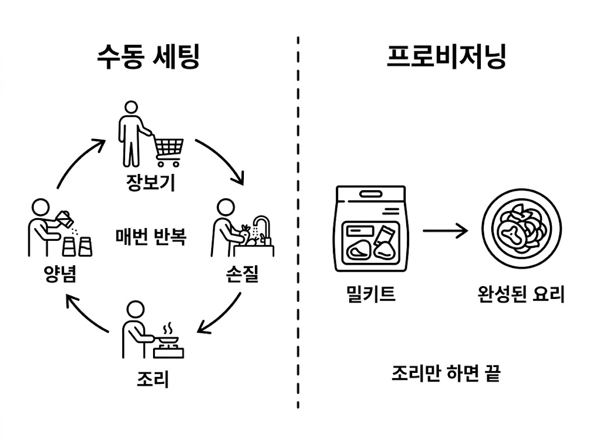

*그림 3-1. 수동 세팅과 Dockerfile 자동화 비교*

매번 같은 순서로 명령어를 입력하는 거라면, 그 순서를 어딘가에 적어두고 자동으로 실행하게 만들 수는 없을까요. 도커에는 이미 그런 역할을 하는 파일이 있었습니다. 바로 Dockerfile입니다.

Dockerfile은 요리 레시피와 비슷합니다. 재료와 조리 순서만 정확히 적어두면 누가 만들어도 같은 맛이 나는 레시피처럼 말입니다. 베이스 이미지, 설치할 패키지, 복사할 파일, 실행할 명령을 순서대로 적어두면 도커가 이를 읽어 자동으로 이미지를 만들어줍니다.

:::term-box
**Dockerfile**: 컨테이너가 실행될 때 필요한 환경을 자동으로 구성해 주는 이미지를 만들기 위한 스크립트입니다. 베이스 이미지, 설치할 패키지, 복사할 파일, 실행할 명령을 순서대로 적어둡니다.
:::

### 3.1.2 Dockerfile에서 컨테이너까지의 세 단계

Dockerfile에서 컨테이너가 실제로 실행되기까지는 크게 세 단계를 거칩니다.

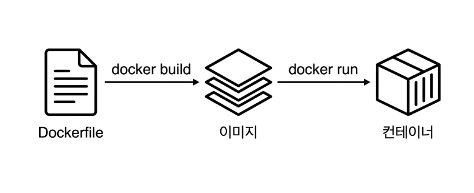

*그림 3-2. Dockerfile → 이미지 → 컨테이너의 세 단계*

1. **Dockerfile 작성**: 구축하고 싶은 환경을 텍스트 파일에 차례대로 적습니다.
2. **docker build**: 도커 엔진이 Dockerfile의 내용을 위에서 아래로 읽으며 실행합니다. 이 과정이 끝나면 결과물이 이미지로 저장됩니다.
3. **docker run**: 생성된 이미지를 기반으로 실제 컨테이너를 실행합니다.

컨테이너를 삭제하더라도 이미지는 그대로 남아 있습니다. 덕분에 똑같은 환경이 필요할 때마다 언제든 다시 띄울 수 있습니다. 지난번 수동으로 commit 명령어를 쳐서 만들었던 이미지의 빈자리를, 이제는 Dockerfile이 자동으로 채워주게 됩니다.

### 3.1.3 Dockerfile 기본 문법

오픈이는 먼저 도커파일에서 가장 자주 사용하는 지시어들을 정리해 보았습니다. 레시피를 적기 위한 일종의 '전용 단어'들입니다.

| 지시어 | 역할 |
|--------|------|
| `FROM` | 베이스 이미지를 지정합니다. (어떤 환경에서 시작할지) |
| `WORKDIR` | 컨테이너 내부에서 명령이 실행될 기본 디렉토리를 지정합니다. |
| `COPY` | 호스트 컴퓨터의 파일을 컨테이너 안으로 복사합니다. |
| `RUN` | 이미지를 빌드하는 동안 실행할 명령어입니다. (패키지 설치 등)|
| `ENV` | 컨테이너 안에서 사용할 환경 변수를 설정합니다. |
| `CMD` | 컨테이너가 실행될 때 기본적으로 실행되는 명령어입니다. |
| `ENTRYPOINT` | 컨테이너가 실행될 때 반드시 실행되는 메인 프로세스를 지정합니다. |

오픈이는 첫 실습으로 Ubuntu 환경에 vim이 미리 설치된 이미지를 직접 만들어보기로 했습니다. 메모장을 열고 아래 내용을 작성했습니다.

```dockerfile
# Dockerfile
FROM ubuntu:24.04                      # 베이스 이미지
RUN apt update && apt install -y vim   # vim 패키지 설치
CMD ["/bin/bash"]                      # 컨테이너 시작 시 bash 실행
```

작성한 파일을 저장하고 터미널에서 빌드 명령을 실행했습니다.(터미널은 Dockerfile이 위치하는 곳에서 실행해야 합니다.)

```bash
docker build -t ubuntu-vim .   # . 은 현재 폴더의 Dockerfile을 읽겠다는 뜻
```

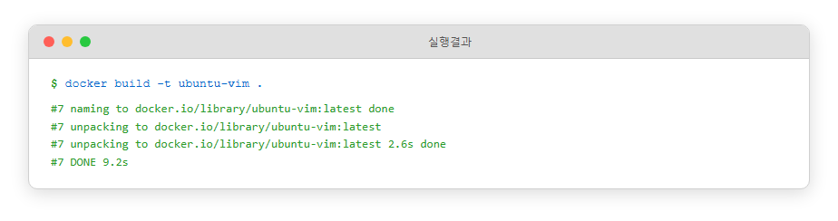

*그림 3-3. docker build 실행 결과*

화면에 빌드 로그가 한 줄씩 올라가더니 이미지가 완성되었습니다. 새로 만든 이미지로 컨테이너를 띄우자, 별도의 설치 과정 없이도 vim이 즉시 실행되었습니다.

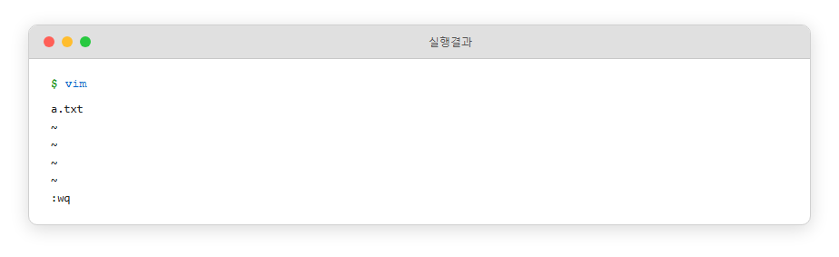

*그림 3-4. vim이 이미 설치된 상태로 컨테이너 실행*

지난번만 해도 컨테이너 접속, 업데이트, 설치, 종료, 커밋까지 다섯 단계를 일일이 수동으로 처리해야 했습니다. 하지만 이제는 **Dockerfile 하나와 명령어 한 줄로** 모든 과정이 끝났습니다.

Dockerfile로 필요한 패키지들은 설치했지만, 내 컴퓨터(호스트)에 있는 소스 코드를 컨테이너 안으로 어떻게 넣어야 할지 궁금해졌습니다. 프로젝트를 실제로 구동하려면 로컬의 파일들을 컨테이너 내부로 옮기는 과정이 반드시 필요했기 때문입니다. 이럴 때 사용하는 지시어가 바로 **WORKDIR**와 **COPY**입니다.

오픈이는 이 과정을 테스트해 보기 위해, 우선 Dockerfile과 같은 위치에 내용은 비어있는 **index.html** 파일을 하나 만들었습니다.

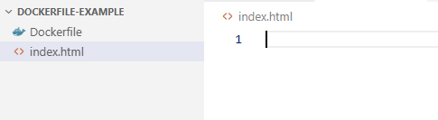

*그림 3-5. 폴더 및 파일 구조*

그리고 기존 Dockerfile에 내용을 덧붙였습니다. 작업 디렉토리를 /app으로 지정하고, 로컬의 index.html을 그 안으로 복사하도록 설정했습니다.

```dockerfile
FROM ubuntu:24.04                      # 베이스 이미지
WORKDIR /app                           # 작업 경로를 /app으로 설정
COPY ./index.html ./index.html         # 로컬의 index.html을 컨테이너의 /app으로 복사
RUN apt update && apt install -y vim   # vim 패키지 설치
CMD ["/bin/bash"]                      # 컨테이너가 시작될 때 자동으로 실행할 명령
```

이렇게 하면 WORKDIR 덕분에 컨테이너가 실행될 때 기본 경로가 /app이 되고, 그 안에 index.html이 미리 들어가 있게 됩니다. 오픈이는 설레는 마음으로 다시 빌드하고 컨테이너를 실행했습니다.

```bash
docker build -t ubuntu-html .    # . 은 현재 경로를 기준으로 Dockerfile을 읽어옴
docker run -it ubuntu-html       # ubuntu-html 이미지로 컨테이너 실행
ls
```

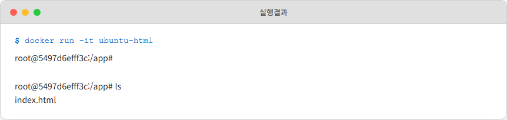

*그림 3-6. 실행 결과 확인*

예상대로 터미널은 접속하자마자 /app 경로를 가리키고 있었고, 그 안에는 index.html이 들어 있었습니다. 직접 들어가서 파일을 옮기거나 환경을 설정할 필요가 없어진 것입니다. 확인을 마친 오픈이는 만족스럽게 exit을 입력하고 컨테이너에서 빠져나왔습니다.

### 3.1.4 CMD와 ENTRYPOINT

앞선 실습에서는 CMD를 사용했습니다. 그런데 문법 표를 다시 보니 ENTRYPOINT라는 지시어도 눈에 띄었습니다.

*'둘 다 "실행할 명령" 같은데, 굳이 왜 나눠져 있을까?'*

두 지시어는 성격이 조금 다릅니다. 쉽게 비유하면 CMD는 기본 메뉴, ENTRYPOINT는 수저와 물 같은 존재입니다. 기본 메뉴는 손님이 다른 음식을 주문하면 바꿀 수 있지만, 수저와 물은 어떤 주문을 하든 반드시 테이블에 깔리는 것과 비슷합니다.

:::note
**CMD와 ENTRYPOINT**

- **CMD**: 컨테이너가 시작될 때 실행할 기본 명령입니다. docker run 명령어를 칠 때 뒤에 다른 명령을 입력하면 기존의 CMD는 무시됩니다.
- **ENTRYPOINT**: 컨테이너가 시작될 때 **반드시 실행되어야 하는 메인 프로세스입니다.** 외부 명령어로 쉽게 덮어쓸 수 없도록 고정됩니다.
- 둘을 같이 쓰면 ENTRYPOINT 뒤에 CMD가 붙어서 실행됩니다.
:::

오픈이는 실제 동작을 확인하기 위해 Dockerfile에 ENTRYPOINT를 추가해 보았습니다. echo 명령어로 메시지를 출력하는 간단한 구성입니다.

```dockerfile
FROM ubuntu:24.04                      # 베이스 이미지
WORKDIR /app                           # 작업 경로를 /app으로 설정
COPY ./index.html ./index.html         # 로컬의 index.html을 컨테이너의 /app으로 복사
RUN apt update && apt install -y vim   # vim 패키지 설치
CMD ["/bin/bash"]                      # ENTRYPOINT 뒤에 붙어서 실행됨
ENTRYPOINT ["echo", "컨테이너 실행"]     # 컨테이너 시작 시 실행되는 명령
```

Dockerfile에서 지시어 순서는 크게 상관없지만, 최종적으로는 ENTRYPOINT + CMD 조합이 적용됩니다. 오픈이는 이미지를 다시 빌드하고 컨테이너를 띄워봤습니다.

```bash
docker build -t ubuntu-entry .         # 이미지 생성
docker run -it ubuntu-entry            # 컨테이너 실행
```

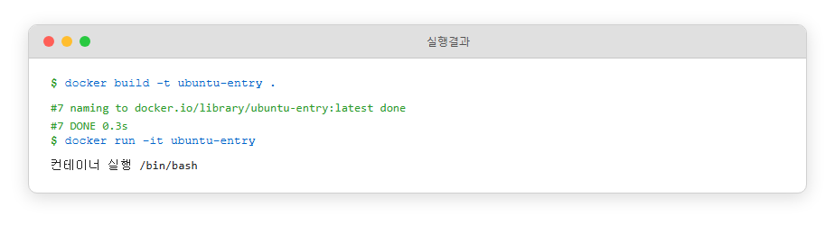

*그림 3-7. ENTRYPOINT 실행 결과*

결과 화면에는 **'컨테이너 실행 /bin/bash'** 라는 문구가 찍히고 프로세스가 바로 종료되었습니다. ENTRYPOINT가 설정되어 있으면 CMD는 독립적으로 실행되지 않고 뒤에 인자로 붙기 때문입니다. 결국 echo "컨테이너 실행" "/bin/bash"가 실행된 셈인데, echo는 출력 후 자기 할 일을 다하면 바로 종료되는 프로그램이라 컨테이너도 함께 꺼진 것입니다.

이런 방식은 실제 서비스를 배포할 때 유용합니다. ENTRYPOINT에는 서버 실행 명령어를 고정해두고, CMD에는 상황에 따라 바뀔 수 있는 옵션이나 파일명만 적어두면 이미지를 훨씬 유연하게 재활용할 수 있습니다.


*'수동으로 한참 동안 치던 설정들이 파일 한 장에 다 담겼네.'*

이미지를 자동으로 만드는 준비는 끝났습니다. 이제 진짜 프로젝트를 구성할 차례입니다. 

오픈이는 프론트엔드와 백엔드가 나누어진 구조에서, 사용자의 요청을 받아 알맞은 곳으로 보내줄 '앞단'을 먼저 세워보기로 했습니다.

## 3.2 NGINX — 요청을 앞에서 받아 나눠주기

### 3.2.1 왜 서버 앞에 NGINX를 둘까

오픈이는 화이트보드에 프로젝트 구조를 그려보았습니다. 프론트엔드와 백엔드 컨테이너가 각각 독립적으로 돌아가는 것은 좋았지만, 이 내부의 상세한 주소나 포트를 그대로 외부에 노출하는 방식은 보안상 위험해 보였습니다.

*'내부 인프라가 어떻게 구성되어 있든 사용자는 하나의 입구로만 들어오게 할 수 없을까? 복잡한 내부 구조는 감추면서 요청만 적절히 배분해 줄 단일 창구가 필요해.'*

자료를 찾던 오픈이의 눈에 들어온 해결책은 NGINX였습니다.

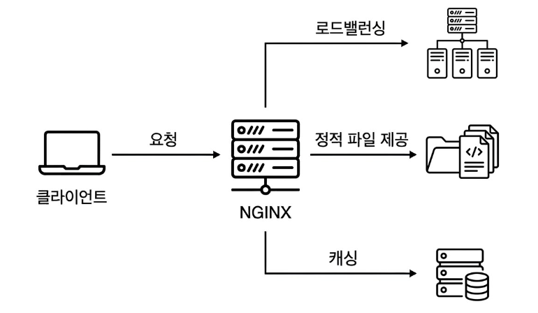

*그림 3-8. NGINX가 앞에서 요청을 받아 뒤의 서버들로 전달*

NGINX는 웹 서버이면서 동시에 요청을 중간에서 중계하는 **리버스 프록시(Reverse Proxy)** 역할을 수행합니다. 사용자의 요청을 NGINX가 대신 받아 뒤쪽의 실제 서버로 넘겨주고, 서버의 응답을 다시 받아 사용자에게 돌려주는 식입니다.

이렇게 하면 실제 서버의 IP 주소나 내부 포트를 외부에 드러내지 않아도 되어 보안에 유리합니다. 또한, 나중에 서버를 여러 대로 늘렸을 때 요청을 골고루 분산해 주는 로드밸런싱 기능까지 제공합니다. 오픈이는 서비스의 모든 요청이 거쳐 가는 단일 진입점으로 NGINX를 가장 앞단에 두기로 했습니다.

:::note
**프록시 / 리버스 프록시 / 로드밸런싱**

- **프록시**: 사용자가 인터넷상의 웹 사이트에 접속하려고 할 때, 사용자를 대신해 요청을 전달해 주는 중간 통로입니다. 주로 보안을 위해 개인 정보를 감추거나, 자주 가는 사이트의 데이터를 미리 저장해 두어 접속 속도를 높일 때 사용합니다.
- **리버스 프록시**: 인터넷에서 들어온 요청을 받아 내부 서버로 연결해 줍니다. NGINX의 주된 역할이며, 실제 서버의 위치를 숨겨 안전하게 보호하고 관리하는 데 쓰입니다.
- **로드밸런싱**: 하나의 서버에 부하가 몰리지 않도록 요청을 여러 서버에 골고루 나눠주는 방식입니다.
:::

### 3.2.2 NGINX 기본 문법 세 가지

NGINX가 요청을 나누어준다는 개념은 이해했지만, 정작 설정 파일을 어떻게 작성해야 할지가 고민이었습니다. nginx.conf 파일을 열어보니 처음 보는 지시어들이 쏟아져 나왔습니다.

*'upstream이 뭐지, location은 또 뭐지?'*

구조를 가만히 뜯어보니 크게 세 가지 덩어리로 나뉘어 있었습니다. 오픈이는 이를 배달 앱의 주문 흐름에 비유해 이해해 보기로 했습니다.

- **upstream** : 요청을 실제로 처리할 서버들을 그룹으로 묶고 이름을 붙이는 곳입니다. "A 식당"이라는 간판을 다는 단계라고 볼 수 있습니다.
- **location** : 어떤 URL 경로로 들어온 요청을 처리할지 정하는 곳입니다. "짜장면 주문이 들어오면"과 같은 조건을 거는 단계입니다.
- **proxy_pass** : 잡힌 요청을 어느 upstream(서버 그룹)으로 보낼지 지정하는 지시어입니다. "A 식당으로 배달해"라는 최종 전달 명령인 셈입니다.

세 지시어가 어떻게 맞물리는지 뼈대 코드로 정리하면 다음과 같습니다.

```nginx
upstream backend {                           # backend라는 이름으로 서버 그룹 등록
    server host.docker.internal:8080;        # 그룹에 속한 실제 서버 주소
}

server {
    listen 80;                               # 80번 포트로 들어오는 요청 대기
    server_name localhost;

    location / {                             # 모든 경로(/) 요청에 대해
        proxy_pass http://backend;           # backend 그룹으로 넘김
    }
}
```

이 뼈대 위에 세부적인 옵션을 얹으면 다양한 기능을 구현할 수 있습니다. 이번 절에서는 가장 대표적인 활용 사례인 경로 기반 라우팅, 로드밸런싱, 그리고 캐싱을 차례로 살펴보겠습니다.

### 3.2.3 실습 1 경로 기반 라우팅

오픈이는 가장 먼저 URL 경로에 따라 서로 다른 서버로 요청을 보내는 실습을 시작했습니다. /app1로 접속하면 1번 서버로, /app2로 접속하면 2번 서버로 요청이 가도록 만드는 방식입니다. 서비스가 여러 컨테이너로 나뉘어 있을 때 NGINX가 앞단에서 길을 갈라주는 구조입니다.

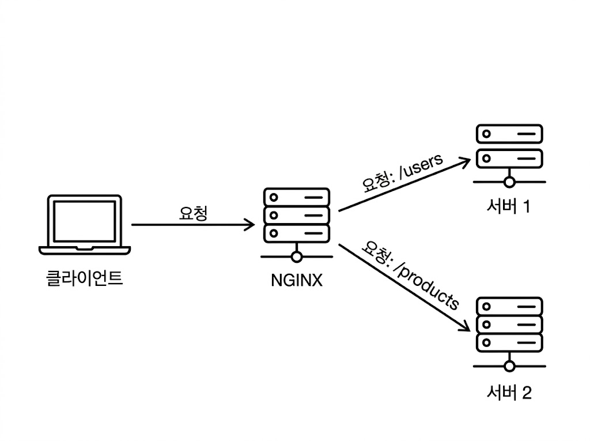

*그림 3-9. 경로 기반 라우팅 구조*

> 실습 코드: https://github.com/metacoding-10-linux-docker/docker/tree/master/ex01

오픈이는 먼저 화면에 띄워둔 폴더 구조를 확인했습니다. 세 개의 컨테이너(app1, app2, lb)가 각각의 Dockerfile을 통해 실행되는 구조입니다.

```text
ex01/
├── app1/
│   ├── Dockerfile       # nginx 이미지 + index.html 복사
│   └── index.html       # "Hello from app1" 페이지
├── app2/
│   ├── Dockerfile       # nginx 이미지 + index.html 복사
│   └── index.html       # "Hello from app2" 페이지
├── lb/
│   ├── Dockerfile       # nginx 이미지 + nginx.conf 복사
│   └── nginx.conf       # 로드밸런싱 + 경로 라우팅 설정
└── README.md            # 실습 안내
```

이번 실습의 핵심은 lb 폴더의 nginx.conf였습니다. 오픈이는 메모장을 열고 경로에 따라 서버 그룹을 매칭해주는 설정을 작성했습니다.

**ex01/lb/nginx.conf**
```nginx
upstream app1 {
    server host.docker.internal:8000;     # 호스트의 8000번 포트 = app1 컨테이너
}

upstream app2 {
    server host.docker.internal:9000;     # 호스트의 9000번 포트 = app2 컨테이너
}

server {
    listen 80;

    location /app1 {                      # /app1 요청은
        proxy_pass http://app1/;          # app1 upstream으로
    }

    location /app2 {                      # /app2 요청은
        proxy_pass http://app2/;          # app2 upstream으로
    }
}
```

설정을 마친 오픈이는 ex01 폴더 안의 실습 파일들로 세 컨테이너를 순서대로 빌드하고 실행했습니다.

```bash
docker build -t app1 ex01/app1 && docker run -dit -p 8000:80 app1   # app1 빌드+실행 (8000)
docker build -t app2 ex01/app2 && docker run -dit -p 9000:80 app2   # app2 빌드+실행 (9000)
docker build -t lb ex01/lb && docker run -dit -p 80:80 lb           # 로드밸런서(nginx) 빌드+실행 (80)
```

준비가 끝나고 브라우저 주소창에 localhost:80/app1을 입력하자 app1 서버가 응답했습니다. 이어서 /app2로 주소를 바꾸자 이번에는 app2 서버의 화면이 떴습니다.

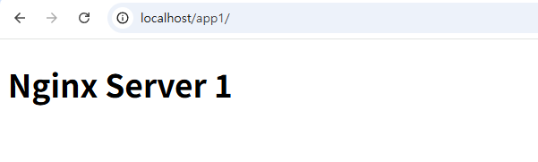

*그림 3-10. /app1 경로로 접속한 결과*

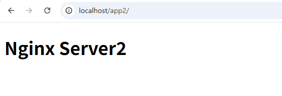

*그림 3-11. /app2 경로로 접속한 결과*

URL 경로만 달라졌을 뿐인데 서로 다른 서버가 응답하고 있었습니다. location이 요청을 낚아채고, proxy_pass가 해당 upstream으로 넘겨준 결과입니다.

#### host.docker.internal이 왜 필요했나

nginx.conf를 작성하던 오픈이의 눈에 계속 걸리는 지점이 하나 있었습니다. 바로 host.docker.internal:8000이라는 주소입니다. 구조를 가만히 보니 lb 컨테이너가 app1 컨테이너를 직접 부르는 게 아니라, 호스트 PC를 한 번 거쳐서 돌아가는 방식이었습니다.

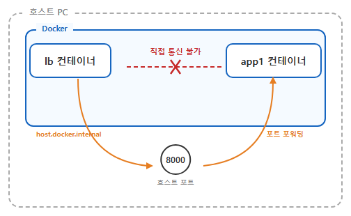

*그림 3-12. lb 컨테이너 → 호스트 PC → app1 컨테이너로 가는 우회 경로*

이유는 앞서 챕터 2에서 다뤘던 네트워크의 특성 때문이었습니다. 세 컨테이너를 **docker run** 명령어로 각각 따로 실행했기 때문에, 이들은 도커의 기본 네트워크에 속합니다. 이 기본 네트워크 안에서는 컨테이너끼리 서로의 이름(app1, app2 등)을 불러서 통신할 수 있는 기능이 없습니다. 그래서 어쩔 수 없이 "lb → 호스트 포트 → app1"이라는 우회 경로를 선택한 것입니다.

:::term-box
**host.docker.internal**: 컨테이너 내부에서 '호스트 PC' 그 자체를 가리키는 특수 주소입니다. 컨테이너 안에서 localhost라고 입력하면 호스트 PC가 아닌 **컨테이너 자기 자신을** 가리키게 됩니다. 따라서 호스트 PC에 열려 있는 포트에 접근하려면 이 **별칭을** 사용해야 합니다. 
:::

오픈이는 이 우회 방식이 다소 번거롭고 복잡하다는 인상을 받았습니다. 하지만 이 문제는 곧 이어질 3.3절에서 배울 '사용자 정의 네트워크'를 통해 해결됩니다. 

### 3.2.4 실습 2 로드밸런싱

경로에 따라 서버를 나누는 방법은 이제 익혔습니다. 하지만 문득 똑같은 앱을 두 대, 세 대로 복제해서 운영하려면 NGINX 설정을 어떻게 바꿔야 할지 궁금해졌습니다.

*'업스트림을 여러 개 만들어야 할까? 아니면 하나 안에 서버 주소를 여러 개 넣을 수 있을까?'*

답은 후자였습니다. upstream 블록 안에 server 줄을 추가하기만 하면 NGINX가 들어오는 요청을 순서대로 뿌려줍니다. 마치 놀이공원 매표소 창구 두 곳이 손님을 번갈아 가며 받는 것과 비슷합니다. 이러한 방식을 **라운드 로빈(Round Robin)** 이라고 부릅니다.

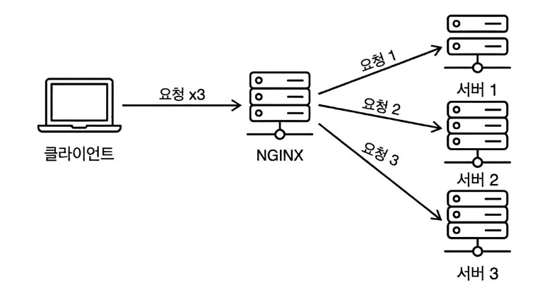

*그림 3-13. 라운드 로빈 로드밸런싱 구조*

> 실습 코드: https://github.com/metacoding-10-linux-docker/docker/tree/master/ex02

이번 실습은 ex02 폴더에 들어 있습니다. 이전 실습과 달라진 점은 크게 세 가지였습니다. 똑같은 앱을 여러 대 띄울 것이라 app2 폴더가 사라졌고, nginx.conf에서 app1 그룹에 서버 줄이 늘어났으며, 불필요해진 app2 관련 설정들은 모두 빠졌습니다.

**ex02/lb/nginx.conf** (달라진 블록)
```nginx
upstream app1 {
    server host.docker.internal:8000;     # 첫 번째 서버
    server host.docker.internal:8001;     # 같은 그룹에 두 번째 서버 추가
}

server {
    listen 80;
    location /app1 {
        proxy_pass http://app1/;          # 자동으로 두 서버에 번갈아 분배 (라운드 로빈)
    }
}
```

오픈이는 같은 이미지를 사용해 컨테이너를 두 번 띄우기로 했습니다. 이때 호스트의 포트만 다르게 지정하여 서로 충돌하지 않게 설정했습니다.

```bash
docker build -t app1 ex02/app1
docker run -dit -p 8000:80 app1   # 서버 1
docker run -dit -p 8001:80 app1   # 서버 2 (같은 이미지, 다른 포트)

docker build -t lb ex02/lb
docker run -dit -p 80:80 lb
```

설정을 마치고 브라우저에서 localhost:80/app1에 접속해 보았습니다. 새로고침을 반복해도 화면에 보이는 HTML 내용은 똑같았습니다.

오픈이는 실제 동작 여부를 확인하기 위해 각 Docker Desktop의 컨테이너 로그를 확인했습니다.

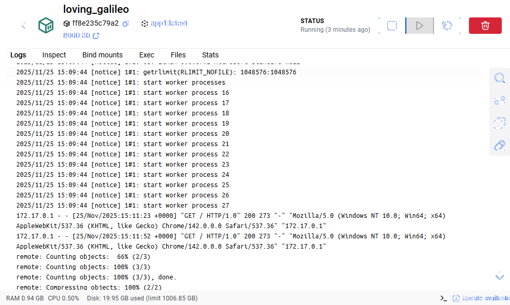

*그림 3-14. 8000 포트 컨테이너 로그에 찍힌 요청*

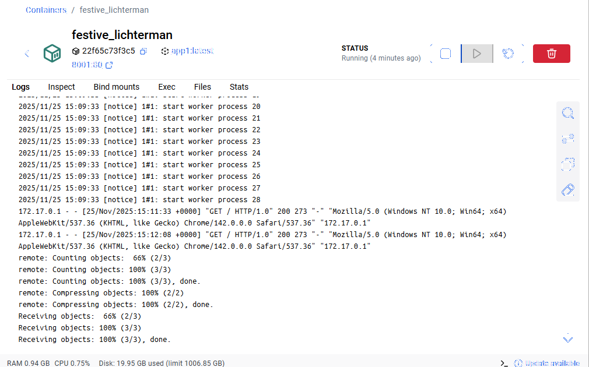

*그림 3-15. 8001 포트 컨테이너 로그에 찍힌 요청*

새로고침을 할 때마다 요청이 8000번 컨테이너와 8001번 컨테이너로 번갈아 들어오는 것을 눈으로 확인할 수 있었습니다. 설정 파일에 server 줄 하나를 추가했을 뿐인데, NGINX가 알아서 트래픽을 두 대의 서버로 나누어 보내준 것입니다. 별도의 복잡한 세팅 없이도 기본적으로 라운드 로빈 방식이 적용된 결과였습니다.

*'서버가 100대로 늘어나도 결국 이 파일에 한 줄만 더 추가하면 끝나는 거네. 되게 간단하네?'*

오픈이는 NGINX를 활용한 부하 분산의 편리함을 실감하며 다음 실습으로 넘어갔습니다.

### 3.2.5 실습 3 캐싱

로드밸런싱 테스트를 하던 오픈이는 문득 백엔드 서버의 로그를 보고 멈춰 섰습니다. 새로고침을 할 때마다 화면에 있는 똑같은 로고 이미지 파일 요청이 백엔드까지 계속 전달되고 있었기 때문입니다.

*'똑같은 파일인데 굳이 매번 백엔드까지 가서 가져와야 하나? 요청이 몰리면 서버에 부하가 많겠는데...'*

자주 꺼내 입는 옷을 옷장 깊숙이 넣지 않고 옷걸이에 따로 걸어두는 것처럼, 자주 요청되는 파일을 NGINX 앞단에 잠시 보관해두면 효율적입니다. 이 과정을 **캐싱(Caching)**이라고 부릅니다.

캐싱을 적용하면 응답 상태는 크게 두 가지로 나뉩니다. MISS는 캐시에 저장된 파일이 없어 백엔드 서버까지 다녀온 상태를 말하고, HIT은 캐시에 이미 보관된 파일을 백엔드 거침 없이 바로 돌려준 상태를 의미합니다.

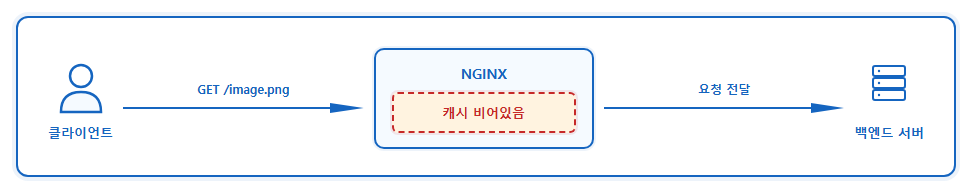

*그림 3-16. 첫 번째 요청 (MISS) — 캐시가 비어있어 백엔드까지 요청 후 응답을 캐시에 저장*


*그림 3-17. 두 번째 요청 (HIT) — 캐시에 저장된 응답을 바로 반환, 백엔드 접근 없음*

> 실습 코드: https://github.com/metacoding-10-linux-docker/docker/tree/master/ex03

이번 캐싱 실습은 ex03 폴더에 준비되어 있습니다. 이미지 파일을 응답으로 내려주는 간단한 파이썬 Flask 기반 API 서버를 활용합니다.

```text
ex03/
├── api/                 # 백엔드 (Flask)
│   ├── app.py           # /image 라우트에서 image.png 반환
│   ├── Dockerfile       # Python 이미지 + app.py·image.png 복사
│   └── image.png        # 응답으로 내려주는 이미지 파일
├── nginx/               # NGINX (캐싱 + 프록시)
│   ├── Dockerfile       # nginx 이미지 + nginx.conf 복사
│   └── nginx.conf       # proxy_cache 설정 + 프록시 라우팅
└── README.md            # 실습 안내
```

이번 설정에서 핵심이 되는 지시어는 **proxy_cache_path**와 **proxy_cache**입니다.
proxy_cache_path로 어디에 얼마만큼 보관할지 틀을 짜고, location 블록 안에서 그 캐시를 쓸지 말지를 결정하는 구조입니다. 

**ex03/nginx/nginx.conf**
```nginx
# 캐시를 저장할 경로와 메모리 공간 이름을 선언합니다. (http{} 블록 내부에 위치)
proxy_cache_path /var/cache/nginx keys_zone=my_cache:10m;

server {
    listen 80;

    location / {
        proxy_pass http://host.docker.internal:5000;
        proxy_cache off;                             # 일반 경로는 캐시를 끕니다.
    }

    location = /image.png {                          # 이미지 파일 요청에 대해서만
        proxy_pass http://host.docker.internal:5000;
        proxy_cache my_cache;                        # 선언한 캐시 공간을 사용합니다.
        proxy_cache_valid 200 1m;                    # 정상 응답(200)을 1분 동안 보관합니다.
        add_header X-Cache-Status $upstream_cache_status always;  # HIT/MISS 표시
        proxy_ignore_headers Cache-Control Expires;  # 백엔드 캐시 헤더 무시 (NGINX 설정 우선)
    }
}
```

오픈이는 터미널을 열고 실습 환경을 실행했습니다.

```bash
# api 서버 실행 (Flask — 5000번 포트)
docker build -t api ex03/api
docker run -dit -p 5000:5000 api

# nginx 실행
docker build -t nginx-cache ex03/nginx
docker run -dit -p 80:80 nginx-cache
```

이제 브라우저에서 localhost:80/image.png를 요청해 보았습니다. 화면에는 이미지가 정상적으로 출력되었습니다.

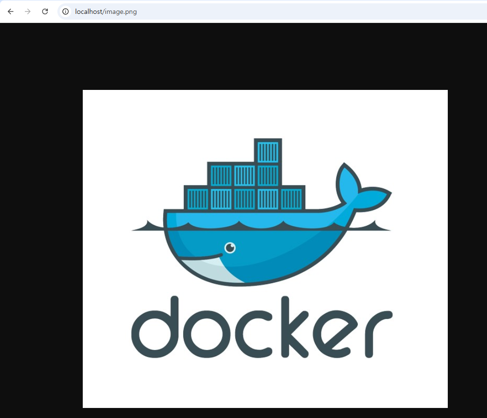

*그림 3-18. 캐싱 실습 — 이미지 응답*

오픈이는 정확한 확인을 위해 개발자 도구(F12) > Network 탭을 열었습니다. 브라우저 자체 캐시가 개입하지 못하도록 **'Disable cache'** 를 체크한 뒤 응답 헤더를 살폈습니다. 첫 번째 요청에서는 예상대로 X-Cache-Status 값이 MISS로 찍혔습니다.

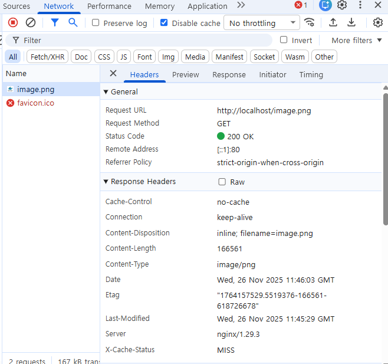

*그림 3-19. X-Cache-Status: MISS 확인*

다시 새로고침을 누르자 이번에는 HIT으로 바뀌었습니다. 백엔드 서버는 가만히 있는데, NGINX가 저장한 파일을 꺼내 바로 돌려준 것입니다.

*'어, 진짜 HIT이 떴네.'*

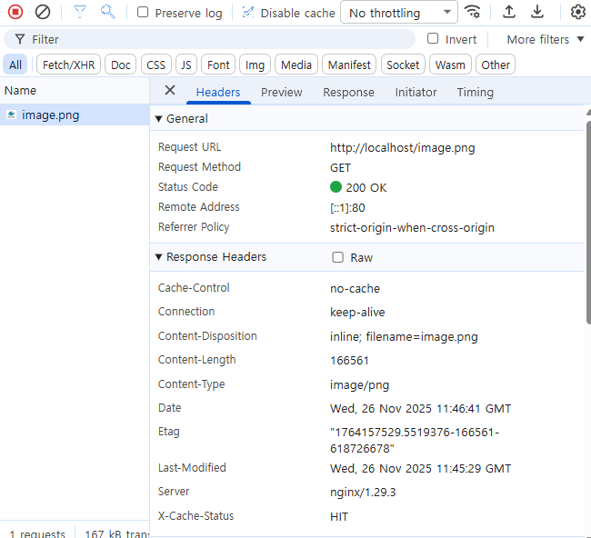

*그림 3-20. X-Cache-Status: HIT 확인*

실습을 마친 오픈이는 nginx.conf가 결국 **어떤 요청(location)을** **어디로 보낼지(proxy_pass)** , 그리고 **어떤 옵션을 얹을지를** 결정하는 일정한 패턴을 가지고 있다는 사실을 깨달았습니다.

## 3.3 Redis 

### 3.3.1 서버 여러 대면 생기는 세션 문제

로드밸런싱으로 부하를 나누는 것까지는 성공했지만, 오픈이는 설계를 검토하다가 또 다른 장벽에 부딪혔습니다. 단순히 서버를 복제해서 늘리는 것만으로는 해결되지 않는 '상태 유지'의 문제였습니다.

가장 대표적인 것이 로그인 상태입니다. 사용자가 1번 서버에서 로그인하고 다음 페이지로 넘어갔는데, 로드밸런서가 그 요청을 2번 서버로 보내버리면 갑자기 로그인이 풀리는 현상이 발생합니다.

원인은 백엔드 서버가 사용자의 상태를 기억하는 방식에 있었습니다. 보통 많은 프레임워크는 로그인 정보를 서버의 개별 메모리에 보관하는데, 이를 **세션(Session)**이라고 부릅니다. 서버가 한 대일 때는 문제가 없지만, 서버가 여러 대로 갈라지는 순간 각 서버의 메모리는 서로의 기록을 모르는 독립된 공간이 됩니다.

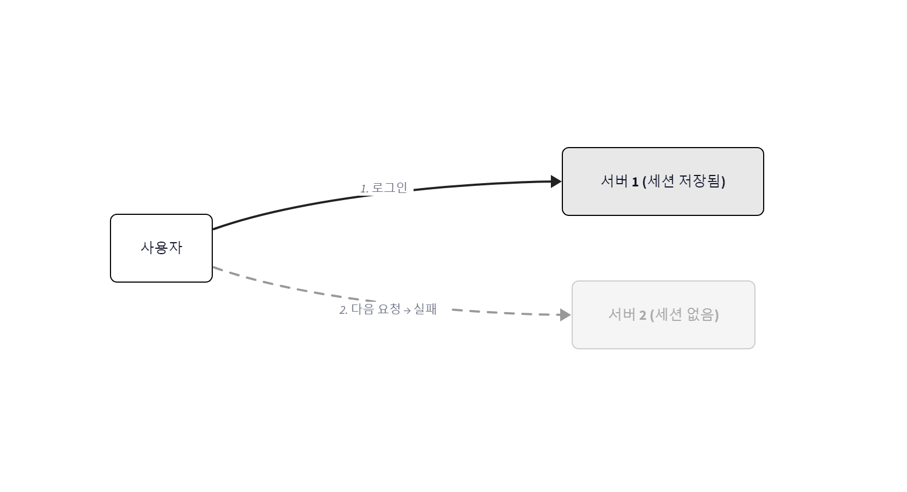

*그림 3-21. 세션 불일치 — 1번 서버에 저장된 세션이 2번 서버엔 없어 로그인 풀림*

1번 서버 메모리에만 로그인 기록을 남겨두었는데, 다음 요청이 2번 서버로 전달되면 2번 서버 입장에서는 처음 보는 사용자일 뿐입니다. 결국 시스템은 보안을 위해 사용자를 로그아웃 처리하고 다시 로그인 페이지로 돌려보내게 됩니다.

*'서버를 늘릴수록 오히려 로그인이 더 자주 풀리는 구조였네. 이걸 어떻게 하나로 묶지?'*

:::term-box
**세션(Session)**: 사용자가 로그인했을 때 서버가 생성하는 임시 기록입니다. 서버는 "이 사용자는 인증되었습니다"라는 정보를 자신의 메모리에 보관하고, 이후 요청이 올 때마다 이 기록을 대조해 로그인 상태를 유지합니다.
:::

### 3.3.2 Redis는 서버들이 공유하는 사물함

오픈이는 이 문제를 해결하기 위해 세션을 서버 메모리가 아닌, 서버들 바깥의 공용 저장소에 두는 방식을 찾아냈습니다.

개인 책상 서랍에 물건을 넣으면 본인만 쓸 수 있지만, 복도에 있는 공용 사물함에 물건을 넣어두면 열쇠를 가진 사람 누구나 그 안의 물건을 꺼낼 수 있는 것과 같은 원리입니다. 이 공용 저장소 역할을 하는 대표적인 도구가 바로 **Redis** 입니다.

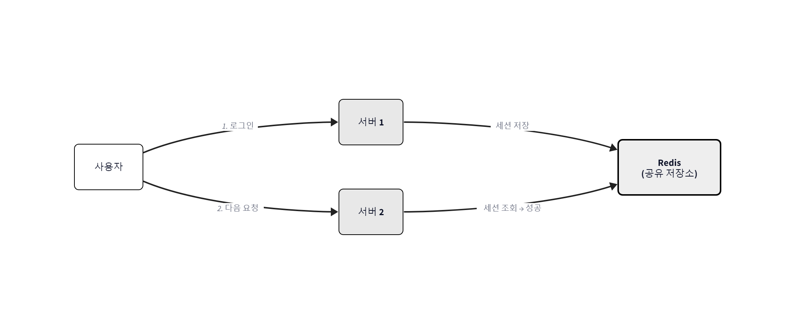

*그림 3-22. Redis로 해결 — 세션을 공용 저장소에 보관하여 어느 서버에서든 조회 가능*

1번 서버가 로그인을 처리하고 그 기록(세션)을 Redis에 저장하면, 2번 서버도 같은 Redis를 열어 로그인 정보를 확인할 수 있습니다. 어떤 서버로 요청이 가더라도 동일한 데이터에 접근할 수 있게 된 것입니다. 이 구조가 갖춰지면 서버를 아무리 복제하더라도 사용자의 로그인 상태는 끊김 없이 유지됩니다.

:::term-box
**Redis**: 메모리 기반의 키-값(Key-Value) 데이터베이스입니다. 데이터를 디스크가 아닌 메모리에 저장하기 때문에 처리 속도가 매우 빠릅니다. 그래서 세션 저장소나 캐싱처럼 짧은 시간 안에 빈번한 읽기/쓰기가 필요한 곳에 주로 사용됩니다.
:::

### 3.3.3 사용자 정의 네트워크 — 이름으로 부르기

Redis 컨테이너와 API 컨테이너를 띄우고 나면, 두 컨테이너가 서로를 어떻게 호출할 것인가가 숙제로 남습니다. host.docker.internal나 컨테이너 IP가 아닌 컨테이너의 이름을 그대로 주소처럼 쓰면 편할 것 같았기 때문입니다.

*'지난 예제에서는 호스트 IP를 거쳐서 돌아갔지만, 이번에는 네트워크를 하나 만들어서 이름으로 바로 묶어보자.'*

이 문제를 해결하기 위해 드디어 **사용자 정의 네트워크(User-defined Network)**를 사용할 차례입니다. 사용자 정의 네트워크 안에 있는 컨테이너들은 도커 내부의 **DNS(Domain Name System)**가 컨테이너 이름을 IP 주소로 자동 변환해 줍니다. 덕분에 번거로운 우회 없이 컨테이너 이름을 도메인 주소처럼 바로 쓸 수 있습니다.

<div class="svg-figure">
<svg viewBox="0 0 700 230" xmlns="http://www.w3.org/2000/svg" role="img" aria-label="사용자 정의 네트워크에서 이름으로 통신하는 흐름">
  <defs>
    <marker id="dn23-p" markerWidth="10" markerHeight="10" refX="8" refY="3" orient="auto"><path d="M0,0 L0,6 L8,3 z" fill="#475569"/></marker>
    <marker id="dn23-o" markerWidth="10" markerHeight="10" refX="8" refY="3" orient="auto"><path d="M0,0 L0,6 L8,3 z" fill="#ff7849"/></marker>
  </defs>
  <text x="350" y="22" text-anchor="middle" font-size="13" font-weight="700" fill="#1f2937">사용자 정의 네트워크 — 이름으로 컨테이너 호출</text>
  <rect x="20" y="55" width="160" height="70" rx="8" fill="#fff" stroke="#475569" stroke-width="1.8"/>
  <text x="100" y="85" text-anchor="middle" font-size="13" font-weight="700" fill="#0f172a">api 컨테이너</text>
  <text x="100" y="105" text-anchor="middle" font-size="11" font-family="monospace" fill="#6b7280">172.18.0.2</text>
  <rect x="270" y="55" width="160" height="70" rx="8" fill="#fff4ed" stroke="#ff7849" stroke-width="1.8"/>
  <text x="350" y="85" text-anchor="middle" font-size="13" font-weight="700" fill="#7b341e">Docker DNS</text>
  <text x="350" y="105" text-anchor="middle" font-size="11" font-family="monospace" fill="#6b7280">127.0.0.11</text>
  <rect x="520" y="55" width="160" height="70" rx="8" fill="#fff" stroke="#475569" stroke-width="1.8"/>
  <text x="600" y="85" text-anchor="middle" font-size="13" font-weight="700" fill="#0f172a">redis 컨테이너</text>
  <text x="600" y="105" text-anchor="middle" font-size="11" font-family="monospace" fill="#6b7280">172.18.0.3</text>
  <line x1="180" y1="77" x2="270" y2="77" stroke="#475569" stroke-width="1.8" marker-end="url(#dn23-p)"/>
  <text x="225" y="70" text-anchor="middle" font-size="11" fill="#0f172a"><tspan font-weight="700">1.</tspan> redis의 IP는?</text>
  <line x1="270" y1="103" x2="180" y2="103" stroke="#ff7849" stroke-width="1.8" stroke-dasharray="5,3" marker-end="url(#dn23-o)"/>
  <text x="225" y="118" text-anchor="middle" font-size="11" fill="#7b341e"><tspan font-weight="700">2.</tspan> 172.18.0.3</text>
  <path d="M 100 125 L 100 180 L 600 180 L 600 125" fill="none" stroke="#475569" stroke-width="1.8" marker-end="url(#dn23-p)"/>
  <rect x="265" y="168" width="170" height="22" rx="4" fill="#fff"/>
  <text x="350" y="183" text-anchor="middle" font-size="11" fill="#0f172a"><tspan font-weight="700">3.</tspan> 172.18.0.3 으로 요청</text>
  <text x="350" y="218" text-anchor="middle" font-size="10" fill="#6b7280">사용자 정의 네트워크에서만 자동 DNS가 켜집니다 (기본 docker0에는 없음)</text>
</svg>
</div>

*그림 3-23. 사용자 정의 네트워크 — 같은 네트워크 안의 컨테이너끼리 이름으로 호출*

실습에 필요한 네트워크 관련 명령어는 세 가지입니다.

| 명령 | 역할 |
|------|------|
| `docker network create <이름>` | 새 네트워크 생성 |
| `docker run ... --network <이름>` | 컨테이너를 해당 네트워크에 참여 |
| `docker network ls` | 현재 생성된 네트워크 목록 확인 |

오픈이는 이제야 퍼즐이 맞춰지는 기분이 들었습니다. 복잡한 호스트 주소 대신, 컨테이너 이름만으로 깔끔하게 통신할 수 있는 환경을 만들 준비를 마쳤습니다.

*'이제 주소를 구구절절 적을 필요가 없겠네. 그냥 지어준 이름으로 바로 부르면 되니까.'*

### 3.3.4 실습: Redis로 세션 공유

> 실습 코드: https://github.com/metacoding-10-linux-docker/docker/tree/master/ex04

오픈이는 이어서 Redis를 이용해 세션을 공유하는 실습에 들어갔습니다. 실습은 ex04 폴더에 들어 있고, 폴더 구조는 API 서버가 담긴 폴더 하나로 간단하며, Redis는 별도의 빌드 없이 공식 이미지를 그대로 사용했습니다.

```text
ex04/
├── api/
│   ├── Dockerfile       # Python 이미지 + app.py 복사
│   └── app.py           # Redis에 값을 저장/조회하는 간단한 API
└── README.md            # 실습 안내
```

app.py는 /save 경로로 값을 저장하고 /read 경로로 값을 꺼내는 간단한 서버입니다. 여기서 가장 중요한 부분은 Redis 연결 설정에서 **host='redis'** 라고 적은 줄입니다. IP 주소가 아닌 컨테이너 이름을 그대로 주소로 사용했습니다.

**ex04/api/app.py** (핵심)
```python
import redis
# 'redis'는 사용자 정의 네트워크 안의 컨테이너 이름
r = redis.Redis(host='redis', port=6379, db=0)
```

오픈이는 네트워크를 먼저 생성한 뒤, 세 컨테이너가 모두 같은 네트워크 안에서 돌아가도록 차례대로 실행했습니다.

```bash
# 1. 사용자 정의 네트워크 생성
docker network create myNetwork

# 2. Redis 컨테이너 실행 (-p는 호스트에서 확인용으로 노출, 같은 네트워크 내 통신에는 불필요)
docker run -d --name redis --network myNetwork -p 6379:6379 redis

# 3. API 서버 두 대 실행 (같은 이미지, 다른 포트)
docker build -t api ex04/api
docker run -d --name api1 --network myNetwork -p 5001:5000 api
docker run -d --name api2 --network myNetwork -p 5002:5000 api
```

이제 데이터가 제대로 공유되는지 확인할 차례입니다. 

먼저 api1 서버(localhost:5001/save)에 접속해 값을 저장했습니다. 그러고 나서 곧바로 api2 서버(localhost:5002/read)로 들어가 조회를 시도했습니다.


*그림 3-24. api1에서 데이터 저장*

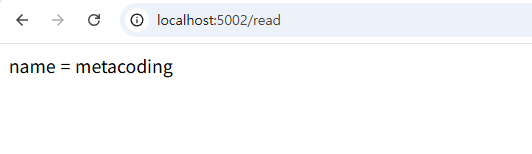

*그림 3-25. api2에서 같은 데이터 조회*

결과는 성공적이었습니다. api1에서 저장한 데이터가 api2에서도 그대로 나왔습니다.

오픈이는 개별 서버가 상태를 직접 들고 있을 때 생기는 복잡한 문제들이, 외부 저장소 하나로 깔끔하게 정리되는 과정을 직접 확인했습니다.

## 3.4 MySQL — 영구 데이터는 DB 서버에

Redis를 이용해 세션 문제는 해결했습니다. 하지만 오픈이는 실습을 마치고 잠시 생각에 잠겼습니다. Redis는 데이터를 메모리에 저장하기 때문에 컨테이너를 재시작하면 모든 값이 사라집니다.

*'세션처럼 잠깐 들고 있는 데이터는 괜찮지만, 회원 정보나 채팅 기록처럼 꼭 남아야 하는 데이터는 어디에 저장해야 하지?'*

영구히 보관되어야 하는 데이터는 별도의 데이터베이스 서버에 두어야 했습니다. 오픈이는 프로젝트의 사용자 데이터를 담을 DB로 MySQL을 선택하고, 이를 컨테이너로 띄워보기로 했습니다.

> 실습 코드: https://github.com/metacoding-10-linux-docker/docker/tree/master/ex05

**ex05/db/Dockerfile**
```dockerfile
FROM mysql                                    # MySQL 공식 이미지 사용
COPY init.sql /docker-entrypoint-initdb.d      # 첫 기동 시 자동 실행될 SQL 복사
ENV MYSQL_USER=metacoding                      # 사용자 계정 설정
ENV MYSQL_PASSWORD=metacoding1234              # 사용자 비밀번호
ENV MYSQL_ROOT_PASSWORD=root1234               # root 비밀번호
ENV MYSQL_DATABASE=metadb                      # 기본 생성할 데이터베이스 이름
CMD ["--character-set-server=utf8mb4", "--collation-server=utf8mb4_unicode_ci"]
```

Dockerfile에서 눈여겨볼 지점은 두 가지였습니다.

 -  **/docker-entrypoint-initdb.d** : MySQL 공식 이미지가 제공하는 특수 경로입니다. 여기에 init.sql 파일을 넣어두면 컨테이너가 처음 실행될 때 자동으로 SQL 문을 실행해 테이블과 초기 데이터를 만들어줍니다.
 -  **환경 변수(ENV)** : 네 개의 환경 변수를 통해 계정과 DB 이름을 미리 설정합니다. 실제 접속 시 이 설정값들을 사용하게 됩니다.

:::note
**Dockerfile에 비밀번호를 직접 적는 방식**

이번 실습에서는 과정을 단순하게 보여드리기 위해 비밀번호를 Dockerfile에 직접 적었습니다. 하지만 실무에서 이런 방식은 매우 위험합니다. 이미지를 빌드하는 순간 이미지를 가진 사람 누구나 비밀번호를 볼 수 있기 때문입니다. 그래서 실제 서비스를 운영할 때는 비밀번호 같은 민감한 정보를 이미지 내부에 기록하지 않고 외부에 따로 보관해 두었다가, 컨테이너가 실행되는 시점에만 살짝 건네주는 방식을 사용합니다. 이 방식은 쿠버네티스에서 사용해보겠습니다.
:::

오픈이는 ex05 폴더의 파일로 이미지를 빌드하고 컨테이너를 실행했습니다.

```bash
docker build -t db ex05/db          # ex05/db의 Dockerfile로 db 이미지 빌드
docker run -dit -p 3306:3306 db     # db 컨테이너를 3306 포트로 실행
```

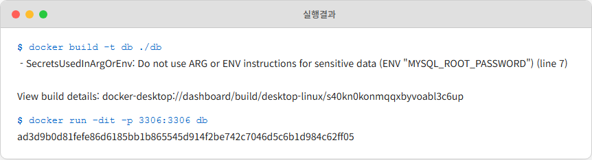

*그림 3-26. MySQL 컨테이너 실행 로그*

데이터가 잘 들어갔는지 확인하기 위해 실행 중인 컨테이너 내부로 직접 진입해 보기로 했습니다. docker ps로 컨테이너 ID를 확인한 뒤, docker exec 명령어를 사용했습니다.

```bash
docker ps                    # 실행 중인 컨테이너 확인
docker exec -it 1fc2 bash   # MySQL 컨테이너 내부 접속
```

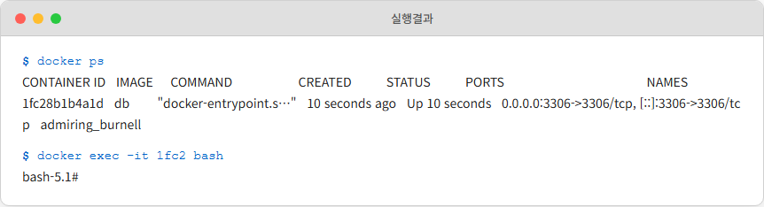

*그림 3-27. MySQL 컨테이너 내부 진입*

컨테이너 안에서 MySQL 클라이언트를 실행했습니다. 접속할 때는 Dockerfile에 설정해 둔 계정 정보를 그대로 입력했습니다.

```bash
mysql -u metacoding -p      # MySQL 접속 (비밀번호 입력 창이 뜨면 metacoding1234 입력)
```

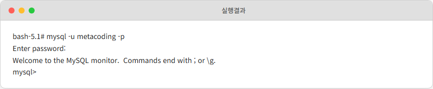

*그림 3-28. MySQL 접속 성공*

접속 후에는 DB 목록과 테이블, 그리고 초기 데이터를 차례로 조회해 보았습니다.

```sql
show databases;            -- MySQL 서버에 있는 DB 목록 조회
use metadb;                -- metadb를 사용할 DB로 선택
show tables;               -- metadb 안의 테이블 목록 조회
select * from user_tb;     -- user_tb 테이블의 전체 행 조회
```

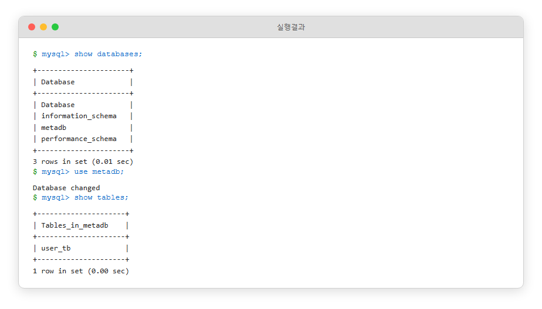

*그림 3-29. 데이터베이스 목록 확인*

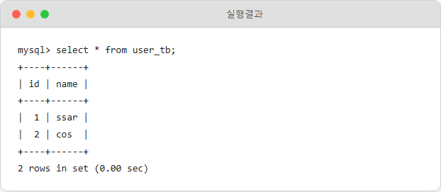

*그림 3-30. user_tb 데이터 조회 결과*

init.sql에 적어두었던 초기 데이터들이 테이블에 안전하게 담겨 있는 것을 확인했습니다.

DB까지 컨테이너로 준비를 마친 오픈이는 터미널의 히스토리를 쭉 올려보다가 멈췄습니다. 지금까지 띄운 컨테이너만 벌써 여러 개인데, 매번 빌드와 실행 명령어를 일일이 입력하는 과정이 번거롭게 느껴졌기 때문입니다.

*'프론트엔드, 백엔드, DB까지... 이 많은 컨테이너를 한 번에 관리할 수 있는 방법은 없을까?'*

오픈이는 흩어져 있는 컨테이너들을 하나로 묶어 관리할 수 있는 도구를 찾아보기 시작했습니다.

## 3.5 Docker Compose — 여러 컨테이너를 한 번에

### 3.5.1 docker run을 매번 치는 게 지친다

네트워크 만들고, Redis 띄우고, API 두 대 띄우고, MySQL에 NGINX까지. 여기까지 오면서 오픈이가 터미널에 입력한 docker run 명령어만 다섯 번이 넘었습니다. 수동 설치가 피곤해서 Dockerfile을 배웠는데, 이제는 그 Dockerfile로 만든 이미지를 일일이 실행하느라 또 다른 수동 작업에 갇힌 기분이었습니다.

*'이 많은 명령어를 매번 다 기억해서 쳐야 하는 건가?'*

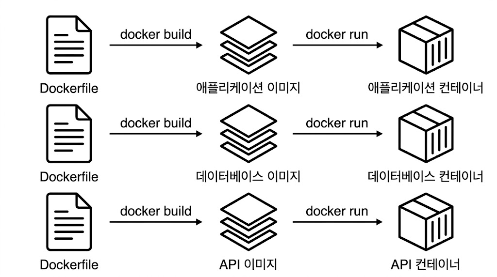

*그림 3-31. 기존 방식 — 개별 빌드 및 실행 반복*

여러 컨테이너를 하나의 파일에 정의해두고 명령어 딱 한 줄로 실행할 수는 없을까? 이 고민을 해결해 주는 도구가 바로 Docker Compose입니다. 여러 악기가 모여 연주할 때, 각자의 악보를 따로 들고 있는 게 아니라 '총보(지휘자용 악보)' 한 장에 모든 파트를 적어두고 지휘자의 손짓 한 번에 연주를 시작하는 것과 같습니다.

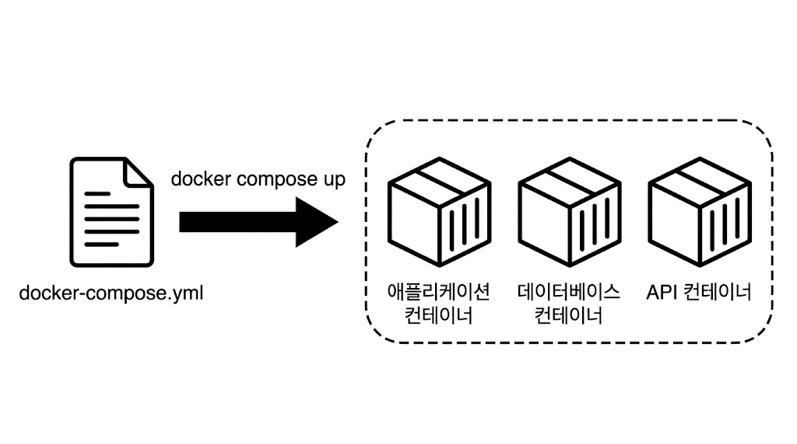

*그림 3-32. Docker Compose 방식 — 한 번에 생성 및 연결*

Compose가 해주는 핵심 역할은 세 가지입니다.

- **순서**: 어떤 컨테이너(예: DB)가 먼저 준비되어야 하는지 순서를 지정할 수 있습니다.
- **네트워크**: 같은 Compose 파일에 정의된 컨테이너들은 자동으로 하나의 네트워크에 묶입니다. 이제 **docker network create** 를 따로 할 필요가 없습니다.
- **일괄 관리**: 명령어 한 줄로 모든 서비스를 시작하고, 한 줄로 종료할 수 있습니다.

:::term-box
**Docker Compose**: 여러 컨테이너를 하나의 YAML 파일(.yml)에 묶어 관리하는 도구입니다. 복잡한 컨테이너 간의 연결 고리와 실행 옵션을 문서화해두고, 이를 통째로 실행하거나 중지할 수 있게 도와줍니다.
:::

### 3.5.2 docker-compose.yml 기본 구조

설정 파일의 뼈대는 생각보다 단순합니다. 오픈이는 자주 쓰이는 옵션들을 중심으로 구조를 익혔습니다.

```yaml
services:
  <서비스명>:                         # 예: app, db, proxy 등
    container_name: <컨테이너명>      # 실제로 생성될 컨테이너 이름
    image: <이미지명>                 # Docker Hub에서 이미지를 가져와야 한다면 여기 이미지명 작성
    build: <경로>                    # Dockerfile로 직접 이미지를 빌드한다면 여기 경로 입력
    ports:
      - "호스트포트:컨테이너포트"
    depends_on:
      - <먼저 떠야 할 서비스>
    environment:
      - KEY=VALUE                   # 환경 변수 설정 (비밀번호 등)
    volumes: 
      - <호스트경로:컨테이너경로>       # 데이터 보관을 위한 볼륨 연결
    networks:
      - <네트워크명>                  # 아래 networks에서 만든 망에 이 컨테이너를 참여시킴

networks:
  <네트워크명>:                       # 이 프로젝트에서 사용할 네트워크 이름을 생성 
```

모든 옵션을 다 외울 필요는 없습니다. 상황에 맞춰 필요한 것만 골라 쓰면 됩니다.

| 옵션 | 필수 여부 | 언제 쓰나 |
|------|---------|----------|
| `services.<이름>` | 필수 | 관리할 컨테이너들의 묶음입니다. |
| `image` 또는 `build` | 둘 중 하나 | 기존 이미지를 쓸지, 직접 빌드할지 결정합니다. |
| `ports` | 선택 | 외부 브라우저 등에서 접속이 필요할 때 씁니다. |
| `environment` | 선택 | DB 계정 정보 같은 설정값을 주입합니다. |
| `depends_on` | 선택 | 컨테이너들 사이의 실행 우선순위를 정합니다. |
| `networks` | 선택 | 컨테이너를 하나의 네트워크로 연결합니다. 같은 파일 안이면 자동이라 대부분 생략 가능합니다. |

### 3.5.3 실습: Compose로 EX01 다시 만들기

오픈이는 이전에 진행했던 ex01 실습(경로 기반 라우팅)을 Compose 방식으로 바꿔보기로 했습니다. 기존의 Dockerfile들은 그대로 두고, 이를 하나로 묶어줄 docker-compose.yml만 새로 작성했습니다.

> 실습 코드: https://github.com/metacoding-10-linux-docker/docker/tree/master/ex06

**ex06/docker-compose.yml**
```yaml
services:                          # 컨테이너 단위로 실행할 서비스 묶음
  app1:                            # 첫 번째 서비스 이름 (다른 서비스가 부를 때 호스트명이 됨)
    build:
      context: ./app1              # ./app1 폴더의 Dockerfile로 이미지 빌드
    ports:
      - 8000:80                    # 호스트 8000 → 컨테이너 80 포워딩
    networks:
      - ex06-network               # ex06-network에 연결
  app2:                            # 두 번째 서비스
    build:
      context: ./app2
    ports:
      - 9000:80                    # 호스트 9000 → 컨테이너 80
    networks:
      - ex06-network
  lb:                              # 로드밸런서(nginx) 서비스
    build:
      context: ./lb
    ports:
      - 80:80                      # 호스트 80 → 컨테이너 80
    networks:
      - ex06-network

networks:
  ex06-network:                    # 세 서비스가 공유하는 사용자 정의 네트워크
```

여기서 결정적인 차이가 생깁니다. **lb/nginx.conf** 설정 파일에서 백엔드 주소를 적을 때, 더 이상 host.docker.internal을 쓸 필요가 없습니다. Compose가 자동으로 만든 네트워크 덕분에 app1:80, **app2:80**처럼 서비스 이름으로 바로 부를 수 있기 때문입니다.


<div class="svg-figure">
<svg viewBox="0 0 700 230" xmlns="http://www.w3.org/2000/svg" role="img" aria-label="Compose 네트워크에서 서비스 이름으로 통신">
  <defs>
    <marker id="cn-p" markerWidth="10" markerHeight="10" refX="8" refY="3" orient="auto"><path d="M0,0 L0,6 L8,3 z" fill="#475569"/></marker>
    <marker id="cn-o" markerWidth="10" markerHeight="10" refX="8" refY="3" orient="auto"><path d="M0,0 L0,6 L8,3 z" fill="#ff7849"/></marker>
  </defs>
  <text x="350" y="22" text-anchor="middle" font-size="13" font-weight="700" fill="#1f2937">Compose 네트워크 — 서비스 이름으로 통신</text>
  <rect x="20" y="55" width="160" height="70" rx="8" fill="#fff" stroke="#475569" stroke-width="1.8"/>
  <text x="100" y="85" text-anchor="middle" font-size="13" font-weight="700" fill="#0f172a">lb (NGINX)</text>
  <text x="100" y="105" text-anchor="middle" font-size="11" font-family="monospace" fill="#6b7280">172.18.0.2</text>
  <rect x="270" y="55" width="160" height="70" rx="8" fill="#fff4ed" stroke="#ff7849" stroke-width="1.8"/>
  <text x="350" y="80" text-anchor="middle" font-size="13" font-weight="700" fill="#7b341e">Docker DNS</text>
  <text x="350" y="98" text-anchor="middle" font-size="10" fill="#7b341e">(자동 생성)</text>
  <text x="350" y="113" text-anchor="middle" font-size="10" font-family="monospace" fill="#6b7280">127.0.0.11</text>
  <rect x="520" y="55" width="160" height="70" rx="8" fill="#fff" stroke="#475569" stroke-width="1.8"/>
  <text x="600" y="85" text-anchor="middle" font-size="13" font-weight="700" fill="#0f172a">app1 컨테이너</text>
  <text x="600" y="105" text-anchor="middle" font-size="11" font-family="monospace" fill="#6b7280">172.18.0.3</text>
  <line x1="180" y1="77" x2="270" y2="77" stroke="#475569" stroke-width="1.8" marker-end="url(#cn-p)"/>
  <text x="225" y="70" text-anchor="middle" font-size="11" fill="#0f172a"><tspan font-weight="700">1.</tspan> app1의 IP는?</text>
  <line x1="270" y1="103" x2="180" y2="103" stroke="#ff7849" stroke-width="1.8" stroke-dasharray="5,3" marker-end="url(#cn-o)"/>
  <text x="225" y="118" text-anchor="middle" font-size="11" fill="#7b341e"><tspan font-weight="700">2.</tspan> 172.18.0.3</text>
  <path d="M 100 125 L 100 180 L 600 180 L 600 125" fill="none" stroke="#475569" stroke-width="1.8" marker-end="url(#cn-p)"/>
  <rect x="270" y="168" width="160" height="22" rx="4" fill="#fff"/>
  <text x="350" y="183" text-anchor="middle" font-size="11" fill="#0f172a"><tspan font-weight="700">3.</tspan> 172.18.0.3 으로 요청</text>
  <text x="350" y="218" text-anchor="middle" font-size="10" fill="#6b7280">Compose가 docker-compose.yml의 서비스 이름으로 자동 DNS 등록</text>
</svg>
</div>

*그림 3-33. Compose가 자동 생성한 네트워크에서 서비스 이름으로 통신*

이제 터미널을 열고 ex06의 docker-compose.yml로 명령어를 실행합니다.

```bash
docker compose -f ex06/docker-compose.yml up   # 모든 컨테이너 한 번에 실행
```

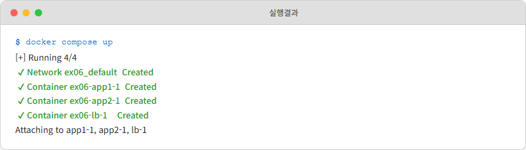

*그림 3-34. docker compose up 실행 결과*

빌드부터 실행까지 한 번에 끝났습니다. 브라우저 접속 결과는 이전과 똑같았지만, 여러번 치던 명령어가 단 한 줄로 줄어들었습니다.

*'이걸 두고 왜 그동안 사서 고생을 했지? 진작 이걸로 묶어서 관리할걸.'*

### 3.5.4 자주 쓰는 Compose 명령어

| 명령어 | 설명 |
|--------|------|
| `docker compose up` | 모든 서비스 빌드 + 실행 |
| `docker compose up -d` | 백그라운드 실행 |
| `docker compose down` | 모든 서비스 중지 + 삭제 |
| `docker compose ps` | 실행 중인 서비스 목록 |
| `docker compose logs` | 서비스 로그 |
| `docker compose build` | 이미지만 빌드 |

## 3.6 종합 실습 — 통합 웹사이트

오픈이는 이제 각각의 컨테이너를 실행하는 법과 이를 컴포즈로 묶는 법을 익혔습니다. 이제 이 조각들을 모아 실제 서비스와 유사한 프론트엔드(NGINX) + 백엔드(Spring Boot) + DB(MySQL) 세트를 조립해 볼 차례입니다. docker compose up 한 줄로 전체 시스템을 가동하는 것이 이번 실습의 최종 목표입니다.

> 실습 코드: https://github.com/metacoding-10-linux-docker/docker/tree/master/ex07

### 3.6.1 전체 아키텍처

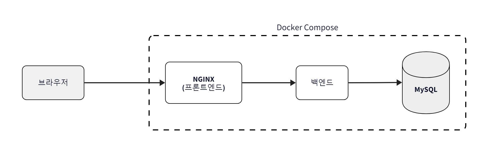

*그림 3-35. 세 컨테이너로 구성되는 웹 애플리케이션 아키텍처*

오픈이는 먼저 세 컨테이너가 맞물려 돌아가는 구조를 확인했습니다.

- **Frontend (NGINX)**: 브라우저에 화면을 띄워주고, /api/로 들어오는 데이터 요청은 백엔드로 넘겨줍니다.
- **Backend (Spring Boot)**: 실제 로직을 처리하며, DB에서 데이터를 꺼내와 전달합니다.
- **DB (MySQL)**: 사용자 데이터를 영구적으로 저장하는 창고입니다.

*'하나씩 떼어서 연습했던 것들을 이제 하나의 서비스로 합쳐보는 과정이네.'*

오픈이는 ex07 폴더에 준비된 파일들을 살폈습니다. 백엔드, DB, 프론트엔드가 각자의 폴더에 담겨 있고, 이를 docker-compose.yml이 감싸고 있는 구조입니다.

```text
ex07/
├── backend/             # Spring Boot 백엔드
│   ├── Dockerfile       # JDK 이미지 + entrypoint.sh 복사
│   └── entrypoint.sh    # Git clone + Gradle 빌드 + JAR 실행
├── db/                  # MySQL (ex05와 동일)
│   ├── Dockerfile       # MySQL 이미지 + init.sql 복사
│   └── init.sql         # 테이블·초기 데이터 생성 스크립트
├── frontend/            # NGINX + HTML
│   ├── Dockerfile       # nginx 이미지 + index.html·nginx.conf 복사
│   ├── index.html       # 로그인/게시판 UI
│   └── nginx.conf       # /api 경로를 backend로 프록시
├── docker-compose.yml   # 세 서비스 + 네트워크 정의
└── README.md            # 실습 안내
```

### 3.6.2 Backend: 시작 시 소스 내려받아 빌드

백엔드 설정을 보던 오픈이는 특이한 점을 발견했습니다. 소스 코드를 미리 빌드해서 넣지 않고, 컨테이너가 뜨는 시점에 깃허브에서 코드를 가져와 즉석에서 빌드하도록 구성되어 있었습니다.

**ex07/backend/entrypoint.sh**
```bash
#!/bin/bash
git clone https://github.com/metacoding-10-linux-docker/backend-server   # 백엔드 소스 내려받기
cd backend-server                       # 클론한 폴더로 이동
chmod +x gradlew                        # 실행 권한 부여
./gradlew build                         # Gradle로 JAR 빌드
java -jar -Dspring.profiles.active=prod build/libs/*.jar   # prod 프로필로 실행
```

:::tip
**실제 운영 환경과의 차이**

운영 환경에서는 이미지를 빌드하는 시점에 JAR 파일을 미리 포함시키는 것이 일반적입니다. 여기서는 별도의 로컬 빌드 환경 없이도 누구나 바로 실습할 수 있도록 실행 시점에 빌드하는 방식을 썼습니다.
:::

*'이미지에 소스 가져오는 로직을 넣으니, 환경에 상관없이 코드만 있으면 바로 실행해 볼 수 있겠구나.'*

### 3.6.3 docker-compose.yml

오픈이는 마지막으로 모든 서비스를 연결하는 설정 파일을 작성했습니다.

**ex07/docker-compose.yml**
```yaml
services:
  backend:                          # Spring Boot 백엔드 서비스
    build:
      context: ./backend            # ./backend 폴더의 Dockerfile로 빌드
    ports:
      - "8080:8080"                 # 호스트 8080 → 컨테이너 8080
    environment:                    # 컨테이너에 주입할 환경 변수
      # DB 접속 URL (호스트명 db = 아래 db 서비스명)
      SPRING_DATASOURCE_URL: jdbc:mysql://db:3306/metadb?useSSL=false&serverTimezone=UTC&useLegacyDatetimeCode=false&allowPublicKeyRetrieval=true
      SPRING_DATASOURCE_DRIVER_CLASS_NAME: com.mysql.cj.jdbc.Driver   # JDBC 드라이버 클래스
      SPRING_DATASOURCE_USERNAME: root                                # DB 계정
      SPRING_DATASOURCE_PASSWORD: root1234                            # DB 비밀번호
    networks:
      - ex07-network                # 공용 네트워크 연결

  db:                               # MySQL DB 서비스
    build:
      context: ./db
    ports:
      - 3306:3306                   # 호스트 3306 → 컨테이너 3306
    networks:
      - ex07-network

  frontend:                         # nginx 프론트엔드 서비스
    build:
      context: ./frontend
    ports:
      - "80:80"                     # 호스트 80 → 컨테이너 80
    networks:
      - ex07-network

networks:
  ex07-network:                     # backend·db·frontend가 공유하는 네트워크
```

backend의 `SPRING_DATASOURCE_URL`에 들어간 `jdbc:mysql://db:3306/...`이 DB 컨테이너를 이름으로 부르는 지점입니다.

### 3.6.4 한 줄로 전체 띄우기

오픈이는 터미널에서 ex07의 docker-compose.yml로 서비스를 실행했습니다.

```bash
docker compose -f ex07/docker-compose.yml up   # compose 파일 기반으로 서비스 일괄 실행
```

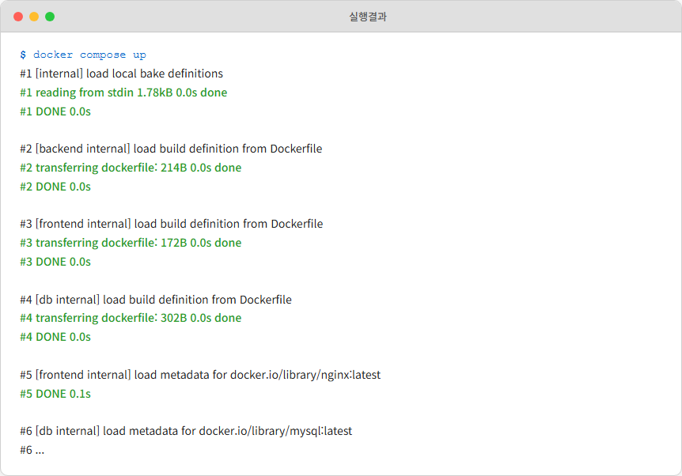

*그림 3-36. docker compose up 한 줄로 세 컨테이너가 동시에 뜨는 모습*

백엔드가 소스를 가져와 빌드하는 과정이 있어 첫 실행 시에는 시간이 다소 걸렸습니다. 빌드가 완료된 후 브라우저에서 localhost:80에 접속하자, DB에서 가져온 사용자 목록이 화면에 나타났습니다.

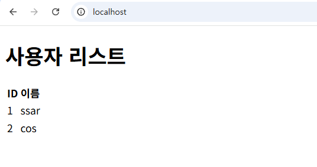

*그림 3-37. 사용자 목록 조회 성공*

오픈이는 이 시스템 내부에서 일어난 흐름을 다시 정리해 보았습니다.

1. **브라우저** : localhost:80으로 접속해 화면(HTML)을 요청함.
2. **NGINX** : 화면을 응답하고, 내부 JS가 보낸 /api/users 요청을 backend로 전달함.
3. **Spring** : db:3306 주소로 MySQL에 접속해 회원 데이터를 조회함.
4. 응답이 Spring → NGINX → 브라우저로 돌아가 화면에 표시.

오픈이는 이제 복잡한 다중 컨테이너 환경도 도커 컴포즈를 통해 안정적으로 구성하고 관리할 수 있게 되었습니다. 화면에 뜬 사용자 목록을 보며 오픈이는 기분 좋게 실습을 마무리했습니다.

## 3.7 Docker 네트워크의 진화

오픈이는 노트를 다시 펼쳤습니다. 처음 컨테이너 두 개를 띄워 서로 부르려 했을 때부터 docker compose up 한 줄까지, 네트워크가 어떻게 바뀌어 왔는지 한 표로 그려 봤습니다.

| 단계 | 방식 | 이름 통신 | 해결책 |
|------|------|---------|--------|
| docker run 개별 실행 | 기본 bridge | 불가 | host.docker.internal 우회 |
| docker network create | 사용자 정의 bridge | 가능 | Docker DNS 자동 활성화 |
| docker compose up | Compose 자동 네트워크 | 가능 | 전부 자동 |

옆을 지나가던 선배가 화면을 슬쩍 들여다봤습니다.

**선배**: "이 흐름 기억해 둬. 쿠버네티스에서 똑같은 게 더 큰 스케일로 나와."


## 이것만은 기억하자

- **Dockerfile**은 환경 구성의 레시피입니다. 한 번 잘 작성해두면 어디서든 동일한 실행 환경을 100% 재현할 수 있습니다.
- **NGINX**는 서버 앞단에 두는 리버스 프록시입니다. 경로 라우팅, 로드밸런싱, 캐싱이 핵심이며, 설정 파일의 기본 뼈대는 늘 비슷하다는 점을 확인했습니다.
- **Redis**는 서버들이 함께 사용하는 공용 사물함입니다. 서버가 여러 대로 늘어나도 로그인 상태(세션)를 잃어버리지 않게 도와줍니다.
- **사용자 정의 네트워크**는 컨테이너끼리 **이름으로 통신**하게 해줍니다. 
- **Docker Compose**는 여러 컨테이너를 한 파일로 관리하는 설계도입니다. 명령어 한 줄로 복잡한 서비스 간 네트워크와 의존 관계를 자동으로 묶어줍니다.

프로젝트를 돌릴 환경은 갖춰졌습니다. 하지만 오픈이는 이 시스템을 실제 서비스에 적용한다고 생각하니 몇 가지 풀리지 않은 숙제들이 보이기 시작했습니다.

*'지금은 내가 수동으로 관리하지만, 만약 새벽 2시에 컨테이너가 죽으면 누가 다시 살려주지?'*

실제 운영 환경에서는 다음과 같은 문제들이 현실로 다가옵니다.

 - **자동 복구(Self-healing)** : 컨테이너에 크래시가 발생했을 때, 사람의 개입 없이 자동으로 다시 띄울 방법이 필요합니다.
 - **유연한 확장(Scaling)** : 갑자기 트래픽이 몰릴 때, 설정 파일을 일일이 고치지 않고도 서버 대수를 즉시 늘릴 수 있어야 합니다.
 - **무중단 배포** : 새 버전을 올리는 동안 서비스가 잠시라도 중단되는 공백을 없애야 합니다.
 - **다중 서버 관리** : Docker Compose는 기본적으로 한 대의 컴퓨터 위에서 작동합니다. 수십 대의 서버에 컨테이너를 나눠 띄우려면 더 큰 규모의 관리 도구가 필요합니다.
 - **설정의 분리** : 이미지 안에 박제된 설정이나 비밀번호를 실행 시점에 안전하게 주입하고 관리해야 합니다.

이 모든 과제를 한꺼번에 해결해 주는 자동화 시스템이 바로 다음 챕터의 주인공인 **쿠버네티스(Kubernetes)**입니다.

이제 오픈이는 단순히 컨테이너를 띄우는 단계를 넘어, 시스템 스스로가 살아 움직이며 관리되는 '컨테이너 오케스트레이션'의 세계로 들어갑니다.