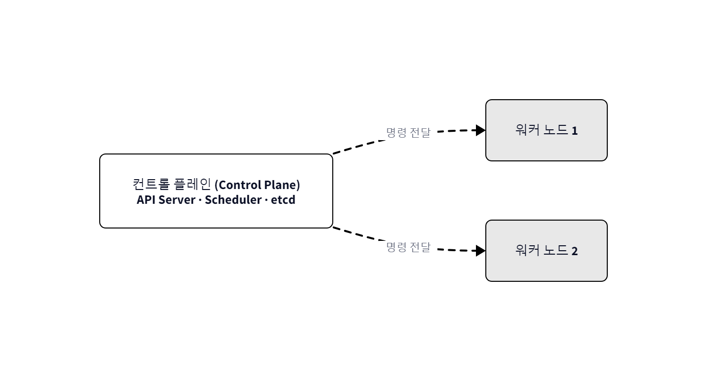
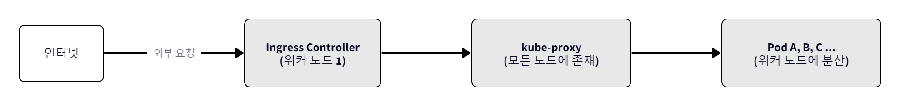
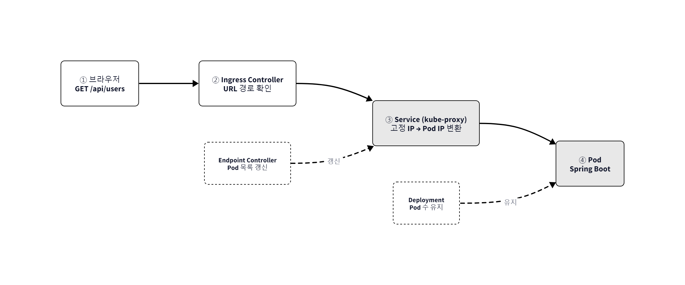
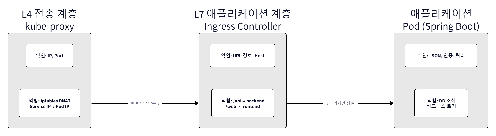

# Ch.4 Kubernetes 시작하기

> 한 줄 요약: 쿠버네티스가 컨테이너를 자동으로 관리하고 복구한다
> 핵심 개념: Kubernetes, Minikube, Deployment, ReplicaSet, Service

## 4.1 왜 Kubernetes인가 : 컨테이너 운영의 한계

### 4.1.1 쿠버네티스가 필요한 이유

새벽 3시, 오픈이의 핸드폰이 울렸습니다.

**"[ALERT] 백엔드 서버 응답 없음"**

오픈이는 잠에서 덜 깬 채로 노트북을 열었습니다. 백엔드 컨테이너가 메모리 부족으로 죽어 있었습니다. 급하게 `docker compose up -d`를 실행해 복구했지만, 그 사이 수십 명의 사용자가 이탈한 뒤였습니다.

다음 날 아침, 선배가 오픈이의 다크서클을 보고 물었습니다.

> **선배**: "어젯밤에 또 서버 터졌어?"
>
> **오픈이**: "네... 선배 이거 자동으로 안 돼요? 죽으면 알아서 살아나게 할 순 없나..."
>
> **선배**: "Compose는 한 서버 안에서 묶어 돌리는 거잖아. 자동 복구에 무중단 배포, 트래픽 따라 늘렸다 줄였다까지 하려면 다른 게 필요해. 너 이제 Kubernetes 만날 때 됐다."

선배의 말대로였습니다. Docker Compose로 여러 컨테이너를 실행할 수 있게 되었지만, 운영 환경에서는 다른 문제가 생깁니다.

**상황 1 --- 새벽 3시, 컨테이너가 죽었다**

백엔드 컨테이너가 메모리 부족으로 종료됐습니다. 사용자는 "서버 오류" 화면만 보게 됩니다. Docker Compose 환경이라면, 개발자가 알림을 확인하고 직접 `docker compose up`을 다시 실행해야 합니다. 그 사이 서비스는 멈춰 있습니다.

**상황 2 --- 타임세일, 트래픽이 10배로 폭증**

평소에는 컨테이너 1대로 충분했는데, 이벤트가 시작되자 응답 시간이 급격히 느려졌습니다. 수동으로 컨테이너 수를 늘리려면 서버를 준비하고 설정을 수정한 뒤 다시 배포해야 합니다. 이벤트가 끝나면 또 줄여야 하는데, 매번 사람이 손으로 해야 합니다.

**상황 3 --- 새 버전 배포, 서비스가 잠시 멈춘다**

결제 기능을 수정한 새 버전을 배포하는 상황입니다. 기존 컨테이너를 멈추고 새 컨테이너를 띄우는 그 짧은 순간, 결제 중이던 사용자는 오류를 만나게 됩니다.

> **오픈이**: "선배, 저 이 세 가지 전부 겪어봤는데요..."
>
> **선배**: "컨테이너 몇 개야 손으로 하지. 근데 수십~수백 개 되면 사람이 감당이 안 돼. 그걸 자동으로 해주는 게 쿠버네티스거든."

> **쿠버네티스(Kubernetes)** 는 구글에서 만든 대규모 컨테이너 관리 시스템입니다. 컨테이너의 배포와 확장, 복구를 자동으로 처리하는 운영 플랫폼입니다.

**"원하는 상태가 무엇인지"** 만 선언하면, "어떻게 복구할지"는 쿠버네티스가 알아서 맞춰 갑니다. 이것이 쿠버네티스의 핵심 철학인 **선언적 관리(Desired State)** 입니다. "백엔드 서버 3대를 유지해라"라고 선언해 두면, 1대가 죽어도 쿠버네티스가 자동으로 새 컨테이너를 띄워 3대를 맞춥니다. Docker가 **한 대의 호스트** 안에서 컨테이너를 관리하는 도구라면, Kubernetes는 **여러 대의 호스트(Node)** 에 걸쳐 컨테이너를 관리하는 도구입니다.

### 4.1.2 쿠버네티스의 핵심 리소스

> **선배**: "쿠버네티스에는 리소스라는 게 있어. 외부에서 요청이 들어오면 이 리소스들을 거쳐서 컨테이너에 도달하거든. 전체 흐름만 한 번 봐."


*쿠버네티스 핵심 리소스 구조도*

각 리소스의 역할은 아래 표와 같습니다. 상세 내용은 실습에서 하나씩 다룹니다.

| 리소스 | 역할 | 이야기 속 비유 |
|--------|------|--------------|
| **Ingress** | 외부 요청을 클러스터 내부로 라우팅하는 진입점 | 항구의 입구 게이트 |
| **Service** | Pod의 IP가 바뀌어도 고정된 진입점을 제공하여 트래픽을 전달 | 대표 전화번호 |
| **Deployment** | Pod의 생성, 개수 유지, 업데이트를 자동 관리하는 지침서 | "이 앱을 3개 유지하라"는 지침서 |
| **Pod** | 컨테이너를 실행하는 가장 작은 단위 | 컨테이너를 감싸는 최소 실행 단위 |
| **ConfigMap** | 데이터베이스 주소 등 일반 설정값을 저장 | 환경 설정표 |
| **Secret** | 비밀번호, API 키 등 민감한 설정값을 별도로 분리하여 저장 | 금고 |

### 4.1.3 쿠버네티스의 동작 원리

> **오픈이**: "이게 어떤 구조로 돌아가는 건데요?"

쿠버네티스는 크게 **컨트롤 플레인(Control Plane)** 과 **워커 노드(Worker Node)** 로 구성되어 있습니다. 이 둘을 하나의 시스템처럼 묶은 구조를 **클러스터(Cluster)** 라고 합니다. 회사에 비유하면 다음과 같습니다.

- **컨트롤 플레인** --- 본사 관리팀. "서버 3대를 유지해라", "이 서버가 죽으면 새로 띄워라" 같은 판단과 지시를 내립니다.
- **워커 노드** --- 현장 작업자. 관리팀의 지시를 받아 실제로 컨테이너를 실행하고 관리합니다.


*쿠버네티스 클러스터 구조*

개발자가 명령어를 입력하면 어떤 일이 벌어지는지 살펴보겠습니다.

**Step 1.** 명령이 컨트롤 플레인의 `Kube API Server`에 도달합니다.


*개발자의 명령이 Kube API Server로 전달되는 흐름*

**Step 2.** `Kube API Server`는 컨트롤 플레인 내부의 구성 요소와 상호 작용합니다.


*컨트롤 플레인 내부 구성 요소의 상호 작용*

| 구성 요소 | 역할 |
|-----------|------|
| **etcd** | 상태 정보를 저장하는 저장소 |
| **Controller** | 원하는 상태와 실제 상태를 비교하여 필요한 작업을 자동 생성 |
| **Scheduler** | 명령이 실행될 노드를 자동 선택 |

**Step 3.** 실행할 작업과 노드가 정해지면 워커 노드의 `kubelet`으로 전달됩니다.


*kubelet의 컨테이너 관리*

> **kubelet** 은 컨트롤 플레인으로부터 명령을 받아 실제로 컨테이너를 관리하는 관리자입니다.

### 4.1.4 전체 그림 : 요청의 여정

> **선배**: "자, 이제 쿠버네티스가 뭐고 어떻게 생겼는지는 봤잖아. 이제 요청이 실제로 어떻게 흘러가는지 전체 지도 한 번 보면 실습할 때 안 헤매거든."

#### 어디에 있나 — 클러스터 물리 구조

> **선배**: "방금 컨트롤 플레인이랑 워커 노드 배웠잖아. 먼저 큰 틀부터 보자. 컨트롤 플레인이 워커 노드한테 명령 내리는 구조야."


*컨트롤 플레인 → 워커 노드 — 명령이 어떻게 내려가는가*

> **오픈이**: "컨트롤 플레인이 워커 노드한테 명령 보내는 거 2장에서 본 Docker 엔진이랑 비슷한 건가요?"
>
> **선배**: "비슷하긴 한데 스케일이 다르지. Docker는 한 대에서 끝나잖아. 쿠버네티스는 여러 대 노드를 한꺼번에 관리하는 거거든."

> **선배**: "이제 워커 노드 안에 뭐가 있는지 보자. 외부에서 요청 오면 어떤 순서로 흘러가는지 봐."


*워커 노드 내부 — 외부 요청이 Pod까지 가는 경로*

> **오픈이**: "kube-proxy가 노드마다 하나씩 있네요? 이건 왜 그래요?"
>
> **선배**: "요청이 어떤 노드로 들어오든 Pod한테 보내줘야 하니까. 경비원이 층마다 한 명씩 있어야 되는 거랑 같은 거야."

| 컴포넌트 | 위치 | 핵심 |
|---------|------|------|
| **컨트롤 플레인** | 클러스터 상단 | 전체를 관리하고 명령을 내림 |
| **kube-proxy** | **모든** 워커 노드에 존재 | 어떤 노드로 요청이 와도 올바른 Pod로 전달 |
| **Ingress Controller** | 특정 워커 노드 | 외부 요청의 진입점 |
| **Pod** | 워커 노드에 분산 | 실제 애플리케이션이 실행되는 곳 |

#### 어떻게 흘러가나 — 트래픽 경로

> **선배**: "이번엔 브라우저에서 주소 치는 순간부터 Pod까지 어떻게 가는지 따라가 봐."


*요청이 Pod에 도달하기까지 — ①~④ 단계*

| 단계 | 컴포넌트 | 하는 일 |
|------|---------|--------|
| ① | **브라우저** | `http://my-service.com/api/users` 요청 전송 |
| ② | **Ingress Controller** | URL 경로 확인 → 적절한 Service로 라우팅 |
| ③ | **Service** | 고정 IP를 제공하고, 실제 Pod로 요청을 전달 |
| ④ | **Pod** | 애플리케이션이 요청을 처리 (JSON 파싱, DB 조회 등) |

#### 누가 뭘 하나 — 계층별 역할 분담

> **오픈이**: "근데 이것들이 다 비슷비슷해 보이는데... 누가 뭘 하는 건지 좀 헷갈려요."
>
> **선배**: "그게 포인트야. 계층마다 보는 게 다르거든. 여기서 확실히 정리해놓으면 나중에 안 헷갈려."


*계층별 역할 분담 — 아래로 갈수록 더 많이 확인한다*

| 계층 | 컴포넌트 | 확인하는 것 | 안 하는 것 |
|------|---------|-----------|-----------|
| **L4** (전송 계층) | kube-proxy | IP, Port | URL, Host, JSON |
| **L7** (애플리케이션 계층) | Ingress Controller | URL 경로, Host 헤더 | JSON 파싱 |
| **App** | Pod (Spring 등) | JSON, 인증, 비즈니스 로직 | 라우팅, 포트 변환 |

> **오픈이**: "아~ 네트워크 쪽은 그냥 전달만 하고, 진짜 일은 Pod 안에서 하는 거네요."
>
> **선배**: "맞아. 3장에서 NGINX가 URL 보고 요청 나눠준 거 기억나지? 그게 L7이었어. 쿠버네티스에서도 Ingress Controller가 L7, kube-proxy가 L4 맡아. 역할 나눠서 하니까 전체가 돌아가는 거거든."

이제 직접 실행해 볼 차례입니다. 로컬 PC 한 대로도 쿠버네티스를 체험할 수 있는 **미니큐브(Minikube)** 를 먼저 설치해보겠습니다.

## 4.2 Minikube : 로컬 클러스터

> 4.2부터 작성하는 **YAML(yml)** 파일은 https://github.com/metacoding-10-linux-docker/docker/tree/master/yaml 에서 확인할 수 있습니다.

### 4.2.1 미니큐브(Minikube)란?

> **오픈이**: "쿠버네티스가 서버 여러 대를 관리하는 거라면서요? 제 노트북 한 대로도 돼요?"
>
> **선배**: "그래서 미니큐브라는 게 있거든."

> **미니큐브(Minikube)** 는 Mini + Kubernetes라는 의미로, 로컬 PC에서 쿠버네티스 환경을 구성할 수 있는 개발용 프로그램입니다. Docker 컨테이너, VirtualBox 가상 머신 등을 사용해 미니큐브 환경을 구성할 수 있습니다.

미니큐브와 쿠버네티스의 기본 구조는 동일하지만, 미니큐브는 개발 환경용으로 설계된 만큼 하나의 노드에 컨트롤 플레인과 워커 노드 기능이 함께 들어 있습니다.


*미니큐브의 단일 노드 구조*

미니큐브는 단일 노드로 구성되어 구조가 단순하고 필요한 리소스도 적습니다. 로컬 PC에서 간편하게 쓸 수 있는 대신, 클라우드 로드밸런서 자동 생성이나 멀티 노드 확장 같은 운영 환경 기능은 지원하지 않습니다. 그래도 미니큐브에서 애플리케이션이 정상적으로 동작한다면, 동일한 설정과 구조를 실제 쿠버네티스 환경에도 그대로 적용할 수 있습니다.

### 4.2.2 미니큐브 기본 명령어

#### 미니큐브 설치

오픈이는 선배의 안내대로 미니큐브를 설치하기 시작했습니다.

**[실습]** OS에 맞는 패키지 관리자로 미니큐브를 설치합니다.
```bash
# Windows (터미널을 관리자 권한으로 실행)
choco install minikube

# Mac (터미널에서 실행)
brew install minikube
```

> Windows는 **Chocolatey**, Mac은 **Homebrew** 패키지 관리자가 설치되어 있어야 합니다. 미설치 시 [Chocolatey 설치 가이드](https://chocolatey.org/install) 또는 [Homebrew 설치 가이드](https://brew.sh/)를 참고합니다.

#### 미니큐브 실행

**[실습]** 터미널에서 미니큐브를 실행합니다.
```bash
minikube start         # 미니큐브 클러스터 시작
```


*minikube start 실행*

#### 미니큐브 명령어 요약

| 명령어 | 설명 |
|--------|------|
| `minikube start` | 미니큐브 실행 |
| `minikube stop` | 미니큐브 종료 |
| `minikube ip` | 미니큐브 IP 확인 |
| `minikube version` | 미니큐브 버전 확인 |
| `minikube dashboard` | 대시보드 실행 |
| `minikube service <서비스명> --url` | 서비스 접근 URL 생성 |
| `minikube addons enable ingress` | Ingress Controller 활성화 |
| `minikube tunnel` | 클러스터 외부에서 내부로 접근할 수 있도록 터널 생성 |

### 4.2.3 kubectl로 첫 Pod 띄우기

미니큐브가 실행되자, 선배가 말했습니다.

> **선배**: "이제 kubectl을 좀 익혀야 돼. 쿠버네티스 다루는 기본 도구야."

> **kubectl** 은 쿠버네티스 내부의 클러스터 리소스를 관리하는 명령어입니다.

쿠버네티스를 다루려면 kubectl 명령어를 익혀야 합니다. 먼저 쿠버네티스의 핵심 리소스인 Pod로 명령어를 실습해 보겠습니다.

#### Pod

> **오픈이**: "Docker에서는 컨테이너를 바로 실행했잖아요. 쿠버네티스도 그래요?"
>
> **선배**: "쿠버네티스는 컨테이너를 직접 안 다뤄. Pod라는 껍데기에 담아서 관리하거든."

> **Pod** 는 쿠버네티스에서 컨테이너를 실행하는 가장 작은 단위입니다. Pod는 하나 이상의 컨테이너로 구성되어 있습니다.


*Pod --- 컨테이너를 감싸는 최소 실행 단위*

#### 명령어 한 줄로 Pod 생성하기

오픈이는 가장 빠른 방법부터 시작했습니다. `kubectl run` 명령어 한 줄이면 Pod가 만들어집니다.

**[실습]** nginx 이미지를 사용해 Pod를 생성합니다.
```bash
kubectl run hello-pod1 --image=nginx  # Dockerhub의 nginx 이미지로 Pod 생성
```


*kubectl run hello-pod1 실행 결과*

명령어 한 줄로 Pod가 만들어졌습니다. 이 한 줄이 실제로 무엇을 했는지 YAML 파일로 풀어 볼 수 있습니다. **같은 결과를 파일로 저장해서 재사용할 수 있게 만든 것**이 YAML입니다.

#### YAML 초간단 문법

YAML은 설정을 사람이 읽기 쉽게 적는 형식입니다. 규칙은 세 가지뿐입니다.

- **들여쓰기**: 스페이스 2칸으로 계층을 구분합니다 (탭은 사용 불가).
- **key: value**: 콜론 뒤에 공백 하나를 두고 값을 적습니다.
- **리스트(-)**: 하이픈(`-`)으로 배열 항목을 나타냅니다.

#### Pod를 YAML 파일로 생성하는 방법

위에서 `kubectl run`으로 만든 Pod를, YAML 파일로 작성하면 이렇게 됩니다.

**[참고]** Github 프로젝트의 `yaml/hello-pod2.yml`을 참고합니다.

**yaml/hello-pod2.yml**
```yaml
apiVersion: v1                # API 버전
kind: Pod                     # 리소스 종류
metadata:
  name: hello-pod2            # 리소스명
spec:                         # 상세 설정
  containers:                 # 컨테이너 설정
    - name: hello-container   # 컨테이너 이름
      image: nginx:1.20       # 사용할 이미지
```

> **오픈이**: "아까 **kubectl run** 으로 한 거랑 뭐가 다른 거예요?"
>
> **선배**: "같은 거야. Pod 이름이랑 이미지 같은 걸 파일에 적어둔 거지. YAML로 써두면 파일로 남으니까 반복해서 쓸 수 있어."

**[실습]** 터미널 창을 **yaml 폴더** 로 이동 후 아래 명령어를 실행하면 `Pod`가 생성됩니다.
```bash
kubectl apply -f hello-pod2.yml       # YAML 파일로 Pod 생성
```


*kubectl apply로 Pod 생성*

#### Pod 조회

**[실습]** 생성된 `Pod` 목록을 조회합니다.
```bash
kubectl get pod                       # Pod 목록 조회
```


*Pod 목록 조회*

`kubectl describe pod <Pod이름>` 명령어로 Pod의 상세 정보도 조회할 수 있습니다.

**[실습]** Pod의 상세 정보를 조회합니다.
```bash
kubectl describe pod hello-pod2       # Pod 상세 정보 조회
```


*Pod 상세 조회*

> **네트워크 돋보기: Pod = 공유 Network Namespace**
>
> Docker에서는 컨테이너마다 독립된 Network Namespace(독립 IP)를 가졌습니다. Kubernetes의 Pod는 다릅니다. Pod가 생성되면 **pause** 라는 인프라 컨테이너가 먼저 만들어지고, 앱 컨테이너들이 pause의 Network Namespace에 합류합니다. 그래서 같은 Pod 안의 컨테이너들은 **같은 IP, 같은 포트 공간** 을 공유하며 **localhost** 로 서로 통신합니다. Docker에서 컨테이너가 네트워크의 단위였다면, Kubernetes에서는 **Pod가 네트워크의 단위** 입니다.
>
> 
> *Pod의 공유 Network Namespace --- pause 컨테이너가 네트워크를 소유*
>
> **한 줄 정리**: Pod 안의 컨테이너들은 pause 컨테이너 덕분에 하나의 네트워크를 공유합니다.

#### kubectl 명령어 요약

| 명령어 | 설명 |
|--------|------|
| `kubectl apply -f <파일>` | YAML 파일로 리소스 생성/업데이트 |
| `kubectl get <리소스>` | 리소스 목록 조회 |
| `kubectl describe <리소스> <이름>` | 리소스 상세 정보 확인 |
| `kubectl delete <리소스> <이름>` | 리소스 삭제 |
| `kubectl exec -it <Pod명> -- bash` | Pod 내부 접속 |
| `kubectl logs <Pod명>` | Pod 로그 확인 |
| `kubectl set image` | 리소스 이미지 변경 |

## 4.3 Deployment, ReplicaSet : 자동 복구와 스케일링

오픈이는 Pod를 띄우는 데 성공했습니다. 그런데 문득 궁금한 게 생겼습니다. "이 Pod가 죽으면 어떻게 되지?" 실험해보기로 했습니다.

**[실습]** Pod를 수동으로 삭제해봅니다.
```bash
kubectl delete pod hello-pod1         # Pod 삭제
kubectl get pod                       # Pod 목록 조회
```

hello-pod1은 삭제되면 그냥 사라졌습니다. 아무도 다시 살려주지 않았습니다.

> **오픈이**: "선배, Pod를 직접 만들면 죽어도 아무도 안 살려주잖아요. 이러면 또 새벽에 알람 받는 거 아닌가요..."
>
> **선배**: "맞아. 그래서 Pod를 직접 안 만들고 Deployment를 쓰는 거야. 'Pod 몇 개 유지하고, 문제 생기면 알아서 갈아 끼워라' 이런 지침서 같은 거거든."


*Deployment가 ReplicaSet을 생성하고, ReplicaSet이 Pod 수를 유지한다*

### 4.3.1 Deployment

> **Deployment** 는 Pod를 자동으로 생성, 업데이트, 복구하는 관리 리소스입니다. Pod의 개수, 버전, 장애 여부를 지정된 상태에 맞게 자동으로 관리합니다.

오픈이는 `Deployment`로 Pod를 생성해 보았습니다. nginx 이미지를 사용하는 deploy-ex01.yml입니다.

**[참고]** Github 프로젝트의 `yaml/deploy-ex01.yml`을 참고합니다.

**yaml/deploy-ex01.yml**
```yaml
apiVersion: apps/v1            # API 버전
kind: Deployment               # 리소스 종류
metadata:
  name: nginx-deploy           # 리소스 이름
spec:                          # pod에 대한 상태 지정
  replicas: 1                  # 생성할 pod 수 지정(명시하지 않으면 기본이 1)
  selector:                    # 관리할 Pod 선택 조건
    matchLabels:               
      app: nginx               # 라벨이 app : nginx인 pod를 관리
  template:                    # Pod 템플릿
    metadata:
      labels:                  
        app: nginx             # pod에 붙일 라벨
    spec:                      # 컨테이너 상세 설정
      containers:              
        - name: nginx-container  # 컨테이너 이름
          image: nginx:1.20    # 사용할 이미지
```

**Selector** 는 특정 label을 가진 리소스를 선택하는 조건입니다. Deployment나 Service의 Selector와 Pod의 labels가 일치하면 그 Pod를 관리 대상으로 삼습니다.


*Selector가 app: web인 Pod만 매칭하고, app: db인 Pod는 매칭하지 않음*

아래 명령어로 `Deployment`를 생성합니다.

**[실습]** `Deployment`를 생성하고 `Pod`를 확인합니다.
```bash
kubectl apply -f deploy-ex01.yml      # Deployment 생성
kubectl get pod                       # Pod 목록 조회
```


*Deployment와 Pod 생성 확인*

이제 진짜 실험입니다. 오픈이는 모든 Pod를 삭제해보았습니다. Deployment가 관리하지 않는 Pod도 함께 삭제됩니다.

**[실습]** 전체 `Pod`를 삭제한 뒤 다시 조회합니다.
```bash
kubectl delete pod --all              # 전체 Pod 삭제
kubectl get pod                       # Pod 목록 조회
```


*Pod 제거 후 자동 재생성 확인*

> **오픈이**: "어?! hello-pod1, hello-pod2는 사라졌는데 Deployment로 만든 건 알아서 살아났어요! 이거 누가 살려준 거예요?"
>
> **선배**: "Deployment가 살린 거지. 'Pod 1개 유지해라' 선언해놨으니까, 죽으면 알아서 새로 만드는 거야."

`kubectl run`으로 직접 생성한 `Pod`는 종료되었지만, `Deployment`로 생성된 `Pod`는 자동으로 재시작되었습니다.

> **Deployment** 로 Pod를 생성하면 Pod 생성뿐만 아니라 개수 유지와 장애 복구까지 자동으로 처리됩니다. Pod는 직접 생성하기보다 **Deployment** 로 생성하는 것이 일반적입니다.

**[실습]** 다음 실습을 위해 생성한 `Deployment`를 제거합니다.

```bash
kubectl delete deployment nginx-deploy # Deployment 삭제
```

### 4.3.2 ReplicaSet

오픈이가 물었습니다.

> **오픈이**: "Pod를 1개가 아니라 여러 개 유지하고 싶으면 어떻게 해요?"
>
> **선배**: "ReplicaSet이 그걸 해. 에어컨 자동 온도 조절 알지? 24도로 맞춰놓으면 올라가면 냉방 틀고 내려가면 멈추고 알아서 하잖아. ReplicaSet도 똑같아. Pod 개수 설정해두면 모자라든 넘치든 알아서 맞춰주는 컨트롤러야."

> **ReplicaSet** 은 지정한 개수만큼 Pod가 항상 살아있도록 관리하는 컨트롤러입니다. Pod가 죽거나 예상보다 많아지는 상황이 발생하면 원래 설정된 수에 맞게 Pod를 자동으로 생성하거나 제거하여 상태를 일정하게 유지합니다.


*Pod 3이 종료되면 ReplicaSet이 설정 개수를 맞추기 위해 Pod 4를 자동 생성*

`ReplicaSet`은 `Deployment`에 설정합니다. Pod를 4개 생성하는 Deployment를 작성합니다.

**[참고]** Github 프로젝트의 `yaml/deploy-ex02.yml`을 참고합니다.

**yaml/deploy-ex02.yml**
```yaml
apiVersion: apps/v1      # API 버전
kind: Deployment         # 리소스 종류
metadata:
  name: nginx-replica    # 리소스 이름
spec:                    # 상세 설정
  replicas: 4            # pod 수 지정

  strategy:              # Pod 교체 방식 설정
    type: RollingUpdate  # 롤링 업데이트 전략
    rollingUpdate:
      maxSurge: 4        # 업데이트 중 최대 4개까지 추가 생성
      maxUnavailable: 0  # 기존 Pod를 먼저 종료하지 않음 (무중단 배포)

  selector:              # 라벨이 app: nginx 인 pod를 관리
    matchLabels:         # 라벨이 일치하는 Pod 선택
      app: nginx         # app이 nginx인 Pod 선택
  template:              # Pod 템플릿
    metadata:
      labels:            # 라벨 지정
        app: nginx       # pod에 붙일 라벨
    spec:                # 컨테이너 상세 설정
      containers:        # 컨테이너 설정
        - name: nginx-container  # 컨테이너 이름
          image: nginx:1.20      # 사용할 이미지
```

Deployment를 생성합니다.

**[실습]** `Deployment`를 생성하고 `Pod` 개수를 확인합니다.
```bash
kubectl apply -f deploy-ex02.yml      # Deployment 생성
kubectl get pod                       # Pod 목록 조회
```


*replicas 설정으로 Pod 4개 생성*

`replicas`에 설정한 수에 따라 `Pod`가 4개 생성되었습니다.

> **오픈이**: "replicas를 4로 했더니 진짜 딱 4개 생기네요!"

### 4.3.3 롤링 업데이트(RollingUpdate)

이제 새 버전을 배포해야 하는 상황을 생각해 보겠습니다. 기존 서버를 전부 내리고 새 서버를 올리면? 그 사이에 서비스가 멈춥니다. deploy-ex02.yml의 `strategy`에 `RollingUpdate`가 설정되어 있는 이유가 여기 있습니다.

> **롤링 업데이트(RollingUpdate)** 는 기존 Pod를 한꺼번에 내리지 않고, 새 Pod를 먼저 띄운 뒤 기존 Pod를 순차적으로 교체하는 무중단 배포 방식입니다. **maxSurge** 는 업데이트 중 추가로 띄울 수 있는 Pod 수, **maxUnavailable** 은 동시에 내릴 수 있는 Pod 수를 뜻합니다. `maxUnavailable: 0`이면 기존 Pod를 먼저 종료하지 않으므로, 새 Pod가 완전히 준비된 뒤에야 기존 Pod가 제거됩니다.

**[실습]** nginx 이미지를 1.21 버전으로 업데이트합니다.
```bash
kubectl set image deployment/nginx-replica nginx-container=nginx:1.21  # nginx 이미지를 1.21로 업데이트
```


*이미지 버전 업데이트 실행*

**[실습]** 업데이트 진행 상황을 실시간으로 확인합니다.
```bash
kubectl get pod -w                    # Pod 상태 실시간 감시
```


*롤링 업데이트 진행 상황*

새 Pod가 `ContainerCreating` → `Running` 상태로 먼저 전환된 뒤, 기존 Pod가 `Terminating` 상태로 종료됩니다. `maxUnavailable: 0`이기 때문에 기존 Pod가 먼저 죽지 않고, 새 Pod가 준비될 때까지 기다립니다.

> **오픈이**: "새 Pod가 먼저 뜨고, 기존 Pod가 나중에 죽네요. 동시에 다 내리는 게 아니고요?"
>
> **선배**: "**maxUnavailable: 0** 으로 설정해놨거든. 기존 Pod를 먼저 안 죽이고, 새 Pod가 다 뜬 다음에 순서대로 내리는 거야. **maxSurge**와 **maxUnavailable** 설정으로 원하는 방식으로 업데이트를 할 수 있어"

**[실습]** `Deployment`의 상세 정보를 확인하면 이미지가 1.21 버전으로 변경된 것을 볼 수 있습니다.
```bash
kubectl describe deployment nginx-replica  # Deployment 상세 정보 조회
```

### 4.3.4 Rollback

새 버전을 배포했는데 버그가 터졌습니다. 이전 버전으로 되돌려야 합니다.

**[실습]** 먼저 배포 이력을 확인한 뒤 롤백합니다.
```bash
kubectl rollout history deployment/nginx-replica  # 배포 이력 조회
kubectl rollout undo deployment/nginx-replica      # 이전 버전으로 롤백
```


*Rollback 실행 결과*

`kubectl describe` 명령어로 롤백된 이미지 버전을 확인합니다.

## 4.4 Service : 고정 접근 주소

### 4.4.1 Service란?

Pod IP는 Pod가 죽으면 바뀝니다. 오픈이가 다른 Pod에서 접속하려는데 IP가 매번 달라졌습니다.

> **오픈이**: "이러면 고정 주소가 필요한 거 아닌가요?"
>
> **선배**: "그게 Service야. 콜센터 대표 번호 생각해 봐. 상담사 개인 번호 몰라도 대표 번호로 걸면 연결되잖아. Service가 그거야. Pod 앞에 고정 주소 하나 딱 만들어주는 거거든."


*Service는 고정 주소를 제공한다. Pod IP가 바뀌어도 Service 주소는 그대로다*

> **Service** 는 Pod에 접근할 때 고정 IP를 제공해 안정적으로 접근할 수 있게 하는 리소스입니다. 쿠버네티스 내부에 DNS가 있어서 IP 대신 서비스 이름으로도 접근할 수 있습니다. 원리는 5장에서 다룹니다.

#### Pod IP 변경

오픈이가 직접 확인해보았습니다.

**[실습]** `Pod`의 IP는 재시작 시 변경됩니다. IP를 확인한 후 `Pod`를 삭제하고 다시 조회하면 IP가 달라진 것을 볼 수 있습니다.
```bash
kubectl get pod -o wide           # IP 확인 (예: 10.244.0.7)
kubectl delete pod --all          # Pod 삭제
kubectl get pod -o wide           # IP 변경됨 (예: 10.244.0.8)
```


*Pod 재시작 시 IP 변경 확인*

#### Service 생성

`Service`는 `Deployment`처럼 selector의 라벨이 일치하는 `Pod`를 관리합니다. service-ex01.yml은 `NodePort` 타입의 `Service`를 정의하며, 외부에서 접근할 수 있게 합니다.

**[참고]** Github 프로젝트의 `yaml/service-ex01.yml`을 참고합니다.

**yaml/service-ex01.yml**
```yaml
apiVersion: v1           # API 버전
kind: Service            # 리소스 종류
metadata:
  name: nginx-service    # 서비스 이름
spec:                    # 상세 설정
  type: NodePort         # 클러스터가 외부에서 접근할 수 있도록 노드를 열어줌
  selector:              # 연결할 Pod 선택 조건
    app: nginx           # app이 nginx인 Pod에 연결
  ports:                 # 포트 설정
  - port: 80             # 서비스가 클러스터 내부에서 열어둔 포트
```

Service의 포트는 외부 요청이 Pod까지 도달하는 경로를 정의합니다. 트래픽은 외부 -> `nodePort` -> `port` -> `targetPort` -> Pod 순으로 전달됩니다.

| 포트 종류 | 역할 | 생략 시 |
|----------|------|--------|
| `port` | 클러스터 내부에서 Service에 접근하는 포트 | 필수 |
| `targetPort` | Service가 트래픽을 전달할 Pod의 포트 | `port` 값과 동일하게 설정 |
| `nodePort` | 외부에서 노드 IP로 접근할 때 사용하는 포트 (30000~32767) | 범위 내 자동 할당 |

**[실습]** `Service`를 생성합니다.
```bash
kubectl apply -f service-ex01.yml     # Service 생성
```


*Service 생성*

### 4.4.2 Service 타입

오픈이가 아까 작성한 YAML을 다시 보니 `type: NodePort`가 눈에 들어왔습니다.

> **오픈이**: "선배, 여기 **type: NodePort** 라고 적혀있는데, 이게 뭐예요?"
>
> **선배**: "Service 타입이야. 노드의 실제 IP에 실제 포트(30000~32767)를 열어서 외부에서 접근할 수 있게 해주는 거거든."


*NodePort --- 노드의 실제 IP + 실제 포트로 외부 접근 가능*

> **오픈이**: "타입을 안 쓰면요?"
>
> **선배**: "기본 타입인 ClusterIP는 **내선 번호** 같은 거야. 클러스터 안에서만 통하지. Service를 만들면 부여되는 IP는 랜카드에 꽂힌 진짜 IP가 아니야. 2장에서 Docker가 iptables로 목적지 바꿔치기한 거 기억나? 똑같아. **kube-proxy** 라는 애가 **'이 가상 IP로 찾아오면 진짜 Pod로 안내해라'** 하고 노드들 안에 iptables 규칙을 세워둔 거거든. 이게 클러스터 안에만 있으니까, 외부 컴퓨터에서는 당연히 찾아올 길이 없는 거지."


*ClusterIP --- iptables 규칙이 클러스터 안에만 있어서 외부 접근 불가*

> **오픈이**: "그럼 외부에서 접근해야 하면 항상 NodePort 쓰면 되는 거예요?"
>
> **선배**: "NodePort는 노드 IP를 직접 알아야 되잖아. 클라우드에서는 **LoadBalancer** 쓰면 공인 IP를 자동으로 만들어주고, 여러 노드에 트래픽도 알아서 나눠줘."


*LoadBalancer --- 클라우드 LB가 공인 IP로 여러 노드에 트래픽 분산*

| 타입 | 접근 범위 | 사용 사례 |
|------|----------|----------|
| **NodePort** | 노드IP:포트로 외부 접근 가능 | 테스트, 개발 환경 |
| **ClusterIP** | 클러스터 내부만 | 백엔드, DB 등 외부 노출 불필요한 서비스 |
| **LoadBalancer** | 공인 IP로 외부 접근 가능 | 클라우드 운영 환경 |

### 4.4.3 Networking

`Service`를 생성했지만, 로컬 PC와 미니큐브는 서로 다른 네트워크에 있어 Service의 IP로 직접 접근할 수 없습니다. 두 네트워크를 잇는 다리가 필요한데, `minikube service` 명령어가 그 역할을 합니다. 실행하면 로컬 PC에서 접근할 수 있는 임시 경로가 생성됩니다.

> **minikube service** 명령어는 특정 Service에 대해 임시 접근 경로를 생성해, 로컬 PC에서 그 Service에 바로 접속할 수 있도록 합니다.

**[실습]** 로컬 PC에서 `Service`에 접속할 수 있는 URL을 생성합니다.
```bash
minikube service nginx-service --url  # Service 접근 URL 생성
```


*minikube service URL 생성*

생성된 URL로 접속하면 미니큐브 내부 `Service`를 거쳐 `Pod` 서버로 요청이 전달됩니다.


*브라우저에서 nginx 접속 확인*

확인 후 CTRL + C를 입력해 터미널을 빠져나옵니다.

이번에는 `Pod`를 전부 삭제한 뒤 다시 접속해 보겠습니다.

**[실습]** `Pod`를 삭제하고, `minikube service` 명령어로 다시 접근합니다.
```bash
kubectl delete pod --all              # 전체 Pod 삭제
minikube service nginx-service --url  # Service 접근 URL 생성
```


*Pod 삭제 후 Service 접속*

새 URL로 접속하면 nginx 페이지가 정상적으로 표시됩니다. `Service`가 고정 접근 경로를 유지하므로 Pod가 재실행되어도 연결이 끊기지 않습니다.

**[실습]** 실습이 끝난 후 `Deployment`와 `Service`를 삭제합니다.
```bash
kubectl delete deployment nginx-replica   # Deployment 삭제
kubectl delete service nginx-service     # Service 삭제
```

### 4.4.4 Ingress

Service로 접근은 가능해졌지만, `minikube service` 명령어는 테스트용 임시 경로입니다. 실제 운영 환경에서는 `http://my-service.com` 같은 도메인으로 접속합니다.

> **오픈이**: "도메인으로 접속하고 싶은데요!"
>
> **선배**: "그러면 Ingress를 써야 돼. 건물로 치면, Service가 부서별 대표 번호고 Ingress는 1층 **안내 데스크** 같은 거야."


*외부 요청은 Ingress를 통해 Service로 전달된다*

> **Ingress** 는 클러스터 외부의 HTTP/HTTPS 요청을 내부 Service로 라우팅하는 규칙을 정의하는 리소스입니다.

`Ingress`가 동작하려면 두 가지가 갖춰져야 합니다.

| 구성 요소 | 역할 | 비유 |
|-----------|------|------|
| **Ingress Controller** | 실제로 외부 요청을 받아 처리하는 소프트웨어 | 안내 데스크에 앉아있는 직원 |
| **Ingress 리소스** | 어떤 요청을 어떤 Service로 보낼지 정의한 규칙 | 안내 데스크에 놓인 부서 안내판 |

`Ingress Controller`는 Nginx를 주로 사용하며, 미니큐브에서는 `minikube addons enable ingress` 명령어 한 줄로 활성화합니다.

## 이것만은 기억하자

- **컨테이너가 많아지면, 관제탑이 필요합니다.** 컨테이너 몇 개는 수동으로 관리할 수 있지만 수십~수백 개가 되면 자동으로 배포, 복구, 확장하는 쿠버네티스가 필요합니다. --- *새벽 3시에 알람 받던 그날의 교훈*

- **Pod를 직접 관리하지 마세요.** Pod를 직접 만들면 죽었을 때 아무도 살려주지 않습니다. Deployment가 원하는 상태를 선언하면 쿠버네티스가 알아서 유지합니다.

- **Service는 Pod의 대표 전화번호입니다.** Pod는 생겼다 사라지며 IP가 바뀌지만, Service는 고정된 접근점을 제공합니다. Pod가 죽고 다시 태어나도 Service 주소는 그대로입니다.

- **Docker에서 배운 네트워크가 Kubernetes에서도 그대로 쓰입니다.** `-p 8080:80`의 iptables DNAT가 kube-proxy로 확장된 것일 뿐, 원리는 같습니다. 4.1.4 전체 그림에서 본 흐름을 기억해 두세요.

쿠버네티스의 핵심인 Pod, Deployment, Service까지 익혔습니다. 자동 복구, 스케일링, 무중단 배포가 가능해졌습니다. 하지만 3장에서 만든 웹사이트를 쿠버네티스에 올리려면 DB 비밀번호는 어디에 넣고, 외부 사용자는 도메인으로 어떻게 접속하게 할지 등 풀어야 할 것들이 남아 있습니다.

