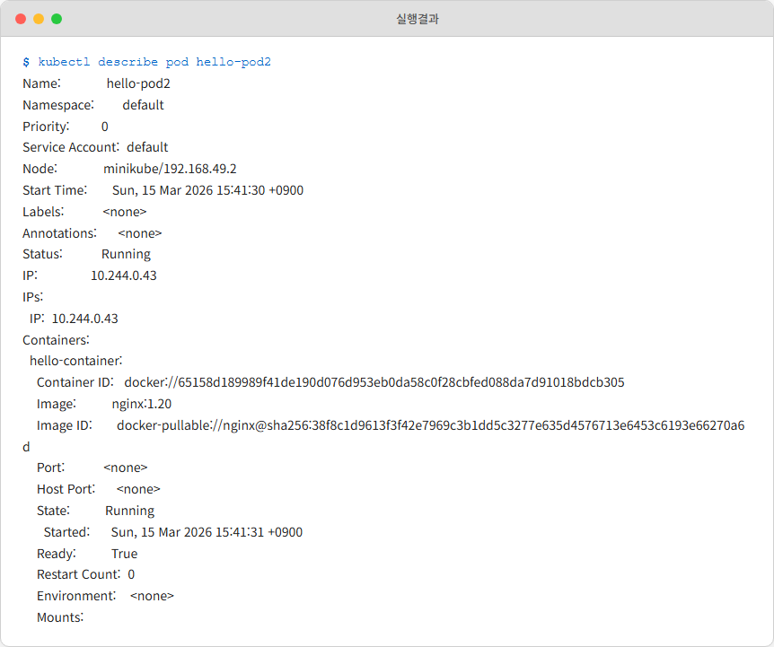
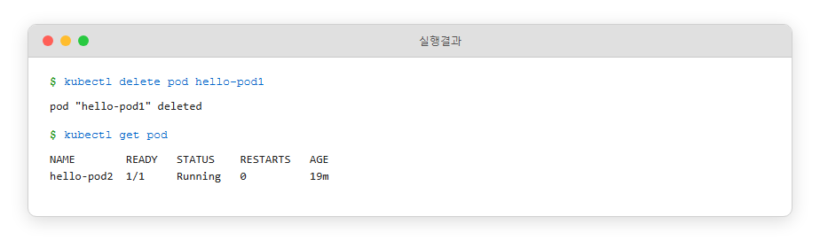

# Ch.4 Kubernetes 시작하기

컴포즈로 프로젝트 환경을 멋지게 갖춘 뒤 팀장에게 시연을 마쳤습니다. docker compose up 한 줄에 프론트엔드, 백엔드, DB가 동시에 올라가는 모습을 보며 팀장도 고개를 끄덕였습니다. 그런데 시연이 끝나갈 무렵, 팀장이 툭 던진 한마디에 말문이 막혔습니다.

**팀장**: "오픈아, 구성은 좋은데 이거 운영 서버에 올릴 거잖아. 만약 새벽 두 시에 컨테이너 하나가 죽으면 누가 살려?"

그 질문에 아무 대답도 할 수 없었습니다. 지난번 노트북을 덮으며 스스로에게 던졌던 *'만약 새벽 두 시에 컨테이너가 죽으면 누가 살려주지?'* 그 질문이 팀장의 입에서 그대로 돌아왔습니다. 컴포즈는 "지금 이 순간 띄워라"는 도구였지, 죽은 컨테이너를 실시간으로 감시하며 살려주는 기능은 없었으니까요. 팀장의 질문은 계속 이어졌습니다.

 - 사용자가 갑자기 몰리면 서버 대수는 어떻게 늘릴 건지?
 - 새 버전을 배포할 때 서비스 중단 없이 교체할 수 있는지?
 - 여러 대의 서버에 컨테이너를 골고루 나눠 띄울 수 있는지?

**팀장**: "이제 로컬을 넘어서야지. 쿠버네티스(Kubernetes) 한번 제대로 파봐."

퇴근 후 노트북을 열었습니다. 이제 막 도커에 익숙해졌는데 또 산을 넘어야 한다니 막막했지만, 팀장이 던진 '운영의 숙제'를 해결하려면 쿠버네티스가 왜 필요한지부터 알아야 했습니다.

## 4.1 왜 Kubernetes가 필요한가

### 4.1.1 Compose는 '실행 명령', Kubernetes는 '약속 유지'

팀장이 물었던 "죽으면 누가 살려?"라는 질문의 답을 찾다 보니, 도커 컴포즈와 쿠버네티스의 결정적인 차이점을 알게 되었습니다. 두 도구는 애초에 컨테이너를 대하는 태도부터 달랐습니다.

- **Docker Compose**: *"이 순간 이 세 컨테이너를 같이 띄워라."* 한 번의 실행 지시입니다.
- **Kubernetes**: *"이 서비스 3개가 항상 떠 있게 유지해라."* 지속되는 **약속**입니다.

Compose가 **명령형**이라면 K8s는 **선언형**입니다. 선언형이란 "해야 할 단계"를 지시하는 게 아니라, "원하는 최종 상태"만 적어두는 방식입니다.

시스템은 이 약속을 기억하고 있다가 현재 상태를 계속 비교합니다. 컨테이너가 하나 죽어서 약속한 숫자보다 부족해지면, 누가 시키지 않아도 즉시 새 컨테이너를 띄워 상태를 맞춥니다. 오픈이가 매번 up 명령어를 쳐서 상태를 만들던 방식과는 차원이 다른 '관리'의 개념이었습니다.

*'내가 일일이 감시하고 살리지 않아도 시스템이 알아서 관리 해준다는 거네.'*

:::term-box
**원하는 상태(Desired State)**: 쿠버네티스의 핵심 철학입니다. 사용자가 "서버 3대, CPU 0.5 사용" 같은 결과물(Desired State)을 선언하면, 쿠버네티스는 24시간 내내 현재 상태(Current State)를 관찰합니다. 만약 두 상태가 다르면(예: 서버가 2대로 줄어듦), 시스템이 자동으로 조치해 다시 3대로 맞춥니다.
:::

### 4.1.2 본사와 상가 건물 — 원하는 상태만 선언한다

챕터 1에서 미리 이름을 맞춰 두었던 **프랜차이즈 본사** 비유가 여기서 본격적으로 가동됩니다. 컨테이너 한 무더기를 다루는 자리에서, 가맹점 한 무더기를 다루는 자리로 옮겨 왔습니다.

'선언형'이라는 말이 이론적으로는 이해가 갔지만, 시스템이 "계속 비교하며 상태를 맞춘다"는 게 구체적으로 어떤 모습인지 오픈이는 선뜻 그려지지 않았습니다. 다음 날, 어제 팀장의 질문을 선배에게 슬쩍 물어보았습니다.

**선배**: "프랜차이즈 본사랑 상가 건물 관계를 생각하면 편해. 본사가 일일이 가맹점에 들어가서 요리하진 않잖아?"

그 말을 듣자 퍼즐이 맞춰지기 시작했습니다. 본사는 가맹점을 하나하나 직접 운영하지 않습니다. 대신 "서울 지역에 가맹점 50개 유지" 같은 지침을 내려보냅니다. 만약 한 가맹점이 갑자기 폐업하면 본사 관리팀은 새 가맹점을 열기 위해 노력하고 손님이 몰려 대기 줄이 길어지면 직원을 더 뽑으라고 지시합니다. 본사는 **'원하는 상태(Desired State)'**만 선언하고, 실제 현장은 그 상태에 맞춰 끊임없이 움직이는 구조입니다.


*그림 4-1. 본사가 "가맹점 4개 유지"를 선언하면 시스템이 가맹점 개수를 자동으로 맞추는 구조*

쿠버네티스도 똑같습니다. 오픈이가 "백엔드 서버(Pod) 3개를 항상 유지해줘"라고 선언만 해두면, 서버 하나가 죽어도 시스템이 알아서 새 서버를 띄웁니다. 트래픽이 늘어 숫자를 5로 바꾸면 그 즉시 2개를 더 복제해 냅니다. 컴포즈에서는 오픈이가 직접 docker run을 더 치거나 상태를 살펴야 했지만, 쿠버네티스에서는 이 모든 게 '선언 한 줄'로 끝납니다.

### 4.1.3 K8s 핵심 리소스 한눈에

쿠버네티스 세상에서는 모든 작업 단위를 **리소스(Resource)**라고 부릅니다. 사용자의 요청이 들어오면 여러 리소스를 거쳐 실제 컨테이너에 도달하게 됩니다. 전체적인 흐름은 다음과 같습니다.


*그림 4-2. Kubernetes 핵심 리소스의 전체 구조*

각 리소스의 역할을 프랜차이즈 비유와 연결해 보면 훨씬 이해하기 쉽습니다.

| 리소스 | 역할 | 프랜차이즈 비유 |
|--------|------|---------------|
| `Ingress` | 외부 요청을 도메인과 경로 기준으로 내부 서비스에 연결 | 프랜차이즈 공식 앱 |
| `Service` | 서버 주소가 바뀌어도 변하지 않는 고정 주소 제공 | 가맹점 직통 전화번호 |
| `Deployment` | 서버의 생성, 개수 유지, 업데이트를 자동 관리 | 본사 운영 지침서 |
| `Pod` | 컨테이너가 실행되는 가장 작은 단위 | 가맹점 |
| `ConfigMap` | 일반 설정값 저장 | 메뉴판 |
| `Secret` | 비밀번호·API 키 등 민감 정보 저장 | 금고 속 레시피 |

이번 챕터에서는 가장 기본이 되는 Pod와 Deployment를 먼저 다뤄보겠습니다. 자동 복구와 스케일링 같은 핵심 기능은 이 둘만으로도 충분히 구현할 수 있기 때문입니다.

### 4.1.4 K8s 동작 원리 — 본사와 상가 건물의 조직도

쿠버네티스는 크게 **컨트롤 플레인(Control Plane)** 과 **워커 노드(Worker Node)** 라는 두 조직으로 나뉩니다. 이 둘이 합쳐져 유기적으로 돌아가는 전체 시스템을 **클러스터(Cluster)**라고 부릅니다.


*그림 4-3. Kubernetes 클러스터의 구조*

- **클러스터**: 프랜차이즈 기업 그 자체입니다. 본사와 전국 상가 건물을 하나로 묶은 거대한 체계입니다.
- **컨트롤 플레인**: 본사 관리팀입니다. 어떤 상가 건물에 가맹점을 배치할지 정책을 정하고, 건물 상태를 실시간으로 점검하며 지침을 내립니다.
- **워커 노드**: 가맹점이 위치한 상가 건물입니다. 본사의 지침을 받아 가맹점(Pod)이 들어서서 실제로 서비스를 제공하는 현장입니다.

:::term-box
**노드(Node)**: 컨테이너가 실제로 돌아가는 컴퓨터 한 대를 말합니다. 실제 서비스 환경에서는 수십~수백 대의 노드(서버)가 모여 하나의 클러스터를 이룹니다.
:::

개발자가 명령을 내리면 **본사 관리팀(컨트롤 플레인)** 에서는 접수, 판단, 지시가 순차적으로 일어납니다.


*그림 4-4. 명령이 접수되어 현장으로 내려가는 흐름*

1. **접수**: 개발자의 명령이 **Kube API Server(본사 안내데스크)** 로 들어옵니다. 모든 요청의 입구입니다.
2. **판단**: 본사 내부에서 담당자들이 바빠집니다. 새 가맹점을 어느 상가 건물에 배치할지 **입지를 정하고(Scheduler)** 가맹점이 지침대로 **잘 운영되는지 감시(Controller Manager)** 합니다.
3. **실행**: 확정된 지시가 해당 상가 건물의 **실무 책임자(Kubelet)** 에게 전달되어 실제 운영에 반영됩니다.

이름이 조금 낯설어도 괜찮습니다. **"본사는 계획(선언)을 받고, 상가 건물은 그 계획대로 가맹점을 운영한다"** 는 흐름만 챙기면 됩니다. 조금 더 깊숙한 조직도가 궁금하다면 아래 박스를 가볍게 훑어보세요.

:::note
**본사와 상가 건물의 상세 조직도**

**컨트롤 플레인 (본사 관리팀)**
- **Kube API Server**: 모든 요청이 가장 먼저 도달하는 입구 (본사 안내데스크)
- **etcd**: 클러스터의 모든 상태를 기록하는 장부 (본사 데이터베이스)
- **Scheduler**: 새 Pod를 어느 노드에 배치할지 결정 (매장 입지 선정)
- **Controller Manager**: 원하는 상태와 실제 상태를 계속 비교하며 조절 (운영 감시 담당)

**워커 노드 (상가 건물)**
- **kubelet**: 본사 지시를 받아 컨테이너를 띄우고 상태를 보고 (현장 슈퍼바이저)
- **kube-proxy**: 가맹점이 자리를 옮겨도 손님 동선이 끊기지 않도록 자동으로 길을 다시 잡아 주는 안내 시스템. 챕터 2에서 본 iptables 포트포워딩과 같은 도구로, Docker가 호스트 한 대에 적용한 것을 클러스터 전체로 확장한 형태입니다 (자세한 동작은 5장에서 다룹니다)
:::


*'본사는 큰 그림을 그리고 상가 건물에서 실무를 뛴다... 구조는 알겠는데, 내 노트북 한 대로 이 거대한 시스템을 돌릴 수 있을까?'*

## 4.2 Minikube — 로컬에 세우는 작은 본사

### 4.2.1 노트북 한 대로 클러스터 흉내 내기

본사와 상가 건물 구조를 잡으려면 서버가 여러 대 필요할 것 같지만, 다행히 연습 단계에서는 노트북 한 대로도 충분합니다. Minikube를 쓰면 내 컴퓨터 안에 쿠버네티스 환경을 통째로 구축할 수 있습니다.

실제 쿠버네티스와 구조는 똑같지만 한 가지 차이가 있습니다. 노드가 단 하나라는 점입니다. Minikube는 노트북 안에 가상 머신(VM)이나 컨테이너를 하나 띄우고, 그 안에 컨트롤 플레인과 워커 노드 기능을 몽땅 집어넣습니다. 프랜차이즈로 치면, 본점 밖에 없는 구조입니다.


*그림 4-5. Minikube는 단일 노드 안에 본사와 상가 건물 기능이 함께 들어간 구조*

노드가 하나라 구조가 가볍고 리소스도 적게 먹습니다. 클라우드 전용의 복잡한 기능은 제한적이지만, 우리가 이번에 배울 Pod나 Deployment 같은 핵심 리소스를 익히기에는 이만한 게 없습니다. 여기서 연습한 설정 파일은 나중에 실제 운영 서버로 옮겨도 거의 그대로 쓸 수 있습니다.

:::term-box
**Minikube**: Mini + Kubernetes의 합성어로, 개인 PC에서 쿠버네티스를 실습하기 위한 표준 도구입니다. 가벼운 가상 환경을 사용해 클러스터를 흉내 냅니다.
:::

*'별도의 서버 없이 노트북 한 대로 클러스터를 돌려볼 수 있다니 다행이네. 이제 쿠버네티스를 하나씩 시작해봐야겠다.'*

### 4.2.2 설치와 시작

각 운영체제(OS)에 맞는 패키지 관리자로 Minikube를 설치합니다. Windows는 **Chocolatey**, Mac은 **Homebrew** 패키지 관리자가 미리 설치돼 있어야 합니다.

```bash
# Windows (관리자 권한 터미널)
choco install minikube

# Mac
brew install minikube
```

명령어를 치고 잠시 기다리면 노트북 안에 쿠버네티스 환경이 구성됩니다. 이제 우리가 만든 설계도를 쿠버네티스에게 전달할 준비가 끝났습니다.

```bash
minikube start         # 클러스터 시작
```


*그림 4-6. minikube start 실행 결과*

*'이제 쿠버네티스 테스트를 해볼 수 있겠네. 생각보다 간단하구나.'*

### 4.2.3 자주 쓰는 Minikube 명령어

오픈이는 실습 중 자주 쓰게 될 명령어들을 미리 정리해 뒀습니다.

| 명령어 | 설명 |
|--------|------|
| `minikube start` | 클러스터를 시작합니다. |
| `minikube stop` | 실행 중인 클러스터를 중지합니다. |
| `minikube status` | 현재 클러스터의 구동 상태를 확인합니다. |
| `minikube service <서비스명> --url` | 생성한 서비스에 접근할 수 있는 URL을 생성합니다. |
| `minikube addons enable ingress` | Ingress 기능을 활성화합니다. |
| `minikube tunnel` | 로컬 환경과 클러스터 내부를 연결하는 터널을 만듭니다. |

## 4.3 첫 Pod 띄우기

> 실습 YAML: https://github.com/metacoding-10-linux-docker/docker/tree/master/yaml

노트북에 Minikube 환경을 구성했으니 이제 실제 쿠버네티스의 리소스를 하나씩 띄워볼 차례입니다. 도커만 쓸 때와는 무엇이 다른지, 쿠버네티스라는 시스템이 컨테이너를 다루는 최소 단위부터 확인해 볼 차례입니다.

### 4.3.1 kubectl과 Pod

클러스터에 명령을 내릴 때 사용하는 도구는 kubectl입니다. 쿠버네티스에게 "이런 상태를 만들어줘"라고 요청하는 명령줄 도구입니다.

본격적으로 실습하기 전, 오픈이는 **Pod(파드)** 라는 생소한 단위를 먼저 짚고 넘어갔습니다. 도커에서는 컨테이너가 실행의 최소 단위였지만, 쿠버네티스는 컨테이너를 직접 제어하지 않습니다. 대신 하나 이상의 컨테이너를 Pod라는 박스로 한 번 감싸서 관리합니다.


*그림 4-7. Pod는 컨테이너를 감싸는 최소 실행 단위*

프랜차이즈 비유로 보면, Pod는 **가맹점 하나**와 같습니다. 가맹점 안에는 **직원(컨테이너)** 이 있고 조리 도구도 있지만, 외부에서는 '가맹점'이라는 단위로 소통하고 관리하는 셈입니다.

:::note
**왜 컨테이너 대신 Pod를 쓸까?**

컨테이너는 서로 독립적으로 동작해 네트워크·스토리지·생명주기를 함께 관리하기 어렵습니다. 
그래서 쿠버네티스는 하나처럼 묶어 관리할 수 있는 Pod를 ‘배포·운영의 최소 단위’로 사용합니다.
**하나처럼 묶어서 관리** : 여러 컨테이너를 하나로 묶어 같이 생성·종료되고, 함께 동작하도록 합니다.
**네트워크 공유** : Pod 내부 컨테이너들은 하나의 IP를 공유해 같은 서버 안처럼 통신합니다.
**관리 기준 단위** : 스케줄링, 확장, 장애 복구 등은 컨테이너가 아니라 Pod 기준으로 이루어집니다.

 이러한 이유로 쿠버네티스는 컨테이너가 아닌 Pod 단위로 관리합니다.
:::

### 4.3.2 명령어로 Pod 만들기

쿠버네티스에서 실제로 컨테이너가 어떻게 돌아가는지 확인해 볼 차례입니다. 가장 먼저 시도한 방식은 도커와 가장 유사한 명령어 기반의 생성입니다.

```bash
kubectl run hello-pod1 --image=nginx   # nginx 이미지로 Pod 생성
```


*그림 4-8. kubectl run으로 Pod 생성*

명령어를 입력하자 쿠버네티스의 컨트롤 플레인이 클러스터 내 노드 중 하나를 선택해 Pod를 배치했습니다.

*'도커에서 docker run을 쓰던 것과 비슷하네. 명령을 내리면 본사(컨트롤 플레인)가 알아서 적절한 위치를 지정해주는군.'*

### 4.3.3 YAML로 Pod 만들기

명령어 한 줄은 간편하지만, 실무에서는 설계도 역할을 하는 **YAML 파일을** 주로 사용합니다. 파일로 남겨두면 나중에 똑같은 설정을 재현하거나 팀원들과 공유하기가 훨씬 수월하기 때문입니다.

**yaml/hello-pod2.yml**
```yaml
apiVersion: v1
kind: Pod                 # 리소스 종류
metadata:
  name: hello-pod2        # 리소스명
spec:
  containers:
    - name: hello-container
      image: nginx:1.20        # 이미지
```

이렇게 작성한 파일을 클러스터에 적용할 때는 **kubectl apply** 명령어를 사용합니다.

```bash
kubectl apply -f hello-pod2.yml   # YAML로 Pod 생성
```


*그림 4-9. kubectl apply로 Pod 생성*

*'명령어 한 줄보다는 이렇게 파일로 관리하는 쪽이 나중에 다시 보기에도, 팀에 공유하기에도 편하겠다.'*

### 4.3.4 Pod 조회

생성 명령을 내렸다면 이제 상태를 확인할 차례입니다.

```bash
kubectl get pod   # Pod 목록 조회
```


*그림 4-10. Pod 목록 조회 결과*

STATUS 칸에 Running이 찍혀 있습니다. 

*'Pod 두 개가 떴다.'*

만약 Pod가 어느 노드에 배치되었는지, 혹은 생성 과정에서 어떤 일이 있었는지 상세히 알고 싶다면 describe 명령어를 사용합니다.

```bash
kubectl describe pod hello-pod2       # Pod 상세 정보 조회
```



*그림 4-11. Pod 상세 조회*

### 4.3.5 자주 쓰는 kubectl 명령어

오픈이는 실습 중 자주 쓰게 될 기본 명령어들을 간단히 정리해 두었습니다.

| 명령어 | 설명 |
|--------|------|
| `kubectl apply -f <파일>` | YAML로 리소스 생성/업데이트 |
| `kubectl get <리소스>` | 리소스 목록 조회 |
| `kubectl describe <리소스> <이름>` | 리소스 상세 정보 |
| `kubectl delete <리소스> <이름>` | 리소스 삭제 |
| `kubectl exec -it <Pod명> -- bash` | Pod 내부 접속 |
| `kubectl logs <Pod명>` | Pod 로그 확인 |

노트북에 두 개의 Pod가 나란히 떴습니다. 하지만 오픈이는 팀장이 던졌던 질문이 다시금 마음에 걸렸습니다.

*'근데 이것도 죽어버리면 도커랑 차이가 없는데?'*

## 4.4 Deployment — 자동 복구와 스케일링

### 4.4.1 Pod 하나를 직접 만들면 생기는 문제

방금 만든 Pod를 지워보며 한 가지 실험을 해봤습니다. 만약 운영 중에 누군가의 실수로 Pod가 삭제되거나, 프로그램 오류로 종료된다면 어떻게 될까?

```bash
kubectl delete pod hello-pod1
kubectl get pod
```



*그림 4-12. Pod 삭제 후 목록을 조회하면 hello-pod1이 사라져 있습니다*

결과는 냉정했습니다. hello-pod1은 목록에서 깔끔하게 사라졌고, 시간이 지나도 다시 나타나지 않았습니다.

*'이게 팀장님이 말씀하신 상황이구나.'*

상가 건물 비유로 보면, 가맹점(Pod) 하나가 폐업했는데도 아무도 신경 쓰지 않는 것과 같습니다. 이렇게 직접 만든 Pod는 일회성이라, 문제가 생겨 사라져도 아무도 책임지고 살려주지 않습니다.

결국 오픈이에게 필요한 건 **"가맹점 개수를 항상 일정하게 관리하라"는** 명확한 지침이었습니다. 쿠버네티스에서 이 역할을 담당하는 리소스가 바로 **Deployment(디플로이먼트)**입니다.

:::term-box
**Deployment**: Pod의 생성, 개수 유지, 업데이트를 자동으로 관리하는 리소스입니다. 실무에서는 장애 복구(Self-healing) 기능을 위해 Pod를 직접 만들지 않고 항상 Deployment로 감싸서 배포합니다. selector는 관리 대상을 식별하고, template은 새로 찍어낼 Pod의 규격을 정의합니다.
:::

### 4.4.2 Deployment — 본사의 지침서

Deployment는 "Pod를 몇 개 유지할지, 문제가 생기면 어떻게 교체할지"를 적어두는 매뉴얼과 같습니다.

**yaml/deploy-ex01.yml**
```yaml
apiVersion: apps/v1
kind: Deployment
metadata:
  name: nginx-deploy
spec:                    # pod에 대한 상태 지정
  replicas: 1            # 생성할 pod 수 지정
  selector:
    matchLabels:
      app: nginx         # 'app: nginx' 라벨이 붙은 Pod를 내 관리 대상으로 지정
  template:
    metadata:
      labels:
        app: nginx       # pod에 붙일 라벨
    spec:
      containers:
        - name: nginx-container
          image: nginx:1.20
```

여기서 가장 중요한 개념은 **selector** 와 **labels** 의 연결입니다.
Deployment의 selector에 **app: nginx** 라고 적어두면, 쿠버네티스는 해당 라벨을 가진 Pod들만 골라 관리합니다. 본사가 **"우리 브랜드 간판(Label)을 단 가맹점만 책임진다"고** 선언하는 방식과 같습니다. 이 라벨 매칭 방식은 Deployment만 쓰는 게 아닙니다. 다음 챕터에서 만날 **Service**도 같은 라벨로 Pod를 찾습니다.


*그림 4-13. selector가 지정한 라벨(app: nginx)을 가진 Pod만 골라 관리, 다른 라벨은 건드리지 않음*

작성한 파일을 적용해 보겠습니다.

```bash
kubectl apply -f deploy-ex01.yml   # Deployment 생성
kubectl get pod                    # Pod 목록
```


*그림 4-14. Deployment가 만든 Pod가 뜬 모습*

이제 Deployment가 정말로 지침을 지키는지 확인하기 위해, 현재 떠 있는 Pod를 전부 강제로 지워보았습니다.

```bash
kubectl delete pod --all           # 모든 Pod 삭제 
kubectl get pod                    # 목록 재확인
```


*그림 4-15. Pod를 다 지워도 Deployment가 자동으로 새 Pod를 띄웁니다*

`hello-pod2`는 그대로 사라졌지만 Deployment가 만든 Pod는 잠깐 사라졌다가 **새 이름으로 다시 올라와** 있었습니다.

*'오, 이거다. 내가 수동으로 살릴 필요가 없네.'*

Deployment에 replicas: 1이라고 선언해 두었기 때문에, Pod가 사라지면 시스템이 이를 감지하고 즉시 설계도(template)대로 새 Pod를 만들어낸 것입니다. 도커 컴포즈(Compose)를 쓸 때 오픈이가 일일이 확인하며 다시 띄워야 했던 일을 이제 쿠버네티스가 대신 해줍니다.


### 4.4.3 ReplicaSet — 개수를 맞춰주는 손

이제 안심이 되었습니다. 이제 Pod가 죽어도 Deployment가 알아서 살려준다는 걸 확인했으니까요. 하지만 곧이어 새로운 고민이 생겼습니다.

*'하나가 살아나는 건 알겠는데, 만약 사용자가 동시에 몰리면 어떨까? 아무리 성능이 좋아도 물리적인 한계가 있을 텐데.'*

결국 운영 환경에서는 부하를 분산하기 위해 여러 대의 Pod를 띄워야 합니다. 쿠버네티스에서는 replicas 값만 수정하면 되는데, 이 개수 관리를 실질적으로 담당하는 리소스가 바로 **ReplicaSet(레플리카셋)**입니다.

에어컨이 설정 온도를 유지하기 위해 실시간으로 온도를 체크하듯, ReplicaSet은 **'사용자가 선언한 개수(Desired State)'** 와 **'실제 돌아가는 개수'** 를 계속 비교합니다. 누군가 Pod를 지우거나 장애가 생겨 숫자가 모자라면, 즉시 새 Pod를 생성해 선언한 개수를 맞춥니다.

:::term-box
**ReplicaSet**: Deployment가 내부적으로 생성·관리하는 리소스로, 실제 Pod 개수 유지의 실행 주체입니다. 사용자는 보통 ReplicaSet을 직접 만들지 않고 Deployment를 통해 관리합니다.
:::


*그림 4-16. Pod 하나가 종료되면 ReplicaSet이 설정 개수를 맞추기 위해 새 Pod를 자동 생성*

replicas를 4로 설정해 실행될 Pod의 개수를 지정했습니다.

**yaml/deploy-ex02.yml**
```yaml
apiVersion: apps/v1
kind: Deployment
metadata:
  name: nginx-replica
spec:
  replicas: 4            # pod 수 지정

  strategy:
    type: RollingUpdate  #  롤링 업데이트 전략
    rollingUpdate:
      maxSurge: 4        # 업데이트 중 최대 4개까지 추가 생성
      maxUnavailable: 0  # 기존 Pod를 먼저 종료하지 않음 (무중단 배포)

  selector:              # 라벨이 app: nginx 인 pod를 관리
    matchLabels:
      app: nginx
  template:
    metadata:
      labels:
        app: nginx       # pod에 붙일 라벨
    spec:
      containers:
        - name: nginx-container
          image: nginx:1.20
```

이 YAML 파일을 클러스터에 적용하고, 설정한 대로 4개의 Pod가 생성되는지 확인했습니다.

```bash
kubectl apply -f deploy-ex02.yml
kubectl get pod
```


*그림 4-17. replicas 설정대로 Pod 4개가 생성*

*'replicas 설정값만 바꿨는데 자리가 4개나 생기네. 서버도 쉽게 늘릴 수 있으니 서버 부하는 괜찮겠어.'*

### 4.4.4 롤링 업데이트 — 끊김 없는 버전 교체

*'그런데 4개나 되는 Pod를 새 버전으로 바꾸려면 어떻게 하지? 전부 내리고 새로 올리면... 그 찰나에 서비스가 죽을 텐데. 팀장님한테 혼나겠지?'*

스케일링으로 동시 접속 문제는 해결했지만, 다음 고민은 '배포'였습니다. 서버를 내리고 새로운 버전으로 한꺼번에 바꾸면, 서버가 내려가 있는 동안 오류가 발생하게 됩니다.

이때 등장하는 것이 **롤링 업데이트(Rolling Update)** 입니다. 새 버전을 먼저 띄우고, 제대로 작동하는 게 확인되면 기존 버전을 내리는 식으로 '순차 교체'하는 방식입니다. YAML 파일의 strategy 설정이 바로 이 교체 속도를 조절하는 리모컨입니다.

:::term-box
**RollingUpdate 전략**: K8s Deployment의 기본 배포 전략입니다. `maxSurge`와 `maxUnavailable` 두 값으로 "몇 개를 더 띄울 수 있는지", "몇 개까지 사용 불가능해도 되는지"를 조정합니다.
:::

위 YAML의 `strategy` 블록의 속성은 다음과 같습니다.

- **maxSurge**: 업데이트 중 정원(replicas)보다 잠시 증가되는 Pod의 수 (추가 투입 인원)
- **maxUnavailable**: 업데이트 중 '작동 불능' 상태가 되어도 허용되는 Pod의 수 (잠시 문 닫아도 되는 가게 수)

예를 들어 replicas: 4, maxSurge: 4, maxUnavailable: 0이라면, 기존 4개는 그대로 둔 상태에서 새 버전 4개를 한꺼번에 더 만듭니다. 순식간에 가맹점이 8개로 늘어나는 셈입니다. 새 버전 4개가 모두 손님을 받을 준비(Ready)가 되면 그제야 기존 버전 4개를 동시에 종료시킵니다. maxUnavailable: 0 덕분에 어떤 순간에도 최소 4대는 무조건 살아있으니, 손님은 배포 중인지도 모르는 '무중단 배포'가 가능해집니다.

명령어 한 줄로 이미지 버전을 올려봤습니다.

```bash
kubectl set image deployment/nginx-replica nginx-container=nginx:1.21
```


*그림 4-18. 이미지 버전 업데이트 실행*

실시간으로 지켜보니 정말 신기했습니다. 새 Pod가 먼저 실행되고, 기다렸다는 듯 기존 Pod가 하나씩 종료되는 순서가 눈에 들어옵니다.

```bash
kubectl get pod -w   # Pod 상태 실시간 감시
```


*그림 4-19. 롤링 업데이트 진행 화면*

업데이트가 끝난 뒤 Deployment의 상세 정보를 확인하면 이미지가 `nginx:1.21` 버전으로 변경된 것을 볼 수 있습니다.

```bash
kubectl describe deployment nginx-replica  # Deployment 상세 정보 조회
```

### 4.4.5 Rollback — 되돌리기

세상에 완벽한 배포는 없습니다. 만약 새 버전에 치명적인 버그가 있다면? 쿠버네티스에서는 걱정할 필요가 없습니다.

```bash
kubectl rollout history deployment/nginx-replica   # 배포 이력 조회
kubectl rollout undo deployment/nginx-replica      # 이전 버전으로 롤백
```


*그림 4-20. Rollback 실행 결과*

배포가 꼬여도 단 두 줄이면 시간을 되돌릴 수 있습니다.

*'휴, 배포 실패 복구가 이렇게 간단하다니. 이제 배포 날 새벽까지 떨지 않아도 되겠어.'*

### 4.4.6 바뀌는 번호

Deployment가 Pod를 자동으로 살려 줍니다. 숫자만 바꿔주면 개수가 맞춰지고, 새 버전도 무중단으로 넘어갑니다. 오픈이가 새벽마다 하던 일 대부분이 이 안에 들어왔습니다. 노트북을 덮으려다 무심코 Pod 목록을 한 번 더 본 게 화근이었습니다.

방금 롤백으로 다시 정렬된 Pod를 들여다보던 오픈이는 이상한 점을 발견했습니다. 되살아난 Pod의 **이름이 달라져 있었습니다**. 이름이 다르면 IP도 다를 것 같았습니다. 직접 확인해 봤습니다.

`-o wide` 옵션을 붙이면 Pod별 IP가 같이 표시됩니다.

```bash
kubectl get pod -o wide               # Pod별 IP 함께 조회
```

오픈이의 화면에는 이런 줄이 떴습니다. (IP 값은 환경마다 다릅니다)

```
NAME                            READY   STATUS    IP            NODE
nginx-replica-6d4cf56db6-abc12  1/1     Running   10.244.0.5    minikube
nginx-replica-6d4cf56db6-def34  1/1     Running   10.244.0.6    minikube
nginx-replica-6d4cf56db6-ghi56  1/1     Running   10.244.0.7    minikube
nginx-replica-6d4cf56db6-jkl78  1/1     Running   10.244.0.8    minikube
```

첫 번째 Pod의 IP는 `10.244.0.5`였습니다. 오픈이는 이 번호를 메모장에 적어 뒀습니다. 그리고 이 Pod를 지웠습니다.

```bash
kubectl delete pod nginx-replica-6d4cf56db6-abc12  # 첫 번째 Pod 삭제
kubectl get pod -o wide                            # 다시 조회
```

Deployment가 곧바로 새 Pod를 하나 만들어 총 네 개를 맞췄습니다. 그런데 새로 올라온 Pod의 이름은 `nginx-replica-6d4cf56db6-mno90`처럼 완전히 다른 해시값을 달고 있었습니다. IP 칸을 봤습니다.

```
nginx-replica-6d4cf56db6-mno90  1/1     Running   10.244.0.9    minikube
```

`10.244.0.5`가 아니라 `10.244.0.9`였습니다. 가맹점 자리는 네 개 그대로 유지됐는데 **가맹점 전화번호가 바뀐** 겁니다. 이게 왜 문제인지 한 박자 늦게 떠올랐습니다.

*'어… 그래서 이게 왜 문제지?'*

메모장에 적어 둔 그 번호는 더 이상 존재하지 않는 가맹점 번호였습니다.

순간 머릿속에 떠오른 그림은 챕터 3의 풀스택이었습니다. 프론트엔드 컨테이너가 백엔드 컨테이너를 호출할 때, 그 백엔드의 IP가 배포할 때마다 달라진다면 프론트엔드 설정을 매번 고쳐야 합니다. 자동 복구가 진짜 자동이 되려면 이 흔들림을 가려 줄 고정된 주소가 필요했습니다.

*'이 숫자를 프론트엔드 코드에 박아 둘 수는 없잖아.'*

다음 실습을 위해 오픈이는 Deployment를 정리했습니다.

```bash
kubectl delete deployment nginx-replica # Deployment 삭제
```

화면이 비워졌습니다. 흔들리는 IP라는 마지막 매듭은 다음 챕터에서 풀어 갈 일이었습니다.


## 이것만은 기억하자

- **Compose는 "지금 이대로", Kubernetes는 "이 상태를 유지해라".** : 선언형 관리의 핵심입니다. 내가 원하는 상태를 YAML에 정의해두면, 쿠버네티스가 실시간 상태를 확인하며 그 모습에 계속 맞춥니다.
- **K8s는 프랜차이즈 본사 구조** : 컨트롤 플레인은 본사, 워커 노드는 상가 건물입니다. 본사에서 지침을 내리면 상가 건물 안에 가맹점(Pod)이 일을 하는 구조입니다.
- **Pod는 가맹점, 실행의 최소 단위.** : K8s에서 컨테이너는 Pod라는 박스에 담겨 움직입니다.
- **Pod를 직접 만들지 마세요.** : 직접 만든 Pod는 장애가 나도 복구되지 않습니다. 반드시 Deployment로 감싸서 관리 목록에 올려야 자동 복구와 스케일링이 가능해집니다.
- **롤링 업데이트로 무중단 배포.** : 새 Pod를 먼저 띄운 뒤 기존 Pod를 순차적으로 교체하여, 서비스 중단 없이 버전을 올리는 방식입니다.

Pod와 Deployment로 자동 복구·스케일링·무중단 배포까지 손에 넣었습니다. 흔들리는 Pod IP가 마지막 매듭으로 남아 다음 챕터로 이어집니다. Service와 Ingress가 그 매듭을 풀어 줄 차례입니다.