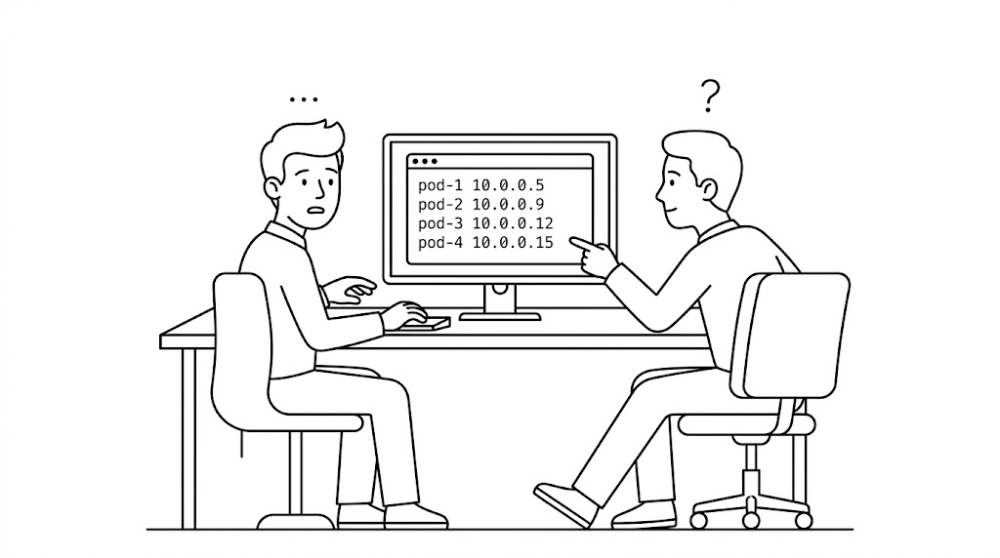
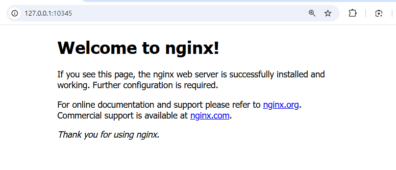
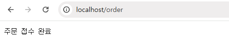

# Ch.5 Kubernetes 네트워킹

:::goal
**이번 챕터가 끝나면**

- **Service**가 어떻게 Pod IP 변동을 추상화해 고정 진입점을 만드는지 이해합니다
- **ClusterIP·NodePort·LoadBalancer** 세 타입의 차이와 사용 사례를 익힙니다
- **Ingress**로 외부 도메인 한 곳에서 URL 경로별로 요청을 분기합니다
- 브라우저에서 Pod까지 패킷이 가는 3단계 흐름을 그려 봅니다
:::

다음 날 아침이었습니다. 가방을 내려놓고 자리에 앉았습니다.

옆자리 선배가 자리에 앉으며 물었습니다.

**선배**: "어제 쿠버네티스는 어디까지 봤어요?"

**오픈이**: "Pod 띄우는 거랑 자동 복구까지 봤어요."

**선배**: "잘했네요. 그럼 외부에서 그 Pod에는 어떻게 접근하면 될까요?"

오픈이는 답이 떠오르지 않았습니다.

*'어... 어디로 들어가지...'*

오픈이는 어제처럼 Pod 네 대를 다시 실행했습니다. Pod마다 다른 IP가 보였고, 그중 하나를 브라우저에 쳐 봤지만 화면은 열리지 않습니다.



*그림 5-1. Pod는 떠 있는데 접근할 주소가 없던 아침*

게다가 화면에 뜬 IP는 어제 본 것과 모두 달랐습니다.

**오픈이**: "선배님, IP가 보여도 안 들어가지고, 다시 실행할 때마다 바뀌어요. 어떻게 접근해야 하죠?"

**선배**: "Service라는 리소스가 그 역할을 맡아요. Pod 앞에 고정된 주소를 세워 두는 일을 하죠. 한 번 공부해봐요."

## 5.1 Service - Pod의 고정 주소

### 5.1.1 Service가 필요한 이유

오픈이가 **Service**를 검색해 보니, 첫 줄에 정의가 적혀 있었습니다. Pod IP가 바뀌어도 변하지 않는 **고정 진입점**을 만들고, 뒤에 연결된 여러 Pod에 **요청을 분배**하는 리소스가 Service였습니다.

<div class="svg-figure">
<svg viewBox="0 0 760 260" xmlns="http://www.w3.org/2000/svg" role="img" aria-label="외부 요청이 Service를 거쳐 클러스터 안 여러 Pod로 분배되는 구조">
  <defs>
    <marker id="sv-p" markerWidth="10" markerHeight="10" refX="8" refY="3" orient="auto"><path d="M0,0 L0,6 L8,3 z" fill="#475569"/></marker>
  </defs>
  <rect x="20" y="100" width="130" height="80" rx="8" fill="#fff" stroke="#475569" stroke-width="1.6"/>
  <text x="85" y="135" text-anchor="middle" font-size="13" font-weight="700" fill="#0f172a">외부 요청</text>
  <text x="85" y="158" text-anchor="middle" font-size="10" fill="#6b7280">브라우저·클라이언트</text>
  <line x1="150" y1="140" x2="198" y2="140" stroke="#475569" stroke-width="1.8" marker-end="url(#sv-p)"/>
  <text x="174" y="132" text-anchor="middle" font-size="10" fill="#6b7280" font-style="italic">요청</text>
  <rect x="190" y="30" width="510" height="225" rx="10" fill="none" stroke="#ff7849" stroke-width="1.6" stroke-dasharray="6,4"/>
  <text x="205" y="20" font-size="11" font-weight="700" fill="#7b341e">Kubernetes 클러스터</text>
  <rect x="200" y="100" width="180" height="80" rx="8" fill="#fff4ed" stroke="#ff7849" stroke-width="1.8"/>
  <text x="290" y="135" text-anchor="middle" font-size="14" font-weight="700" fill="#7b341e">Service</text>
  <text x="290" y="158" text-anchor="middle" font-size="11" fill="#7b341e">고정 진입점</text>
  <line x1="380" y1="125" x2="505" y2="68" stroke="#475569" stroke-width="1.8" marker-end="url(#sv-p)"/>
  <line x1="380" y1="140" x2="505" y2="140" stroke="#475569" stroke-width="1.8" marker-end="url(#sv-p)"/>
  <line x1="380" y1="155" x2="505" y2="212" stroke="#475569" stroke-width="1.8" marker-end="url(#sv-p)"/>
  <text x="445" y="134" text-anchor="middle" font-size="10" fill="#6b7280" font-style="italic">분배</text>
  <rect x="510" y="40" width="180" height="55" rx="8" fill="#fff" stroke="#475569" stroke-width="1.6"/>
  <text x="600" y="62" text-anchor="middle" font-size="13" font-weight="700" fill="#0f172a">Pod 1</text>
  <text x="600" y="80" text-anchor="middle" font-size="11" font-family="monospace" fill="#6b7280">10.0.0.5</text>
  <rect x="510" y="115" width="180" height="55" rx="8" fill="#fff" stroke="#475569" stroke-width="1.6"/>
  <text x="600" y="137" text-anchor="middle" font-size="13" font-weight="700" fill="#0f172a">Pod 2</text>
  <text x="600" y="155" text-anchor="middle" font-size="11" font-family="monospace" fill="#6b7280">10.0.0.9</text>
  <rect x="510" y="190" width="180" height="55" rx="8" fill="#fff" stroke="#475569" stroke-width="1.6"/>
  <text x="600" y="212" text-anchor="middle" font-size="13" font-weight="700" fill="#0f172a">Pod 3</text>
  <text x="600" y="230" text-anchor="middle" font-size="11" font-family="monospace" fill="#6b7280">10.0.0.12</text>
</svg>
</div>

*그림 5-2. Service는 Pod IP가 바뀌어도 변하지 않는 고정 주소를 제공*

### 5.1.2 Service 생성

:::tip
전체 실습 코드는 깃헙을 참고합니다.

**실습 코드 (GitHub)**: https://github.com/metacoding-10-linux-docker/docker/tree/master/ex11
:::

오픈이는 직접 만들어 보기로 했습니다. 먼저 Pod를 실행한 다음, 앞에 Service를 붙이는 순서로 진행합니다.

`ex11` 폴더를 열고 어제 적용했던 `deploy-ex02.yml`을 다시 적용합니다. Pod 네 개를 실행하는 Deployment 설정입니다.

```bash [터미널] Pod 4개 생성
kubectl apply -f ex11/deploy-ex02.yml   # Pod 4개 생성
```

다음으로 Service YAML을 살펴봤습니다.

```yaml [실습 1] ex11/service-ex01.yml. NodePort Service 정의
apiVersion: v1
kind: Service
metadata:
  name: nginx-service
spec:
  type: NodePort        # 노드 IP와 포트로 외부 접근이 가능한 타입
  selector:
    app: nginx          # 이 라벨을 가진 Pod들을 뒤에 연결
  ports:
    - port: 80          # 클러스터 내부에서 Service로 진입하는 포트
      targetPort: 80    # Service가 Pod로 요청을 전달하는 포트
      nodePort: 30080   # 외부에서 노드로 진입할 때 사용하는 포트 (기본 허용 범위 30000~32767)
```

Service는 **Deployment**와 동일하게 **selector** 방식으로 Pod를 관리합니다.

<div class="svg-figure">
<svg viewBox="0 0 760 260" xmlns="http://www.w3.org/2000/svg" role="img" aria-label="Service의 selector(app: nginx)와 같은 라벨을 가진 Pod만 골라 매칭하고, 라벨이 다른 Pod는 제외하는 구조">
  <defs>
    <marker id="sl-svc" markerWidth="10" markerHeight="10" refX="8" refY="3" orient="auto"><path d="M0,0 L0,6 L8,3 z" fill="#ff7849"/></marker>
  </defs>
  <text x="380" y="22" text-anchor="middle" font-size="13" font-weight="700" fill="#0f172a">selector — 같은 라벨을 가진 Pod만 매칭</text>
  <rect x="40" y="80" width="220" height="100" rx="8" fill="#fff" stroke="#ff7849" stroke-width="1.8"/>
  <path d="M 48 80 L 252 80 Q 260 80 260 88 L 260 106 L 40 106 L 40 88 Q 40 80 48 80 Z" fill="#ff7849"/>
  <text x="150" y="99" text-anchor="middle" font-size="12" font-weight="700" fill="#fff">Service</text>
  <text x="150" y="135" text-anchor="middle" font-size="11" font-weight="600" fill="#7b341e">selector</text>
  <text x="150" y="163" text-anchor="middle" font-size="14" font-family="monospace" font-weight="700" fill="#7b341e">app: nginx</text>
  <path d="M 260 115 Q 380 70, 510 55" fill="none" stroke="#ff7849" stroke-width="1.8" stroke-dasharray="6,4" marker-end="url(#sl-svc)"/>
  <path d="M 260 135 Q 380 135, 510 135" fill="none" stroke="#ff7849" stroke-width="1.8" stroke-dasharray="6,4" marker-end="url(#sl-svc)"/>
  <rect x="510" y="25" width="220" height="60" rx="6" fill="#fff" stroke="#ff7849" stroke-width="1.6"/>
  <text x="525" y="48" font-size="12" font-weight="700" fill="#7b341e">Pod 1</text>
  <text x="525" y="71" font-size="11" font-family="monospace" fill="#7b341e">labels: </text>
  <text x="585" y="71" font-size="11" font-family="monospace" font-weight="700" fill="#7b341e">app: nginx</text>
  <text x="722" y="48" text-anchor="end" font-size="11" font-weight="700" fill="#ff7849">선택</text>
  <rect x="510" y="105" width="220" height="60" rx="6" fill="#fff" stroke="#ff7849" stroke-width="1.6"/>
  <text x="525" y="128" font-size="12" font-weight="700" fill="#7b341e">Pod 2</text>
  <text x="525" y="151" font-size="11" font-family="monospace" fill="#7b341e">labels: </text>
  <text x="585" y="151" font-size="11" font-family="monospace" font-weight="700" fill="#7b341e">app: nginx</text>
  <text x="722" y="128" text-anchor="end" font-size="11" font-weight="700" fill="#ff7849">선택</text>
  <rect x="510" y="185" width="220" height="60" rx="6" fill="#f1f5f9" stroke="#cbd5e1" stroke-width="1.4" stroke-dasharray="4,3"/>
  <text x="525" y="208" font-size="12" font-weight="700" fill="#94a3b8">Pod 3</text>
  <text x="525" y="231" font-size="11" font-family="monospace" fill="#94a3b8">labels: </text>
  <text x="585" y="231" font-size="11" font-family="monospace" font-weight="700" fill="#94a3b8">app: db</text>
  <text x="722" y="208" text-anchor="end" font-size="11" font-weight="700" fill="#94a3b8">제외</text>
</svg>
</div>

*그림 5-3. selector가 지정한 라벨(app: nginx)을 가진 Pod만 매칭하고 다른 라벨은 제외*

### 5.1.3 Service 타입과 접근 범위

YAML을 살펴보던 중에 오픈이는 `type: NodePort` 한 줄에서 멈췄습니다.

*'NodePort 말고 다른 type도 있다는 거네. 어떤 차이가 있을까.'*

Service는 접근 범위에 따라 세 종류로 나뉩니다. 아파트 단지에 비유하면 **단지 내부 인터폰**처럼 안에서만 통하는 **ClusterIP**, **각 동 1층의 특수 출입구**처럼 동 위치와 번호를 알아야 들어오는 **NodePort**, **단지 정문 총괄 경비실**처럼 대표 주소 하나로 트래픽을 분산하는 **LoadBalancer**입니다.

#### ① ClusterIP

서비스 타입의 **기본값**입니다. 외부 접근은 막혀 있고, **클러스터 내부의 Pod끼리만 통신**할 때 사용합니다. DB처럼 외부 노출이 필요 없는 구성에 적합합니다.

<div class="svg-figure">
<svg viewBox="0 0 760 250" xmlns="http://www.w3.org/2000/svg" role="img" aria-label="ClusterIP — 외부 접근은 차단되고 클러스터 내부 Pod끼리만 통신하는 구조">
  <defs>
    <marker id="cip-p" markerWidth="10" markerHeight="10" refX="8" refY="3" orient="auto"><path d="M0,0 L0,6 L8,3 z" fill="#475569"/></marker>
    <marker id="cip-x" markerWidth="10" markerHeight="10" refX="8" refY="3" orient="auto"><path d="M0,0 L0,6 L8,3 z" fill="#dc2626"/></marker>
  </defs>
  <text x="380" y="22" text-anchor="middle" font-size="13" font-weight="700" fill="#1f2937">ClusterIP — 클러스터 안에서만 통신</text>
  <rect x="20" y="100" width="130" height="60" rx="8" fill="#fff" stroke="#475569" stroke-width="1.6"/>
  <text x="85" y="125" text-anchor="middle" font-size="13" font-weight="700" fill="#0f172a">외부 Host</text>
  <text x="85" y="145" text-anchor="middle" font-size="10" fill="#6b7280">브라우저·외부 PC</text>
  <line x1="150" y1="130" x2="270" y2="130" stroke="#dc2626" stroke-width="1.8" stroke-dasharray="6,4" marker-end="url(#cip-x)"/>
  <g transform="translate(210,130)">
    <circle r="14" fill="#fff" stroke="#dc2626" stroke-width="2"/>
    <line x1="-7" y1="-7" x2="7" y2="7" stroke="#dc2626" stroke-width="2.4"/>
    <line x1="-7" y1="7" x2="7" y2="-7" stroke="#dc2626" stroke-width="2.4"/>
  </g>
  <text x="210" y="172" text-anchor="middle" font-size="10" font-style="italic" fill="#b91c1c">접근 차단</text>
  <rect x="290" y="50" width="450" height="190" rx="10" fill="#fff" stroke="#ff7849" stroke-width="1.6" stroke-dasharray="6,4"/>
  <text x="305" y="71" font-size="11" font-weight="700" fill="#7b341e">Kubernetes 클러스터</text>
  <rect x="305" y="100" width="120" height="60" rx="8" fill="#fff" stroke="#475569" stroke-width="1.6"/>
  <text x="365" y="125" text-anchor="middle" font-size="12" font-weight="700" fill="#0f172a">내부 Pod</text>
  <text x="365" y="145" text-anchor="middle" font-size="10" fill="#6b7280">호출자</text>
  <line x1="425" y1="130" x2="475" y2="130" stroke="#475569" stroke-width="1.8" marker-end="url(#cip-p)"/>
  <rect x="475" y="100" width="130" height="60" rx="8" fill="#fff4ed" stroke="#ff7849" stroke-width="1.8"/>
  <text x="540" y="123" text-anchor="middle" font-size="13" font-weight="700" fill="#7b341e">Service</text>
  <text x="540" y="143" text-anchor="middle" font-size="10" font-family="monospace" fill="#7b341e">ClusterIP</text>
  <line x1="605" y1="120" x2="650" y2="100" stroke="#475569" stroke-width="1.6" marker-end="url(#cip-p)"/>
  <line x1="605" y1="140" x2="650" y2="180" stroke="#475569" stroke-width="1.6" marker-end="url(#cip-p)"/>
  <rect x="650" y="80" width="80" height="50" rx="6" fill="#fff" stroke="#475569" stroke-width="1.4"/>
  <text x="690" y="110" text-anchor="middle" font-size="12" font-weight="700" fill="#0f172a">Pod A</text>
  <rect x="650" y="170" width="80" height="50" rx="6" fill="#fff" stroke="#475569" stroke-width="1.4"/>
  <text x="690" y="200" text-anchor="middle" font-size="12" font-weight="700" fill="#0f172a">Pod B</text>
</svg>
</div>

*그림 5-4. ClusterIP는 외부 요청은 닿지 못하고 내부 Pod끼리만 통신*

#### ② NodePort

이번 실습에서 사용한 방식입니다. **노드(서버)에 특정 포트를 열어** 외부에서 들어올 수 있게 합니다. 노드 포트로 들어온 요청이 클러스터 내부 Service로 전달됩니다.

<div class="svg-figure">
<svg viewBox="0 0 760 230" xmlns="http://www.w3.org/2000/svg" role="img" aria-label="NodePort — 노드 IP의 특정 포트(30080)를 통해 외부에서 Service로 접근하는 구조">
  <defs>
    <marker id="np-p" markerWidth="10" markerHeight="10" refX="8" refY="3" orient="auto"><path d="M0,0 L0,6 L8,3 z" fill="#475569"/></marker>
  </defs>
  <text x="380" y="22" text-anchor="middle" font-size="13" font-weight="700" fill="#1f2937">NodePort — 노드 IP의 특정 포트로 외부 접근 허용</text>
  <rect x="20" y="100" width="130" height="60" rx="8" fill="#fff" stroke="#475569" stroke-width="1.6"/>
  <text x="85" y="125" text-anchor="middle" font-size="13" font-weight="700" fill="#0f172a">외부 Host</text>
  <text x="85" y="145" text-anchor="middle" font-size="10" font-family="monospace" fill="#6b7280">노드IP:30080</text>
  <rect x="195" y="50" width="555" height="160" rx="10" fill="#fff" stroke="#ff7849" stroke-width="1.6" stroke-dasharray="6,4"/>
  <text x="210" y="71" font-size="11" font-weight="700" fill="#7b341e">Kubernetes 클러스터</text>
  <line x1="150" y1="130" x2="220" y2="130" stroke="#475569" stroke-width="1.8" marker-end="url(#np-p)"/>
  <rect x="220" y="100" width="130" height="60" rx="8" fill="#fff4ed" stroke="#ff7849" stroke-width="2.4"/>
  <text x="285" y="124" text-anchor="middle" font-size="13" font-weight="700" fill="#7b341e">NodePort</text>
  <text x="285" y="144" text-anchor="middle" font-size="11" font-family="monospace" fill="#7b341e">:30080</text>
  <line x1="350" y1="130" x2="400" y2="130" stroke="#475569" stroke-width="1.8" marker-end="url(#np-p)"/>
  <rect x="400" y="100" width="130" height="60" rx="8" fill="#fff" stroke="#475569" stroke-width="1.6"/>
  <text x="465" y="123" text-anchor="middle" font-size="13" font-weight="700" fill="#0f172a">Service</text>
  <text x="465" y="143" text-anchor="middle" font-size="10" font-family="monospace" fill="#6b7280">ClusterIP</text>
  <line x1="530" y1="120" x2="585" y2="95" stroke="#475569" stroke-width="1.6" marker-end="url(#np-p)"/>
  <line x1="530" y1="140" x2="585" y2="165" stroke="#475569" stroke-width="1.6" marker-end="url(#np-p)"/>
  <rect x="585" y="70" width="120" height="50" rx="6" fill="#fff" stroke="#475569" stroke-width="1.4"/>
  <text x="645" y="100" text-anchor="middle" font-size="12" font-weight="700" fill="#0f172a">Pod A</text>
  <rect x="585" y="150" width="120" height="50" rx="6" fill="#fff" stroke="#475569" stroke-width="1.4"/>
  <text x="645" y="180" text-anchor="middle" font-size="12" font-weight="700" fill="#0f172a">Pod B</text>
</svg>
</div>

*그림 5-5. NodePort는 노드의 특정 포트로 외부 접근을 허용*

#### ③ LoadBalancer

실제 운영 환경에서 가장 흔히 쓰는 방식입니다. 클라우드 환경에서 **공인 IP가 자동 발급**되어, 사용자는 IP나 도메인 하나로 들어옵니다.

<div class="svg-figure">
<svg viewBox="0 0 760 300" xmlns="http://www.w3.org/2000/svg" role="img" aria-label="LoadBalancer — 공인 IP가 각 노드의 NodePort로 직접 트래픽을 분산하고, Service는 Pod 집합을 라벨로 묶는 논리 리소스">
  <defs>
    <marker id="lb-p" markerWidth="10" markerHeight="10" refX="8" refY="3" orient="auto"><path d="M0,0 L0,6 L8,3 z" fill="#475569"/></marker>
  </defs>
  <text x="380" y="22" text-anchor="middle" font-size="13" font-weight="700" fill="#1f2937">LoadBalancer — 공인 IP 하나로 여러 노드에 분산</text>
  <rect x="150" y="60" width="100" height="34" rx="6" fill="#fff" stroke="#475569" stroke-width="1.4"/>
  <text x="200" y="82" text-anchor="middle" font-size="12" font-weight="700" fill="#0f172a">User 1</text>
  <rect x="150" y="118" width="100" height="34" rx="6" fill="#fff" stroke="#475569" stroke-width="1.4"/>
  <text x="200" y="140" text-anchor="middle" font-size="12" font-weight="700" fill="#0f172a">User 2</text>
  <rect x="150" y="176" width="100" height="34" rx="6" fill="#fff" stroke="#475569" stroke-width="1.4"/>
  <text x="200" y="198" text-anchor="middle" font-size="12" font-weight="700" fill="#0f172a">User 3</text>
  <line x1="250" y1="77" x2="303" y2="120" stroke="#475569" stroke-width="1.4" marker-end="url(#lb-p)"/>
  <line x1="250" y1="135" x2="303" y2="140" stroke="#475569" stroke-width="1.4" marker-end="url(#lb-p)"/>
  <line x1="250" y1="193" x2="303" y2="165" stroke="#475569" stroke-width="1.4" marker-end="url(#lb-p)"/>
  <rect x="305" y="100" width="140" height="90" rx="10" fill="#fff4ed" stroke="#ff7849" stroke-width="1.8" stroke-dasharray="6,4"/>
  <text x="375" y="125" text-anchor="middle" font-size="11" font-weight="600" fill="#7b341e">클라우드 (AWS, GCP 등)</text>
  <text x="375" y="148" text-anchor="middle" font-size="13" font-weight="700" fill="#7b341e">LoadBalancer</text>
  <text x="375" y="172" text-anchor="middle" font-size="10" font-family="monospace" fill="#7b341e">공인 IP</text>
  <rect x="500" y="40" width="170" height="250" rx="10" fill="#fff" stroke="#ff7849" stroke-width="1.6" stroke-dasharray="5,3"/>
  <text x="513" y="58" font-size="11" font-weight="700" fill="#7b341e">Kubernetes 클러스터</text>
  <line x1="445" y1="120" x2="508" y2="107" stroke="#475569" stroke-width="1.4" marker-end="url(#lb-p)"/>
  <line x1="445" y1="145" x2="508" y2="180" stroke="#475569" stroke-width="1.4" marker-end="url(#lb-p)"/>
  <line x1="445" y1="170" x2="508" y2="253" stroke="#475569" stroke-width="1.4" marker-end="url(#lb-p)"/>
  <rect x="510" y="75" width="150" height="65" rx="6" fill="#fff" stroke="#cbd5e1" stroke-width="0.8"/>
  <text x="525" y="93" font-size="10" font-weight="700" fill="#0f172a">Node 1</text>
  <rect x="560" y="95" width="80" height="32" rx="4" fill="#fff4ed" stroke="#ff7849" stroke-width="1.4"/>
  <text x="600" y="115" text-anchor="middle" font-size="11" font-weight="700" fill="#7b341e">Pod</text>
  <rect x="510" y="148" width="150" height="65" rx="6" fill="#fff" stroke="#cbd5e1" stroke-width="0.8"/>
  <text x="525" y="166" font-size="10" font-weight="700" fill="#0f172a">Node 2</text>
  <rect x="560" y="168" width="80" height="32" rx="4" fill="#fff4ed" stroke="#ff7849" stroke-width="1.4"/>
  <text x="600" y="188" text-anchor="middle" font-size="11" font-weight="700" fill="#7b341e">Pod</text>
  <rect x="510" y="221" width="150" height="65" rx="6" fill="#fff" stroke="#cbd5e1" stroke-width="0.8"/>
  <text x="525" y="239" font-size="10" font-weight="700" fill="#0f172a">Node 3</text>
  <rect x="560" y="241" width="80" height="32" rx="4" fill="#fff4ed" stroke="#ff7849" stroke-width="1.4"/>
  <text x="600" y="261" text-anchor="middle" font-size="11" font-weight="700" fill="#7b341e">Pod</text>
</svg>
</div>

*그림 5-6. LoadBalancer는 클라우드가 공인 IP를 발급해 여러 노드에 분산*

LoadBalancer 타입은 ClusterIP와 NodePort를 함께 포함합니다. 그래서 Service 하나로 내부 통신과 외부 접근이 모두 처리됩니다.

세 타입의 차이를 한 표로 정리하면 다음과 같습니다.

| 타입 | 접근 범위 | 사용 사례 |
|:----:|:---------|:---------|
| `ClusterIP` | 클러스터 내부만 | 백엔드·DB 등 외부 노출이 불필요한 서비스 |
| `NodePort` | 노드IP:포트로 외부 접근 가능 | 테스트 및 개발 환경 |
| `LoadBalancer` | 공인 IP로 외부 접근 가능 | 실제 클라우드 운영 환경 |

### 5.1.4 포트 흐름

앞서 만든 Service YAML에는 `port`, `targetPort`, `nodePort` 세 포트가 한 곳에 모여 있습니다. 각 포트는 외부에서 들어온 요청을 Pod까지 단계별로 전달하기 위한 역할을 합니다.

외부 사용자가 노드의 `nodePort`로 접속하면, 서비스는 `port`로 이를 수신한 뒤, 파드 내부 컨테이너의 `targetPort`로 최종 전달합니다.

<div class="svg-figure">
<svg viewBox="0 0 760 420" xmlns="http://www.w3.org/2000/svg" role="img" aria-label="노드 큰 박스 안에 NodePort, Service, Pod가 자리하고 외부 사용자가 NodePort로 진입해 Service를 거쳐 Pod 안 컨테이너에 도달하는 구조">
  <defs>
    <marker id="nps-d" markerWidth="10" markerHeight="10" refX="8" refY="3" orient="auto"><path d="M0,0 L0,6 L8,3 z" fill="#475569"/></marker>
    <marker id="nps-o" markerWidth="10" markerHeight="10" refX="8" refY="3" orient="auto"><path d="M0,0 L0,6 L8,3 z" fill="#ff7849"/></marker>
  </defs>
  <text x="380" y="22" text-anchor="middle" font-size="14" font-weight="700" fill="#1f2937">노드 한 채 안에 자리한 NodePort, Service, Pod</text>
  <rect x="0" y="180" width="130" height="60" rx="8" fill="#fff" stroke="#475569" stroke-width="1.6"/>
  <text x="65" y="208" text-anchor="middle" font-size="13" font-weight="700" fill="#0f172a">외부 사용자</text>
  <text x="65" y="228" text-anchor="middle" font-size="10" fill="#6b7280">브라우저</text>
  <rect x="220" y="60" width="520" height="340" rx="12" fill="#fff" stroke="#475569" stroke-width="2.4" stroke-dasharray="6,4"/>
  <text x="240" y="84" font-size="13" font-weight="700" fill="#475569">Node (워커 서버)</text>
  <rect x="240" y="158" width="120" height="104" rx="10" fill="#fff4ed" stroke="#ff7849" stroke-width="1.6"/>
  <rect x="252" y="178" width="96" height="64" rx="6" fill="#fff" stroke="#ff7849" stroke-width="2"/>
  <text x="300" y="205" text-anchor="middle" font-size="14" font-weight="700" fill="#7b341e">NodePort</text>
  <text x="300" y="228" text-anchor="middle" font-size="13" font-family="monospace" font-weight="700" fill="#7b341e">:30080</text>
  <text x="300" y="254" text-anchor="middle" font-size="9" fill="#7b341e">각 노드의 외부 포트</text>
  <rect x="420" y="115" width="200" height="90" rx="8" fill="#fff4ed" stroke="#ff7849" stroke-width="2"/>
  <path d="M 360 195 Q 385 170, 430 152" fill="none" stroke="#475569" stroke-width="1.8" marker-end="url(#nps-d)"/>
  <text x="520" y="146" text-anchor="middle" font-size="14" font-weight="700" fill="#7b341e">Service</text>
  <line x1="435" y1="160" x2="605" y2="160" stroke="#fde4d3" stroke-width="0.8"/>
  <text x="520" y="187" text-anchor="middle" font-size="15" font-family="monospace" font-weight="700" fill="#7b341e">:80 (port)</text>
  <line x1="520" y1="205" x2="520" y2="252" stroke="#475569" stroke-width="2" marker-end="url(#nps-d)"/>
  <rect x="420" y="258" width="200" height="125" rx="8" fill="#fff" stroke="#475569" stroke-width="1.8"/>
  <text x="435" y="278" font-size="11" font-weight="700" fill="#475569">Pod</text>
  <rect x="445" y="295" width="160" height="78" rx="6" fill="#f8fafc" stroke="#94a3b8" stroke-width="1.4"/>
  <text x="520" y="320" text-anchor="middle" font-size="12" font-weight="700" fill="#0f172a">컨테이너</text>
  <text x="520" y="350" text-anchor="middle" font-size="14" font-family="monospace" font-weight="700" fill="#0f6f3f">:80 (targetPort)</text>
  <line x1="130" y1="210" x2="237" y2="210" stroke="#ff7849" stroke-width="2.6" marker-end="url(#nps-o)"/>
  <text x="190" y="200" text-anchor="middle" font-size="12" font-family="monospace" font-weight="700" fill="#7b341e">노드IP:30080</text>
</svg>
</div>

*그림 5-7. 노드 안에 NodePort, Service, Pod가 자리하고 외부 사용자가 NodePort로 진입해 Service를 거쳐 Pod 안 컨테이너에 닿는 구조*

| 포트 종류 | 소유 주체 | 역할 | 생략 시 |
|:--------:|:---------|:-----|:-------|
| `nodePort` | 노드(서버) | 외부에서 노드 IP로 접근할 때 열리는 포트 | 30000~32767 중 하나로 자동 할당. 명시 지정도 같은 범위 |
| `port` | Service | 클러스터 내부에서 Service를 부를 때 쓰는 포트 | 생략 불가 (필수) |
| `targetPort` | Pod | Service가 Pod로 트래픽을 전달할 때 쓰는 포트 (컨테이너 포트와 일치 필요) | 생략 시 `port`와 같은 값 |

### 5.1.5 외부에서 Service 접속해 보기

이제 실습을 해 보겠습니다.

`ex11/service-ex01.yml`을 클러스터에 적용한 뒤, 외부에서 NodePort로 접속이 되는지와 Pod가 사라져도 같은 주소로 연결되는지 차례로 확인합니다.

```bash [터미널] Service 생성
kubectl apply -f ex11/service-ex01.yml   # Service YAML 적용
```

<div class="terminal-log">
  <div class="tl-chrome">
    <div class="tl-traffic"><span></span><span></span><span></span></div>
    <div class="tl-title">실행결과</div>
    <div class="tl-spacer"></div>
  </div>
  <div class="tl-body">
    <div><span class="tl-key">$</span> <span class="tl-str">kubectl apply -f ex11/service-ex01.yml</span></div>
    <div>service/nginx-service created</div>
  </div>
</div>

*그림 5-8. Service 생성 결과*

오픈이는 브라우저를 열고 NodePort로 설정한 30080 포트(`localhost:30080`)로 접속했습니다. 그런데 연결할 수 없다는 화면이 떴습니다.

*'분명 30080 포트를 열었는데 왜 안 들어가지.'*

:::note
**NodePort로 접속이 안 되는 이유**

미니큐브는 로컬 컴퓨터 내에 독립된 가상 환경을 구축하고, 그 안에서 클러스터를 구동합니다. 이 가상 환경은 컴퓨터 내부에 존재하지만, 자체 IP를 가진 별도의 독립된 PC처럼 동작합니다. 이로 인해 호스트와 가상 환경은 서로 분리된 네트워크망을 가지게 되며, 기본적으로 로컬 컴퓨터에서 보낸 요청은 가상 환경 내부까지 직접 전달되지 않습니다.
:::

이 문제를 해결하기 위해, 미니큐브에는 내 컴퓨터와 클러스터를 연결하는 별도의 명령어가 있습니다.

<table>
  <thead>
    <tr>
      <th style="width:15%">방법</th>
      <th style="width:50%">명령어</th>
      <th style="width:35%">설명</th>
    </tr>
  </thead>
  <tbody>
    <tr>
      <td style="text-align:center">URL 생성</td>
      <td style="white-space:nowrap"><code>minikube service &lt;서비스이름&gt; --url</code></td>
      <td>Service 한 개에 접근할 임시 URL 생성. NodePort 접근에 사용</td>
    </tr>
    <tr>
      <td style="text-align:center">터널 개방</td>
      <td style="white-space:nowrap"><code>minikube tunnel</code></td>
      <td>LoadBalancer·Ingress에 외부 IP 부여. 클라우드 LoadBalancer 흉내</td>
    </tr>
  </tbody>
</table>

NodePort에 접근할 때는 임시 URL을 만드는 `minikube service`를 사용합니다. 명령을 실행하면 내 컴퓨터에서 접속할 수 있는 URL이 출력됩니다.

```bash [터미널] Service 접근 URL 생성
minikube service nginx-service --url   # Service 접근 URL 생성
```

<div class="terminal-log">
  <div class="tl-chrome">
    <div class="tl-traffic"><span></span><span></span><span></span></div>
    <div class="tl-title">실행결과</div>
    <div class="tl-spacer"></div>
  </div>
  <div class="tl-body">
    <div><span class="tl-key">$</span> <span class="tl-str">minikube service nginx-service --url</span></div>
    <div>http://127.0.0.1:10345</div>
    <div>! windows 에서 Docker 드라이버를 사용하고 있기 때문에, 터미널을 열어야 실행할 수 있습니다.</div>
  </div>
</div>

*그림 5-9. minikube service URL 생성 결과*

URL이 한 줄 출력되고 커서는 그대로 멈춰 있습니다. 이 명령은 연결을 유지하는 동안 터미널에서 계속 실행됩니다. 출력된 주소를 브라우저에 붙여 넣자, 익숙한 NGINX 환영 페이지가 떴습니다.



*그림 5-10. 브라우저에서 nginx 접속 확인*

다음으로 Pod가 사라지고 IP가 바뀌어도 Service가 새 Pod로 자동 연결되는지 직접 확인합니다. 오픈이는 Ctrl+C로 터미널을 종료하고 Pod를 전부 지웠습니다.

```bash [터미널] Pod 재생성 후 같은 주소로 재접속
kubectl delete pod --all                # 모든 Pod 삭제 (Deployment가 자동 재생성)
minikube service nginx-service --url    # 다시 접속 URL 확인
```

<div class="terminal-log">
  <div class="tl-chrome">
    <div class="tl-traffic"><span></span><span></span><span></span></div>
    <div class="tl-title">실행결과</div>
    <div class="tl-spacer"></div>
  </div>
  <div class="tl-body">
    <div><span class="tl-key">$</span> <span class="tl-str">kubectl delete pod --all</span></div>
    <div>pod "nginx-replica-756b46b54c-7qztnx" deleted from default namespace</div>
    <div>pod "nginx-replica-756b46b54c-cb592" deleted from default namespace</div>
    <div>pod "nginx-replica-756b46b54c-ff5dt" deleted from default namespace</div>
    <div>pod "nginx-replica-756b46b54c-hpnzm" deleted from default namespace</div>
    <div><span class="tl-key">$</span> <span class="tl-str">minikube service nginx-service --url</span></div>
    <div>http://127.0.0.1:3082</div>
    <div>! windows 에서 Docker 드라이버를 사용하고 있기 때문에, 터미널을 열어야 실행할 수 있습니다.</div>
  </div>
</div>

*그림 5-11. Pod 삭제 후 Service 접속 확인*

새 URL로 접속하니 NGINX 페이지가 그대로 떴습니다. Pod IP가 모두 새로 바뀌었지만 Service는 새 Pod에 이미 연결되어 있습니다.

*'Pod IP가 다 바뀌었는데도 Service는 새 Pod와 연결돼 있네. Pod가 바뀌어도 Service가 자동으로 관리하는구나.'*

## 5.2 Ingress - 도메인 라우팅

### 5.2.1 Service의 한계

오픈이는 Service 실험 결과를 정리해 선배에게 찾아갔습니다.

**선배**: "외부 접속 확인했군요. 그런데 실제 서비스에서는 사용자에게 매번 복잡한 IP 주소와 포트 번호를 제공할 수는 없잖아요?"

**오픈이**: "그렇네요. 보통은 도메인 주소 하나를 사용하니까요."

**선배**: "만약 도메인 주소는 하나인데 경로마다 다른 Service로 보내야 한다면, 지금 만든 Service가 URL 경로를 보고 어디로 보낼지 정할 수 있을까요?"

Service는 라벨로 Pod 묶음을 만들 뿐 **URL 경로 라우팅 기능은 없고**, 기능마다 외부 포트나 IP를 따로 여는 방식은 **관리와 비용 측면에서 비효율적**입니다.

**선배**: "그래서 쿠버네티스에는 **Ingress**라는 리소스가 있어요. 한번 알아봐요."

### 5.2.2 Ingress의 역할

**Ingress**는 외부 도메인 하나로 들어온 요청을 URL 경로에 따라 알맞은 Service로 보냅니다. 예를 들어 `/order` 요청은 주문 Service로, `/stores` 요청은 매장 Service로 보내도록 규칙을 적어 두면, Ingress가 요청 경로를 읽어 알맞은 Service로 전달합니다.

<div class="svg-figure">
<svg viewBox="0 0 920 260" xmlns="http://www.w3.org/2000/svg" role="img" aria-label="Ingress가 도메인과 경로를 읽어 적절한 Service로 요청을 분기하고 Pod까지 연결하는 구조">
  <defs>
    <marker id="ir-p" markerWidth="10" markerHeight="10" refX="8" refY="3" orient="auto"><path d="M0,0 L0,6 L8,3 z" fill="#475569"/></marker>
  </defs>
  <text x="460" y="22" text-anchor="middle" font-size="13" font-weight="700" fill="#1f2937">Ingress — 경로를 읽어 요청을 Service로 분기</text>
  <rect x="180" y="40" width="720" height="215" rx="10" fill="#fff" stroke="#ff7849" stroke-width="1.6" stroke-dasharray="6,4"/>
  <text x="195" y="61" font-size="11" font-weight="700" fill="#7b341e">Kubernetes 클러스터</text>
  <g transform="translate(60, 125)">
    <circle cx="0" cy="0" r="14" fill="#fff" stroke="#475569" stroke-width="1.6"/>
    <path d="M -22 35 Q -22 12 0 12 Q 22 12 22 35 L 22 55 L -22 55 Z" fill="#fff" stroke="#475569" stroke-width="1.6"/>
  </g>
  <text x="60" y="210" text-anchor="middle" font-size="12" font-weight="700" fill="#0f172a">고객</text>
  <line x1="90" y1="135" x2="200" y2="135" stroke="#475569" stroke-width="1.6" marker-end="url(#ir-p)"/>
  <text x="145" y="127" text-anchor="middle" font-size="10" font-style="italic" fill="#6b7280">/order, /stores</text>
  <rect x="200" y="105" width="170" height="60" rx="8" fill="#fff4ed" stroke="#ff7849" stroke-width="1.8"/>
  <text x="285" y="130" text-anchor="middle" font-size="14" font-weight="700" fill="#7b341e">Ingress</text>
  <text x="285" y="150" text-anchor="middle" font-size="10" fill="#7b341e">경로 읽음</text>
  <line x1="370" y1="120" x2="560" y2="80" stroke="#475569" stroke-width="1.6" marker-end="url(#ir-p)"/>
  <text x="465" y="93" text-anchor="middle" font-size="11" font-family="monospace" font-weight="700" fill="#0f172a">/order</text>
  <line x1="370" y1="150" x2="560" y2="190" stroke="#475569" stroke-width="1.6" marker-end="url(#ir-p)"/>
  <text x="465" y="177" text-anchor="middle" font-size="11" font-family="monospace" font-weight="700" fill="#0f172a">/stores</text>
  <rect x="560" y="55" width="120" height="50" rx="8" fill="#fff" stroke="#475569" stroke-width="1.6"/>
  <text x="620" y="85" text-anchor="middle" font-size="12" font-weight="700" fill="#0f172a">order-service</text>
  <rect x="560" y="175" width="120" height="50" rx="8" fill="#fff" stroke="#475569" stroke-width="1.6"/>
  <text x="620" y="205" text-anchor="middle" font-size="12" font-weight="700" fill="#0f172a">stores-service</text>
  <line x1="680" y1="70" x2="720" y2="60" stroke="#475569" stroke-width="1.6" marker-end="url(#ir-p)"/>
  <line x1="680" y1="90" x2="720" y2="105" stroke="#475569" stroke-width="1.6" marker-end="url(#ir-p)"/>
  <rect x="720" y="45" width="100" height="30" rx="6" fill="#fff" stroke="#475569" stroke-width="1.6"/>
  <text x="770" y="65" text-anchor="middle" font-size="11" font-weight="700" fill="#0f172a">Pod</text>
  <rect x="720" y="90" width="100" height="30" rx="6" fill="#fff" stroke="#475569" stroke-width="1.6"/>
  <text x="770" y="110" text-anchor="middle" font-size="11" font-weight="700" fill="#0f172a">Pod</text>
  <line x1="680" y1="190" x2="720" y2="180" stroke="#475569" stroke-width="1.6" marker-end="url(#ir-p)"/>
  <line x1="680" y1="210" x2="720" y2="225" stroke="#475569" stroke-width="1.6" marker-end="url(#ir-p)"/>
  <rect x="720" y="165" width="100" height="30" rx="6" fill="#fff" stroke="#475569" stroke-width="1.6"/>
  <text x="770" y="185" text-anchor="middle" font-size="11" font-weight="700" fill="#0f172a">Pod</text>
  <rect x="720" y="210" width="100" height="30" rx="6" fill="#fff" stroke="#475569" stroke-width="1.6"/>
  <text x="770" y="230" text-anchor="middle" font-size="11" font-weight="700" fill="#0f172a">Pod</text>
</svg>
</div>

*그림 5-12. Ingress가 도메인과 경로를 읽어 요청을 적절한 Service로 연결하는 구조*

**Service**는 Pod 묶음마다 **고정 진입점**을 만듭니다. **Ingress**는 그렇게 만들어진 Service 여러 개를 **외부 도메인 하나**로 묶어 줍니다. 외부 요청이 들어오면 **URL 경로**를 보고 알맞은 Service로 갈라집니다. Service가 **IP와 포트**만 보고 요청을 전달한다면, Ingress는 **도메인과 URL 경로**까지 함께 봅니다.

### 5.2.3 Ingress 적용하기

:::tip
전체 실습 코드는 깃헙을 참고합니다.

**실습 코드 (GitHub)**: https://github.com/metacoding-10-linux-docker/docker/tree/master/ex12
:::

문서의 첫 줄을 읽던 오픈이의 눈이 한 곳에서 멈췄습니다.

> "인그레스 컨트롤러가 있어야 인그레스를 충족할 수 있다. 인그레스 리소스만 생성한다면 효과가 없다."

*'인그레스 리소스 말고 컨트롤러라는 게 또 따로 있어야 한다고?'*

Ingress는 라우팅 규칙을 적은 **리소스(YAML)** 와 그 규칙을 읽고 외부 트래픽을 처리하는 **컨트롤러(Pod)** 두 가지로 분리됩니다.

리소스만 만들고 컨트롤러가 떠 있지 않으면 라우팅이 동작하지 않습니다. 두 가지가 함께 떠 있어야 작동합니다.

<div class="svg-figure">
<svg viewBox="0 0 760 280" xmlns="http://www.w3.org/2000/svg" role="img" aria-label="Ingress Controller(Pod)가 Ingress 리소스(YAML)의 규칙을 참조해 외부 요청을 Service로 분기">
  <defs>
    <marker id="ic12-arrow" markerWidth="10" markerHeight="10" refX="8" refY="3" orient="auto"><path d="M0,0 L0,6 L8,3 z" fill="#1f2937"/></marker>
    <marker id="ic12-ref" markerWidth="9" markerHeight="9" refX="8" refY="3" orient="auto"><path d="M0,0 L0,6 L8,3 z" fill="#475569"/></marker>
  </defs>
  <text x="380" y="22" text-anchor="middle" font-size="13" font-weight="700" fill="#1f2937">Controller가 리소스의 규칙을 참조해 외부 요청을 Service로 분기합니다</text>
  <text x="180" y="48" text-anchor="middle" font-size="10" font-weight="700" fill="#475569">외부 요청</text>
  <line x1="180" y1="55" x2="180" y2="92" stroke="#1f2937" stroke-width="1.6" marker-end="url(#ic12-arrow)"/>
  <rect x="80" y="100" width="200" height="120" rx="6" fill="#fff" stroke="#ff7849" stroke-width="2"/>
  <path d="M 88 100 H 272 Q 280 100 280 108 V 120 H 80 V 108 Q 80 100 88 100 Z" fill="#ff7849"/>
  <text x="180" y="115" text-anchor="middle" font-size="11" font-weight="700" fill="#fff">Ingress Controller</text>
  <text x="180" y="138" text-anchor="middle" font-size="10" font-style="italic" fill="#7b341e">Pod</text>
  <text x="180" y="160" text-anchor="middle" font-size="10" fill="#475569">외부 트래픽 처리</text>
  <circle cx="148" cy="190" r="8" fill="#fff4ed" stroke="#ff7849" stroke-width="1.4"/>
  <circle cx="180" cy="190" r="8" fill="#fff4ed" stroke="#ff7849" stroke-width="1.4"/>
  <circle cx="212" cy="190" r="8" fill="#fff4ed" stroke="#ff7849" stroke-width="1.4"/>
  <line x1="280" y1="150" x2="450" y2="150" stroke="#475569" stroke-width="1.4" stroke-dasharray="4,3" marker-end="url(#ic12-ref)"/>
  <text x="365" y="140" text-anchor="middle" font-size="10" font-style="italic" fill="#475569">규칙 참조</text>
  <rect x="450" y="100" width="240" height="120" rx="6" fill="#fff" stroke="#475569" stroke-width="1.6"/>
  <path d="M 458 100 H 682 Q 690 100 690 108 V 120 H 450 V 108 Q 450 100 458 100 Z" fill="#475569"/>
  <text x="570" y="115" text-anchor="middle" font-size="11" font-weight="700" fill="#fff">Ingress 리소스</text>
  <text x="570" y="138" text-anchor="middle" font-size="10" font-style="italic" fill="#475569">YAML</text>
  <line x1="465" y1="148" x2="675" y2="148" stroke="#cbd5e1" stroke-width="0.6"/>
  <text x="465" y="170" font-size="10" font-family="monospace" fill="#0f172a">/order   → order-service</text>
  <text x="465" y="190" font-size="10" font-family="monospace" fill="#0f172a">/stores → stores-service</text>
  <line x1="180" y1="220" x2="180" y2="252" stroke="#1f2937" stroke-width="1.6" marker-end="url(#ic12-arrow)"/>
  <text x="180" y="268" text-anchor="middle" font-size="10" fill="#475569">Service 분기</text>
</svg>
</div>

*그림 5-13. Ingress 리소스(YAML)와 Ingress Controller(Pod) — 둘 다 있어야 라우팅이 작동합니다*

*'아, 규칙만 적어 둔다고 알아서 굴러가는 게 아니구나. 그 규칙을 읽고 실제로 실행해 주는 역할이 따로 필요한 거네.'*

실습을 위해 미니큐브에 인그레스를 활성화해 보겠습니다. 미니큐브는 Ingress Controller를 애드온 형태로 한 번에 배포할 수 있는 명령어를 제공합니다.

```bash [터미널] 인그레스 애드온 활성화
minikube addons enable ingress           # 인그레스 애드온 활성화
```

<div class="terminal-log">
  <div class="tl-chrome">
    <div class="tl-traffic"><span></span><span></span><span></span></div>
    <div class="tl-title">실행결과</div>
    <div class="tl-spacer"></div>
  </div>
  <div class="tl-body">
    <div><span class="tl-key">$</span> <span class="tl-str">minikube addons enable ingress</span></div>
    <div>* ingress is an addon maintained by Kubernetes. For any concerns contact minikube on GitHub.</div>
    <div>You can view the list of minikube maintainers at: https://github.com/kubernetes/minikube/blob/master/OWNERS</div>
    <div>* After the addon is enabled, please run "minikube tunnel" and your ingress resources would be available at "127.0.0.1"</div>
    <div>&nbsp;&nbsp;&nbsp;- Using image registry.k8s.io/ingress-nginx/kube-webhook-certgen:v1.6.2</div>
    <div>&nbsp;&nbsp;&nbsp;- Using image registry.k8s.io/ingress-nginx/kube-webhook-certgen:v1.6.2</div>
    <div>&nbsp;&nbsp;&nbsp;- Using image registry.k8s.io/ingress-nginx/controller:v1.13.2</div>
    <div>* Verifying ingress addon...</div>
    <div>* The 'ingress' addon is enabled</div>
  </div>
</div>

*그림 5-14. minikube에서 ingress 애드온 활성화 과정*

마지막 줄에 `'ingress' addon is enabled`가 떴습니다. 컨트롤러 Pod가 실제로 떠 있는지 한 번 더 확인합니다.

```bash [터미널] Ingress Controller Pod 확인
kubectl get pods -n ingress-nginx        # 컨트롤러 Pod 확인
```

<div class="terminal-log">
  <div class="tl-chrome">
    <div class="tl-traffic"><span></span><span></span><span></span></div>
    <div class="tl-title">실행결과</div>
    <div class="tl-spacer"></div>
  </div>
  <div class="tl-body">
    <div><span class="tl-key">$</span> <span class="tl-str">kubectl get pods -n ingress-nginx</span></div>
    <div>NAME                                        READY   STATUS      RESTARTS   AGE</div>
    <div>ingress-nginx-admission-create-zg9hh        0/1     Completed   0          52m</div>
    <div>ingress-nginx-admission-patch-bvxlw         0/1     Completed   1          52m</div>
    <div>ingress-nginx-controller-9cc49f96f-qrpm7    1/1     Running     0          52m</div>
  </div>
</div>

*그림 5-15. Ingress Controller Pod가 Running 상태임을 확인*

`ingress-nginx-controller`가 `1/1 Running` 상태입니다. 물류 센터가 가동되어 우편을 받을 준비를 마쳤다는 뜻입니다.

#### ① 두 서비스 준비

이제 들어온 요청을 받아 처리할 Service를 만들 차례입니다. 주문 쪽과 매장 쪽을 각각 ClusterIP Service로 만들겠습니다. 두 Service는 같은 이미지(`hashicorp/http-echo`)를 쓰는데, `-text` 옵션으로 응답 문구만 달리 줍니다. 주문 쪽은 `"주문 접수 완료"`, 매장 쪽은 `"매장 선택"`이 돌아옵니다.

`ex12/` 안에는 주문과 매장 각각 **Pod를 실행하는 Deployment** 와 그 Pod를 묶는 **ClusterIP Service** 가 한 쌍씩 들어 있습니다.

| 파일 | 종류 | 역할 |
|:----:|:-----|:-----|
| `order-deploy.yml` | Deployment | 주문 응답 Pod ("주문 접수 완료") |
| `order-service.yml` | Service (ClusterIP) | 주문 Pod를 묶는 내부 창구 (port 5678) |
| `stores-deploy.yml` | Deployment | 매장 응답 Pod ("매장 선택") |
| `stores-service.yml` | Service (ClusterIP) | 매장 Pod를 묶는 내부 창구 (port 5678) |

두 Service 모두 ClusterIP 타입이라 클러스터 바깥에서는 직접 접근할 수 없습니다. 부서 내선 같은 자리라, 손님이 직접 그 번호를 누르지는 못합니다. 손님 쪽 요청을 받아서 이 둘로 갈라 보낼 Ingress 규칙이 필요합니다.

#### ② 규칙 문서 작성

이제 컨트롤러에게 어떤 경로를 어디로 보낼지 정의한 지침서를 전달할 차례입니다.

```yaml [실습 2] ex12/ingress-ex01.yml. 경로별 라우팅 규칙
apiVersion: networking.k8s.io/v1
kind: Ingress
metadata:
  name: ex12-ingress
spec:
  ingressClassName: nginx           # 어느 Controller가 이 규칙을 집행할지 지정
  rules:
    - http:
        paths:
          - path: /order            # 주문 경로 → order-service
            pathType: Prefix
            backend:
              service:
                name: order-service
                port:
                  number: 5678
          - path: /stores           # 매장 경로 → stores-service
            pathType: Prefix
            backend:
              service:
                name: stores-service
                port:
                  number: 5678
```

`rules` 아래 두 개의 `path`가 있고, 각 경로가 서로 다른 Service를 가리킵니다. `/order`는 주문 Service로, `/stores`는 매장 Service로 돌리는 두 줄짜리 라우팅 규칙입니다. Ingress Controller가 이 규칙을 읽고 실제 트래픽을 분류해 보냅니다.

오픈이는 `ex12/` 폴더의 모든 파일을 적용해 두 Service와 Ingress 규칙을 한 번에 등록했습니다.

```bash [터미널] Ingress 규칙과 두 Service 일괄 적용
kubectl apply -f ex12/
kubectl get ingress                     # 등록된 인그레스 확인
```

<div class="terminal-log">
  <div class="tl-chrome">
    <div class="tl-traffic"><span></span><span></span><span></span></div>
    <div class="tl-title">실행결과</div>
    <div class="tl-spacer"></div>
  </div>
  <div class="tl-body">
    <div><span class="tl-key">$</span> <span class="tl-str">kubectl apply -f ex12/</span></div>
    <div>ingress.networking.k8s.io/ex12-ingress created</div>
    <div>deployment.apps/order-deploy created</div>
    <div>service/order-service created</div>
    <div>deployment.apps/stores-deploy created</div>
    <div>service/stores-service created</div>
    <div><span class="tl-key">$</span> <span class="tl-str">kubectl get ingress</span></div>
    <div>NAME           CLASS   HOSTS   ADDRESS   PORTS   AGE</div>
    <div>ex12-ingress   nginx   *                 80      37s</div>
  </div>
</div>

*그림 5-16. Ingress 리소스 등록 확인*

#### ③ 브라우저로 접속

가상 세계와 원활히 통신하기 위해 별도 터미널에서 `minikube tunnel`을 실행합니다.

```bash [터미널] 외부 터널 개방
minikube tunnel                          # 별도 터미널에서 실행
```

<div class="terminal-log">
  <div class="tl-chrome">
    <div class="tl-traffic"><span></span><span></span><span></span></div>
    <div class="tl-title">실행결과</div>
    <div class="tl-spacer"></div>
  </div>
  <div class="tl-body">
    <div><span class="tl-key">$</span> <span class="tl-str">minikube tunnel</span></div>
    <div>* Tunnel successfully started</div>
    <div>* NOTE: Please do not close this terminal as this process must stay alive for the tunnel to be accessible ...</div>
    <div>* Starting tunnel for service ex12-ingress.</div>
  </div>
</div>

*그림 5-17. minikube tunnel 실행 화면*

이 명령은 Ingress의 80·443 포트를 호스트로 노출해 브라우저에서 `localhost`로 바로 접속할 수 있게 해 줍니다. 이제 경로별로 직접 접속해 보겠습니다.

* `http://localhost/order` → "주문 접수 완료"
* `http://localhost/stores` → "매장 선택"

<!-- [CAPTURE NEEDED: 브라우저에서 http://localhost/order 접속 시 "주문 접수 완료" 응답 확인 화면. 자산 경로: assets/CH05/mock-order-page.png] -->


*그림 5-18. /order 접속 결과 - "주문 접수 완료"*

<!-- [CAPTURE NEEDED: 브라우저에서 http://localhost/stores 접속 시 "매장 선택" 응답 확인 화면. 자산 경로: assets/CH05/mock-stores-page.png] -->


*그림 5-19. /stores 접속 결과 - "매장 선택"*

같은 도메인인데 뒤에 붙는 경로 한 글자에 따라 응답이 갈라집니다. `localhost` 한 곳으로만 들어오는데도 누른 경로에 따라 주문 Service와 매장 Service로 정확히 갈라집니다. Ingress가 URL 경로를 읽고 알맞은 Service로 트래픽을 분기해 준 결과입니다.

동료가 등 뒤로 와서 화면을 들여다봤습니다.

**동료**: "이번엔 주소 하나만 알려 주면 되는 거예요?"

오픈이는 `localhost/order`와 `localhost/stores`를 차례로 적어 줬습니다. 이번에는 포트 번호도 없고, 따로 외울 IP도 없었습니다.

### 5.2.4 Service와 Ingress가 보는 정보가 다른 이유

오픈이는 두 리소스가 같은 트래픽을 다루는데 보는 정보가 다르다는 점이 궁금했습니다. 우편 한 통이 떠올랐습니다.

우편 봉투에 붙은 **송장**에는 두 가지 정보가 함께 적혀 있습니다. 위쪽의 **받는 곳 주소**는 사람이 눈으로 읽는 위치 정보이고, 아래쪽의 **송장 바코드**는 우체국이 시스템에 등록한 뒤 출력해 붙인 시스템적 분류 코드입니다. 분류 라인·도착 우체국 코드 같은 정보가 구조화되어 있어 스캐너로만 읽힙니다. 두 정보는 같은 송장 위에 있지만 누가 읽는지와 들이는 손이 다릅니다.

<div class="svg-figure">
<svg viewBox="0 0 800 305" xmlns="http://www.w3.org/2000/svg" role="img" aria-label="우편 위 송장에 받는 곳 주소(눈으로 읽음)와 바코드(스캐너로 읽음)가 함께 있고, Service는 받는 곳 주소만, Ingress는 바코드까지 읽음">
  <defs>
    <marker id="lbl-orange" markerWidth="10" markerHeight="10" refX="8" refY="3" orient="auto"><path d="M0,0 L0,6 L8,3 z" fill="#ff7849"/></marker>
    <marker id="lbl-slate" markerWidth="10" markerHeight="10" refX="8" refY="3" orient="auto"><path d="M0,0 L0,6 L8,3 z" fill="#475569"/></marker>
  </defs>
  <text x="400" y="22" text-anchor="middle" font-size="13" font-weight="700" fill="#1f2937">한 우편 송장에 두 가지 정보가 함께 붙어 있습니다</text>
  <g transform="translate(180, 56)">
    <rect x="0" y="0" width="440" height="240" rx="4" fill="#fef3c7" stroke="#d97706" stroke-width="2"/>
    <line x1="0" y1="0" x2="220" y2="80" stroke="#d97706" stroke-width="1.3"/>
    <line x1="440" y1="0" x2="220" y2="80" stroke="#d97706" stroke-width="1.3"/>
    <text x="220" y="-12" text-anchor="middle" font-size="13" font-weight="700" fill="#7b341e">우편</text>
    <g transform="translate(20, 90)">
      <rect x="0" y="0" width="400" height="135" rx="3" fill="#fff" stroke="#dc2626" stroke-width="1.6"/>
      <text x="200" y="-4" text-anchor="middle" font-size="9" font-weight="700" fill="#dc2626">송장</text>
      <rect x="8" y="8" width="384" height="56" rx="2" fill="#fffaf0" stroke="#cbd5e1" stroke-width="0.8"/>
      <text x="16" y="24" font-size="10" font-weight="700" fill="#475569">받는 곳 주소</text>
      <text x="386" y="24" text-anchor="end" font-size="8" font-style="italic" fill="#94a3b8">사람이 눈으로 읽음</text>
      <text x="16" y="42" font-size="11" font-family="monospace" font-weight="700" fill="#0f172a">서울시 강남구 테헤란로 123</text>
      <text x="16" y="58" font-size="11" font-family="monospace" font-weight="700" fill="#0f172a">○○빌딩 5층  김영진</text>
      <rect x="8" y="70" width="384" height="58" rx="2" fill="#fffaf0" stroke="#cbd5e1" stroke-width="0.8"/>
      <text x="16" y="86" font-size="10" font-weight="700" fill="#dc2626">송장 바코드</text>
      <text x="386" y="86" text-anchor="end" font-size="8" font-style="italic" fill="#94a3b8">스캐너로 읽음</text>
      <g transform="translate(16, 92)">
        <line x1="0" y1="0" x2="0" y2="24" stroke="#0f172a" stroke-width="1"/>
        <line x1="3" y1="0" x2="3" y2="24" stroke="#0f172a" stroke-width="1.4"/>
        <line x1="6" y1="0" x2="6" y2="24" stroke="#0f172a" stroke-width="0.6"/>
        <line x1="9" y1="0" x2="9" y2="24" stroke="#0f172a" stroke-width="1"/>
        <line x1="12" y1="0" x2="12" y2="24" stroke="#0f172a" stroke-width="0.8"/>
        <line x1="15" y1="0" x2="15" y2="24" stroke="#0f172a" stroke-width="1.2"/>
        <line x1="18" y1="0" x2="18" y2="24" stroke="#0f172a" stroke-width="0.5"/>
        <line x1="21" y1="0" x2="21" y2="24" stroke="#0f172a" stroke-width="1"/>
        <line x1="24" y1="0" x2="24" y2="24" stroke="#0f172a" stroke-width="0.7"/>
        <line x1="27" y1="0" x2="27" y2="24" stroke="#0f172a" stroke-width="1.3"/>
        <line x1="30" y1="0" x2="30" y2="24" stroke="#0f172a" stroke-width="0.6"/>
        <line x1="33" y1="0" x2="33" y2="24" stroke="#0f172a" stroke-width="1"/>
        <line x1="36" y1="0" x2="36" y2="24" stroke="#0f172a" stroke-width="0.8"/>
        <line x1="39" y1="0" x2="39" y2="24" stroke="#0f172a" stroke-width="1.2"/>
        <line x1="42" y1="0" x2="42" y2="24" stroke="#0f172a" stroke-width="0.5"/>
        <line x1="45" y1="0" x2="45" y2="24" stroke="#0f172a" stroke-width="1.1"/>
        <line x1="48" y1="0" x2="48" y2="24" stroke="#0f172a" stroke-width="0.7"/>
        <line x1="51" y1="0" x2="51" y2="24" stroke="#0f172a" stroke-width="1.3"/>
        <line x1="54" y1="0" x2="54" y2="24" stroke="#0f172a" stroke-width="0.6"/>
        <line x1="57" y1="0" x2="57" y2="24" stroke="#0f172a" stroke-width="1"/>
        <line x1="60" y1="0" x2="60" y2="24" stroke="#0f172a" stroke-width="0.8"/>
        <line x1="63" y1="0" x2="63" y2="24" stroke="#0f172a" stroke-width="1.2"/>
        <line x1="66" y1="0" x2="66" y2="24" stroke="#0f172a" stroke-width="0.5"/>
        <line x1="69" y1="0" x2="69" y2="24" stroke="#0f172a" stroke-width="1.1"/>
        <line x1="72" y1="0" x2="72" y2="24" stroke="#0f172a" stroke-width="0.7"/>
        <line x1="75" y1="0" x2="75" y2="24" stroke="#0f172a" stroke-width="1.3"/>
        <line x1="78" y1="0" x2="78" y2="24" stroke="#0f172a" stroke-width="0.6"/>
        <line x1="81" y1="0" x2="81" y2="24" stroke="#0f172a" stroke-width="1"/>
        <line x1="84" y1="0" x2="84" y2="24" stroke="#0f172a" stroke-width="0.8"/>
        <line x1="87" y1="0" x2="87" y2="24" stroke="#0f172a" stroke-width="1.2"/>
        <line x1="90" y1="0" x2="90" y2="24" stroke="#0f172a" stroke-width="0.5"/>
        <line x1="93" y1="0" x2="93" y2="24" stroke="#0f172a" stroke-width="1.1"/>
        <line x1="96" y1="0" x2="96" y2="24" stroke="#0f172a" stroke-width="0.7"/>
        <line x1="99" y1="0" x2="99" y2="24" stroke="#0f172a" stroke-width="1.3"/>
        <line x1="102" y1="0" x2="102" y2="24" stroke="#0f172a" stroke-width="0.6"/>
        <line x1="105" y1="0" x2="105" y2="24" stroke="#0f172a" stroke-width="1"/>
        <line x1="108" y1="0" x2="108" y2="24" stroke="#0f172a" stroke-width="0.8"/>
        <line x1="111" y1="0" x2="111" y2="24" stroke="#0f172a" stroke-width="1.2"/>
        <line x1="114" y1="0" x2="114" y2="24" stroke="#0f172a" stroke-width="0.5"/>
        <line x1="117" y1="0" x2="117" y2="24" stroke="#0f172a" stroke-width="1.1"/>
        <line x1="120" y1="0" x2="120" y2="24" stroke="#0f172a" stroke-width="0.7"/>
        <line x1="123" y1="0" x2="123" y2="24" stroke="#0f172a" stroke-width="1.3"/>
        <line x1="126" y1="0" x2="126" y2="24" stroke="#0f172a" stroke-width="0.6"/>
        <line x1="129" y1="0" x2="129" y2="24" stroke="#0f172a" stroke-width="1"/>
        <line x1="132" y1="0" x2="132" y2="24" stroke="#0f172a" stroke-width="0.8"/>
      </g>
      <text x="200" y="124" text-anchor="middle" font-size="9" font-family="monospace" fill="#dc2626">1234-5678-90</text>
    </g>
  </g>
  <g transform="translate(20, 110)">
    <rect x="0" y="0" width="150" height="60" rx="6" fill="#fff" stroke="#475569" stroke-width="1.6"/>
    <text x="75" y="22" text-anchor="middle" font-size="13" font-weight="700" fill="#0f172a">Service</text>
    <text x="75" y="40" text-anchor="middle" font-size="9" fill="#475569">받는 곳 주소만</text>
    <text x="75" y="54" text-anchor="middle" font-size="8" fill="#94a3b8">눈으로 읽고 분류</text>
  </g>
  <line x1="170" y1="130" x2="216" y2="155" stroke="#475569" stroke-width="2.2" marker-end="url(#lbl-slate)"/>
  <g transform="translate(630, 158)">
    <rect x="0" y="0" width="150" height="60" rx="6" fill="#fff" stroke="#ff7849" stroke-width="2"/>
    <text x="75" y="22" text-anchor="middle" font-size="13" font-weight="700" fill="#7b341e">Ingress</text>
    <text x="75" y="40" text-anchor="middle" font-size="9" fill="#7b341e">송장 바코드까지</text>
    <text x="75" y="54" text-anchor="middle" font-size="8" fill="#7b341e">스캐너로 정밀 분기</text>
  </g>
  <line x1="630" y1="188" x2="572" y2="220" stroke="#ff7849" stroke-width="2.4" marker-end="url(#lbl-orange)"/>
</svg>
</div>

*그림 5-20. 우편 위 송장에 받는 곳 주소와 바코드가 함께 있고, Service는 받는 곳 주소만, Ingress는 바코드까지 읽습니다*

이 우편의 두 라벨을 그대로 네트워크 패킷에 옮겨 볼 수 있습니다.

<div class="svg-figure">
<svg viewBox="0 0 800 270" xmlns="http://www.w3.org/2000/svg" role="img" aria-label="실제 패킷의 두 정보 — TCP/IP 헤더(IP·포트)와 HTTP 페이로드(Host·URL). Service는 TCP/IP 헤더만, Ingress는 HTTP 페이로드까지 읽음">
  <defs>
    <marker id="it-orange" markerWidth="10" markerHeight="10" refX="8" refY="3" orient="auto"><path d="M0,0 L0,6 L8,3 z" fill="#ff7849"/></marker>
    <marker id="it-slate" markerWidth="10" markerHeight="10" refX="8" refY="3" orient="auto"><path d="M0,0 L0,6 L8,3 z" fill="#475569"/></marker>
  </defs>
  <text x="400" y="22" text-anchor="middle" font-size="13" font-weight="700" fill="#1f2937">실제 패킷에 두 종류의 정보가 함께 들어 있습니다</text>
  <g transform="translate(220, 50)">
    <rect x="0" y="0" width="360" height="200" rx="4" fill="#f8fafc" stroke="#475569" stroke-width="1.6" stroke-dasharray="4,3"/>
    <text x="180" y="-8" text-anchor="middle" font-size="11" font-weight="700" fill="#1f2937">패킷</text>
    <g transform="translate(14, 16)">
      <rect x="0" y="0" width="332" height="74" rx="3" fill="#fff" stroke="#475569" stroke-width="1.4"/>
      <text x="14" y="18" font-size="10" font-weight="700" fill="#475569">TCP/IP 헤더</text>
      <text x="318" y="18" text-anchor="end" font-size="8" font-style="italic" fill="#94a3b8">L4 · iptables가 즉시 읽음</text>
      <line x1="14" y1="24" x2="318" y2="24" stroke="#cbd5e1" stroke-width="0.5"/>
      <text x="14" y="42" font-size="10" font-family="monospace" fill="#475569">받는 IP</text>
      <text x="318" y="42" text-anchor="end" font-size="10" font-family="monospace" font-weight="700" fill="#0f172a">10.96.0.20</text>
      <text x="14" y="58" font-size="10" font-family="monospace" fill="#475569">받는 포트</text>
      <text x="318" y="58" text-anchor="end" font-size="10" font-family="monospace" font-weight="700" fill="#0f172a">80</text>
      <text x="14" y="71" font-size="9" font-family="monospace" fill="#94a3b8">...프로토콜·TTL 등</text>
    </g>
    <g transform="translate(14, 100)">
      <rect x="0" y="0" width="332" height="86" rx="3" fill="#fff" stroke="#dc2626" stroke-width="1.4"/>
      <text x="14" y="18" font-size="10" font-weight="700" fill="#dc2626">HTTP 페이로드</text>
      <text x="318" y="18" text-anchor="end" font-size="8" font-style="italic" fill="#94a3b8">L7 · HTTP 서버가 파싱</text>
      <line x1="14" y1="24" x2="318" y2="24" stroke="#fed7aa" stroke-width="0.5"/>
      <text x="14" y="42" font-size="10" font-family="monospace" font-weight="700" fill="#0f172a">GET /order HTTP/1.1</text>
      <text x="14" y="58" font-size="10" font-family="monospace" fill="#0f172a">Host: localhost</text>
      <text x="14" y="74" font-size="10" font-family="monospace" fill="#0f172a">User-Agent: ...</text>
    </g>
  </g>
  <g transform="translate(20, 88)">
    <rect x="0" y="0" width="150" height="60" rx="6" fill="#fff" stroke="#475569" stroke-width="1.6"/>
    <text x="75" y="22" text-anchor="middle" font-size="13" font-weight="700" fill="#0f172a">Service</text>
    <text x="75" y="40" text-anchor="middle" font-size="9" fill="#475569">받는 IP·포트만</text>
    <text x="75" y="54" text-anchor="middle" font-size="8" fill="#94a3b8">iptables 규칙 매칭</text>
  </g>
  <line x1="170" y1="108" x2="232" y2="100" stroke="#475569" stroke-width="2.2" marker-end="url(#it-slate)"/>
  <g transform="translate(630, 168)">
    <rect x="0" y="0" width="150" height="60" rx="6" fill="#fff" stroke="#ff7849" stroke-width="2"/>
    <text x="75" y="22" text-anchor="middle" font-size="13" font-weight="700" fill="#7b341e">Ingress</text>
    <text x="75" y="40" text-anchor="middle" font-size="9" fill="#7b341e">HTTP 페이로드까지</text>
    <text x="75" y="54" text-anchor="middle" font-size="8" fill="#7b341e">Pod 안 HTTP 파싱</text>
  </g>
  <line x1="630" y1="198" x2="568" y2="194" stroke="#ff7849" stroke-width="2.4" marker-end="url(#it-orange)"/>
</svg>
</div>

*그림 5-21. 실제 패킷에 TCP/IP 헤더와 HTTP 페이로드가 함께 들어 있고, Service는 헤더만, Ingress는 페이로드까지 읽습니다*

패킷 안의 정보는 종류별로 층이 나뉩니다. TCP/IP 헤더의 받는 IP·포트는 **전송 계층(L4)** 정보이고, HTTP 페이로드의 URL·Host는 **응용 계층(L7)** 정보입니다. 네트워크 통신은 OSI 모델에서 일곱 계층으로 나뉘는데, 이번 챕터에서 마주치는 정보는 그중 두 종류입니다.

네트워크는 책임을 계층으로 나누어 처리합니다. L4의 책임은 패킷을 어느 컴퓨터의 어느 프로세스로 보낼지까지입니다. IP가 컴퓨터를, 포트가 그 안의 프로세스를 가리키므로, L4는 받는 IP·포트 두 정보만 있으면 임무가 끝납니다. L7의 책임은 한 걸음 더 나아갑니다. 같은 IP·포트로 들어온 요청이라도 안의 메시지에 따라 갈래가 갈라져야 하기 때문입니다.

<div class="svg-figure">
<svg viewBox="0 0 800 340" xmlns="http://www.w3.org/2000/svg" role="img" aria-label="같은 IP·포트로 들어온 두 패킷이 안의 URL에 따라 다른 Service로 갈라지는 구조">
  <defs>
    <marker id="cs21-arrow" markerWidth="9" markerHeight="9" refX="8" refY="3" orient="auto"><path d="M0,0 L0,6 L8,3 z" fill="#ff7849"/></marker>
  </defs>
  <text x="400" y="22" text-anchor="middle" font-size="13" font-weight="700" fill="#1f2937">같은 IP·포트로 들어온 두 패킷이 안의 URL로 갈라집니다</text>
  <text x="190" y="48" text-anchor="middle" font-size="11" font-weight="700" fill="#1f2937">패킷 1</text>
  <rect x="80" y="56" width="220" height="120" rx="4" fill="#fff" stroke="#475569" stroke-width="1.6"/>
  <rect x="88" y="64" width="204" height="46" rx="3" fill="#f1f5f9" stroke="#cbd5e1" stroke-width="1"/>
  <text x="96" y="78" font-size="9" font-weight="700" fill="#475569">TCP/IP 헤더</text>
  <text x="284" y="78" text-anchor="end" font-size="9" font-weight="700" fill="#94a3b8">L4</text>
  <text x="96" y="93" font-size="10" font-family="monospace" fill="#0f172a">받는 IP: 10.96.0.20</text>
  <text x="96" y="106" font-size="10" font-family="monospace" fill="#0f172a">받는 Port: 80</text>
  <rect x="88" y="116" width="204" height="52" rx="3" fill="#fff7ed" stroke="#ff7849" stroke-width="1.4"/>
  <text x="96" y="130" font-size="9" font-weight="700" fill="#dc2626">HTTP 페이로드</text>
  <text x="284" y="130" text-anchor="end" font-size="9" font-weight="700" fill="#dc2626">L7</text>
  <text x="96" y="146" font-size="10" font-family="monospace" font-weight="700" fill="#0f172a">GET /order</text>
  <text x="96" y="160" font-size="10" font-family="monospace" fill="#475569">Host: localhost</text>
  <text x="610" y="48" text-anchor="middle" font-size="11" font-weight="700" fill="#1f2937">패킷 2</text>
  <rect x="500" y="56" width="220" height="120" rx="4" fill="#fff" stroke="#475569" stroke-width="1.6"/>
  <rect x="508" y="64" width="204" height="46" rx="3" fill="#f1f5f9" stroke="#cbd5e1" stroke-width="1"/>
  <text x="516" y="78" font-size="9" font-weight="700" fill="#475569">TCP/IP 헤더</text>
  <text x="704" y="78" text-anchor="end" font-size="9" font-weight="700" fill="#94a3b8">L4</text>
  <text x="516" y="93" font-size="10" font-family="monospace" fill="#0f172a">받는 IP: 10.96.0.20</text>
  <text x="516" y="106" font-size="10" font-family="monospace" fill="#0f172a">받는 Port: 80</text>
  <rect x="508" y="116" width="204" height="52" rx="3" fill="#fff7ed" stroke="#ff7849" stroke-width="1.4"/>
  <text x="516" y="130" font-size="9" font-weight="700" fill="#dc2626">HTTP 페이로드</text>
  <text x="704" y="130" text-anchor="end" font-size="9" font-weight="700" fill="#dc2626">L7</text>
  <text x="516" y="146" font-size="10" font-family="monospace" font-weight="700" fill="#0f172a">GET /stores</text>
  <text x="516" y="160" font-size="10" font-family="monospace" fill="#475569">Host: localhost</text>
  <rect x="320" y="84" width="160" height="26" rx="13" fill="#fff" stroke="#475569" stroke-width="1.4"/>
  <text x="400" y="101" text-anchor="middle" font-size="10" font-weight="700" fill="#0f172a">TCP/IP 헤더 동일</text>
  <line x1="40" y1="200" x2="760" y2="200" stroke="#94a3b8" stroke-width="1.2" stroke-dasharray="6,4"/>
  <text x="400" y="218" text-anchor="middle" font-size="10" font-style="italic" fill="#64748b">L4 시야 한계 — 여기까지만 보면 두 패킷이 똑같습니다</text>
  <line x1="190" y1="230" x2="190" y2="266" stroke="#ff7849" stroke-width="1.8" marker-end="url(#cs21-arrow)"/>
  <line x1="610" y1="230" x2="610" y2="266" stroke="#ff7849" stroke-width="1.8" marker-end="url(#cs21-arrow)"/>
  <text x="155" y="252" text-anchor="end" font-size="9" font-style="italic" fill="#7b341e">L7이 페이로드 읽음</text>
  <text x="645" y="252" font-size="9" font-style="italic" fill="#7b341e">L7이 페이로드 읽음</text>
  <rect x="120" y="274" width="140" height="44" rx="22" fill="#fff4ed" stroke="#ff7849" stroke-width="2"/>
  <text x="190" y="294" text-anchor="middle" font-size="12" font-weight="700" fill="#7b341e">order-service</text>
  <text x="190" y="310" text-anchor="middle" font-size="9" fill="#7b341e">/order 패킷 도착</text>
  <rect x="540" y="274" width="140" height="44" rx="22" fill="#fff4ed" stroke="#ff7849" stroke-width="2"/>
  <text x="610" y="294" text-anchor="middle" font-size="12" font-weight="700" fill="#7b341e">stores-service</text>
  <text x="610" y="310" text-anchor="middle" font-size="9" fill="#7b341e">/stores 패킷 도착</text>
  <text x="400" y="335" text-anchor="middle" font-size="10" fill="#64748b">→ 둘을 구분하려면 안의 URL(L7)을 봐야 합니다</text>
</svg>
</div>

*그림 5-22. 같은 IP·포트로 들어온 두 패킷이 안의 URL로 갈라집니다*

위 그림처럼 두 요청이 같은 IP·포트로 들어와도 안의 URL이 다르면 갈 곳이 갈라집니다. L4는 받는 IP·포트만으로 임무가 끝나므로 둘을 구분할 수 없고, L7이 페이로드를 읽어야 분기가 됩니다.

이 두 책임을 누가 맡는지 보면 깔끔하게 나뉩니다. **Service**는 L4 책임만 맡습니다. 받는 IP·포트만 보고 모든 노드 커널의 iptables 규칙으로 분류·전달합니다. **Ingress**는 L7 책임까지 맡습니다. 별도 Pod 안의 HTTP 서버가 URL·Host를 파싱해 어느 Service로 보낼지 결정합니다.

| 항목 | Service | Ingress |
|:---:|:---|:---|
| 보는 정보 | 받는 곳 주소 (IP·포트) | 송장 바코드 (URL·Host) |
| 맡는 책임 | L4 (전송 계층) | L7 (응용 계층) |
| 일하는 위치 | 모든 노드 커널 iptables | 별도 Pod 안 HTTP 서버 |

## 5.3 브라우저에서 Pod까지의 경로

오후 늦게 옥상에 잠깐 올라갔습니다. 바람을 맞으며 머릿속 그림을 다시 한 번 정리하고 싶었기 때문입니다. NodePort, kube-proxy, Ingress Controller, ClusterIP. 이름은 다 들어봤는데 한 줄로 늘어놓고 보면 어디서 무슨 일을 하는지가 흐릿합니다.

자리로 돌아와 흰 종이를 한 장 꺼냈습니다. 통합 사이트의 *브라우저에서 Pod까지* 한 번 죽 그어 봤습니다. 한 자리에 너무 많은 컴포넌트가 모이지 않게, 일을 세 단계로 잘랐습니다.

<div class="svg-figure">
<svg viewBox="0 0 1200 540" xmlns="http://www.w3.org/2000/svg" role="img" aria-label="요청이 Pod까지 닿는 전체 흐름 — 1·2단계와 컨트롤 플레인이 위쪽 가로로, 3단계가 아래쪽에 두 컬럼(order/stores)으로 평행">
  <defs>
    <marker id="ov-a" markerWidth="9" markerHeight="9" refX="8" refY="3" orient="auto"><path d="M0,0 L0,6 L8,3 z" fill="#1f2937"/></marker>
    <marker id="ov-s" markerWidth="10" markerHeight="10" refX="8" refY="3" orient="auto"><path d="M0,0 L0,6 L8,3 z" fill="#94a3b8"/></marker>
  </defs>
  <text x="600" y="24" text-anchor="middle" font-size="14" font-weight="700" fill="#1f2937">전체 흐름 한눈에 — 세 단계가 일어나는 위치</text>
  <text x="20" y="170" font-size="10" font-weight="600" fill="#475569">로컬호스트</text>
  <rect x="20" y="180" width="130" height="80" rx="6" fill="#fff" stroke="#475569" stroke-width="1.6"/>
  <text x="85" y="226" text-anchor="middle" font-size="14" font-weight="700" fill="#0f172a">Host</text>
  <rect x="200" y="70" width="980" height="460" rx="10" fill="none" stroke="#475569" stroke-width="1.4" stroke-dasharray="6,4"/>
  <text x="290" y="92" text-anchor="middle" font-size="11" font-style="italic" fill="#475569">쿠버네티스 가상세계 (클러스터)</text>
  <rect x="220" y="110" width="320" height="230" rx="8" fill="#fffaf0" stroke="#fed7aa" stroke-width="1"/>
  <text x="380" y="128" text-anchor="middle" font-size="13" font-weight="700" fill="#7b341e">1단계 외부 진입 <tspan font-size="9" fill="#94a3b8" font-weight="600">[L4]</tspan> <tspan font-size="10" fill="#7b341e" font-weight="700">· Service(NodePort)</tspan></text>
  <rect x="240" y="180" width="140" height="80" rx="8" fill="#fff" stroke="#ff7849" stroke-width="2"/>
  <text x="310" y="207" text-anchor="middle" font-size="14" font-weight="700" fill="#7b341e">NodePort</text>
  <text x="310" y="227" text-anchor="middle" font-size="12" font-family="monospace" fill="#7b341e">:30080</text>
  <text x="310" y="247" text-anchor="middle" font-size="9" fill="#7b341e">각 노드의 외부 포트</text>
  <line x1="150" y1="220" x2="238" y2="220" stroke="#1f2937" stroke-width="1.4" marker-end="url(#ov-a)"/>
  <line x1="380" y1="220" x2="398" y2="220" stroke="#1f2937" stroke-width="1.4" marker-end="url(#ov-a)"/>
  <rect x="400" y="195" width="120" height="50" rx="6" fill="#fff" stroke="#ff7849" stroke-width="2"/>
  <text x="460" y="216" text-anchor="middle" font-size="12" font-weight="700" fill="#7b341e">kube-proxy</text>
  <text x="460" y="233" text-anchor="middle" font-size="9" fill="#7b341e">iptables DNAT</text>
  <line x1="520" y1="220" x2="558" y2="220" stroke="#1f2937" stroke-width="1.4" marker-end="url(#ov-a)"/>
  <rect x="560" y="110" width="340" height="230" rx="8" fill="#fffaf0" stroke="#fed7aa" stroke-width="1"/>
  <text x="730" y="128" text-anchor="middle" font-size="13" font-weight="700" fill="#7b341e">2단계 정밀 분류 <tspan font-size="9" fill="#94a3b8" font-weight="600">[L7]</tspan> <tspan font-size="10" fill="#7b341e" font-weight="700">· Ingress</tspan></text>
  <rect x="600" y="155" width="260" height="60" rx="6" fill="#fff" stroke="#ff7849" stroke-width="2.4"/>
  <text x="730" y="178" text-anchor="middle" font-size="12" font-weight="700" fill="#7b341e">Ingress Controller</text>
  <text x="730" y="196" text-anchor="middle" font-size="9" fill="#7b341e">URL·Host로 Service 결정</text>
  <line x1="690" y1="215" x2="630" y2="266" stroke="#1f2937" stroke-width="1.4" marker-end="url(#ov-a)"/>
  <line x1="770" y1="215" x2="830" y2="266" stroke="#1f2937" stroke-width="1.4" marker-end="url(#ov-a)"/>
  <text x="565" y="265" text-anchor="middle" font-size="9" font-weight="600" fill="#7b341e">ClusterIP</text>
  <rect x="565" y="270" width="130" height="38" rx="19" fill="#fff" stroke="#ff7849" stroke-width="2"/>
  <text x="630" y="294" text-anchor="middle" font-size="11" font-weight="700" fill="#7b341e">order-service</text>
  <text x="895" y="265" text-anchor="middle" font-size="9" font-weight="600" fill="#7b341e">ClusterIP</text>
  <rect x="765" y="270" width="130" height="38" rx="19" fill="#fff" stroke="#ff7849" stroke-width="2"/>
  <text x="830" y="294" text-anchor="middle" font-size="11" font-weight="700" fill="#7b341e">stores-service</text>
  <rect x="920" y="125" width="240" height="190" rx="6" fill="#f8fafc" fill-opacity="0.5" stroke="#94a3b8" stroke-width="1.4" stroke-dasharray="5,3"/>
  <text x="1040" y="142" text-anchor="middle" font-size="10" font-style="italic" fill="#64748b">컨트롤 플레인 (백그라운드)</text>
  <rect x="940" y="155" width="200" height="50" rx="4" fill="#fff" stroke="#94a3b8" stroke-width="1.2"/>
  <text x="1040" y="174" text-anchor="middle" font-size="11" font-weight="600" fill="#475569">EndpointSlice Controller</text>
  <text x="1040" y="193" text-anchor="middle" font-size="8" fill="#94a3b8">Pod 변동 감시 → Pod 목록 갱신</text>
  <rect x="940" y="232" width="200" height="50" rx="4" fill="#fff" stroke="#94a3b8" stroke-width="1.2"/>
  <text x="1040" y="251" text-anchor="middle" font-size="11" font-weight="600" fill="#475569">API Server</text>
  <text x="1040" y="270" text-anchor="middle" font-size="8" fill="#94a3b8">Ingress·Service·EndpointSlice 정보</text>
  <line x1="1025" y1="205" x2="1025" y2="230" stroke="#94a3b8" stroke-width="1" stroke-dasharray="3,2" marker-end="url(#ov-s)"/>
  <text x="1010" y="223" font-size="9" font-style="italic" fill="#94a3b8" text-anchor="end">갱신</text>
  <line x1="1055" y1="230" x2="1055" y2="205" stroke="#94a3b8" stroke-width="1" stroke-dasharray="3,2" marker-end="url(#ov-s)"/>
  <text x="1070" y="223" font-size="9" font-style="italic" fill="#94a3b8">watch</text>
  <line x1="860" y1="210" x2="938" y2="244" stroke="#94a3b8" stroke-width="1" stroke-dasharray="3,2" marker-end="url(#ov-s)"/>
  <line x1="938" y1="252" x2="860" y2="218" stroke="#94a3b8" stroke-width="1" stroke-dasharray="3,2" marker-end="url(#ov-s)"/>
  <text x="900" y="240" font-size="9" font-style="italic" fill="#94a3b8">watch</text>
  <rect x="220" y="360" width="940" height="160" rx="8" fill="#fffaf0" stroke="#fed7aa" stroke-width="1"/>
  <text x="240" y="378" font-size="13" font-weight="700" fill="#7b341e">3단계 내부 분배 <tspan font-size="9" fill="#94a3b8" font-weight="600">[L4]</tspan> <tspan font-size="10" fill="#7b341e" font-weight="700">· Service(ClusterIP)</tspan></text>
  <line x1="630" y1="308" x2="630" y2="394" stroke="#1f2937" stroke-width="1.4" marker-end="url(#ov-a)"/>
  <line x1="830" y1="308" x2="830" y2="394" stroke="#1f2937" stroke-width="1.4" marker-end="url(#ov-a)"/>
  <rect x="565" y="398" width="130" height="44" rx="6" fill="#fff" stroke="#ff7849" stroke-width="2"/>
  <text x="630" y="418" text-anchor="middle" font-size="11" font-weight="700" fill="#7b341e">kube-proxy</text>
  <text x="630" y="434" text-anchor="middle" font-size="9" fill="#7b341e">iptables DNAT</text>
  <rect x="765" y="398" width="130" height="44" rx="6" fill="#fff" stroke="#ff7849" stroke-width="2"/>
  <text x="830" y="418" text-anchor="middle" font-size="11" font-weight="700" fill="#7b341e">kube-proxy</text>
  <text x="830" y="434" text-anchor="middle" font-size="9" fill="#7b341e">iptables DNAT</text>
  <line x1="630" y1="442" x2="630" y2="460" stroke="#1f2937" stroke-width="1.4" marker-end="url(#ov-a)"/>
  <line x1="830" y1="442" x2="830" y2="460" stroke="#1f2937" stroke-width="1.4" marker-end="url(#ov-a)"/>
  <text x="630" y="472" text-anchor="middle" font-size="8" font-style="italic" fill="#94a3b8">(Deployment 관리)</text>
  <rect x="565" y="476" width="130" height="34" rx="6" fill="none" stroke="#ff7849" stroke-width="1.4" stroke-dasharray="4,3"/>
  <rect x="572" y="482" width="56" height="22" rx="11" fill="#fff4ed" stroke="#ff7849" stroke-width="1.6"/>
  <text x="600" y="497" text-anchor="middle" font-size="10" font-weight="700" fill="#7b341e">Pod A1</text>
  <rect x="632" y="482" width="56" height="22" rx="11" fill="#fff4ed" stroke="#ff7849" stroke-width="1.6"/>
  <text x="660" y="497" text-anchor="middle" font-size="10" font-weight="700" fill="#7b341e">Pod A2</text>
  <text x="830" y="472" text-anchor="middle" font-size="8" font-style="italic" fill="#94a3b8">(Deployment 관리)</text>
  <rect x="765" y="476" width="130" height="34" rx="6" fill="none" stroke="#ff7849" stroke-width="1.4" stroke-dasharray="4,3"/>
  <rect x="772" y="482" width="56" height="22" rx="11" fill="#fff4ed" stroke="#ff7849" stroke-width="1.6"/>
  <text x="800" y="497" text-anchor="middle" font-size="10" font-weight="700" fill="#7b341e">Pod B1</text>
  <rect x="832" y="482" width="56" height="22" rx="11" fill="#fff4ed" stroke="#ff7849" stroke-width="1.6"/>
  <text x="860" y="497" text-anchor="middle" font-size="10" font-weight="700" fill="#7b341e">Pod B2</text>
  <line x1="893" y1="398" x2="937" y2="285" stroke="#94a3b8" stroke-width="1" stroke-dasharray="3,2" marker-end="url(#ov-s)"/>
  <line x1="944" y1="282" x2="900" y2="395" stroke="#94a3b8" stroke-width="1" stroke-dasharray="3,2" marker-end="url(#ov-s)"/>
  <text x="945" y="348" font-size="9" font-style="italic" fill="#94a3b8">watch</text>
</svg>
</div>

*그림 5-23. 요청이 Pod까지 닿는 전체 흐름 - 세 단계가 일어나는 위치*

:::term-box
**kube-proxy**: 모든 노드(서버)에 떠 있는 변환기입니다. 들어온 패킷의 목적지 IP를 iptables 규칙에 따라 다음 단계의 IP로 바꿉니다. NodePort로 진입한 직후 한 번(→ Ingress Controller IP), Service의 ClusterIP에 도착한 직후 또 한 번(→ 살아있는 Pod IP) 같은 방식으로 동작합니다.
:::

이 흐름을 우체국에 우편을 보내는 예시를 통해 단계별로 살펴보겠습니다.

### 5.3.1 1단계 진입 - 중앙 우체국 입구에서 송장을 붙인다

발신자가 우편을 들고 **중앙 우체국** 입구로 들어갑니다. 우편 봉투에는 중앙 우체국으로 가는 외부 주소가 적혀 있습니다. 안쪽 **창구 직원**이 그 외부 주소를 가리고 그 위에 새 **송장**을 붙입니다. 새 송장에는 우편이 **다음으로 갈 물류 센터의 라우팅 코드**가 들어 있습니다. 우편에 적힌 받는 사람·주소는 그대로 따라가며 최종 목적지를 알려 줍니다.

<div class="svg-figure">
<svg viewBox="0 0 800 280" xmlns="http://www.w3.org/2000/svg" role="img" aria-label="1단계 비유 — 우편의 외부 주소 위에 새 송장이 덮여 붙어 다음 단계로 흘러 나감">
  <defs>
    <marker id="m1n-a" markerWidth="9" markerHeight="9" refX="8" refY="3" orient="auto"><path d="M0,0 L0,6 L8,3 z" fill="#1f2937"/></marker>
  </defs>
  <text x="400" y="22" text-anchor="middle" font-size="13" font-weight="700" fill="#1f2937">우편의 외부 주소 위에 새 송장이 덮어 붙어 다음 단계로 갑니다</text>
  <!-- 좌측: 외부 주소 우편 -->
  <g transform="translate(20, 110)">
    <text x="65" y="-10" text-anchor="middle" font-size="10" font-weight="700" fill="#475569">외부 주소 우편</text>
    <g transform="translate(8, 22)">
      <circle cx="0" cy="0" r="7" fill="#fff" stroke="#475569" stroke-width="1.2"/>
      <path d="M -9 9 Q -9 21 0 21 Q 9 21 9 9 L 9 38 L -9 38 Z" fill="#fff4ed" stroke="#475569" stroke-width="1.2"/>
    </g>
    <text x="8" y="80" text-anchor="middle" font-size="8" fill="#94a3b8">발신자</text>
    <g transform="translate(28, 12)">
      <rect x="0" y="0" width="100" height="62" rx="2" fill="#fef3c7" stroke="#d97706" stroke-width="1.6"/>
      <line x1="0" y1="0" x2="50" y2="31" stroke="#d97706" stroke-width="1.2"/>
      <line x1="100" y1="0" x2="50" y2="31" stroke="#d97706" stroke-width="1.2"/>
      <rect x="14" y="36" width="72" height="22" rx="2" fill="#fff" stroke="#475569" stroke-width="1"/>
      <text x="50" y="46" text-anchor="middle" font-size="6" fill="#475569">받는 곳</text>
      <text x="50" y="55" text-anchor="middle" font-size="7" font-weight="700" fill="#0f172a">중앙 우체국 :30080</text>
    </g>
  </g>
  <line x1="170" y1="148" x2="232" y2="148" stroke="#1f2937" stroke-width="1.4" marker-end="url(#m1n-a)"/>
  <text x="200" y="139" text-anchor="middle" font-size="9" font-style="italic" fill="#7b341e">중앙 우체국으로</text>
  <!-- 가운데: 우체국 건물 -->
  <g transform="translate(238, 60)">
    <rect x="0" y="20" width="320" height="180" rx="3" fill="#fff" stroke="#7b341e" stroke-width="1.8"/>
    <path d="M -3 20 L 323 20 L 323 8 L -3 8 Z" fill="#7b341e"/>
    <text x="160" y="2" text-anchor="middle" font-size="10" font-weight="700" fill="#7b341e">중앙 우체국</text>
    <text x="160" y="42" text-anchor="middle" font-size="11" font-style="italic" font-weight="700" fill="#dc2626">외부 주소 가리고 새 송장 덮어붙임</text>
    <rect x="14" y="120" width="44" height="80" fill="#fff" stroke="#7b341e" stroke-width="1.4"/>
    <rect x="29" y="148" width="14" height="52" fill="#7b341e"/>
    <text x="36" y="138" text-anchor="middle" font-size="9" font-weight="700" fill="#7b341e">입구</text>
    <path d="M 60 155 Q 90 155 108 130" stroke="#1f2937" stroke-width="1.2" marker-end="url(#m1n-a)" fill="none" stroke-dasharray="3,2"/>
    <rect x="100" y="65" width="200" height="120" rx="3" fill="#fffaf0" stroke="#7b341e" stroke-width="1.4"/>
    <line x1="100" y1="86" x2="300" y2="86" stroke="#7b341e" stroke-width="1.2"/>
    <text x="200" y="80" text-anchor="middle" font-size="10" font-weight="700" fill="#7b341e">창구 카운터</text>
    <g transform="translate(125, 116)">
      <rect x="0" y="0" width="110" height="60" rx="2" fill="#fef3c7" stroke="#d97706" stroke-width="1.6"/>
      <line x1="0" y1="0" x2="55" y2="30" stroke="#d97706" stroke-width="1.2"/>
      <line x1="110" y1="0" x2="55" y2="30" stroke="#d97706" stroke-width="1.2"/>
      <rect x="14" y="32" width="82" height="22" rx="2" fill="#f1f5f9" stroke="#cbd5e1" stroke-width="0.8"/>
      <line x1="14" y1="32" x2="96" y2="54" stroke="#cbd5e1" stroke-width="1"/>
      <line x1="96" y1="32" x2="14" y2="54" stroke="#cbd5e1" stroke-width="1"/>
      <text x="55" y="46" text-anchor="middle" font-size="6" fill="#94a3b8">중앙 우체국 :30080</text>
      <g transform="translate(20, -10) rotate(-7)">
        <rect x="0" y="0" width="68" height="32" rx="2" fill="#fff" stroke="#dc2626" stroke-width="2.2"/>
        <text x="34" y="10" text-anchor="middle" font-size="6" font-weight="700" fill="#dc2626">새 송장</text>
        <line x1="3" y1="13" x2="65" y2="13" stroke="#dc2626" stroke-width="0.4"/>
        <line x1="6" y1="16" x2="6" y2="29" stroke="#0f172a" stroke-width="1"/>
        <line x1="10" y1="16" x2="10" y2="29" stroke="#0f172a" stroke-width="1.4"/>
        <line x1="14" y1="16" x2="14" y2="29" stroke="#0f172a" stroke-width="0.7"/>
        <line x1="18" y1="16" x2="18" y2="29" stroke="#0f172a" stroke-width="1.2"/>
        <line x1="22" y1="16" x2="22" y2="29" stroke="#0f172a" stroke-width="0.8"/>
        <line x1="26" y1="16" x2="26" y2="29" stroke="#0f172a" stroke-width="1.4"/>
        <line x1="30" y1="16" x2="30" y2="29" stroke="#0f172a" stroke-width="0.6"/>
        <line x1="34" y1="16" x2="34" y2="29" stroke="#0f172a" stroke-width="1.2"/>
        <line x1="38" y1="16" x2="38" y2="29" stroke="#0f172a" stroke-width="0.8"/>
        <line x1="42" y1="16" x2="42" y2="29" stroke="#0f172a" stroke-width="1.4"/>
        <line x1="46" y1="16" x2="46" y2="29" stroke="#0f172a" stroke-width="0.6"/>
        <line x1="50" y1="16" x2="50" y2="29" stroke="#0f172a" stroke-width="1.2"/>
        <line x1="54" y1="16" x2="54" y2="29" stroke="#0f172a" stroke-width="0.8"/>
        <line x1="58" y1="16" x2="58" y2="29" stroke="#0f172a" stroke-width="1.4"/>
        <line x1="62" y1="16" x2="62" y2="29" stroke="#0f172a" stroke-width="0.6"/>
      </g>
      <line x1="34" y1="-4" x2="30" y2="-12" stroke="#dc2626" stroke-width="1.6"/>
      <line x1="56" y1="-5" x2="56" y2="-14" stroke="#dc2626" stroke-width="1.6"/>
      <line x1="78" y1="-4" x2="82" y2="-12" stroke="#dc2626" stroke-width="1.6"/>
    </g>
    <g transform="translate(265, 100)">
      <circle cx="0" cy="0" r="8" fill="#fff" stroke="#475569" stroke-width="1.2"/>
      <path d="M -10 9 Q -10 20 0 20 Q 10 20 10 9 L 10 28 L -10 28 Z" fill="#fff4ed" stroke="#475569" stroke-width="1.2"/>
      <line x1="-8" y1="14" x2="-30" y2="22" stroke="#475569" stroke-width="2.6" stroke-linecap="round"/>
      <circle cx="-32" cy="22" r="4.5" fill="#fff4ed" stroke="#475569" stroke-width="1.2"/>
    </g>
    <text x="278" y="92" font-size="8" fill="#94a3b8">창구 직원</text>
  </g>
  <line x1="566" y1="148" x2="628" y2="148" stroke="#1f2937" stroke-width="1.4" marker-end="url(#m1n-a)"/>
  <text x="597" y="139" text-anchor="middle" font-size="9" font-style="italic" fill="#7b341e">물류 센터로</text>
  <!-- 우측: 새 송장 우편 (외부 주소 가려진 채 새 송장 덮여 있음) -->
  <g transform="translate(640, 110)">
    <text x="65" y="-10" text-anchor="middle" font-size="10" font-weight="700" fill="#7b341e">새 송장 우편</text>
    <rect x="11" y="12" width="110" height="62" rx="2" fill="#fef3c7" stroke="#d97706" stroke-width="1.6"/>
    <line x1="11" y1="12" x2="66" y2="43" stroke="#d97706" stroke-width="1.2"/>
    <line x1="121" y1="12" x2="66" y2="43" stroke="#d97706" stroke-width="1.2"/>
    <rect x="25" y="44" width="82" height="22" rx="2" fill="#f1f5f9" stroke="#cbd5e1" stroke-width="0.8"/>
    <line x1="25" y1="44" x2="107" y2="66" stroke="#cbd5e1" stroke-width="1"/>
    <line x1="107" y1="44" x2="25" y2="66" stroke="#cbd5e1" stroke-width="1"/>
    <text x="66" y="58" text-anchor="middle" font-size="6" fill="#94a3b8">중앙 우체국 :30080</text>
    <g transform="translate(31, 38) rotate(-5)">
      <rect x="0" y="0" width="68" height="30" rx="2" fill="#fff" stroke="#dc2626" stroke-width="2"/>
      <text x="34" y="10" text-anchor="middle" font-size="6" font-weight="700" fill="#dc2626">새 송장</text>
      <line x1="3" y1="13" x2="65" y2="13" stroke="#dc2626" stroke-width="0.4"/>
      <line x1="6" y1="16" x2="6" y2="27" stroke="#0f172a" stroke-width="0.9"/>
      <line x1="10" y1="16" x2="10" y2="27" stroke="#0f172a" stroke-width="1.3"/>
      <line x1="14" y1="16" x2="14" y2="27" stroke="#0f172a" stroke-width="0.6"/>
      <line x1="18" y1="16" x2="18" y2="27" stroke="#0f172a" stroke-width="1.1"/>
      <line x1="22" y1="16" x2="22" y2="27" stroke="#0f172a" stroke-width="0.8"/>
      <line x1="26" y1="16" x2="26" y2="27" stroke="#0f172a" stroke-width="1.3"/>
      <line x1="30" y1="16" x2="30" y2="27" stroke="#0f172a" stroke-width="0.5"/>
      <line x1="34" y1="16" x2="34" y2="27" stroke="#0f172a" stroke-width="1.1"/>
      <line x1="38" y1="16" x2="38" y2="27" stroke="#0f172a" stroke-width="0.7"/>
      <line x1="42" y1="16" x2="42" y2="27" stroke="#0f172a" stroke-width="1.3"/>
      <line x1="46" y1="16" x2="46" y2="27" stroke="#0f172a" stroke-width="0.6"/>
      <line x1="50" y1="16" x2="50" y2="27" stroke="#0f172a" stroke-width="1.1"/>
      <line x1="54" y1="16" x2="54" y2="27" stroke="#0f172a" stroke-width="0.8"/>
      <line x1="58" y1="16" x2="58" y2="27" stroke="#0f172a" stroke-width="1.2"/>
      <line x1="62" y1="16" x2="62" y2="27" stroke="#0f172a" stroke-width="0.6"/>
    </g>
  </g>
</svg>
</div>

*그림 5-24. 중앙 우체국 창구에서 우편의 외부 주소 위에 새 송장이 덮여 붙어 다음 단계로 넘어갑니다*

| 비유 | IT 용어 | 한 줄 설명 |
|:---:|:---|:---|
| 발신자 | **외부 호스트** | 브라우저로 요청을 보내는 사용자 |
| 중앙 우체국 입구 | **NodePort** | 각 노드의 공개 포트 |
| 창구 직원 | **kube-proxy (1차)** | iptables DNAT으로 패킷의 목적지 IP를 Ingress Controller IP로 변환 |
| 송장 | **NAT 변환** | 패킷의 받는 곳을 Ingress Controller의 IP로 변환 |

브라우저가 `http://localhost:30080/order`를 누르면 요청은 노드의 NodePort(`:30080`)로 들어옵니다. 같은 노드의 kube-proxy가 미리 깔아 둔 iptables 규칙을 따라 패킷의 목적지 IP가 Ingress Controller Pod의 IP로 변환됩니다.

<div class="svg-figure">
<svg viewBox="0 0 800 280" xmlns="http://www.w3.org/2000/svg" role="img" aria-label="1단계 IT — 노드 :30080으로 들어온 패킷이 kube-proxy iptables 규칙으로 Ingress Controller Pod IP로 변환">
<defs>
<marker id="s21-arrow" markerWidth="9" markerHeight="9" refX="8" refY="3" orient="auto"><path d="M0,0 L0,6 L8,3 z" fill="#1f2937"/></marker>
<marker id="s21-red" markerWidth="9" markerHeight="9" refX="8" refY="3" orient="auto"><path d="M0,0 L0,6 L8,3 z" fill="#1f2937"/></marker>
</defs>
<text x="400" y="20" text-anchor="middle" font-size="13" font-weight="700" fill="#1f2937">노드 :30080으로 들어온 패킷이 kube-proxy를 거쳐 Ingress로 전달됩니다</text>
<g id="left-section">
<text x="80" y="92" text-anchor="middle" font-size="8" fill="#94a3b8">사용자 입력</text>
<text x="80" y="106" text-anchor="middle" font-size="9" font-family="monospace" font-weight="700" fill="#7b341e">http://localhost:30080/order</text>
<rect x="20" y="115" width="120" height="50" rx="4" fill="#fff" stroke="#475569" stroke-width="1.4"/>
<text x="80" y="135" text-anchor="middle" font-size="11" font-weight="700" fill="#0f172a">Host</text>
<text x="80" y="152" text-anchor="middle" font-size="9" fill="#6b7280">브라우저</text>
<line x1="140" y1="140" x2="180" y2="140" stroke="#1f2937" stroke-width="1.4" marker-end="url(#s21-arrow)"/>
<text x="160" y="131" text-anchor="middle" font-size="8" font-style="italic" fill="#7b341e">:30080</text>
</g>
<g id="node-section">
<rect x="186" y="50" width="604" height="180" rx="4" fill="#fff" stroke="#475569" stroke-width="1.4" stroke-dasharray="6,4"/>
<text x="488" y="46" text-anchor="middle" font-size="11" font-style="italic" fill="#475569">Kubernetes 클러스터</text>
<rect x="200" y="112" width="70" height="56" rx="3" fill="#fff4ed" stroke="#ff7849" stroke-width="1.6"/>
<text x="235" y="133" text-anchor="middle" font-size="10" font-weight="700" fill="#7b341e">NodePort</text>
<text x="235" y="151" text-anchor="middle" font-size="9" font-family="monospace" font-weight="700" fill="#7b341e">:30080</text>
<line x1="270" y1="140" x2="290" y2="140" stroke="#1f2937" stroke-width="1.2" marker-end="url(#s21-arrow)"/>
<rect x="290" y="70" width="260" height="140" rx="4" fill="#fffaf0" stroke="#ff7849" stroke-width="2"/>
<text x="420" y="89" text-anchor="middle" font-size="11" font-weight="700" fill="#7b341e">kube-proxy</text>
<text x="420" y="104" text-anchor="middle" font-size="8" font-style="italic" fill="#94a3b8">iptables NAT 규칙</text>
<rect x="305" y="118" width="90" height="44" rx="3" fill="#fff" stroke="#475569" stroke-width="1.2"/>
<text x="350" y="132" text-anchor="middle" font-size="8" fill="#475569">Node 포트</text>
<line x1="312" y1="137" x2="388" y2="137" stroke="#cbd5e1" stroke-width="0.6"/>
<text x="350" y="154" text-anchor="middle" font-size="10" font-family="monospace" font-weight="700" fill="#0f172a">:30080</text>
<line x1="395" y1="140" x2="445" y2="140" stroke="#1f2937" stroke-width="1.4" marker-end="url(#s21-red)"/>
<text x="420" y="131" text-anchor="middle" font-size="9" font-style="italic" font-weight="700" fill="#dc2626">주소 변환</text>
<rect x="445" y="118" width="85" height="44" rx="3" fill="#fff" stroke="#dc2626" stroke-width="2"/>
<text x="488" y="132" text-anchor="middle" font-size="8" fill="#dc2626">Ingress IP</text>
<line x1="452" y1="137" x2="523" y2="137" stroke="#fed7aa" stroke-width="0.6"/>
<text x="488" y="154" text-anchor="middle" font-size="10" font-family="monospace" font-weight="700" fill="#dc2626">10.244.0.5:80</text>
</g>
<path d="M 525 140 Q 555 140 575 140" stroke="#1f2937" stroke-width="1.2" stroke-dasharray="4,3" fill="none" marker-end="url(#s21-red)"/>
<text x="550" y="131" text-anchor="middle" font-size="8" font-style="italic" font-weight="700" fill="#dc2626">전달</text>
<g id="right-section">
<rect x="580" y="88" width="200" height="104" rx="4" fill="#fff4ed" stroke="#ff7849" stroke-width="2.4"/>
<text x="680" y="112" text-anchor="middle" font-size="13" font-weight="700" fill="#7b341e">Ingress Controller</text>
<rect x="600" y="128" width="160" height="52" rx="2" fill="#fff" stroke="#dc2626" stroke-width="1.6"/>
<text x="608" y="143" font-size="8" font-weight="600" fill="#7b341e">Ingress IP:</text>
<text x="752" y="143" text-anchor="end" font-size="10" font-family="monospace" font-weight="700" fill="#dc2626">10.244.0.5:80</text>
<line x1="608" y1="150" x2="752" y2="150" stroke="#fed7aa" stroke-width="0.6"/>
<text x="608" y="165" font-size="8" font-weight="600" fill="#7b341e">요청:</text>
<text x="752" y="165" text-anchor="end" font-size="10" font-family="monospace" font-weight="700" fill="#0f172a">/order</text>
</g>
</svg>
</div>

*그림 5-25. NodePort와 kube-proxy(1차)가 외부 요청을 Ingress Controller로 전달*

### 5.3.2 2단계 분류 - 물류 센터가 바코드를 보고 어디로 보낼지 정한다

송장이 붙은 우편이 **물류 센터**에 도착합니다. 작업자가 송장의 **바코드**를 스캐너로 찍으면 시스템이 옆에 비치된 **분류 규칙**에 따라 어느 우체국으로 갈지 곧장 알려 줍니다.

<div class="svg-figure">
<svg viewBox="0 0 800 280" xmlns="http://www.w3.org/2000/svg" role="img" aria-label="2단계 비유 — 송장 붙은 우편이 물류 센터에서 바코드 스캔으로 분류 규칙에 따라 갈 우체국이 결정됨">
  <defs>
    <marker id="m2n-a" markerWidth="9" markerHeight="9" refX="8" refY="3" orient="auto"><path d="M0,0 L0,6 L8,3 z" fill="#1f2937"/></marker>
    <marker id="m2n-s" markerWidth="10" markerHeight="10" refX="8" refY="3" orient="auto"><path d="M0,0 L0,6 L8,3 z" fill="#475569"/></marker>
  </defs>
  <text x="400" y="22" text-anchor="middle" font-size="13" font-weight="700" fill="#1f2937">송장 바코드를 찍으면 분류 규칙대로 갈 우체국이 정해집니다</text>
  <!-- 좌측: 입력 (송장 붙은 우편 — 1단계 출력과 동일) -->
  <g transform="translate(20, 97)">
    <text x="65" y="-10" text-anchor="middle" font-size="10" font-weight="700" fill="#475569">송장 붙은 우편</text>
    <rect x="13" y="12" width="100" height="62" rx="2" fill="#fef3c7" stroke="#d97706" stroke-width="1.6"/>
    <line x1="13" y1="12" x2="63" y2="43" stroke="#d97706" stroke-width="1.2"/>
    <line x1="113" y1="12" x2="63" y2="43" stroke="#d97706" stroke-width="1.2"/>
    <g transform="translate(53, 50) rotate(-5)">
      <rect x="0" y="0" width="48" height="30" rx="2" fill="#fff" stroke="#dc2626" stroke-width="2"/>
      <text x="24" y="10" text-anchor="middle" font-size="7" font-weight="700" fill="#dc2626">송장</text>
      <line x1="3" y1="13" x2="45" y2="13" stroke="#dc2626" stroke-width="0.3"/>
      <line x1="6" y1="17" x2="6" y2="26" stroke="#0f172a" stroke-width="0.7"/>
      <line x1="10" y1="17" x2="10" y2="26" stroke="#0f172a" stroke-width="1.1"/>
      <line x1="14" y1="17" x2="14" y2="26" stroke="#0f172a" stroke-width="0.6"/>
      <line x1="18" y1="17" x2="18" y2="26" stroke="#0f172a" stroke-width="0.9"/>
      <line x1="22" y1="17" x2="22" y2="26" stroke="#0f172a" stroke-width="1.2"/>
      <line x1="26" y1="17" x2="26" y2="26" stroke="#0f172a" stroke-width="0.5"/>
      <line x1="30" y1="17" x2="30" y2="26" stroke="#0f172a" stroke-width="1"/>
      <line x1="34" y1="17" x2="34" y2="26" stroke="#0f172a" stroke-width="0.7"/>
      <line x1="38" y1="17" x2="38" y2="26" stroke="#0f172a" stroke-width="1"/>
      <line x1="42" y1="17" x2="42" y2="26" stroke="#0f172a" stroke-width="0.6"/>
    </g>
  </g>
  <line x1="170" y1="140" x2="232" y2="140" stroke="#1f2937" stroke-width="1.4" marker-end="url(#m2n-a)"/>
  <text x="200" y="131" text-anchor="middle" font-size="9" font-style="italic" fill="#7b341e">물류 센터로</text>
  <!-- 가운데: 물류 센터 (작업대 + 사전 대조) -->
  <g transform="translate(238, 60)">
    <rect x="0" y="20" width="320" height="180" rx="3" fill="#fff" stroke="#7b341e" stroke-width="1.8"/>
    <path d="M -3 20 L 323 20 L 323 8 L -3 8 Z" fill="#7b341e"/>
    <text x="160" y="2" text-anchor="middle" font-size="10" font-weight="700" fill="#7b341e">물류 센터</text>
    <text x="160" y="42" text-anchor="middle" font-size="11" font-style="italic" font-weight="700" fill="#dc2626">바코드 스캔 → 분류 규칙 → 결정!</text>
    <!-- 좌: 작업대 위 송장 (바코드 강조) -->
    <text x="60" y="68" text-anchor="middle" font-size="9" font-weight="700" fill="#7b341e">송장 바코드</text>
    <g transform="translate(20, 78)">
      <rect x="0" y="0" width="80" height="50" rx="2" fill="#fff" stroke="#dc2626" stroke-width="2.2"/>
      <text x="40" y="13" text-anchor="middle" font-size="8" font-weight="700" fill="#dc2626">송장</text>
      <line x1="4" y1="17" x2="76" y2="17" stroke="#dc2626" stroke-width="0.4"/>
      <line x1="6" y1="22" x2="6" y2="46" stroke="#0f172a" stroke-width="1"/>
      <line x1="10" y1="22" x2="10" y2="46" stroke="#0f172a" stroke-width="1.6"/>
      <line x1="14" y1="22" x2="14" y2="46" stroke="#0f172a" stroke-width="0.7"/>
      <line x1="18" y1="22" x2="18" y2="46" stroke="#0f172a" stroke-width="1.2"/>
      <line x1="22" y1="22" x2="22" y2="46" stroke="#0f172a" stroke-width="0.8"/>
      <line x1="26" y1="22" x2="26" y2="46" stroke="#0f172a" stroke-width="1.6"/>
      <line x1="30" y1="22" x2="30" y2="46" stroke="#0f172a" stroke-width="0.6"/>
      <line x1="34" y1="22" x2="34" y2="46" stroke="#0f172a" stroke-width="1.2"/>
      <line x1="38" y1="22" x2="38" y2="46" stroke="#0f172a" stroke-width="0.8"/>
      <line x1="42" y1="22" x2="42" y2="46" stroke="#0f172a" stroke-width="1.6"/>
      <line x1="46" y1="22" x2="46" y2="46" stroke="#0f172a" stroke-width="0.6"/>
      <line x1="50" y1="22" x2="50" y2="46" stroke="#0f172a" stroke-width="1.2"/>
      <line x1="54" y1="22" x2="54" y2="46" stroke="#0f172a" stroke-width="0.8"/>
      <line x1="58" y1="22" x2="58" y2="46" stroke="#0f172a" stroke-width="1.4"/>
      <line x1="62" y1="22" x2="62" y2="46" stroke="#0f172a" stroke-width="0.7"/>
      <line x1="66" y1="22" x2="66" y2="46" stroke="#0f172a" stroke-width="1.2"/>
      <line x1="70" y1="22" x2="70" y2="46" stroke="#0f172a" stroke-width="0.6"/>
      <line x1="74" y1="22" x2="74" y2="46" stroke="#0f172a" stroke-width="1"/>
    </g>
    <!-- 조회 화살표 (송장 → 규칙) -->
    <line x1="105" y1="100" x2="155" y2="100" stroke="#1f2937" stroke-width="1.2" stroke-dasharray="3,2" marker-end="url(#m2n-a)"/>
    <text x="130" y="92" text-anchor="middle" font-size="9" font-style="italic" fill="#7b341e">조회</text>
    <!-- 우: 분류 규칙 (펼쳐진 책) -->
    <g transform="translate(160, 70)">
      <rect x="0" y="0" width="140" height="100" rx="2" fill="#fffaf0" stroke="#7b341e" stroke-width="1.4"/>
      <line x1="70" y1="0" x2="70" y2="100" stroke="#7b341e" stroke-width="1.2"/>
      <text x="70" y="-6" text-anchor="middle" font-size="9" font-weight="700" fill="#7b341e">분류 규칙</text>
      <text x="6" y="18" font-size="7" fill="#94a3b8">바코드</text>
      <text x="76" y="18" font-size="7" fill="#94a3b8">→ 우체국</text>
      <line x1="4" y1="22" x2="66" y2="22" stroke="#94a3b8" stroke-width="0.4"/>
      <line x1="74" y1="22" x2="136" y2="22" stroke="#94a3b8" stroke-width="0.4"/>
      <rect x="3" y="26" width="64" height="14" fill="#fff4ed" stroke="#ff7849" stroke-width="1.2"/>
      <text x="8" y="36" font-size="7" font-weight="700" fill="#dc2626">|||| ||||</text>
      <text x="76" y="36" font-size="7" font-weight="700" fill="#dc2626">▶ 서울</text>
      <text x="8" y="50" font-size="7" fill="#94a3b8">|||| ||||</text>
      <text x="76" y="50" font-size="7" fill="#94a3b8">  부산</text>
      <text x="8" y="64" font-size="7" fill="#94a3b8">|||| ||||</text>
      <text x="76" y="64" font-size="7" fill="#94a3b8">  대구</text>
      <text x="8" y="78" font-size="7" fill="#94a3b8">|||| ||||</text>
      <text x="76" y="78" font-size="7" fill="#94a3b8">  광주</text>
      <text x="8" y="92" font-size="7" fill="#94a3b8">  ...</text>
    </g>
  </g>
  <line x1="566" y1="140" x2="628" y2="140" stroke="#1f2937" stroke-width="1.4" marker-end="url(#m2n-a)"/>
  <text x="597" y="131" text-anchor="middle" font-size="9" font-style="italic" fill="#7b341e">서울로</text>
  <!-- 우측: 출력 (서울 우체국 결정, 나머지는 흐림) -->
  <g transform="translate(635, 118)">
    <text x="65" y="-10" text-anchor="middle" font-size="10" font-weight="700" fill="#7b341e">결정된 우체국</text>
    <circle cx="65" cy="22" r="22" fill="#fff4ed" stroke="#ff7849" stroke-width="2.6"/>
    <text x="65" y="26" text-anchor="middle" font-size="11" font-weight="700" fill="#7b341e">서울</text>
    <circle cx="20" cy="80" r="11" fill="#f8fafc" stroke="#cbd5e1" stroke-width="1"/>
    <text x="20" y="83" text-anchor="middle" font-size="7" fill="#94a3b8">부산</text>
    <circle cx="65" cy="98" r="11" fill="#f8fafc" stroke="#cbd5e1" stroke-width="1"/>
    <text x="65" y="101" text-anchor="middle" font-size="7" fill="#94a3b8">대구</text>
    <circle cx="110" cy="80" r="11" fill="#f8fafc" stroke="#cbd5e1" stroke-width="1"/>
    <text x="110" y="83" text-anchor="middle" font-size="7" fill="#94a3b8">광주</text>
  </g>
</svg>
</div>

*그림 5-26. 물류 센터가 송장의 바코드를 찍고 어느 우체국으로 보낼지 정합니다*

| 비유 | IT 용어 | 한 줄 설명 |
|:---:|:---|:---|
| 물류 센터 | **Ingress Controller** | URL·Host로 보낼 Service를 결정 |
| 바코드 | **URL·Host 헤더** | 패킷의 L7 식별 정보 |
| 분류 규칙 | **Ingress 규칙** | Controller가 받아 둔 라우팅 규칙 |
| 서울 우체국·부산 우체국 | **Service (ClusterIP)** | 셀렉터로 묶인 Pod 그룹의 가상 진입 주소 |

Ingress Controller는 요청의 URL 경로와 Host 헤더를 등록된 Ingress 규칙과 대조해 대상 Service를 결정하고, 해당 Service의 ClusterIP를 다음 목적지로 잡습니다.

<div class="svg-figure">
<svg viewBox="0 0 800 280" xmlns="http://www.w3.org/2000/svg" role="img" aria-label="2단계 IT — Ingress Controller가 페이로드 /order를 읽고 Ingress 규칙과 대조해 order-service로 결정. API Server가 Ingress 규칙 보관">
<defs>
<marker id="s23-arrow" markerWidth="9" markerHeight="9" refX="8" refY="3" orient="auto"><path d="M0,0 L0,6 L8,3 z" fill="#1f2937"/></marker>
<marker id="s23-gray" markerWidth="10" markerHeight="10" refX="8" refY="3" orient="auto"><path d="M0,0 L0,6 L8,3 z" fill="#94a3b8"/></marker>
</defs>
<text x="400" y="18" text-anchor="middle" font-size="13" font-weight="700" fill="#1f2937">요청을 읽고 Ingress 규칙과 대조해 어느 Service로 보낼지 결정합니다</text>
<rect x="60" y="40" width="680" height="230" rx="4" fill="#fff" stroke="#475569" stroke-width="1.4" stroke-dasharray="6,4"/>
<text x="400" y="36" text-anchor="middle" font-size="11" font-style="italic" fill="#475569">Kubernetes 클러스터</text>
<rect x="270" y="50" width="240" height="35" rx="3" fill="#f8fafc" stroke="#94a3b8" stroke-width="1.2"/>
<text x="390" y="65" text-anchor="middle" font-size="11" font-weight="700" fill="#475569">API Server</text>
<text x="390" y="78" text-anchor="middle" font-size="8" font-style="italic" fill="#64748b">Ingress 규칙 보관</text>
<line x1="383" y1="88" x2="383" y2="113" stroke="#94a3b8" stroke-width="1.2" stroke-dasharray="3,2" marker-end="url(#s23-gray)"/>
<line x1="397" y1="113" x2="397" y2="88" stroke="#94a3b8" stroke-width="1.2" stroke-dasharray="3,2" marker-end="url(#s23-gray)"/>
<text x="415" y="103" font-size="8" font-style="italic" fill="#64748b">watch</text>
<text x="140" y="128" text-anchor="middle" font-size="9" font-weight="700" fill="#475569">도착한 패킷</text>
<rect x="75" y="143" width="130" height="50" rx="3" fill="#fff" stroke="#475569" stroke-width="1.4"/>
<text x="83" y="159" font-size="8" font-weight="600" fill="#7b341e">Ingress IP:</text>
<text x="197" y="159" text-anchor="end" font-size="9" font-family="monospace" font-weight="700" fill="#dc2626">10.244.0.5:80</text>
<line x1="83" y1="164" x2="197" y2="164" stroke="#fed7aa" stroke-width="0.6"/>
<text x="83" y="179" font-size="8" font-weight="600" fill="#7b341e">요청:</text>
<text x="197" y="179" text-anchor="end" font-size="9" font-family="monospace" font-weight="700" fill="#0f172a">/order</text>
<line x1="208" y1="168" x2="262" y2="168" stroke="#1f2937" stroke-width="1.4" marker-end="url(#s23-arrow)"/>
<rect x="270" y="115" width="240" height="135" rx="4" fill="#fffaf0" stroke="#ff7849" stroke-width="2"/>
<text x="390" y="130" text-anchor="middle" font-size="12" font-weight="700" fill="#7b341e">Ingress Controller</text>
<text x="390" y="143" text-anchor="middle" font-size="8" font-style="italic" fill="#94a3b8">요청 읽고 규칙 대조</text>
<rect x="285" y="152" width="210" height="85" rx="2" fill="#fff" stroke="#dc2626" stroke-width="1.4"/>
<text x="390" y="166" text-anchor="middle" font-size="9" font-weight="700" fill="#dc2626">Ingress 규칙</text>
<line x1="295" y1="170" x2="485" y2="170" stroke="#fed7aa" stroke-width="0.6"/>
<text x="295" y="187" font-size="9" font-family="monospace" fill="#475569">매칭:</text>
<text x="345" y="187" font-size="10" font-family="monospace" font-weight="700" fill="#0f172a">/order</text>
<text x="295" y="207" font-size="9" font-family="monospace" fill="#475569">결정:</text>
<text x="345" y="207" font-size="10" font-family="monospace" font-weight="700" fill="#dc2626">order-service</text>
<text x="390" y="229" text-anchor="middle" font-size="7" font-style="italic" fill="#94a3b8">/stores → stores-service ...</text>
<line x1="512" y1="168" x2="565" y2="168" stroke="#1f2937" stroke-width="1.4" marker-end="url(#s23-arrow)"/>
<text x="538" y="159" text-anchor="middle" font-size="9" font-style="italic" font-weight="700" fill="#7b341e">결정</text>
<text x="650" y="128" text-anchor="middle" font-size="9" font-weight="700" fill="#7b341e">결정된 Service</text>
<rect x="570" y="143" width="160" height="46" rx="23" fill="#fff4ed" stroke="#ff7849" stroke-width="2.4"/>
<text x="650" y="161" text-anchor="middle" font-size="11" font-weight="700" fill="#dc2626">order-service</text>
<text x="650" y="178" text-anchor="middle" font-size="9" font-family="monospace" fill="#7b341e">10.96.0.20</text>
<rect x="575" y="195" width="150" height="20" rx="10" fill="#f8fafc" stroke="#cbd5e1" stroke-width="1"/>
<text x="650" y="209" text-anchor="middle" font-size="9" fill="#94a3b8">stores-service</text>
<rect x="575" y="219" width="150" height="20" rx="10" fill="#f8fafc" stroke="#cbd5e1" stroke-width="1"/>
<text x="650" y="233" text-anchor="middle" font-size="9" fill="#94a3b8">payment-service</text>
</svg>
</div>

*그림 5-27. Ingress Controller가 URL을 읽어 Service를 선택, 미리 받아 둔 분류 규칙에서 ClusterIP를 꺼냄*

### 5.3.3 3단계 배달 - 집배원이 우편함에 넣는다

**서울 우체국**으로 도착한 우편을 그 동네 **집배원**이 받습니다. 집배원은 오늘 **배송 목록**을 들고 있습니다. 우편의 행선지를 그 목록과 맞춰 어느 **우편함에** 넣을지 정한 뒤 그 우편함에 우편을 넣습니다. 우편함이 우편의 종착지입니다.

<div class="svg-figure">
<svg viewBox="0 0 800 280" xmlns="http://www.w3.org/2000/svg" role="img" aria-label="3단계 비유 — 서울 우체국에 도착한 우편이 받는 주소대로 동네 우편함 B에 들어감">
  <defs>
    <marker id="m3n-a" markerWidth="9" markerHeight="9" refX="8" refY="3" orient="auto"><path d="M0,0 L0,6 L8,3 z" fill="#1f2937"/></marker>
  </defs>
  <text x="400" y="22" text-anchor="middle" font-size="13" font-weight="700" fill="#1f2937">집배원이 받는 주소 목록과 우편함을 매칭해 우편함 B에 넣습니다</text>
  <!-- 좌측: 입력 (서울 우체국에서 막 나온 우편) -->
  <g transform="translate(20, 94)">
    <text x="68" y="-10" text-anchor="middle" font-size="10" font-weight="700" fill="#475569">서울 우체국 도착</text>
    <rect x="3" y="0" width="50" height="60" rx="0" fill="#fff" stroke="#7b341e" stroke-width="1.4"/>
    <path d="M 1 0 L 55 0 L 55 -7 L 1 -7 Z" fill="#7b341e"/>
    <circle cx="28" cy="14" r="6" fill="#fff" stroke="#7b341e" stroke-width="1"/>
    <text x="28" y="17" text-anchor="middle" font-size="7" font-weight="700" fill="#7b341e">서울</text>
    <rect x="22" y="38" width="11" height="22" fill="#7b341e"/>
    <g transform="translate(60, 22)">
      <rect x="0" y="0" width="76" height="48" rx="2" fill="#fef3c7" stroke="#d97706" stroke-width="1.6"/>
      <line x1="0" y1="0" x2="38" y2="24" stroke="#d97706" stroke-width="1.2"/>
      <line x1="76" y1="0" x2="38" y2="24" stroke="#d97706" stroke-width="1.2"/>
      <g transform="translate(38, 24) rotate(-4)">
        <rect x="0" y="0" width="36" height="22" rx="1.5" fill="#fff" stroke="#dc2626" stroke-width="1.6"/>
        <text x="18" y="9" text-anchor="middle" font-size="6" font-weight="700" fill="#dc2626">행선지</text>
        <text x="18" y="18" text-anchor="middle" font-size="7" font-weight="700" fill="#0f172a">B</text>
      </g>
    </g>
  </g>
  <line x1="170" y1="140" x2="220" y2="140" stroke="#1f2937" stroke-width="1.4" marker-end="url(#m3n-a)"/>
  <text x="195" y="131" text-anchor="middle" font-size="9" font-style="italic" fill="#7b341e">배송으로</text>
  <!-- 집배원 인물 -->
  <g transform="translate(255, 130)">
    <circle cx="0" cy="0" r="11" fill="#fff" stroke="#475569" stroke-width="1.4"/>
    <path d="M -14 14 Q -14 32 0 32 Q 14 32 14 14 L 14 60 L -14 60 Z" fill="#fff4ed" stroke="#475569" stroke-width="1.4"/>
  </g>
  <text x="255" y="208" text-anchor="middle" font-size="9" font-weight="700" fill="#475569">집배원</text>
  <!-- 배송 목록 (집배원 옆) -->
  <rect x="285" y="90" width="115" height="110" rx="2" fill="#fffaf0" stroke="#7b341e" stroke-width="1.4"/>
  <text x="342" y="83" text-anchor="middle" font-size="9" font-weight="700" fill="#7b341e">배송 목록</text>
  <line x1="291" y1="108" x2="394" y2="108" stroke="#94a3b8" stroke-width="0.4"/>
  <text x="298" y="125" font-size="9" fill="#94a3b8">  A</text>
  <rect x="291" y="130" width="103" height="18" fill="#fff4ed" stroke="#ff7849" stroke-width="1.4"/>
  <text x="298" y="144" font-size="10" font-weight="700" fill="#dc2626">▶ B</text>
  <text x="298" y="165" font-size="9" fill="#94a3b8">  C</text>
  <text x="342" y="190" text-anchor="middle" font-size="6" font-style="italic" fill="#94a3b8">실시간 갱신</text>
  <!-- 매칭 화살표 -->
  <line x1="405" y1="140" x2="475" y2="140" stroke="#1f2937" stroke-width="1.2" stroke-dasharray="3,2" marker-end="url(#m3n-a)"/>
  <text x="440" y="131" text-anchor="middle" font-size="9" font-style="italic" fill="#7b341e">매칭</text>
  <!-- 우편함 3개 (A, B 강조, C) -->
  <g transform="translate(490, 110)">
    <rect x="10" y="20" width="70" height="65" rx="6" fill="#f8fafc" stroke="#cbd5e1" stroke-width="1.4"/>
    <rect x="22" y="28" width="46" height="5" rx="1" fill="#cbd5e1"/>
    <rect x="80" y="40" width="3" height="18" fill="#cbd5e1"/>
    <rect x="83" y="40" width="8" height="10" fill="#cbd5e1"/>
    <text x="45" y="108" text-anchor="middle" font-size="11" font-weight="700" fill="#94a3b8">우편함 A</text>
  </g>
  <g transform="translate(600, 110)">
    <rect x="10" y="20" width="70" height="65" rx="6" fill="#fef3c7" stroke="#dc2626" stroke-width="2.6"/>
    <rect x="22" y="28" width="46" height="5" rx="1" fill="#dc2626"/>
    <rect x="80" y="40" width="3" height="18" fill="#dc2626"/>
    <rect x="83" y="40" width="8" height="10" fill="#dc2626"/>
    <text x="45" y="108" text-anchor="middle" font-size="12" font-weight="700" fill="#dc2626">우편함 B</text>
  </g>
  <g transform="translate(710, 110)">
    <rect x="10" y="20" width="70" height="65" rx="6" fill="#f8fafc" stroke="#cbd5e1" stroke-width="1.4"/>
    <rect x="22" y="28" width="46" height="5" rx="1" fill="#cbd5e1"/>
    <rect x="80" y="40" width="3" height="18" fill="#cbd5e1"/>
    <rect x="83" y="40" width="8" height="10" fill="#cbd5e1"/>
    <text x="45" y="108" text-anchor="middle" font-size="11" font-weight="700" fill="#94a3b8">우편함 C</text>
  </g>
  <!-- 우편 (우편함 B 슬롯 위로 배송) -->
  <g transform="translate(623, 118)">
    <rect x="0" y="0" width="22" height="14" rx="1" fill="#fef3c7" stroke="#d97706" stroke-width="1.4"/>
    <line x1="2" y1="1" x2="11" y2="7" stroke="#d97706" stroke-width="0.7"/>
    <line x1="22" y1="1" x2="11" y2="7" stroke="#d97706" stroke-width="0.7"/>
  </g>
  <text x="700" y="148" text-anchor="middle" font-size="9" font-style="italic" font-weight="700" fill="#dc2626">배송!</text>
</svg>
</div>

*그림 5-28. 서울 우체국에서 집배원이 배송 목록을 보고 우편함 B에 우편을 넣습니다*

| 비유 | IT 용어 | 한 줄 설명 |
|:---:|:---|:---|
| 서울 우체국 | **Service (ClusterIP)** | 도착한 ClusterIP의 진입점 |
| 집배원 | **kube-proxy (2차)** | iptables DNAT으로 ClusterIP를 살아있는 Pod IP로 변환 |
| 배송 목록 | **EndpointSlice** | 살아있는 Pod IP를 모은 명단 |
| 우편함 | **Pod** | 실제 비즈니스 로직을 처리하는 앱 |

ClusterIP를 향한 요청은 노드의 kube-proxy(2차)가 가로채, 미리 받아 둔 **EndpointSlice**의 살아있는 Pod IP 중 하나로 목적지를 변환(DNAT)합니다.

<div class="svg-figure">
<svg viewBox="0 0 800 290" xmlns="http://www.w3.org/2000/svg" role="img" aria-label="3단계 IT — kube-proxy(2차)가 API Server에서 받아 둔 Pod 목록(EndpointSlice)에서 살아있는 Pod IP로 변환해 Pod로 전달">
<defs>
<marker id="s25-arrow" markerWidth="9" markerHeight="9" refX="8" refY="3" orient="auto"><path d="M0,0 L0,6 L8,3 z" fill="#1f2937"/></marker>
<marker id="s25-red" markerWidth="10" markerHeight="10" refX="8" refY="3" orient="auto"><path d="M0,0 L0,6 L8,3 z" fill="#dc2626"/></marker>
<marker id="s25-gray" markerWidth="10" markerHeight="10" refX="8" refY="3" orient="auto"><path d="M0,0 L0,6 L8,3 z" fill="#94a3b8"/></marker>
</defs>
<text x="400" y="18" text-anchor="middle" font-size="13" font-weight="700" fill="#1f2937">kube-proxy(2차)가 ClusterIP를 살아있는 Pod IP로 변환해 결정된 Pod로 전달합니다</text>
<rect x="98" y="40" width="604" height="230" rx="4" fill="#fff" stroke="#475569" stroke-width="1.4" stroke-dasharray="6,4"/>
<text x="400" y="36" text-anchor="middle" font-size="11" font-style="italic" fill="#475569">Kubernetes 클러스터</text>
<rect x="270" y="50" width="240" height="35" rx="3" fill="#f8fafc" stroke="#94a3b8" stroke-width="1.2"/>
<text x="390" y="65" text-anchor="middle" font-size="11" font-weight="700" fill="#475569">API Server</text>
<text x="390" y="78" text-anchor="middle" font-size="8" font-style="italic" fill="#64748b">Pod 목록(EndpointSlice) 보관</text>
<line x1="383" y1="88" x2="383" y2="110" stroke="#94a3b8" stroke-width="1.2" stroke-dasharray="3,2" marker-end="url(#s25-gray)"/>
<line x1="397" y1="110" x2="397" y2="88" stroke="#94a3b8" stroke-width="1.2" stroke-dasharray="3,2" marker-end="url(#s25-gray)"/>
<text x="415" y="102" font-size="8" font-style="italic" fill="#64748b">watch</text>
<g transform="translate(0, 45)">
<text x="169" y="100" text-anchor="middle" font-size="9" font-weight="700" fill="#475569">도착한 패킷</text>
<rect x="112" y="115" width="115" height="50" rx="3" fill="#fff" stroke="#475569" stroke-width="1.4"/>
<text x="120" y="131" font-size="8" font-weight="600" fill="#7b341e">ClusterIP:</text>
<text x="219" y="131" text-anchor="end" font-size="9" font-family="monospace" font-weight="700" fill="#dc2626">10.96.0.20</text>
<line x1="120" y1="136" x2="219" y2="136" stroke="#fed7aa" stroke-width="0.6"/>
<text x="120" y="151" font-size="8" font-weight="600" fill="#7b341e">요청:</text>
<text x="219" y="151" text-anchor="end" font-size="9" font-family="monospace" font-weight="700" fill="#0f172a">/order</text>
<line x1="230" y1="140" x2="257" y2="140" stroke="#1f2937" stroke-width="1.4" marker-end="url(#s25-arrow)"/>
<rect x="262" y="70" width="240" height="140" rx="4" fill="#fffaf0" stroke="#ff7849" stroke-width="2"/>
<text x="382" y="88" text-anchor="middle" font-size="11" font-weight="700" fill="#7b341e">kube-proxy (2차)</text>
<text x="382" y="103" text-anchor="middle" font-size="8" font-style="italic" fill="#94a3b8">iptables DNAT</text>
<rect x="277" y="115" width="210" height="85" rx="2" fill="#fff" stroke="#dc2626" stroke-width="1.4"/>
<text x="382" y="129" text-anchor="middle" font-size="9" font-weight="700" fill="#dc2626">Pod 목록 (살아있는 Pod IP)</text>
<line x1="287" y1="133" x2="477" y2="133" stroke="#fed7aa" stroke-width="0.6"/>
<text x="297" y="150" font-size="10" font-family="monospace" fill="#94a3b8">10.244.0.6</text>
<rect x="287" y="156" width="190" height="20" fill="#fff4ed" stroke="#ff7849" stroke-width="1.4"/>
<text x="297" y="170" font-size="10" font-family="monospace" font-weight="700" fill="#dc2626">▶ 10.244.0.7</text>
<text x="297" y="190" font-size="10" font-family="monospace" fill="#94a3b8">10.244.0.8</text>
<line x1="504" y1="140" x2="527" y2="140" stroke="#1f2937" stroke-width="1.4" marker-end="url(#s25-arrow)"/>
<text x="515" y="131" text-anchor="middle" font-size="9" font-style="italic" font-weight="700" fill="#7b341e">전달</text>
<text x="612" y="100" text-anchor="middle" font-size="9" font-weight="700" fill="#7b341e">결정된 Pod</text>
<rect x="532" y="115" width="160" height="46" rx="23" fill="#fff4ed" stroke="#ff7849" stroke-width="2.4"/>
<text x="612" y="133" text-anchor="middle" font-size="11" font-weight="700" fill="#dc2626">Pod B</text>
<text x="612" y="150" text-anchor="middle" font-size="9" font-family="monospace" fill="#7b341e">10.244.0.7</text>
<rect x="537" y="167" width="150" height="20" rx="10" fill="#f8fafc" stroke="#cbd5e1" stroke-width="1"/>
<text x="612" y="181" text-anchor="middle" font-size="9" fill="#94a3b8">Pod A</text>
<rect x="537" y="191" width="150" height="20" rx="10" fill="#f8fafc" stroke="#cbd5e1" stroke-width="1"/>
<text x="612" y="205" text-anchor="middle" font-size="9" fill="#94a3b8">Pod C</text>
</g>
</svg>
</div>

*그림 5-29. kube-proxy(2차)가 미리 받아 둔 Pod 목록에서 살아있는 Pod IP를 골라 변환해 Pod로 전달*

*'우편이 입구에 들어와 송장이 붙고, 물류 센터에서 바코드를 보고 우체국이 정해지고, 그 동네 집배원이 우편함에 넣는다. 각자 한 가지 일만 하는데 이게 합쳐지니 전체가 굴러가네.'*

:::remember
**이것만은 기억하자**

- **Service는 Pod의 고정 진입점입니다.** Pod는 소모품이라 IP가 수시로 바뀌지만, Service는 고정 주소를 제공하며 트래픽을 분산합니다.
- **Service 뒤에는 세 컴포넌트가 협력합니다.** 실시간 Pod 목록을 관리하는 **EndpointSlice Controller**, 명단을 노드에 전파하는 **API Server**, 실제 패킷을 Pod로 전달하는 **kube-proxy**가 함께 트래픽을 처리합니다.
- **Ingress는 외부 요청을 URL 경로로 분기합니다.** 숫자(IP·Port)만 보는 Service와 달리, Ingress는 도메인과 URL 경로를 읽고 적절한 Service로 연결합니다. 라우팅 규칙을 정의하는 **리소스(YAML)** 와 실제 요청을 처리하는 **컨트롤러(Pod)** 가 함께 동작합니다.

외부에서 들어오는 길은 이제 끊김 없이 깔립니다. 그런데 통합 사이트는 길만 있다고 굴러가지 않습니다. DB 비밀번호 같은 설정값과, Pod가 다시 떠도 사라지지 않는 데이터가 함께 있어야 합니다.

다음 챕터에서는 설정값(**ConfigMap**)과 보안 비밀(**Secret**), 데이터의 영속성(**Volume**)을 다뤄 보겠습니다.
:::
