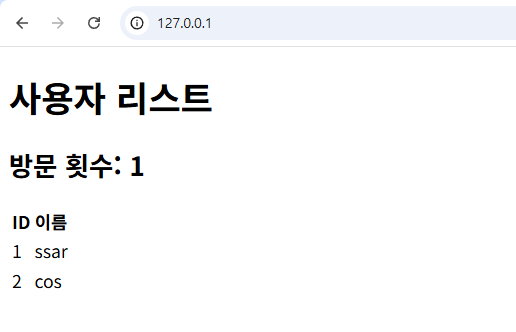

# Ch.6 Kubernetes 운영하기

며칠 뒤였습니다. 진행 중인 프로젝트를 배포하기 전, 마지막으로 한 번 더 코드 리뷰를 하고 있었습니다. 리뷰 중 Dockerfile의 환경 변수 코드가 눈에 띄었습니다.

```dockerfile
ENV MYSQL_PASSWORD=metacoding1234
```

*'잠깐. 이대로 빌드하면 비밀번호가 이미지에 그대로 박히는데.'*

<!-- [GEMINI PROMPT: Dockerfile에 적힌 평문 비밀번호가 빌드된 컨테이너 이미지에 그대로 담겨 사내 레지스트리 서버로 올라가는 모습. 좌측: Dockerfile 텍스트 박스(ENV MYSQL_PASSWORD=... 줄에 자물쇠 아이콘 부착). 중앙: 컨테이너 이미지 박스(이미지 내부에 비밀번호 라벨이 그대로 들어가 있는 모습). 우측: 사내 컨테이너 레지스트리 서버 일러스트. 좌→우 흐름 화살표.
경로: assets/CH06/gemini/01_prologue-secret-baked-into-image.png -->


*그림 6-1. Dockerfile에 적힌 비밀번호가 이미지에 그대로 담겨 배포된다*

문제는 비밀번호만이 아니었습니다. 클러스터에서 돌고 있는 DB Pod가 떠올랐습니다. Pod가 죽으면 Deployment가 새 Pod를 띄우겠지만, 그 안에 쌓아 둔 회원 정보와 게시글 데이터는 새 Pod에 남아 있지 않습니다.

*'이 두 가지부터 해결해야겠다.'*

옆자리 선배에게 질문하자, 선배가 모니터에서 눈을 떼고 돌아봤습니다.

**선배**: "Dockerfile에 비밀번호를 직접 적지 마세요. 설정은 이미지 바깥에 두고, 이미지에는 순수한 코드만 담아야 해요. 쿠버네티스에는 이런 리소스를 관리하는 **ConfigMap**과 **Secret**이 따로 마련되어 있어요."

*'설정을 바깥으로 빼는 방법이 있구나. 이 두 가지부터 당장 알아봐야겠다.'*

:::goal
**이번 챕터가 끝나면**

- **ConfigMap·Secret**으로 설정값과 비밀번호를 이미지 바깥으로 분리합니다
- **PV·PVC**로 Pod가 죽어도 데이터가 사라지지 않게 영속화합니다
- **Namespace**로 리소스를 논리적으로 구분합니다
- 챕터 3의 통합 사이트를 쿠버네티스 위에 한 번에 올려 운영 환경에 가까운 시스템을 만듭니다
:::

## 6.1 ConfigMap·Secret - 설정과 비밀번호를 이미지 바깥으로

컨테이너 이미지는 한 번 빌드하면 내용물을 수정할 수 없습니다. 만약 데이터베이스 주소나 비밀번호를 이미지 안에 직접 적어 두면, 개발 서버용 이미지와 운영 서버용 이미지를 매번 따로 빌드해야 하는 문제가 생깁니다.

그래서 쿠버네티스는 '변하지 않는 코드(컨테이너 이미지)'와 '환경마다 변하는 설정값'을 분리합니다. 일반 설정값은 **ConfigMap**에, 민감한 정보는 **Secret**에 담아 이미지 바깥에 따로 보관하는 방식입니다.

<div class="svg-figure">
<svg viewBox="0 0 760 240" xmlns="http://www.w3.org/2000/svg" role="img" aria-label="ConfigMap과 Secret이 이미지와 별개로 Pod에 주입되는 구조 — ConfigMap·Secret은 데이터 저장소(실린더), Pod는 핵심 프로세스(직사각형)">
  <defs>
    <marker id="cs61-s" markerWidth="10" markerHeight="10" refX="8" refY="3" orient="auto"><path d="M0,0 L0,6 L8,3 z" fill="#475569"/></marker>
  </defs>
  <text x="380" y="22" text-anchor="middle" font-size="13" font-weight="700" fill="#1f2937">ConfigMap과 Secret이 이미지와 별개로 Pod에 주입되는 구조</text>
  <g>
    <path d="M 50 65 L 50 115 Q 50 123 130 123 Q 210 123 210 115 L 210 65" fill="#fff" stroke="#94a3b8" stroke-width="1.6"/>
    <ellipse cx="130" cy="65" rx="80" ry="8" fill="#fff" stroke="#94a3b8" stroke-width="1.6"/>
    <text x="130" y="92" text-anchor="middle" font-size="13" font-weight="700" fill="#0f172a">ConfigMap</text>
    <text x="130" y="110" text-anchor="middle" font-size="11" fill="#475569">일반 설정값</text>
  </g>
  <g>
    <path d="M 50 145 L 50 195 Q 50 203 130 203 Q 210 203 210 195 L 210 145" fill="#fff" stroke="#94a3b8" stroke-width="1.6"/>
    <ellipse cx="130" cy="145" rx="80" ry="8" fill="#fff" stroke="#94a3b8" stroke-width="1.6"/>
    <text x="130" y="172" text-anchor="middle" font-size="13" font-weight="700" fill="#0f172a">Secret</text>
    <text x="130" y="190" text-anchor="middle" font-size="11" fill="#475569">민감 정보 (Base64)</text>
  </g>
  <rect x="540" y="100" width="180" height="80" rx="8" fill="#dbeafe" stroke="#1565c0" stroke-width="1.8"/>
  <text x="630" y="135" text-anchor="middle" font-size="14" font-weight="700" fill="#1e40af">Pod</text>
  <text x="630" y="155" text-anchor="middle" font-size="10" fill="#1e40af">설정·비밀 주입 받음</text>
  <line x1="210" y1="92" x2="540" y2="125" stroke="#475569" stroke-width="1.6" marker-end="url(#cs61-s)"/>
  <text x="375" y="100" text-anchor="middle" font-size="10" fill="#475569" font-style="italic">일반 설정 주입</text>
  <line x1="210" y1="172" x2="540" y2="155" stroke="#475569" stroke-width="1.6" marker-end="url(#cs61-s)"/>
  <text x="375" y="180" text-anchor="middle" font-size="10" fill="#475569" font-style="italic">비밀 설정 주입</text>
</svg>
</div>

*그림 6-2. ConfigMap과 Secret이 이미지와 별개로 Pod에 설정과 민감 정보를 주입*

### 6.1.1 ConfigMap

:::tip
전체 실습 코드는 깃헙을 참고합니다.

**실습 코드 (GitHub)**: https://github.com/metacoding-10-linux-docker/docker/tree/master/ex13
:::

**ConfigMap**은 환경에 따라 달라지는 일반 설정값을 **키-값** 쌍으로 저장하고, Pod에 환경 변수나 파일로 주입하는 리소스입니다.

다음은 키-값 두 개를 정의한 ConfigMap YAML입니다.

```yaml [실습 1] ex13/configmap-conn.yml. ConfigMap 정의
apiVersion: v1
kind: ConfigMap
metadata:
  name: configmap-conn               # ConfigMap 이름 지정
data:                                # 설정값 넣는 영역
  conn_info: "localhost:80"
  conn_url: "config.test"
```

이어서 Deployment에 이 ConfigMap을 연결합니다. `envFrom.configMapRef`를 쓰면 ConfigMap의 값을 환경 변수로 주입받을 수 있습니다.

```yaml [실습 2] ex13/deploy-ex03.yml. ConfigMap을 Pod에 주입
apiVersion: apps/v1
kind: Deployment
metadata:
  name: nginx-config-secret            # Deployment 이름 (재시작 시 이 이름으로 지목)
spec:
  template:
    spec:
      containers:
        - name: nginx-container
          image: nginx:1.20
          envFrom:
            - configMapRef:
                name: configmap-conn   # ConfigMap 연결
```

두 YAML을 적용한 뒤 Pod 안의 환경 변수를 확인합니다.

```bash [터미널] ConfigMap·Deployment 적용과 환경 변수 확인
kubectl apply -f ex13/configmap-conn.yml
kubectl apply -f ex13/deploy-ex03.yml
kubectl get pod                        # Pod 이름 확인
kubectl exec -it <Pod명> -- env       # Pod 환경 변수 조회
```

<div class="terminal-log">
  <div class="tl-chrome">
    <div class="tl-traffic"><span></span><span></span><span></span></div>
    <div class="tl-title">실행결과</div>
    <div class="tl-spacer"></div>
  </div>
  <div class="tl-body">
    <div><span class="tl-key">$</span> <span class="tl-str">kubectl get pod</span></div>
    <div>NAME                                  READY   STATUS    RESTARTS   AGE</div>
    <div>nginx-config-secret-794499d5d4-c2xmw  1/1     Running   0          11s</div>
    <div><span class="tl-key">$</span> <span class="tl-str">kubectl exec -it nginx-config-secret-794499d5d4-c2xmw -- env</span></div>
    <div>PATH=/usr/local/sbin:/usr/local/bin:/usr/sbin:/bin</div>
    <div>HOSTNAME=nginx-config-secret-794499d5d4-c2xmw</div>
    <div>conn_info=localhost:80</div>
    <div>conn_url=config.test</div>
    <div>KUBERNETES_PORT_443_TCP_PORT=443</div>
    <div>KUBERNETES_PORT_443_TCP_ADDR=10.96.0.1</div>
    <div>KUBERNETES_SERVICE_HOST=10.96.0.1</div>
    <div>KUBERNETES_SERVICE_PORT=443</div>
    <div>KUBERNETES_PORT_443_TCP=tcp://10.96.0.1:443</div>
    <div>KUBERNETES_PORT=tcp://10.96.0.1:443</div>
  </div>
</div>

*그림 6-3. Pod 안의 환경 변수 목록에 ConfigMap의 값이 보이는 모습*

Pod 내부의 환경 변수에 ConfigMap에 적어 둔 값이 그대로 들어와 있습니다.

### 6.1.2 Secret

:::tip
전체 실습 코드는 깃헙을 참고합니다.

**실습 코드 (GitHub)**: https://github.com/metacoding-10-linux-docker/docker/tree/master/ex13
:::

**Secret**은 비밀번호·토큰·키처럼 민감한 정보를 별도로 분리해 저장하는 리소스입니다. 값은 Base64로 인코딩되어 저장되며, RBAC으로 조회 권한을 제한할 수 있습니다.

다음은 비밀번호를 정의한 Secret YAML입니다. `stringData`를 사용하면 쿠버네티스가 내부적으로 값을 Base64로 인코딩하여 저장합니다.

```yaml [실습 3] ex13/secret-password.yml. Secret 정의
apiVersion: v1
kind: Secret
metadata:
  name: secret-password
stringData:
  password: metacoding1234
```

Secret을 적용한 뒤 저장된 값을 확인합니다.

```bash [터미널] Secret 적용 후 저장값 확인
kubectl apply -f ex13/secret-password.yml      # Secret YAML 적용
kubectl get secret secret-password -o yaml     # 저장된 Secret 내용을 YAML로 조회
```

<div class="terminal-log">
  <div class="tl-chrome">
    <div class="tl-traffic"><span></span><span></span><span></span></div>
    <div class="tl-title">실행결과</div>
    <div class="tl-spacer"></div>
  </div>
  <div class="tl-body">
    <div><span class="tl-key">$</span> <span class="tl-str">kubectl get secret secret-password -o yaml</span></div>
    <div>apiVersion: v1</div>
    <div>data:</div>
    <div>&nbsp;&nbsp;password: bWV0YWNvZGluZzEyMzQ=</div>
    <div>kind: Secret</div>
    <div>metadata:</div>
    <div>&nbsp;&nbsp;annotations:</div>
    <div>&nbsp;&nbsp;&nbsp;&nbsp;kubectl.kubernetes.io/last-applied-configuration: |</div>
    <div>&nbsp;&nbsp;&nbsp;&nbsp;&nbsp;&nbsp;{"apiVersion":"v1","kind":"Secret","metadata":{"annotations":{},"name":"secret-password","namespace":"defaul...</div>
    <div>&nbsp;&nbsp;creationTimestamp: "2026-03-15T06:30:27Z"</div>
    <div>&nbsp;&nbsp;name: secret-password</div>
    <div>&nbsp;&nbsp;namespace: default</div>
    <div>&nbsp;&nbsp;resourceVersion: "1387"</div>
  </div>
</div>

*그림 6-4. Secret 내부를 보면 비밀번호가 Base64로 인코딩된 상태*

저장된 결과를 보니 `password` 값이 알 수 없는 문자열로 변환되어 있습니다.

:::note
**Secret과 Base64**

Secret의 Base64 처리는 암호화가 아닌 단순 인코딩입니다. 따라서 누구나 디코딩하여 원문을 확인할 수 있습니다. 여기서는 '일반 설정과 민감 정보를 구분하여 관리한다'는 개념이 중요합니다.
:::

Pod에 주입하는 방식은 ConfigMap과 동일합니다. `deploy-ex03.yml`의 `envFrom` 아래에 `secretRef` 두 줄을 추가하면, 쿠버네티스가 실행 시점에 Base64를 디코딩해 환경 변수로 주입합니다.

```yaml [실습 4] ex13/deploy-ex03.yml. Secret 연결 (envFrom 부분)
envFrom:
  - configMapRef:
      name: configmap-conn
  - secretRef:
      name: secret-password   # Secret 연결
```

변경한 Deployment를 다시 적용한 뒤 환경 변수를 확인합니다.

```bash [터미널] 변경한 Deployment 적용과 환경 변수 확인
kubectl apply -f ex13/deploy-ex03.yml   # 변경한 Deployment 적용
kubectl get pod                          # Pod 이름 확인
kubectl exec -it <Pod명> -- env         # Pod 환경 변수 조회
```

<div class="terminal-log">
  <div class="tl-chrome">
    <div class="tl-traffic"><span></span><span></span><span></span></div>
    <div class="tl-title">실행결과</div>
    <div class="tl-spacer"></div>
  </div>
  <div class="tl-body">
    <div><span class="tl-key">$</span> <span class="tl-str">kubectl get pod</span></div>
    <div>NAME                                  READY   STATUS    RESTARTS   AGE</div>
    <div>nginx-config-secret-7fbccb65f5-zq8nz  1/1     Running   0          51s</div>
    <div><span class="tl-key">$</span> <span class="tl-str">kubectl exec -it nginx-config-secret-7fbccb65f5-zq8nz -- env</span></div>
    <div>PATH=/usr/local/sbin:/usr/local/bin:/usr/sbin:/bin</div>
    <div>HOSTNAME=nginx-config-secret-7fbccb65f5-zq8nz</div>
    <div>TERM=xterm</div>
    <div>conn_url=config.test</div>
    <div>password=metacoding1234</div>
    <div>conn_info=localhost:80</div>
    <div>KUBERNETES_SERVICE_PORT_HTTPS=443</div>
    <div>KUBERNETES_PORT=tcp://10.96.0.1:443</div>
  </div>
</div>

*그림 6-5. 환경 변수 목록에 Secret의 값이 평문으로 들어와 있는 모습*

### 6.1.3 환경 변수 반영을 위한 Pod 재시작

기본 동작을 확인했다면 다음은 ConfigMap을 수정해 보겠습니다. `configmap-conn.yml`의 `conn_info` 포트를 80에서 90으로 변경합니다.

```yaml [실습 5] ex13/configmap-conn.yml. 포트 변경
# ... 생략

  conn_info: "localhost:90"          # 환경변수 수정
```

수정한 ConfigMap을 클러스터에 적용합니다.

```bash [터미널] 변경된 ConfigMap 적용 후 환경 변수 확인
kubectl apply -f ex13/configmap-conn.yml   # 변경된 ConfigMap 적용
kubectl get pod                             # Pod 이름 확인
kubectl exec -it <Pod명> -- env            # Pod 환경 변수 조회
```

ConfigMap은 `configured` 메시지와 함께 갱신됐지만, 이미 실행 중인 Pod의 환경 변수는 여전히 80이었습니다.

*'어? 분명히 바꿨는데 왜 그대로지?'*

리눅스에서 환경 변수는 **프로세스가 시작될 때 한 번 주입되는 값**입니다. 그래서 ConfigMap이 갱신되어도 이미 실행 중인 Pod의 프로세스에는 처음 주입된 값이 그대로 남아 있습니다. 새 값을 반영하려면 Pod를 다시 실행해야 합니다.

<div class="svg-figure">
<svg viewBox="0 0 800 200" xmlns="http://www.w3.org/2000/svg" role="img" aria-label="apply만 한 경우 ConfigMap 변경이 Pod에 반영되지 않음">
  <defs>
    <marker id="g65a-p" markerWidth="10" markerHeight="10" refX="8" refY="3" orient="auto"><path d="M0,0 L0,6 L8,3 z" fill="#475569"/></marker>
    <marker id="g65a-x" markerWidth="10" markerHeight="10" refX="8" refY="3" orient="auto"><path d="M0,0 L0,6 L8,3 z" fill="#ff7849"/></marker>
  </defs>
  <text x="20" y="24" font-size="14" font-weight="800" fill="#7b341e">✗  apply 만 한 경우 — Kube API Server에 저장되고, Pod에는 아직 반영 안 됨</text>
  <rect x="20" y="60" width="200" height="80" rx="8" fill="#fff" stroke="#475569" stroke-width="1.6"/>
  <text x="120" y="88" text-anchor="middle" font-size="13" font-weight="700" fill="#0f172a">ConfigMap</text>
  <text x="120" y="110" text-anchor="middle" font-size="11" font-family="monospace" fill="#475569">conn_info: localhost:90</text>
  <text x="120" y="128" text-anchor="middle" font-size="10" fill="#6b7280">(수정 후)</text>
  <line x1="220" y1="100" x2="300" y2="100" stroke="#475569" stroke-width="2" marker-end="url(#g65a-p)"/>
  <text x="260" y="92" text-anchor="middle" font-size="11" fill="#475569" font-family="monospace">kubectl apply</text>
  <rect x="300" y="60" width="200" height="80" rx="8" fill="#fff4ed" stroke="#ff7849" stroke-width="1.6"/>
  <text x="400" y="88" text-anchor="middle" font-size="13" font-weight="700" fill="#7b341e">Kube API Server</text>
  <text x="400" y="110" text-anchor="middle" font-size="10" fill="#7b341e">conn_info: localhost:90 저장됨</text>
  <line x1="500" y1="100" x2="580" y2="100" stroke="#ff7849" stroke-width="2" stroke-dasharray="6,4" marker-end="url(#g65a-x)"/>
  <text x="540" y="92" text-anchor="middle" font-size="13" fill="#7b341e" font-weight="800">✗ 연결 안 됨</text>
  <rect x="580" y="60" width="200" height="80" rx="8" fill="#fff" stroke="#475569" stroke-width="1.6" stroke-dasharray="4,3"/>
  <text x="680" y="88" text-anchor="middle" font-size="13" font-weight="700" fill="#475569">기존 Pod</text>
  <text x="680" y="110" text-anchor="middle" font-size="11" font-family="monospace" fill="#7b341e">env: conn_info=localhost:80</text>
  <text x="680" y="128" text-anchor="middle" font-size="10" fill="#7b341e">(옛 값 유지)</text>
  <text x="400" y="172" text-anchor="middle" font-size="11" fill="#6b7280" font-style="italic">ConfigMap은 갱신됐지만, 이미 떠 있는 Pod의 환경 변수는 시작 시점에 박힌 값(localhost:80)을 그대로 가지고 있습니다.</text>
</svg>
</div>

*그림 6-6. apply 만 한 경우 - ConfigMap 변경이 기존 Pod에는 반영되지 않음*

<div class="svg-figure">
<svg viewBox="0 0 800 200" xmlns="http://www.w3.org/2000/svg" role="img" aria-label="rollout restart로 새 Pod를 실행하면 ConfigMap 새 값이 반영됨">
  <defs>
    <marker id="g65b-p" markerWidth="10" markerHeight="10" refX="8" refY="3" orient="auto"><path d="M0,0 L0,6 L8,3 z" fill="#475569"/></marker>
    <marker id="g65b-g" markerWidth="10" markerHeight="10" refX="8" refY="3" orient="auto"><path d="M0,0 L0,6 L8,3 z" fill="#1565c0"/></marker>
  </defs>
  <text x="20" y="24" font-size="14" font-weight="800" fill="#1e40af">✓  rollout restart 까지 한 경우 — 새 Pod에 반영 OK</text>
  <rect x="20" y="60" width="200" height="80" rx="8" fill="#fff" stroke="#475569" stroke-width="1.6"/>
  <text x="120" y="88" text-anchor="middle" font-size="13" font-weight="700" fill="#0f172a">ConfigMap</text>
  <text x="120" y="110" text-anchor="middle" font-size="11" font-family="monospace" fill="#475569">conn_info: localhost:90</text>
  <text x="120" y="128" text-anchor="middle" font-size="10" fill="#6b7280">(수정 후)</text>
  <line x1="220" y1="100" x2="300" y2="100" stroke="#475569" stroke-width="2" marker-end="url(#g65a-p)"/>
  <text x="260" y="92" text-anchor="middle" font-size="11" fill="#475569" font-family="monospace">kubectl apply</text>
  <rect x="300" y="60" width="200" height="80" rx="8" fill="#fff4ed" stroke="#ff7849" stroke-width="1.6"/>
  <text x="400" y="88" text-anchor="middle" font-size="13" font-weight="700" fill="#7b341e">Kube API Server</text>
  <text x="400" y="110" text-anchor="middle" font-size="10" fill="#7b341e">conn_info: localhost:90 저장됨</text>
  <line x1="500" y1="100" x2="580" y2="100" stroke="#1565c0" stroke-width="2" marker-end="url(#g65b-g)"/>
  <text x="540" y="92" text-anchor="middle" font-size="11" fill="#1e40af" font-weight="700">rollout restart</text>
  <text x="540" y="118" text-anchor="middle" font-size="10" fill="#1e40af">(새 Pod 생성)</text>
  <rect x="580" y="60" width="200" height="80" rx="8" fill="#dbeafe" stroke="#1565c0" stroke-width="1.8"/>
  <text x="680" y="88" text-anchor="middle" font-size="13" font-weight="700" fill="#1e40af">새 Pod</text>
  <text x="680" y="110" text-anchor="middle" font-size="11" font-family="monospace" fill="#1e40af">env: conn_info=localhost:90</text>
  <text x="680" y="128" text-anchor="middle" font-size="10" fill="#1e40af">(새 값 박힘)</text>
  <text x="400" y="172" text-anchor="middle" font-size="11" fill="#6b7280" font-style="italic">새 Pod는 시작 시점에 갱신된 ConfigMap을 읽어 환경 변수에 새 값(localhost:90)을 박습니다.</text>
</svg>
</div>

*그림 6-7. rollout restart 로 Pod를 새로 실행하면 ConfigMap 새 값이 환경 변수로 반영됨*

`kubectl rollout restart`는 여러 Pod를 순차로 교체해 새 값을 반영하는 명령입니다. 명령어를 실행해 Deployment를 재시작합니다.

```bash [터미널] Pod 재시작 후 환경 변수 확인
kubectl rollout restart deployment nginx-config-secret   # Pod 재시작
kubectl get pod                                            # 새 Pod 이름 확인
kubectl exec -it <Pod명> -- env                           # Pod 환경 변수 조회
```

<div class="terminal-log">
  <div class="tl-chrome">
    <div class="tl-traffic"><span></span><span></span><span></span></div>
    <div class="tl-title">실행결과</div>
    <div class="tl-spacer"></div>
  </div>
  <div class="tl-body">
    <div><span class="tl-key">$</span> <span class="tl-str">kubectl rollout restart deployment nginx-config-secret</span></div>
    <div>deployment.apps/nginx-config-secret restarted</div>
    <div><span class="tl-key">$</span> <span class="tl-str">kubectl get pod</span></div>
    <div>NAME                                  READY   STATUS    RESTARTS   AGE</div>
    <div>nginx-config-secret-8c5d4f9b6-r2t4p   1/1     Running   0          12s</div>
    <div><span class="tl-key">$</span> <span class="tl-str">kubectl exec -it nginx-config-secret-8c5d4f9b6-r2t4p -- env</span></div>
    <div>PATH=/usr/local/sbin:/usr/local/bin:/usr/sbin:/bin</div>
    <div>HOSTNAME=nginx-config-secret-8c5d4f9b6-r2t4p</div>
    <div>conn_url=config.test</div>
    <div>conn_info=localhost:90</div>
    <div>password=metacoding1234</div>
  </div>
</div>

*그림 6-8. Pod 재시작 후 환경 변수에 새 포트 90이 반영된 모습*

재시작 후 환경 변수가 적용된 것을 확인할 수 있습니다.

## 6.2 Volume - 데이터의 영속성 확보

### 6.2.1 Pod의 휘발성 문제

Deployment의 자동 복구가 DB Pod에서는 다른 문제를 만듭니다. Pod는 기본적으로 **휘발성**이라, 안에서 만든 파일은 Pod 수명과 함께 사라집니다. 데이터가 매일 쌓이는 DB가 이대로 휘발되면 운영할 수 없습니다.

이 문제는 데이터를 Pod 바깥에 두어 해결할 수 있습니다. Docker에서 본 마운트처럼, 쿠버네티스에서도 외부 저장 공간에 데이터를 두는 기능을 **Volume**이라고 합니다.

Volume에는 여러 종류가 있습니다.

| 종류 | 설명 | 데이터 유지 |
|:----:|:-----|:-----------|
| `emptyDir` | Pod 생성 시 만들어지는 임시 저장 공간 | Pod 삭제 시 함께 삭제 |
| `hostPath` | 워커 노드(호스트)의 특정 경로를 Pod에 마운트 | 노드에 남지만, Pod가 다른 노드로 이동하면 접근 불가 |
| `PV / PVC` | 클러스터가 관리하는 영구 저장소를 만들고 요청서(PVC)로 Pod에 연결 | Pod가 삭제되어도 유지 |

이 중 가장 보편적으로 사용하는 **PV(PersistentVolume)** 와 **PVC(PersistentVolumeClaim)** 를 알아보겠습니다.

### 6.2.2 PV와 PVC

:::tip
전체 실습 코드는 깃헙을 참고합니다.

**실습 코드 (GitHub)**: https://github.com/metacoding-10-linux-docker/docker/tree/master/ex14
:::

*'Volume이 저장 공간이라는 건 알겠는데, PV랑 PVC는 왜 두 개로 나눠져 있지?'*

Pod에 저장 공간을 직접 정의하면 어느 디스크에, 어떤 권한으로, 몇 기가를 쓸지 매번 정해야 합니다. 쿠버네티스는 그래서 저장소를 **창고**와 그 창고를 쓰겠다는 **신청서**로 분리해 두었습니다. 그림 한 장으로 보면 관계가 분명해집니다.

<div class="svg-figure">
<svg viewBox="0 0 760 200" xmlns="http://www.w3.org/2000/svg" role="img" aria-label="Pod가 PVC를 거쳐 실제 저장소(PV)에 연결되는 구조 — Pod는 핵심 프로세스(직사각형), PV는 데이터 저장소(실린더)">
  <defs>
    <marker id="pv67-s" markerWidth="10" markerHeight="10" refX="8" refY="3" orient="auto"><path d="M0,0 L0,6 L8,3 z" fill="#475569"/></marker>
    <marker id="pv67-b" markerWidth="10" markerHeight="10" refX="8" refY="3" orient="auto"><path d="M0,0 L0,6 L8,3 z" fill="#1565c0"/></marker>
  </defs>
  <text x="380" y="22" text-anchor="middle" font-size="13" font-weight="700" fill="#1f2937">Pod가 PVC를 거쳐 실제 저장소(PV)에 연결되는 구조</text>
  <rect x="40" y="65" width="170" height="80" rx="8" fill="#dbeafe" stroke="#1565c0" stroke-width="1.8"/>
  <text x="125" y="98" text-anchor="middle" font-size="14" font-weight="700" fill="#1e40af">Pod</text>
  <text x="125" y="118" text-anchor="middle" font-size="11" fill="#1e40af">데이터 사용자</text>
  <line x1="210" y1="105" x2="290" y2="105" stroke="#475569" stroke-width="1.6" stroke-dasharray="6,4" marker-end="url(#pv67-s)"/>
  <text x="250" y="96" text-anchor="middle" font-size="10" fill="#475569" font-style="italic">저장소 연결</text>
  <rect x="290" y="65" width="170" height="80" rx="8" fill="#fff" stroke="#1565c0" stroke-width="1.6"/>
  <text x="375" y="98" text-anchor="middle" font-size="14" font-weight="700" fill="#1e40af">PVC</text>
  <text x="375" y="118" text-anchor="middle" font-size="11" font-family="monospace" fill="#475569">"1Gi 요청"</text>
  <line x1="460" y1="105" x2="540" y2="105" stroke="#1565c0" stroke-width="1.8" marker-end="url(#pv67-b)"/>
  <text x="500" y="96" text-anchor="middle" font-size="10" fill="#1e40af" font-weight="700" font-style="italic">바인딩</text>
  <g>
    <path d="M 540 78 L 540 132 Q 540 140 630 140 Q 720 140 720 132 L 720 78" fill="#fff" stroke="#94a3b8" stroke-width="1.6"/>
    <ellipse cx="630" cy="78" rx="90" ry="8" fill="#fff" stroke="#94a3b8" stroke-width="1.6"/>
    <text x="630" y="105" text-anchor="middle" font-size="14" font-weight="700" fill="#0f172a">PV</text>
    <text x="630" y="125" text-anchor="middle" font-size="11" fill="#475569">실제 디스크</text>
  </g>
</svg>
</div>

*그림 6-9. PV는 실제 저장 공간, PVC는 그 공간을 요청하는 신청서*

- **PV(PersistentVolume)** 는 실제 저장 공간, 즉 **창고**입니다. 용량, 권한, 위치 같은 창고의 사양이 정의됩니다.
- **PVC(PersistentVolumeClaim)** 는 창고를 쓰겠다고 작성하는 **신청서**입니다. "**1Gi짜리 읽기·쓰기 가능한 창고가 필요하다**"고 적어 두면, 쿠버네티스가 조건에 맞는 PV를 찾아 자동으로 PVC와 연결합니다.

Pod는 PV를 직접 참조하지 않고 PVC만 연결해 사용합니다. 실제 창고 위치는 PVC가 자동으로 연결하므로, Pod는 인프라 세부 사항을 몰라도 됩니다.

### 6.2.3 PV 만들기

저장소를 위한 PV를 만들어 보겠습니다. 이번 실습에서는 외부 스토리지 없이 Minikube 내부의 경로(`/mnt/data`)를 저장소로 씁니다.

```yaml [실습 6] ex14/volume-pv.yml. PersistentVolume 정의
apiVersion: v1
kind: PersistentVolume
metadata:
  name: volume-pv                      # PVC가 volumeName으로 참조할 이름
spec:
  capacity:
    storage: 1Gi                       # 저장 용량
  accessModes:
    - ReadWriteOnce                    # 단일 노드 읽기·쓰기 모드
  storageClassName: ""                 # 자동 StorageClass 비활성, 아래 PVC에서 정적 바인딩
  hostPath:
    path: /mnt/data                    # 호스트 노드의 실제 저장 경로
    type: DirectoryOrCreate            # 경로가 없으면 자동 생성
```

:::note
**StorageClass란**

**StorageClass**는 PVC를 받으면 그 명세에 맞는 PV를 자동으로 만들어 주는 템플릿입니다. AWS·GCP·Minikube 같은 환경마다 기본 StorageClass가 따로 준비되어 있어 평소에는 PVC만 작성해도 PV가 자동 발급됩니다. 이번 실습은 직접 만든 PV에 묶어 두는 정적 바인딩을 보기 위해 **storageClassName: ""** 로 비활성화했습니다.
:::

### 6.2.4 PVC 만들기

앞서 만든 PV에 연결할 PVC를 만들어 보겠습니다.

```yaml [실습 7] ex14/volume-pvc.yml. PersistentVolumeClaim 정의
apiVersion: v1
kind: PersistentVolumeClaim
metadata:
  name: volume-pvc                     # PVC 이름 (Pod가 claimName으로 참조)
spec:
  accessModes:
    - ReadWriteOnce                    # PV와 일치해야 바인딩
  storageClassName: ""                 # PV와 일치해야 바인딩
  resources:
    requests:
      storage: 1Gi                     # 신청 용량 (PV capacity 이하)
  volumeName: volume-pv                # 바인딩할 PV 이름을 수동 지정
```

`volumeName`은 연결할 특정 PV의 이름을 직접 지정하는 필드입니다. 값이 설정되면 지정한 이름과 일치하는 PV와 정적으로 바인딩됩니다.

:::note
**PVC와 PV가 연결되는 조건**

PVC와 PV가 연결되려면 읽기·쓰기 방식(`accessModes`), 스토리지 종류(`storageClassName`), 그리고 용량까지 세 가지 조건이 모두 맞아야 합니다. 이 중 하나라도 어긋나면 PVC는 짝을 찾지 못하고 **Pending** 상태에 머무릅니다.

단, `volumeName`으로 특정 PV를 직접 지정했다면 다른 조건이 모두 맞더라도 이름이 일치하는 PV와만 연결됩니다.
:::

### 6.2.5 Pod에 마운트

이번 실습은 편의를 위해 Deployment 대신 Pod를 직접 생성합니다. Pod 설정의 `volumes`에서 PVC를 선언하고, `volumeMounts`를 통해 컨테이너 내부 경로에 마운트합니다.

```yaml [실습 8] ex14/volume-pod.yml. PVC를 마운트한 Pod
apiVersion: v1
kind: Pod
metadata:
  name: volume-pod                     # Pod 이름
spec:
  containers:
  - name: nginx-volume                 # 컨테이너 이름
    image: nginx                       # 사용할 이미지
    volumeMounts:
    - name: storage                    # 아래 volumes에서 정의한 이름과 일치
      mountPath: /mnt/data             # 컨테이너 내부 마운트 경로
  volumes:
  - name: storage                      # volumeMounts에서 참조할 이름
    persistentVolumeClaim:
      claimName: volume-pvc            # 연결할 PVC 이름
```

아래 명령어를 실행해 클러스터에 적용합니다.

```bash [터미널] PV·PVC·Pod 일괄 생성과 Bound 확인
kubectl apply -f ex14/volume-pv.yml      # PV(창고) 생성
kubectl apply -f ex14/volume-pvc.yml     # PVC(창고 신청서) 생성
kubectl apply -f ex14/volume-pod.yml     # PVC를 마운트한 Pod 생성
kubectl get pv,pvc -o wide                # PV·PVC가 Bound 됐는지 확인
```

<div class="terminal-log">
  <div class="tl-chrome">
    <div class="tl-traffic"><span></span><span></span><span></span></div>
    <div class="tl-title">실행결과</div>
    <div class="tl-spacer"></div>
  </div>
  <div class="tl-body">
    <div><span class="tl-key">$</span> <span class="tl-str">kubectl get pv,pvc -o wide</span></div>
    <div>NAME                          CAPACITY  ACCESS MODES  RECLAIM POLICY  STATUS  CLAIM                S...</div>
    <div>persistentvolume/volume-pv    1Gi       RWO           Retain          Bound   default/volume-pvc   &lt;unset&gt;</div>
    <div>NAME                              STATUS  VOLUME      CAPACITY  ACCESS MODES  STORAGECLASS  VOLUMEATTRIBUTESCl...</div>
    <div>persistentvolumeclaim/volume-pvc  Bound   volume-pv   1Gi       RWO           &lt;unset&gt;                       9s</div>
  </div>
</div>

*그림 6-10. PV와 PVC가 Bound 상태로 연결된 결과*

STATUS가 Bound 상태라면 PV와 PVC가 정상적으로 연결됐다는 뜻입니다.

확인을 위해 Pod 내부에서 파일을 하나 만든 뒤, Pod를 삭제하고 다시 실행해 보겠습니다.

```bash [터미널] 파일 생성 후 Pod 재생성으로 데이터 보존 확인
kubectl exec -it volume-pod -- /bin/bash      # Pod 안 bash 접속
touch /mnt/data/c.txt                          # 마운트 경로에 빈 파일 생성
exit                                           # Pod 셸 종료

kubectl delete pod volume-pod                  # 기존 Pod 삭제
kubectl apply -f ex14/volume-pod.yml           # 같은 PVC를 쓰는 Pod 재생성
kubectl exec -it volume-pod -- ls /mnt/data    # 새 Pod에서 c.txt가 남아 있는지 확인
```

<div class="terminal-log">
  <div class="tl-chrome">
    <div class="tl-traffic"><span></span><span></span><span></span></div>
    <div class="tl-title">실행결과</div>
    <div class="tl-spacer"></div>
  </div>
  <div class="tl-body">
    <div><span class="tl-key">$</span> <span class="tl-str">kubectl exec -it volume-pod -- /bin/bash</span></div>
    <div>root@volume-pod:/#</div>
    <div><span class="tl-key">root@volume-pod:/#</span> <span class="tl-str">ls /mnt/data</span></div>
    <div>c.txt</div>
    <div>root@volume-pod:/#</div>
  </div>
</div>

*그림 6-11. Pod가 새로 태어났는데도 c.txt가 그대로 남아 있는 모습*

새 Pod에서도 `c.txt`가 그대로 보입니다. Pod는 삭제·재생성되어도 PV 안 파일은 그대로 남습니다.

## 6.3 통합 실습 - 쿠버네티스 위에 웹사이트 올리기

:::tip
전체 실습 코드는 깃헙을 참고합니다.

**실습 코드 (GitHub)**: https://github.com/metacoding-10-linux-docker/docker/tree/master/ex15
:::

마지막으로 지금까지 익힌 리소스를 모아 하나의 프로젝트로 연결해 보겠습니다. 앞서 Docker Compose로 띄웠던 프로젝트를 쿠버네티스 위에 다시 구축합니다.

### 6.3.1 전체 그림

이번 실습의 구성도에는 프론트엔드, 백엔드, DB, 그리고 방문 횟수를 기록하는 Redis까지 서비스 네 개가 들어 있습니다. 앞서 Docker Compose로 띄웠던 세 서비스에 Redis가 더해진 구조입니다.

<div class="svg-figure">
<svg viewBox="0 0 920 380" xmlns="http://www.w3.org/2000/svg" role="img" aria-label="ex15 — 외부 진입과 프론트엔드·백엔드·데이터 3계층, 요청·응답 평행 표시">
  <defs>
    <marker id="ex15-p" markerWidth="8" markerHeight="8" refX="6" refY="3" orient="auto"><path d="M0,0 L0,6 L6,3 z" fill="#475569"/></marker>
    <marker id="ex15-pr" markerWidth="8" markerHeight="8" refX="6" refY="3" orient="auto"><path d="M0,0 L0,6 L6,3 z" fill="#94a3b8"/></marker>
  </defs>
  <text x="460" y="14" text-anchor="middle" font-size="13" font-weight="700" fill="#1f2937">ex15 Kubernetes 웹사이트의 전체 구성</text>

  <rect x="75" y="24" width="140" height="36" rx="6" fill="#fff" stroke="#9ca3af" stroke-width="1.4"/>
  <text x="145" y="47" text-anchor="middle" font-size="11" font-weight="700" fill="#374151">브라우저</text>

  <line x1="141" y1="60" x2="141" y2="110" stroke="#475569" stroke-width="1.6" marker-end="url(#ex15-p)"/>
  <line x1="149" y1="110" x2="149" y2="60" stroke="#94a3b8" stroke-width="1.4" stroke-dasharray="4,3" marker-end="url(#ex15-pr)"/>

  <rect x="10" y="116" width="905" height="250" rx="10" fill="#fff" stroke="#475569" stroke-width="1.4" stroke-dasharray="6,4"/>
  <text x="30" y="136" font-size="10" font-weight="600" fill="#0f172a">Cluster (namespace: metacoding)</text>

  <rect x="25" y="146" width="240" height="210" rx="8" fill="#f8fafc" stroke="#94a3b8" stroke-width="1.2" stroke-dasharray="3,2"/>
  <text x="45" y="164" font-size="10" font-style="italic" fill="#475569">프론트엔드</text>

  <rect x="80" y="180" width="130" height="36" rx="6" fill="#fff" stroke="#475569" stroke-width="1.6"/>
  <text x="145" y="202" text-anchor="middle" font-size="11" font-weight="700" fill="#0f172a">Ingress</text>

  <line x1="141" y1="216" x2="141" y2="232" stroke="#475569" stroke-width="1.6" marker-end="url(#ex15-p)"/>
  <line x1="149" y1="232" x2="149" y2="216" stroke="#94a3b8" stroke-width="1.4" stroke-dasharray="4,3" marker-end="url(#ex15-pr)"/>

  <rect x="80" y="236" width="130" height="36" rx="14" fill="#fff" stroke="#475569" stroke-width="1.6"/>
  <text x="145" y="258" text-anchor="middle" font-size="11" font-weight="700" fill="#0f172a">frontend-service</text>

  <line x1="141" y1="272" x2="141" y2="288" stroke="#475569" stroke-width="1.6" marker-end="url(#ex15-p)"/>
  <line x1="149" y1="288" x2="149" y2="272" stroke="#94a3b8" stroke-width="1.4" stroke-dasharray="4,3" marker-end="url(#ex15-pr)"/>

  <rect x="80" y="292" width="130" height="40" rx="6" fill="#fff" stroke="#475569" stroke-width="1.6"/>
  <text x="145" y="316" text-anchor="middle" font-size="11" font-weight="700" fill="#0f172a">Frontend Pod</text>

  <line x1="210" y1="308" x2="323" y2="308" stroke="#475569" stroke-width="1.6" marker-end="url(#ex15-p)"/>
  <line x1="323" y1="316" x2="210" y2="316" stroke="#94a3b8" stroke-width="1.4" stroke-dasharray="4,3" marker-end="url(#ex15-pr)"/>
  <text x="266" y="300" text-anchor="middle" font-size="9" fill="#6b7280" font-style="italic">/api</text>

  <rect x="325" y="146" width="270" height="210" rx="8" fill="#f8fafc" stroke="#94a3b8" stroke-width="1.2" stroke-dasharray="3,2"/>
  <text x="345" y="164" font-size="10" font-style="italic" fill="#475569">백엔드</text>

  <rect x="380" y="180" width="160" height="36" rx="14" fill="#fff" stroke="#475569" stroke-width="1.6"/>
  <text x="460" y="202" text-anchor="middle" font-size="11" font-weight="700" fill="#0f172a">backend-service</text>

  <line x1="456" y1="216" x2="456" y2="232" stroke="#475569" stroke-width="1.6" marker-end="url(#ex15-p)"/>
  <line x1="464" y1="232" x2="464" y2="216" stroke="#94a3b8" stroke-width="1.4" stroke-dasharray="4,3" marker-end="url(#ex15-pr)"/>

  <rect x="370" y="236" width="180" height="40" rx="6" fill="#fff" stroke="#475569" stroke-width="1.6"/>
  <text x="460" y="260" text-anchor="middle" font-size="11" font-weight="700" fill="#0f172a">Backend Pod ×2</text>

  <rect x="375" y="296" width="80" height="32" rx="6" fill="#fff" stroke="#475569" stroke-width="1.4"/>
  <text x="415" y="316" text-anchor="middle" font-size="10" font-weight="700" fill="#0f172a">ConfigMap</text>

  <rect x="465" y="296" width="80" height="32" rx="6" fill="#fff" stroke="#475569" stroke-width="1.4"/>
  <text x="505" y="316" text-anchor="middle" font-size="10" font-weight="700" fill="#0f172a">Secret</text>

  <path d="M 415 296 Q 425 290, 440 286" fill="none" stroke="#475569" stroke-width="1.3" stroke-dasharray="4,3" marker-end="url(#ex15-p)"/>
  <path d="M 505 296 Q 495 290, 480 286" fill="none" stroke="#475569" stroke-width="1.3" stroke-dasharray="4,3" marker-end="url(#ex15-p)"/>
  <text x="460" y="288" text-anchor="middle" font-size="9" fill="#6b7280" font-style="italic">envFrom</text>

  <line x1="553" y1="256" x2="653" y2="256" stroke="#475569" stroke-width="1.6" marker-end="url(#ex15-p)"/>
  <line x1="653" y1="264" x2="553" y2="264" stroke="#94a3b8" stroke-width="1.4" stroke-dasharray="4,3" marker-end="url(#ex15-pr)"/>

  <rect x="655" y="146" width="250" height="210" rx="8" fill="#f8fafc" stroke="#94a3b8" stroke-width="1.2" stroke-dasharray="3,2"/>
  <text x="675" y="164" font-size="10" font-style="italic" fill="#475569">데이터</text>

  <rect x="670" y="200" width="80" height="36" rx="14" fill="#fff" stroke="#475569" stroke-width="1.6"/>
  <text x="710" y="222" text-anchor="middle" font-size="11" font-weight="700" fill="#0f172a">db-service</text>

  <line x1="750" y1="212" x2="773" y2="212" stroke="#475569" stroke-width="1.6" marker-end="url(#ex15-p)"/>
  <line x1="773" y1="220" x2="750" y2="220" stroke="#94a3b8" stroke-width="1.4" stroke-dasharray="4,3" marker-end="url(#ex15-pr)"/>

  <rect x="775" y="194" width="120" height="44" rx="6" fill="#fff4ed" stroke="#ff7849" stroke-width="1.6"/>
  <text x="835" y="214" text-anchor="middle" font-size="11" font-weight="700" fill="#7b341e">MySQL Pod</text>
  <text x="835" y="230" text-anchor="middle" font-size="9" fill="#7b341e">+ PV (영속)</text>

  <rect x="670" y="266" width="80" height="36" rx="14" fill="#fff" stroke="#475569" stroke-width="1.6"/>
  <text x="710" y="288" text-anchor="middle" font-size="11" font-weight="700" fill="#0f172a">redis-service</text>

  <line x1="750" y1="278" x2="773" y2="278" stroke="#475569" stroke-width="1.6" marker-end="url(#ex15-p)"/>
  <line x1="773" y1="286" x2="750" y2="286" stroke="#94a3b8" stroke-width="1.4" stroke-dasharray="4,3" marker-end="url(#ex15-pr)"/>

  <rect x="775" y="260" width="120" height="40" rx="6" fill="#fff4ed" stroke="#ff7849" stroke-width="1.6"/>
  <text x="835" y="284" text-anchor="middle" font-size="11" font-weight="700" fill="#7b341e">Redis Pod</text>
</svg>
</div>

*그림 6-12. ex15 Kubernetes 웹사이트의 전체 구성*

브라우저의 요청은 Ingress를 거쳐 프론트엔드 Pod에 도달한 뒤, 다시 백엔드 Pod로 넘어갑니다. 백엔드는 DB와 Redis를 호출해 데이터를 읽고 씁니다.

### 6.3.2 폴더 구조와 진행 방식

ex15 폴더는 이미지를 만드는 영역과 쿠버네티스 설정(YAML) 영역으로 깔끔하게 나뉘어 있습니다. 이번 실습의 초점은 이미지 제작이 아니라 쿠버네티스 리소스들이 어떻게 하나의 시스템으로 맞물리는지 살펴보는 데 있습니다.

```text
ex15/
├── backend/                          # Spring Boot 백엔드 이미지
│   ├── Dockerfile                    # JDK 이미지 + entrypoint.sh 복사
│   └── entrypoint.sh                 # Git clone + Gradle 빌드 + JAR 실행
├── db/                               # MySQL 이미지
│   ├── Dockerfile                    # MySQL 이미지 + init.sql 복사
│   └── init.sql                      # 테이블·초기 데이터 생성 스크립트
├── frontend/                         # NGINX + HTML 이미지
│   ├── Dockerfile                    # nginx 이미지 + index.html·nginx.conf 복사
│   ├── index.html                    # 로그인/게시판 UI (방문 카운터 표시)
│   └── nginx.conf                    # /api 경로를 backend-service로 프록시
├── redis/                            # Redis 이미지
│   └── Dockerfile                    # redis 공식 이미지 기반
├── k8s/                              # 쿠버네티스 리소스 YAML
│   ├── namespace.yml                 # ex15 네임스페이스 정의
│   ├── backend/
│   │   ├── backend-configmap.yml     # 비밀이 아닌 설정값
│   │   ├── backend-deploy.yml        # 백엔드 Deployment
│   │   ├── backend-secret.yml        # DB 비밀번호 등 민감 정보
│   │   └── backend-service.yml       # 내부용 ClusterIP Service
│   ├── db/
│   │   ├── db-deploy.yml             # MySQL Deployment
│   │   ├── db-pv.yml                 # PersistentVolume (노드 로컬 저장소)
│   │   ├── db-pvc.yml                # PersistentVolumeClaim (볼륨 요청)
│   │   ├── db-secret.yml             # MySQL 계정 정보
│   │   └── db-service.yml            # 내부용 ClusterIP Service
│   ├── frontend/
│   │   ├── frontend-deploy.yml       # 프론트 Deployment
│   │   ├── frontend-ingress.yml      # 외부 진입점 (Ingress)
│   │   └── frontend-service.yml      # 내부용 ClusterIP Service
│   └── redis/
│       ├── redis-deploy.yml          # Redis Deployment
│       └── redis-service.yml         # 내부용 ClusterIP Service
└── README.md                         # 실습 안내
```

### 6.3.3 리소스 살펴보기

`ex15/k8s/` 폴더는 서비스별로 나뉘어 있지만, 그 전에 모든 리소스를 묶어 둘 공간부터 정의합니다.

#### Namespace - 논리적 분리

지금까지 만든 리소스는 모두 default라는 기본 공간에 들어가 있습니다. 별도 지정이 없으면 모든 리소스는 default 네임스페이스에 소속됩니다.

*'혼자 연습할 때는 괜찮지만, 여러 팀의 서비스가 같이 돌면 이름이 충돌할 수도 있겠구나.'*

한 회사 안에서도 **팀마다 사무실을 따로 쓰듯**, 쿠버네티스에서도 **공간을 분리**할 수 있습니다. **Namespace**는 하나의 클러스터를 **논리적으로 구분해 주는 가상 공간**입니다.

<div class="svg-figure">
<svg viewBox="0 0 760 280" xmlns="http://www.w3.org/2000/svg" role="img" aria-label="Cluster 안에 Namespace metacoding과 default로 리소스가 논리적으로 분리되는 구조 — 그룹은 점선 박스, 핵심 프로세스(Pod·Service·Deployment)는 프라이머리 배경 직사각형">
  <text x="380" y="22" text-anchor="middle" font-size="13" font-weight="700" fill="#1f2937">Cluster 안에 Namespace로 리소스가 논리적으로 분리되는 구조</text>
  <rect x="20" y="40" width="720" height="220" rx="10" fill="#fff" stroke="#1565c0" stroke-width="1.6" stroke-dasharray="6,4"/>
  <text x="40" y="62" font-size="11" font-weight="700" fill="#1e40af">Cluster</text>
  <rect x="40" y="80" width="320" height="160" rx="8" fill="#fff" stroke="#94a3b8" stroke-width="1.6" stroke-dasharray="5,3"/>
  <text x="60" y="100" font-size="11" font-weight="700" fill="#475569">Namespace: metacoding</text>
  <rect x="60" y="115" width="280" height="32" rx="6" fill="#dbeafe" stroke="#1565c0" stroke-width="1.4"/>
  <text x="200" y="135" text-anchor="middle" font-size="12" font-weight="700" fill="#1e40af">Pod</text>
  <rect x="60" y="155" width="280" height="32" rx="6" fill="#dbeafe" stroke="#1565c0" stroke-width="1.4"/>
  <text x="200" y="175" text-anchor="middle" font-size="12" font-weight="700" fill="#1e40af">Service</text>
  <rect x="60" y="195" width="280" height="32" rx="6" fill="#dbeafe" stroke="#1565c0" stroke-width="1.4"/>
  <text x="200" y="215" text-anchor="middle" font-size="12" font-weight="700" fill="#1e40af">Deployment</text>
  <rect x="400" y="80" width="320" height="160" rx="8" fill="#fff" stroke="#1565c0" stroke-width="1.8" stroke-dasharray="5,3"/>
  <text x="420" y="100" font-size="11" font-weight="700" fill="#1e40af">Namespace: default</text>
  <rect x="420" y="115" width="280" height="32" rx="6" fill="#dbeafe" stroke="#1565c0" stroke-width="1.4"/>
  <text x="560" y="135" text-anchor="middle" font-size="12" font-weight="700" fill="#1e40af">Pod</text>
  <rect x="420" y="155" width="280" height="32" rx="6" fill="#dbeafe" stroke="#1565c0" stroke-width="1.4"/>
  <text x="560" y="175" text-anchor="middle" font-size="12" font-weight="700" fill="#1e40af">Service</text>
  <rect x="420" y="195" width="280" height="32" rx="6" fill="#dbeafe" stroke="#1565c0" stroke-width="1.4"/>
  <text x="560" y="215" text-anchor="middle" font-size="12" font-weight="700" fill="#1e40af">Deployment</text>
</svg>
</div>

*그림 6-13. 같은 클러스터 안에서 Namespace가 리소스를 층처럼 분리*

이번 실습에서는 `metacoding`이라는 전용 네임스페이스를 만들어 모든 리소스를 그 안에서 관리합니다.

```yaml [실습 9] ex15/k8s/namespace.yml. 네임스페이스 정의
apiVersion: v1
kind: Namespace
metadata:
  name: metacoding
```

이후 만들어지는 모든 리소스는 metacoding이라는 독립된 영역에 들어갑니다.

#### Frontend - 외부 진입

frontend 폴더는 외부에서 들어오는 요청이 처음 도달하는 입구를 정의합니다. 핵심은 단일 path로 모든 요청을 잡아 frontend-service로 넘기는 `frontend-ingress.yml`입니다.

```yaml [실습 10] ex15/k8s/frontend/frontend-ingress.yml. 외부 진입 Ingress
apiVersion: networking.k8s.io/v1
kind: Ingress
metadata:
  name: frontend-ingress
  namespace: metacoding
spec:
  ingressClassName: nginx       # 어느 Controller가 이 규칙을 집행할지 지정
  rules:
    - http:
        paths:
          - path: /                  # 모든 경로를 잡음
            pathType: Prefix
            backend:
              service:
                name: frontend-service
                port:
                  number: 80
```

frontend-ingress.yml은 `/` 경로로 들어오는 모든 요청을 frontend-service로 넘깁니다.

같은 폴더의 나머지 두 파일은 다음과 같습니다.

| 파일 | 역할 |
|:---:|:---|
| `frontend-deploy.yml` | 사용자에게 보여줄 웹 화면을 띄웁니다 |
| `frontend-service.yml` | Ingress가 프론트엔드 Pod로 들어가는 진입점입니다 |

#### Backend - API 처리

backend 폴더의 핵심 YAML은 `backend-deploy.yml`입니다. Pod를 2개 생성하고, DB 접속 정보는 ConfigMap·Secret에서 가져옵니다.

```yaml [실습 11] ex15/k8s/backend/backend-deploy.yml. ConfigMap·Secret 주입
apiVersion: apps/v1
kind: Deployment
metadata:
  name: backend-deploy
  namespace: metacoding              # 모든 리소스를 metacoding 네임스페이스에 배치
spec:
  replicas: 2                        # Pod 두 개로 트래픽 분산
  selector:
    matchLabels:
      app: backend
  template:
    metadata:
      labels:
        app: backend
    spec:
      containers:
        - name: backend-server
          image: metacoding/backend:1
          ports:
            - containerPort: 8080    # Tomcat 기본 포트
          envFrom:
            - configMapRef:
                name: backend-configmap   # DB 주소·JDBC URL·Redis 호스트 등 일반 설정
            - secretRef:
                name: backend-secret      # DB 계정·비밀번호
```

같은 폴더의 다른 세 파일은 다음과 같습니다.

| 파일 | 역할 |
|:---:|:---|
| `backend-service.yml` | 다른 Pod가 백엔드 Pod로 들어가는 진입점입니다 |
| `backend-configmap.yml` | 환경에 따라 달라지는 설정값(DB·Redis 주소 등)을 담습니다 |
| `backend-secret.yml` | 비밀번호 같은 민감 정보를 담습니다 |

#### DB - 영속 저장소

db 폴더의 핵심 YAML은 `db-deploy.yml`입니다. Pod 1개를 생성하고, 데이터는 PV에 저장합니다.

```yaml [실습 12] ex15/k8s/db/db-deploy.yml. PVC 마운트 MySQL Deployment
apiVersion: apps/v1
kind: Deployment
metadata:
  name: db-deploy
  namespace: metacoding
spec:
  replicas: 1                        # DB는 단일 인스턴스로 운영
  selector:
    matchLabels:
      app: db
  template:
    metadata:
      labels:
        app: db
    spec:
      containers:
        - name: db-server
          image: metacoding/db:1
          ports:
            - containerPort: 3306    # MySQL 기본 포트
          envFrom:
            - secretRef:
                name: db-secret      # MySQL 계정·비밀번호
          volumeMounts:
            - name: data
              mountPath: /var/lib/mysql   # MySQL이 데이터를 쓰는 경로를 PV로
      volumes:
        - name: data
          persistentVolumeClaim:
            claimName: db-pvc
```

같은 폴더의 나머지 네 파일은 다음과 같습니다.

| 파일 | 역할 |
|:---:|:---|
| `db-service.yml` | 백엔드가 DB Pod로 들어가는 진입점입니다 |
| `db-secret.yml` | DB 접속 계정 정보를 담습니다 |
| `db-pv.yml` | 노드의 실제 저장 공간입니다 |
| `db-pvc.yml` | DB가 저장 공간을 신청하는 요청서입니다 |

#### Redis - 인메모리 캐시

redis 폴더는 백엔드가 방문 횟수를 기록하기 위해 호출하는 인메모리 저장소이므로 다른 설정 파일 없이 두 파일이면 충분합니다.

| 파일 | 역할 |
|:---:|:---|
| `redis-deploy.yml` | 방문 횟수를 기록하는 인메모리 저장소를 띄웁니다 |
| `redis-service.yml` | 백엔드가 Redis Pod로 들어가는 진입점입니다 |

### 6.3.4 공통 준비

코드를 살펴봤으니 배포할 차례입니다. 본격적으로 배포하기 전에 Minikube와 Ingress Controller를 켜고, 네 가지 이미지를 빌드해 둡니다.

```bash [터미널] Minikube와 Ingress Controller 시작
minikube start
minikube addons enable ingress
```

<div class="terminal-log">
  <div class="tl-chrome">
    <div class="tl-traffic"><span></span><span></span><span></span></div>
    <div class="tl-title">실행결과</div>
    <div class="tl-spacer"></div>
  </div>
  <div class="tl-body">
    <div><span class="tl-key">$</span> <span class="tl-str">minikube addons enable ingress</span></div>
    <div>* ingress is an addon maintained by Kubernetes. For any concerns contact minikube on GitHub.</div>
    <div>You can view the list of minikube maintainers at: https://github.com/kubernetes/minikube/blob/master/OWNERS</div>
    <div>* After the addon is enabled, please run "minikube tunnel" and your ingress resources would be available at "127.0.0.1"</div>
    <div>&nbsp;&nbsp;&nbsp;- Using image registry.k8s.io/ingress-nginx/kube-webhook-certgen:v1.6.2</div>
    <div>&nbsp;&nbsp;&nbsp;- Using image registry.k8s.io/ingress-nginx/kube-webhook-certgen:v1.6.2</div>
    <div>&nbsp;&nbsp;&nbsp;- Using image registry.k8s.io/ingress-nginx/controller:v1.13.2</div>
    <div>* Verifying ingress addon...</div>
    <div>* The 'ingress' addon is enabled</div>
  </div>
</div>

*그림 6-14. Nginx Ingress Controller 애드온 설치*

Minikube는 독립적인 가상 환경에서 작동하는 클러스터라, 로컬 호스트에서 빌드한 이미지를 곧장 인식하지 못합니다. 그래서 별도의 레지스트리를 두지 않고 `minikube image build` 명령으로 Minikube 자체에 이미지를 직접 만들어 둡니다.

```bash [터미널] 네 이미지 한 번에 빌드
minikube image build -t metacoding/db:1 ex15/db              # DB 이미지 빌드
minikube image build -t metacoding/backend:1 ex15/backend    # 백엔드 이미지 빌드
minikube image build -t metacoding/frontend:1 ex15/frontend  # 프론트엔드 이미지 빌드
minikube image build -t metacoding/redis:1 ex15/redis        # Redis 이미지 빌드
```

### 6.3.5 한 번에 배포하고 결과 확인

리소스 구경을 마쳤으니 이제 `ex15/k8s/` 폴더를 한꺼번에 배포합니다.

```bash [터미널] 전체 리소스 일괄 배포
kubectl apply -f ex15/k8s/namespace.yml      # Namespace 먼저
kubectl apply -f ex15/k8s/ --recursive       # k8s 이하 폴더의 리소스 전부 일괄 배포
```

명령을 치면 모든 리소스가 한꺼번에 생성됩니다. 곧바로 상태를 조회합니다.

```bash [터미널] 배포 결과 조회
kubectl get deploy,pod,service,ingress -n metacoding   # 네임스페이스 리소스 상태 일괄 조회
```

프론트엔드와 데이터베이스 Pod는 빠르게 Running 상태로 바뀝니다. 백엔드 Pod만 Gradle 빌드와 의존성 설치 때문에 ContainerCreating 상태가 길게 이어집니다.

잠시 기다리면 모든 Pod가 Running 상태로 바뀝니다. 앞에서처럼 별도 터미널에서 `minikube tunnel`을 실행하면 Ingress 입구가 `127.0.0.1`로 이어집니다.

```bash [터미널] 외부 터널 개방
minikube tunnel                       # 새 터미널에서 실행 (관리자 권한 요구)
```

브라우저에서 `http://127.0.0.1`로 접속해 결과를 확인합니다.



*그림 6-15. Ingress를 거쳐 웹사이트가 화면에 응답*


화면에는 데이터베이스에서 불러온 정보와 함께 방문 횟수가 표시됩니다. 새로고침을 할 때마다 숫자가 하나씩 올라가는데, 방문 횟수가 **Redis에 저장되어 공유**되기 때문에 **백엔드 Pod가 두 개여도 카운터가 함께 증가**합니다.


*그림 6-16. 새로고침 시 방문 횟수가 증가*

백엔드 두 Pod에 요청이 실제로 분산되는지는 로그로도 확인할 수 있습니다.

```bash [터미널] backend Pod 로그로 분산 확인
# backend Pod 최근 100줄 (Pod명 앞에 붙임)
kubectl logs -l app=backend -n metacoding --tail=100 --prefix
```

오픈이는 화면을 잠시 바라봤습니다. 처음 서버에 코드를 올리던 날, 모니터를 가득 채웠던 건 시뻘건 에러 줄이었습니다. 그때는 이 문제를 어떻게 해결해야 할지 알지 못했습니다. 또 docker-compose 시연을 마치고 나오던 회의실에서 팀장이 던진 "새벽에 컨테이너 하나가 죽으면 누가 살리죠?"라는 물음에도, 그때는 답을 찾지 못했습니다.

지금 화면 위에는 네 서비스의 여러 리소스가 한 시스템으로 묶여 동작합니다. 설령 한쪽 Pod가 멈추더라도 사이트는 그대로 응답합니다.

옆자리에서 선배가 화면 쪽을 한 번 보고 모니터로 돌아갔습니다.

**선배**: "처음엔 로컬이랑 서버 환경 다르다고 헤매더니, 이제는 클러스터까지 직접 올리고 많이 성장했네요."

**오픈이**: "그러게요. 전에는 에러 한 줄 뜨면 앞이 캄캄했는데, 이제는 전체 흐름이 잡히네요."

:::remember
**이것만은 기억하자**

- **설정과 비밀번호는 이미지 바깥에 둡니다.** ConfigMap에는 환경마다 달라지는 일반 설정값을, Secret에는 비밀번호·토큰 같은 민감 정보를 두고 `envFrom`으로 한꺼번에 주입합니다.
- **ConfigMap을 바꾼 뒤에는 Pod를 새로 띄웁니다.** 환경 변수는 프로세스 시작 시점에 한 번 꽂히는 값이라 `apply`만으로는 갱신이 반영되지 않습니다. `kubectl rollout restart`로 Pod를 교체해야 새 값이 박힙니다.
- **데이터는 PV·PVC로 Pod 바깥에 두어 보존합니다.** Pod는 휘발성이라 안에서 만든 파일은 함께 사라지지만, PVC가 가리키는 PV에 데이터를 두면 Pod가 새로 태어나도 그대로 남습니다.
- **이름 하나로 한 시스템이 됩니다.** Service 이름만 맞으면 그 뒤 Pod까지 자동으로 연결됩니다. 여러 리소스가 한꺼번에 올라가도 IP를 알 필요 없이 이름만으로 흐름이 이어집니다.
:::

### 마치며

퇴근길 지하철에서 오픈이는 노트를 펼쳤다 다시 덮었습니다. 며칠 전 적어 두었던 두 단어, **설정·비밀번호**와 **데이터** 위로 줄이 두 개 그어져 있었습니다. 그 옆에는 docker-compose로 띄웠던 사이트가 클러스터 위에서 새로 도는 모습이 작게 그려져 있었습니다.

여기까지가 이 책에서 짚은 흐름입니다. 한 명의 개발자가 하나의 클러스터 위에 하나의 서비스를 올리는 데까지가 이 책의 범위입니다. 그 너머의 운영은 이 책의 범위 밖이지만, 다음에 공부할 거리를 제목만 짚어 두면 덜 막막합니다.

- **StatefulSet**: 상태를 가진 Pod (DB 클러스터 등)
- **DaemonSet**: 모든 노드에 배포되는 Pod (로그 수집 등)
- **Job / CronJob**: 일회성·정기 작업
- **HPA(HorizontalPodAutoscaler)**: 자동 스케일링
- **RBAC**: 역할 기반 접근 제어
- **NetworkPolicy**: Pod 간 통신 제한
- **Helm**: 패키지 관리

처음부터 모든 걸 알고 시작할 수는 없습니다. 책 처음에 선배가 던진 "**환경이 달라서 그래요. Docker 한번 알아봐요.**" 한마디가 여기까지 온 출발점이었습니다.

다음에 새 장애를 만나거나 새 리소스를 마주치면, 이 책에서 익힌 흐름을 그대로 꺼내 쓰면 됩니다. 컨테이너 한 칸에서 시작해 클러스터 전체를 손에 잡기까지의 거리는, 이미 한 번 걸어본 길이 됐습니다. 내일도 같은 시간에 출근입니다. 또 한 번 새로운 문제가 책상 위에 놓일 것입니다.

이번에는 그 문제 앞에서 덜 막막할 것입니다.
