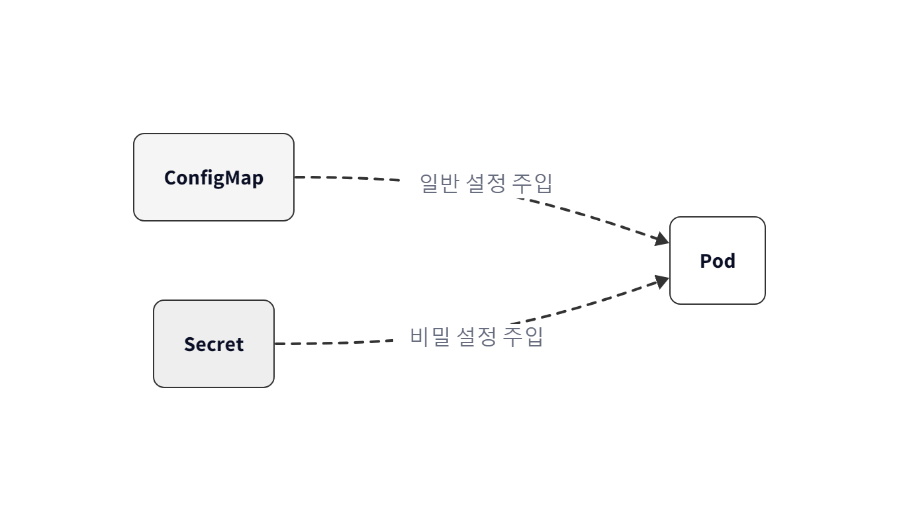
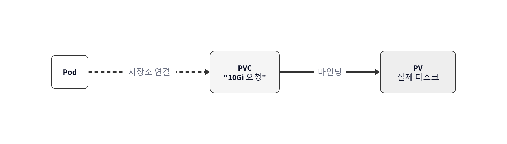
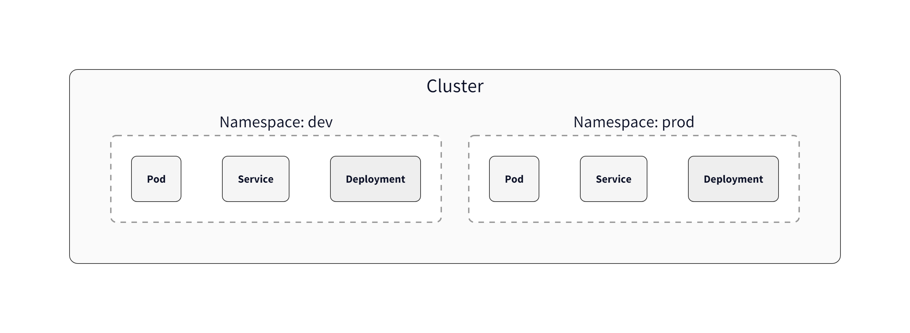
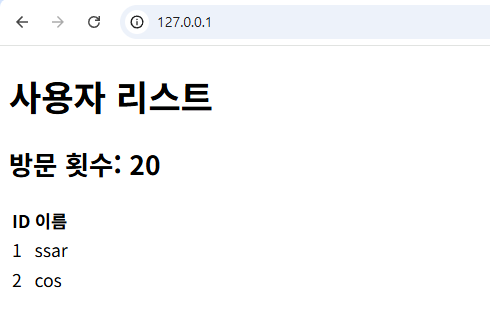

# Ch.6 Kubernetes 운영하기

챕터 4에서 Pod와 Deployment로 같은 서버 네 대를 띄워 봤고, 챕터 5에서는 그 앞에 Service와 Ingress를 두어 IP가 흔들려도 안 흔들리는 진입점을 만들었습니다. 며칠 동안 만들고 지운 Pod와 Service만 한 화면 가득 쌓였습니다. 이제 챕터 3에서 docker-compose로 짰던 통합 프로젝트를 K8s 위로 옮깁니다.

오픈이는 새 Deployment YAML을 열었습니다. 백엔드 컨테이너가 DB에 붙으려면 비밀번호가 필요한데, 막상 그 자리에서 커서가 멈췄습니다. 챕터 3에서는 `docker-compose.yml`에 환경 변수로 그냥 적어 뒀습니다. 로컬에서 돌리던 거라 그래도 됐는데, 운영 환경 YAML에 비밀번호를 박으면 Git 저장소에 그대로 남을 게 분명했습니다. DB 주소처럼 환경마다 달라지는 값도 마찬가지였습니다. 이미지에 박으면 환경이 바뀔 때마다 이미지를 다시 빌드해야 했습니다. 그리고 DB 컨테이너가 재시작되면 데이터가 날아가는 문제도 아직 풀리지 않은 채였습니다.

## 6.1 ConfigMap·Secret — 설정과 비밀번호를 이미지 바깥으로

### 6.1.1 이미지와 설정의 분리

**선배**: "Dockerfile에 비밀번호를 직접 적지 마. 설정은 이미지 바깥에 두고, 이미지는 순수한 코드만 담아야 해."

*'바깥이라면… 어디에 두어야 하지?'*

이미지 안에 넣을 수도 없고, YAML에 직접 적으면 보안 사고가 발생합니다. 설정값과 비밀번호를 따로 보관할 전용 공간이 필요했습니다. 쿠버네티스에는 이미 그 자리가 마련되어 있었습니다. 프랜차이즈에 비유하자면 본사가 매장에 공용 메뉴판을 내려보내고, 금고 속 레시피는 따로 관리하는 방식입니다. 건물을 새로 짓지 않아도 메뉴판과 레시피만 교체하면 매장을 운영할 수 있습니다.

쿠버네티스에서 이 역할을 담당하는 리소스는 두 가지입니다.

 - **ConfigMap**: 일반적인 설정값을 저장할 때 사용합니다. DB 주소, 접속 URL, 로그 레벨처럼 환경에 따라 변하는 값을 담습니다.
 - **Secret**: 비밀번호, 토큰, API 키처럼 민감한 정보를 저장할 때 사용합니다. ConfigMap과 구조는 유사하지만, 값이 Base64로 인코딩되어 저장되며 접근 권한이 엄격하게 제한됩니다.



*그림 6-1. ConfigMap과 Secret이 이미지와 별개로 Pod에 설정과 민감 정보를 주입*

### 6.1.2 ConfigMap

오픈이는 먼저 일반 설정을 관리하는 ConfigMap을 생성했습니다.

:::tip
**실습 코드 (GitHub)**: https://github.com/metacoding-10-linux-docker/docker/tree/master/ex13
:::

**ex13/configmap-conn.yml**
```yaml
apiVersion: v1
kind: ConfigMap
metadata:
  name: configmap-conn               # ConfigMap 이름 지정
data:                                # 설정값 넣는 영역
  conn_info: "localhost:80"
  conn_url: "config.test"
```

data 영역에 키-값 쌍을 적는 것만으로 준비는 끝났습니다. 이제 이 ConfigMap을 Pod가 가져다 쓰도록 Deployment에서 연결해야 합니다. envFrom.configMapRef를 사용하면 ConfigMap의 모든 값을 한꺼번에 환경 변수로 주입할 수 있습니다.

**ex13/deploy-ex03.yml** (핵심)
```yaml
apiVersion: apps/v1
kind: Deployment
metadata:
  name: nginx-config-secret            # Deployment 이름 (재시작 시 이 이름으로 지목)
spec:
  template:
    spec:
      containers:
        - name: nginx-container
          image: nginx:1.20
          envFrom:
            - configMapRef:
                name: configmap-conn   # ConfigMap 연결
```

YAML을 다시 들여다보니 `envFrom` 아래에 ConfigMap 이름 한 줄만 적혀 있었습니다. 키를 하나씩 매핑해 줄 필요가 없었습니다. 컨테이너가 시작되는 순간 `configmap-conn`에 적힌 `conn_info`와 `conn_url`이 그대로 환경 변수를 읽기 때문입니다.

*'이러면 애플리케이션 쪽 코드는 손댈 게 없네. 평소처럼 환경 변수만 읽으면 끝이잖아.'*

오픈이는 두 YAML을 차례로 적용하고 Pod 안에 들어가 환경 변수를 찍어 봤습니다.

```bash
kubectl apply -f ex13/configmap-conn.yml
kubectl apply -f ex13/deploy-ex03.yml
kubectl exec -it <Pod명> -- env       # Pod 환경 변수 조회
```

<div class="terminal-log">
  <div class="tl-chrome">
    <div class="tl-traffic"><span></span><span></span><span></span></div>
    <div class="tl-title">실행결과</div>
    <div class="tl-spacer"></div>
  </div>
  <div class="tl-body">
    <div><span class="tl-key">$</span> <span class="tl-str">kubectl get pod</span></div>
    <div>NAME                                  READY   STATUS    RESTARTS   AGE</div>
    <div>nginx-config-secret-794499d5d4-c2xmw  1/1     Running   0          11s</div>
    <div><span class="tl-key">$</span> <span class="tl-str">kubectl exec -it nginx-config-secret-794499d5d4-c2xmw -- env</span></div>
    <div>PATH=/usr/local/sbin:/usr/local/bin:/usr/sbin:/bin</div>
    <div>HOSTNAME=nginx-config-secret-794499d5d4-c2xmw</div>
    <div>conn_info=localhost:80</div>
    <div>conn_url=config.test</div>
    <div>password=metacoding1234</div>
    <div>KUBERNETES_PORT_443_TCP_PORT=443</div>
    <div>KUBERNETES_PORT_443_TCP_ADDR=10.96.0.1</div>
    <div>KUBERNETES_SERVICE_HOST=10.96.0.1</div>
    <div>KUBERNETES_SERVICE_PORT=443</div>
    <div>KUBERNETES_PORT_443_TCP=tcp://10.96.0.1:443</div>
    <div>KUBERNETES_PORT=tcp://10.96.0.1:443</div>
  </div>
</div>

*그림 6-2. Pod 안의 환경 변수 목록에 ConfigMap의 값이 보이는 모습*

Pod 내부의 환경 변수를 확인하자 conn_info=localhost:80과 같은 값이 나타났습니다. 이미지를 건드리지 않고도 설정값만 외부에서 주입하는 데 성공했습니다.

### 6.1.3 Secret

DB 비밀번호도 같은 방식으로 처리할 수 있을지 고민했습니다. 하지만 민감한 정보를 메뉴판처럼 공개된 곳에 적어둘 수는 없었습니다. 이를 위해 별도로 존재하는 리소스가 바로 Secret입니다.

**ex13/secret-password.yml**
```yaml
apiVersion: v1
kind: Secret
metadata:
  name: secret-password
stringData:                 # 평문을 자동으로 Base64 변환
  password: metacoding1234
```

stringData를 사용하면 쿠버네티스가 내부적으로 값을 Base64로 인코딩하여 저장합니다.

```bash
kubectl apply -f ex13/secret-password.yml      # Secret YAML 적용
kubectl get secret secret-password -o yaml     # 저장된 Secret 내용을 YAML로 조회
```

<div class="terminal-log">
  <div class="tl-chrome">
    <div class="tl-traffic"><span></span><span></span><span></span></div>
    <div class="tl-title">실행결과</div>
    <div class="tl-spacer"></div>
  </div>
  <div class="tl-body">
    <div><span class="tl-key">$</span> <span class="tl-str">kubectl get secret secret-password -o yaml</span></div>
    <div>apiVersion: v1</div>
    <div>data:</div>
    <div>&nbsp;&nbsp;password: bWV0YWNvZGluZzEyMzQ=</div>
    <div>kind: Secret</div>
    <div>metadata:</div>
    <div>&nbsp;&nbsp;annotations:</div>
    <div>&nbsp;&nbsp;&nbsp;&nbsp;kubectl.kubernetes.io/last-applied-configuration: |</div>
    <div>&nbsp;&nbsp;&nbsp;&nbsp;&nbsp;&nbsp;{"apiVersion":"v1","kind":"Secret","metadata":{"annotations":{},"name":"secret-password","namespace":"defaul...</div>
    <div>&nbsp;&nbsp;creationTimestamp: "2026-03-15T06:30:27Z"</div>
    <div>&nbsp;&nbsp;name: secret-password</div>
    <div>&nbsp;&nbsp;namespace: default</div>
    <div>&nbsp;&nbsp;resourceVersion: "1387"</div>
  </div>
</div>

*그림 6-3. Secret 내부를 보면 비밀번호가 Base64로 인코딩된 상태*

저장된 결과를 확인하면 password 값이 알 수 없는 문자열로 변환되어 있습니다.

:::note
**Secret과 Base64**

Secret의 Base64 처리는 암호화가 아닌 단순 인코딩입니다. 따라서 누구나 디코딩하여 원문을 확인할 수 있습니다. 실제 보안은 RBAC(역할 기반 접근 제어)을 통한 조회 권한 제한, etcd 저장소 암호화 등을 통해 확보해야 합니다. 여기서는 '일반 설정과 민감 정보를 구분하여 관리한다'는 개념이 중요합니다.
:::

Pod에 주입하는 방식은 ConfigMap과 동일합니다. 앞서 작성해 둔 `deploy-ex03.yml`을 다시 열어 `envFrom` 아래의 `secretRef` 두 줄에 걸린 `#` 주석을 풀어 줍니다. secretRef를 활성화하면 쿠버네티스가 실행 시점에 인코딩을 자동으로 풀어 평문으로 환경 변수에 추가합니다.

**ex13/deploy-ex03.yml** (Secret 연결 활성화)
```yaml
envFrom:
  - configMapRef:
      name: configmap-conn
  - secretRef:
      name: secret-password   # Secret 연결 (활성화)
```

```bash
kubectl apply -f ex13/deploy-ex03.yml   # Secret 연결판 적용
```

<div class="terminal-log">
  <div class="tl-chrome">
    <div class="tl-traffic"><span></span><span></span><span></span></div>
    <div class="tl-title">실행결과</div>
    <div class="tl-spacer"></div>
  </div>
  <div class="tl-body">
    <div><span class="tl-key">$</span> <span class="tl-str">kubectl get pod</span></div>
    <div>NAME                                  READY   STATUS    RESTARTS   AGE</div>
    <div>nginx-config-secret-7fbccb65f5-zq8nz  1/1     Running   0          51s</div>
    <div><span class="tl-key">$</span> <span class="tl-str">kubectl exec -it nginx-config-secret-7fbccb65f5-zq8nz -- env</span></div>
    <div>PATH=/usr/local/sbin:/usr/local/bin:/usr/sbin:/bin</div>
    <div>HOSTNAME=nginx-config-secret-7fbccb65f5-zq8nz</div>
    <div>TERM=xterm</div>
    <div>conn_url=config.test</div>
    <div>password=metacoding1234</div>
    <div>conn_info=localhost:80</div>
    <div>KUBERNETES_SERVICE_PORT_HTTPS=443</div>
    <div>KUBERNETES_PORT=tcp://10.96.0.1:443</div>
  </div>
</div>

*그림 6-4. 환경 변수 목록에 Secret의 값이 평문으로 들어와 있는 모습*

### 6.1.4 환경 변수 반영을 위한 Pod 재시작

오픈이는 ConfigMap이 정말 살아 있는 설정인지 한 번 확인해 보고 싶었습니다. `configmap-conn.yml`을 열어 `conn_info`의 포트만 `80`에서 `90`으로 살짝 고쳤습니다.

**ex13/configmap-conn.yml** (포트 변경)
```yaml
# ... 생략

  conn_info: "localhost:90"          # 환경변수 수정
```

```bash
kubectl apply -f ex13/configmap-conn.yml   # 변경된 ConfigMap 적용
```

apply를 걸자 `configured` 메시지가 떴습니다. ConfigMap 자체는 분명히 갱신된 것 같았는데, 막상 Pod 안의 환경 변수를 들여다보니 포트는 여전히 `80`이었습니다.

*'어? 분명히 바꿨는데 왜 그대로지?'*

리눅스에서 환경 변수는 **프로세스가 시작될 때 한 번 꽂히는 값**입니다. 그래서 ConfigMap 쪽이 갱신되어도, 이미 떠 있는 Pod의 프로세스 안에는 처음 꽂혔던 옛 값이 그대로 박혀 있게 됩니다. 새 값을 반영하려면 Pod를 한 번 새로 띄워 줘야 합니다.

<div class="svg-figure">
<svg viewBox="0 0 800 200" xmlns="http://www.w3.org/2000/svg" role="img" aria-label="apply만 한 경우 ConfigMap 변경이 Pod에 반영되지 않음">
  <defs>
    <marker id="g65a-p" markerWidth="10" markerHeight="10" refX="8" refY="3" orient="auto"><path d="M0,0 L0,6 L8,3 z" fill="#475569"/></marker>
    <marker id="g65a-x" markerWidth="10" markerHeight="10" refX="8" refY="3" orient="auto"><path d="M0,0 L0,6 L8,3 z" fill="#ff7849"/></marker>
  </defs>
  <text x="20" y="24" font-size="14" font-weight="800" fill="#7b341e">✗  apply 만 한 경우 — Pod에 반영 안 됨</text>
  <rect x="20" y="60" width="200" height="80" rx="8" fill="#fff" stroke="#475569" stroke-width="1.6"/>
  <text x="120" y="88" text-anchor="middle" font-size="13" font-weight="700" fill="#0f172a">ConfigMap</text>
  <text x="120" y="110" text-anchor="middle" font-size="12" font-family="monospace" fill="#475569">port: 90</text>
  <text x="120" y="128" text-anchor="middle" font-size="10" fill="#6b7280">(수정 후)</text>
  <line x1="220" y1="100" x2="300" y2="100" stroke="#475569" stroke-width="2" marker-end="url(#g65a-p)"/>
  <text x="260" y="92" text-anchor="middle" font-size="11" fill="#475569" font-family="monospace">kubectl apply</text>
  <rect x="300" y="60" width="200" height="80" rx="8" fill="#fef3ec" stroke="#c2410c" stroke-width="1.6"/>
  <text x="400" y="88" text-anchor="middle" font-size="13" font-weight="700" fill="#7b341e">Kube API Server</text>
  <text x="400" y="110" text-anchor="middle" font-size="11" fill="#7b341e">port: 90 저장됨</text>
  <text x="400" y="128" text-anchor="middle" font-size="10" fill="#7b341e">(여기까진 OK)</text>
  <line x1="500" y1="100" x2="580" y2="100" stroke="#ff7849" stroke-width="2" stroke-dasharray="6,4" marker-end="url(#g65a-x)"/>
  <text x="540" y="92" text-anchor="middle" font-size="13" fill="#7b341e" font-weight="800">✗ 연결 안 됨</text>
  <rect x="580" y="60" width="200" height="80" rx="8" fill="#fff" stroke="#475569" stroke-width="1.6" stroke-dasharray="4,3"/>
  <text x="680" y="88" text-anchor="middle" font-size="13" font-weight="700" fill="#475569">기존 Pod</text>
  <text x="680" y="110" text-anchor="middle" font-size="12" font-family="monospace" fill="#7b341e">env: port=80</text>
  <text x="680" y="128" text-anchor="middle" font-size="10" fill="#7b341e">(옛 값 유지)</text>
  <text x="400" y="172" text-anchor="middle" font-size="11" fill="#6b7280" font-style="italic">ConfigMap은 갱신됐지만, 이미 떠 있는 Pod의 환경 변수는 시작 시점에 박힌 값(80)을 그대로 가지고 있습니다.</text>
</svg>
</div>

*그림 6-5. apply 만 한 경우 — ConfigMap 변경이 기존 Pod에는 반영되지 않음*

<div class="svg-figure">
<svg viewBox="0 0 800 200" xmlns="http://www.w3.org/2000/svg" role="img" aria-label="rollout restart로 새 Pod를 띄우면 ConfigMap 새 값이 반영됨">
  <defs>
    <marker id="g65b-p" markerWidth="10" markerHeight="10" refX="8" refY="3" orient="auto"><path d="M0,0 L0,6 L8,3 z" fill="#475569"/></marker>
    <marker id="g65b-g" markerWidth="10" markerHeight="10" refX="8" refY="3" orient="auto"><path d="M0,0 L0,6 L8,3 z" fill="#10b981"/></marker>
  </defs>
  <text x="20" y="24" font-size="14" font-weight="800" fill="#0f6f3f">✓  rollout restart 까지 한 경우 — 새 Pod에 반영 OK</text>
  <rect x="20" y="60" width="200" height="80" rx="8" fill="#fff" stroke="#475569" stroke-width="1.6"/>
  <text x="120" y="88" text-anchor="middle" font-size="13" font-weight="700" fill="#0f172a">ConfigMap</text>
  <text x="120" y="110" text-anchor="middle" font-size="12" font-family="monospace" fill="#475569">port: 90</text>
  <text x="120" y="128" text-anchor="middle" font-size="10" fill="#6b7280">(수정 후)</text>
  <line x1="220" y1="100" x2="300" y2="100" stroke="#475569" stroke-width="2" marker-end="url(#g65b-p)"/>
  <text x="260" y="92" text-anchor="middle" font-size="11" fill="#475569" font-family="monospace">kubectl apply</text>
  <rect x="300" y="60" width="200" height="80" rx="8" fill="#fef3ec" stroke="#c2410c" stroke-width="1.6"/>
  <text x="400" y="88" text-anchor="middle" font-size="13" font-weight="700" fill="#7b341e">Kube API Server</text>
  <text x="400" y="110" text-anchor="middle" font-size="11" fill="#7b341e">port: 90 저장됨</text>
  <text x="400" y="128" text-anchor="middle" font-size="10" fill="#7b341e">(저장 OK)</text>
  <line x1="500" y1="100" x2="580" y2="100" stroke="#10b981" stroke-width="2" marker-end="url(#g65b-g)"/>
  <text x="540" y="92" text-anchor="middle" font-size="11" fill="#0f6f3f" font-weight="700">rollout restart</text>
  <text x="540" y="118" text-anchor="middle" font-size="10" fill="#0f6f3f">(새 Pod 생성)</text>
  <rect x="580" y="60" width="200" height="80" rx="8" fill="#ecfdf5" stroke="#10b981" stroke-width="1.8"/>
  <text x="680" y="88" text-anchor="middle" font-size="13" font-weight="700" fill="#0f6f3f">새 Pod</text>
  <text x="680" y="110" text-anchor="middle" font-size="12" font-family="monospace" fill="#0f6f3f">env: port=90</text>
  <text x="680" y="128" text-anchor="middle" font-size="10" fill="#0f6f3f">(새 값 박힘)</text>
  <text x="400" y="172" text-anchor="middle" font-size="11" fill="#6b7280" font-style="italic">새 Pod는 시작 시점에 갱신된 ConfigMap을 읽어 환경 변수에 새 값(90)을 박습니다.</text>
</svg>
</div>

*그림 6-6. rollout restart 로 Pod를 새로 띄우면 ConfigMap 새 값이 환경 변수로 반영됨*

```bash
kubectl rollout restart deployment nginx-config-secret   # Pod 재시작
```

`kubectl rollout restart`는 여러 Pod를 순차로 교체해 새 값을 안전하게 갈아 끼워 주는 명령입니다. 재시작이 끝나고 다시 환경 변수를 찍어 보니 포트가 `90`으로 바뀌어 들어와 있었습니다. apply만으로는 절반이고, 반영까지는 재시작이 한 번 더 필요했습니다.

설정과 민감 정보를 이미지 바깥으로 빼는 일은 끝났습니다. 그러나 Pod 안의 데이터는 아직 그대로였습니다. DB 컨테이너가 재시작되면 회원 정보가 함께 사라지는 문제가 남아 있었습니다. 

## 6.2 Volume — 데이터의 영속성 확보

### 6.2.1 Pod의 휘발성 문제

설정 분리는 끝났고, 남은 건 데이터였습니다. 정작 그 비밀번호로 잠가 두는 **DB 자체도 Pod 위에서 돌고 있다**는 사실을 다시 떠올리자, 챕터 4에서 Pod 하나를 일부러 지워 봤던 장면이 함께 떠올랐습니다. Deployment가 곧장 새 Pod를 띄워 자가 치유는 잘 됐지만, 사라진 Pod 안에 있던 파일은 새 Pod 어디에도 없었습니다. Pod는 기본적으로 **휘발성**이라, 안에서 만든 파일은 Pod 수명과 함께 사라집니다. 회원 가입과 게시글이 매일 쌓이는 DB가 그런 식으로 휘발되면 운영을 할 수가 없었습니다.

*'Pod 지워지면 DB 데이터도 같이 사라지는 거야?'*

그러고 보니 챕터 2에서 본 Docker의 마운트와 같은 형태가 필요했습니다. 호스트나 별도 볼륨에 데이터를 빼두고 컨테이너는 그 경로를 끌어다 쓰는 방식입니다. Kubernetes에도 같은 기능이 있고, 이름이 **Volume**입니다.

:::term-box
**볼륨(Volume)**: Pod 내부 컨테이너가 사용할 수 있는 외부 저장 공간입니다. Pod 수명과 분리되어 있어, Pod가 사라져도 데이터가 남을 수 있습니다.
:::

Volume에는 여러 종류가 있었습니다.

| 종류 | 설명 | 데이터 유지 |
|------|------|------------|
| `emptyDir` | Pod 생성 시 만들어지는 임시 저장 공간 | Pod 삭제 시 함께 삭제 |
| `hostPath` | 워커 노드(호스트)의 특정 경로를 Pod에 마운트 | 노드에 남지만, Pod가 다른 노드로 이동하면 접근 불가 |
| `PV / PVC` | 클러스터 외부에 영구 저장소를 만들고 요청서(PVC)로 Pod에 연결 | Pod가 삭제되어도 유지 |

쿠버네티스에서 데이터 보존을 위해 가장 보편적으로 사용하는 방식은 **PV(PersistentVolume)** 와 **PVC(PersistentVolumeClaim)** 입니다.

### 6.2.2 PV와 PVC 

*'Volume이 저장 공간이라는 건 알겠는데, PV랑 PVC는 왜 두 개로 나눠져 있지?'*

Pod가 직접 저장 공간을 관리하면 인프라 세부 사항까지 알아야 합니다. Kubernetes는 그래서 저장 공간을 **실제 저장 공간** 과 **사용을 위해 작성하는 신청서** 로 분리해 두었습니다. 한 장 그림으로 보면 관계가 분명해집니다.



*그림 6-7. PV는 실제 저장 공간, PVC는 그 공간을 요청하는 신청서*

- **PV(PersistentVolume)**: 실제 저장 공간, 즉 **창고**입니다. 용량, 권한, 위치 같은 창고의 사양이 정의됩니다.
- **PVC(PersistentVolumeClaim)**: 창고를 쓰겠다고 작성하는 **신청서**입니다. "10Gi짜리 읽기·쓰기 가능한 창고가 필요하다"고 적어 두면, Kubernetes가 조건에 맞는 PV를 찾아 자동으로 PVC와 연결합니다.

Pod는 PV를 직접 건드리지 않고 PVC만 붙여 사용합니다. 실제 창고 위치는 PVC가 알아서 연결해 주기 때문에, Pod 입장에서는 "용량이 맞는 저장 공간 하나"가 붙어 있습니다.

:::tip
**실습 코드 (GitHub)**: https://github.com/metacoding-10-linux-docker/docker/tree/master/ex14
:::

#### PV 만들기

```yaml
# ex14/volume-pv.yml
apiVersion: v1
kind: PersistentVolume
metadata:
  name: volume-pv
spec:
  capacity:
    storage: 1Gi
  accessModes:
    - ReadWriteOnce
  storageClassName: ""                 # 자동 StorageClass 비활성, 아래 PVC에서 정적 바인딩
  hostPath:
    path: /mnt/data
    type: DirectoryOrCreate
```

이번 실습에서는 외부 스토리지 없이 Minikube 내부의 경로(`/mnt/data`)를 저장소로 썼습니다. `storageClassName: ""`은 PVC가 자동으로 StorageClass로 새 PV를 만드는 걸 막고, 지금 만든 이 PV에 정적으로 바인딩하게 하는 지정입니다.

#### PVC 만들기

```yaml
# ex14/volume-pvc.yml
apiVersion: v1
kind: PersistentVolumeClaim
metadata:
  name: volume-pvc
spec:
  accessModes:
    - ReadWriteOnce
  storageClassName: ""
  resources:
    requests:
      storage: 1Gi
  volumeName: volume-pv                # 바인딩할 PV 이름을 수동 지정
```

`volumeName`은 "이 PVC를 특정 PV에 수동으로 붙이라"는 지정입니다. 위 PV의 `metadata.name`과 같은 값을 적어 정적 바인딩을 보장합니다.

:::note
**PVC와 PV가 연결 되는 조건**

PVC와 PV가 서로 연결 되려면 세 가지가 맞아야 합니다. 첫째, **읽기·쓰기 방식**(accessModes)이 호환되어야 합니다. 둘째, **저장소 종류 이름**(storageClassName)이 같아야 합니다. 셋째, 신청한 **용량이 창고 용량보다 작거나 같아야** 합니다. 하나라도 어긋나면 PVC는 짝을 못 찾고 **Pending** 상태에 머무릅니다.
:::

#### Pod에 연결

Pod 설정의 volumes에서 PVC를 선언하고, volumeMounts를 통해 컨테이너 내부 경로에 마운트합니다.

```yaml
# ex14/volume-pod.yml
apiVersion: v1
kind: Pod
metadata:
  name: volume-pod
spec:
  containers:
  - name: nginx-volume
    image: nginx
    volumeMounts:
    - name: storage
      mountPath: /mnt/data
  volumes:
  - name: storage
    persistentVolumeClaim:
      claimName: volume-pvc
```

Pod 입장에서는 /mnt/data 폴더가 생긴 것과 같으며, 여기에 저장되는 데이터는 실제 PV가 가리키는 노드의 경로에 기록됩니다.

```bash
kubectl apply -f ex14/volume-pv.yml      # PV(창고) 생성
kubectl apply -f ex14/volume-pvc.yml     # PVC(창고 신청서) 생성
kubectl apply -f ex14/volume-pod.yml     # PVC를 마운트한 Pod 생성
kubectl get pv,pvc                        # PV·PVC가 Bound 됐는지 확인
```

<div class="terminal-log">
  <div class="tl-chrome">
    <div class="tl-traffic"><span></span><span></span><span></span></div>
    <div class="tl-title">실행결과</div>
    <div class="tl-spacer"></div>
  </div>
  <div class="tl-body">
    <div><span class="tl-key">$</span> <span class="tl-str">kubectl get pv,pvc -o wide</span></div>
    <div>NAME                          CAPACITY  ACCESS MODES  RECLAIM POLICY  STATUS  CLAIM                S...</div>
    <div>persistentvolume/volume-pv    1Gi       RWO           Retain          Bound   default/volume-pvc   &lt;unset&gt;</div>
    <div>NAME                              STATUS  VOLUME      CAPACITY  ACCESS MODES  STORAGECLASS  VOLUMEATTRIBUTESCl...</div>
    <div>persistentvolumeclaim/volume-pvc  Bound   volume-pv   1Gi       RWO           &lt;unset&gt;                       9s</div>
  </div>
</div>

*그림 6-8. PV와 PVC가 Bound 상태로 연결된 결과*

STATUS가 Bound 상태라면 PV와 PVC가 정상적으로 연결된 것입니다.

*'창고와 신청서가 엮였다.'*

확인을 위해 Pod 내부에서 파일을 하나 생성한 뒤, Pod를 삭제하고 다시 생성해 봅니다.

```bash
kubectl exec -it volume-pod -- /bin/bash      # Pod 안 bash 접속
touch /mnt/data/c.txt                          # 마운트 경로에 빈 파일 생성
exit                                           # Pod 셸 종료

kubectl delete pod volume-pod                  # 기존 Pod 삭제
kubectl apply -f ex14/volume-pod.yml           # 같은 PVC를 쓰는 Pod 재생성
kubectl exec -it volume-pod -- ls /mnt/data    # 새 Pod에서 c.txt가 남아 있는지 확인
```

<div class="terminal-log">
  <div class="tl-chrome">
    <div class="tl-traffic"><span></span><span></span><span></span></div>
    <div class="tl-title">실행결과</div>
    <div class="tl-spacer"></div>
  </div>
  <div class="tl-body">
    <div><span class="tl-key">$</span> <span class="tl-str">kubectl exec -it volume-pod -- /bin/bash</span></div>
    <div>root@volume-pod:/#</div>
    <div><span class="tl-key">root@volume-pod:/#</span> <span class="tl-str">ls /mnt/data</span></div>
    <div>c.txt</div>
    <div>root@volume-pod:/#</div>
  </div>
</div>

*그림 6-9. Pod가 새로 태어났는데도 c.txt가 그대로 남아 있는 모습*

새로운 Pod가 생성되었음에도 c.txt 파일이 보존되어 있습니다.

Pod는 교체되었으나 파일의 실체는 PV에 존재하므로 데이터가 유지됩니다. PVC가 새로운 Pod에게도 동일한 창고를 연결해 준 결과입니다.

*'Pod가 새로 만들어져도 창고는 그대로다. 이제 데이터를 유실할 걱정이 없겠구나.'*


## 6.3 통합 실습 — K8s 위에 웹사이트 올리기

오픈이는 그동안 학습한 쿠버네티스의 기본 리소스들을 하나씩 되짚어 보았습니다. 컨테이너를 관리하는 Pod와 Deployment, 그 앞을 지키는 Service와 Ingress, 그리고 방금 배운 설정과 저장소 리소스들까지. 하지만 각각의 개념을 이해하는 것과, 이들을 하나로 엮어 실제 서비스를 구동하는 것은 전혀 다른 차원의 문제처럼 느껴졌습니다.

*'지금까지는 조각조각 따로 배워서 띄워 본 건데, 이것들을 한꺼번에 올리면 진짜 설계도처럼 맞물려서 돌아갈까?'*

부분적인 실습은 성공했지만, 전체 시스템이 유기적으로 연결되어 하나의 완성된 웹사이트로 작동하는 모습은 아직 상상하기 어려웠습니다. 확신 없는 표정으로 화면만 응시하던 오픈이의 등 뒤로 팀장의 목소리가 들려왔습니다.

**팀장**: "부분 실습은 끝났지. 한 번에 연결해 봐야 진짜 실력이 늘어."

팀장의 말대로 이번 절은 단순한 실습의 연장이 아니었습니다. 그동안 파편화되어 있던 지식들을 하나로 모아, 실제로 살아 움직이는 통합 서비스를 완성하는 '최종 관문'이었습니다. 

:::tip
**실습 코드 (GitHub)**: https://github.com/metacoding-10-linux-docker/docker/tree/master/ex15
:::

### 6.3.1 전체 그림

오픈이가 펼쳐 본 구성도에는 서비스 네 개가 들어 있었습니다. 프런트엔드(Nginx), 백엔드(Spring Boot), DB(MySQL), 그리고 방문 횟수를 기록할 Redis. Redis가 더해지면서 실제 운영 환경에 한층 더 가까워진 구조였습니다.

<div class="svg-figure">
<svg viewBox="0 0 800 380" xmlns="http://www.w3.org/2000/svg" role="img" aria-label="ex15 Kubernetes 웹사이트의 전체 구성">
  <defs>
    <marker id="ex15-p" markerWidth="10" markerHeight="10" refX="8" refY="3" orient="auto"><path d="M0,0 L0,6 L8,3 z" fill="#475569"/></marker>
  </defs>
  <text x="400" y="22" text-anchor="middle" font-size="13" font-weight="700" fill="#1f2937">ex15 Kubernetes 웹사이트의 전체 구성</text>
  <rect x="20" y="50" width="760" height="310" rx="10" fill="#fff" stroke="#475569" stroke-width="1.6" stroke-dasharray="6,4"/>
  <text x="40" y="70" font-size="11" font-weight="600" fill="#0f172a">Cluster (metacoding namespace)</text>
  <rect x="40" y="90" width="100" height="55" rx="6" fill="#fff" stroke="#9ca3af" stroke-width="1.4"/>
  <text x="90" y="115" text-anchor="middle" font-size="12" font-weight="700" fill="#374151">브라우저</text>
  <text x="90" y="132" text-anchor="middle" font-size="9" fill="#6b7280">외부 사용자</text>
  <line x1="140" y1="118" x2="180" y2="118" stroke="#475569" stroke-width="1.6" marker-end="url(#ex15-p)"/>
  <rect x="180" y="90" width="100" height="55" rx="6" fill="#fff" stroke="#475569" stroke-width="1.6"/>
  <text x="230" y="115" text-anchor="middle" font-size="12" font-weight="700" fill="#0f172a">Ingress</text>
  <text x="230" y="132" text-anchor="middle" font-size="9" fill="#6b7280">외부 진입</text>
  <line x1="280" y1="118" x2="320" y2="118" stroke="#475569" stroke-width="1.6" marker-end="url(#ex15-p)"/>
  <rect x="320" y="90" width="120" height="55" rx="6" fill="#fff" stroke="#475569" stroke-width="1.6"/>
  <text x="380" y="112" text-anchor="middle" font-size="12" font-weight="700" fill="#0f172a">Frontend Pod</text>
  <text x="380" y="128" text-anchor="middle" font-size="10" fill="#6b7280">Nginx :80</text>
  <line x1="440" y1="118" x2="490" y2="118" stroke="#475569" stroke-width="1.6" marker-end="url(#ex15-p)"/>
  <text x="465" y="112" text-anchor="middle" font-size="9" fill="#6b7280" font-style="italic">Service 호출</text>
  <rect x="490" y="60" width="140" height="55" rx="6" fill="#fff" stroke="#475569" stroke-width="1.6"/>
  <text x="560" y="82" text-anchor="middle" font-size="12" font-weight="700" fill="#0f172a">Backend Pod 1</text>
  <text x="560" y="98" text-anchor="middle" font-size="10" fill="#6b7280">Spring Boot :8080</text>
  <rect x="490" y="125" width="140" height="55" rx="6" fill="#fff" stroke="#475569" stroke-width="1.6"/>
  <text x="560" y="147" text-anchor="middle" font-size="12" font-weight="700" fill="#0f172a">Backend Pod 2</text>
  <text x="560" y="163" text-anchor="middle" font-size="10" fill="#6b7280">Spring Boot :8080</text>
  <line x1="630" y1="88" x2="660" y2="120" stroke="#475569" stroke-width="1.6" marker-end="url(#ex15-p)"/>
  <line x1="630" y1="152" x2="660" y2="180" stroke="#475569" stroke-width="1.6" marker-end="url(#ex15-p)"/>
  <rect x="660" y="105" width="120" height="40" rx="6" fill="#fff4ed" stroke="#ff7849" stroke-width="1.6"/>
  <text x="720" y="123" text-anchor="middle" font-size="12" font-weight="700" fill="#7b341e">MySQL Pod</text>
  <text x="720" y="138" text-anchor="middle" font-size="9" fill="#7b341e">+ PV (영속)</text>
  <rect x="660" y="170" width="120" height="40" rx="6" fill="#fff4ed" stroke="#ff7849" stroke-width="1.6"/>
  <text x="720" y="188" text-anchor="middle" font-size="12" font-weight="700" fill="#7b341e">Redis Pod</text>
  <text x="720" y="203" text-anchor="middle" font-size="9" fill="#7b341e">방문 카운터</text>
  <rect x="320" y="240" width="110" height="40" rx="6" fill="#fff" stroke="#475569" stroke-width="1.6"/>
  <text x="375" y="265" text-anchor="middle" font-size="11" font-weight="700" fill="#0f172a">ConfigMap</text>
  <rect x="440" y="240" width="100" height="40" rx="6" fill="#fff" stroke="#475569" stroke-width="1.6"/>
  <text x="490" y="265" text-anchor="middle" font-size="11" font-weight="700" fill="#0f172a">Secret</text>
  <path d="M 375 240 Q 460 200, 530 180" fill="none" stroke="#475569" stroke-width="1.4" stroke-dasharray="4,3" marker-end="url(#ex15-p)"/>
  <path d="M 490 240 Q 510 210, 530 180" fill="none" stroke="#475569" stroke-width="1.4" stroke-dasharray="4,3" marker-end="url(#ex15-p)"/>
  <text x="430" y="220" text-anchor="middle" font-size="9" fill="#6b7280" font-style="italic">envFrom 주입</text>
  <text x="400" y="335" text-anchor="middle" font-size="10" fill="#6b7280">Pod 간 통신은 Service 이름으로 (CoreDNS 자동 변환). MySQL은 PV로 데이터 보존, Secret으로 비밀번호 분리</text>
</svg>
</div>

*그림 6-10. ex15 Kubernetes 웹사이트의 전체 구성*

오픈이는 그림을 따라가며 흐름을 머릿속에 그려 봤습니다. 브라우저의 요청이 Ingress를 통과해 Frontend Service를 거쳐 프런트엔드 Pod에 닿습니다. 사용자가 게시판이나 로그인 버튼을 누르면 프런트엔드의 Nginx가 /api/... 요청을 받아 클러스터 내부의 Backend Service로 넘겨줍니다. 요청을 받은 백엔드 Pod는 로직을 처리하는 과정에서 DB Service와 Redis Service를 호출하여 데이터를 읽고 씁니다.

그림을 보고 있자니 한 가지가 분명해졌습니다. Pod 사이의 모든 통신이 IP가 아닌 서비스 이름으로 이루어진다는 사실이었습니다. 챕터 5에서 본 클러스터 DNS, 즉 **CoreDNS**가 서비스 이름을 ClusterIP로 변환해 주기 때문에, 복잡한 숫자 주소 대신 `db-service`, `backend-service` 같은 직관적인 이름만 챙기면 됩니다.

*'IP가 어디로 옮겨 다니든 이름만 잡고 있으면 흐름이 안 끊기는구나.'*

### 6.3.2 폴더 구조와 진행 방식

오픈이가 ex15 폴더를 열어 보니 이미지를 만드는 영역과 쿠버네티스 설정(YAML) 영역이 깔끔하게 나뉘어 있었습니다. 이번 실습의 초점은 이미지 제작이 아니라 쿠버네티스 리소스들이 어떻게 한 덩어리로 맞물리는지 보는 데 있었습니다.

```text
ex15/
├── backend/                          # Spring Boot 백엔드 이미지
│   ├── Dockerfile                    # JDK 이미지 + entrypoint.sh 복사
│   └── entrypoint.sh                 # Git clone + Gradle 빌드 + JAR 실행
├── db/                               # MySQL 이미지
│   ├── Dockerfile                    # MySQL 이미지 + init.sql 복사
│   └── init.sql                      # 테이블·초기 데이터 생성 스크립트
├── frontend/                         # NGINX + HTML 이미지
│   ├── Dockerfile                    # nginx 이미지 + index.html·nginx.conf 복사
│   ├── index.html                    # 로그인/게시판 UI (방문 카운터 표시)
│   └── nginx.conf                    # /api 경로를 backend-service로 프록시
├── redis/                            # Redis 이미지
│   └── Dockerfile                    # redis 공식 이미지 기반
├── k8s/                              # K8s 리소스 매니페스트
│   ├── namespace.yml                 # ex15 네임스페이스 정의
│   ├── backend/
│   │   ├── backend-configmap.yml     # 비밀이 아닌 설정값
│   │   ├── backend-deploy.yml        # 백엔드 Deployment
│   │   ├── backend-secret.yml        # DB 비밀번호 등 민감 정보
│   │   └── backend-service.yml       # 내부용 ClusterIP Service
│   ├── db/
│   │   ├── db-deploy.yml             # MySQL Deployment
│   │   ├── db-pv.yml                 # PersistentVolume (노드 로컬 저장소)
│   │   ├── db-pvc.yml                # PersistentVolumeClaim (볼륨 요청)
│   │   ├── db-secret.yml             # MySQL 계정 정보
│   │   └── db-service.yml            # 내부용 ClusterIP Service
│   ├── frontend/
│   │   ├── frontend-deploy.yml       # 프론트 Deployment
│   │   ├── frontend-ingress.yml      # 외부 진입점 (Ingress)
│   │   └── frontend-service.yml      # 내부용 ClusterIP Service
│   └── redis/
│       ├── redis-deploy.yml          # Redis Deployment
│       └── redis-service.yml         # 내부용 ClusterIP Service
└── README.md                         # 실습 안내
```

### 6.3.3 공통 준비

오픈이는 본격적으로 띄우기 전에 두 가지부터 챙겼습니다. Minikube와 Ingress Controller를 켜는 일, 그리고 네 가지 이미지를 빌드해 두는 일이었습니다.

```bash
minikube start
minikube addons enable ingress
kubectl get pod -n ingress-nginx   # Controller Pod Running 확인
```

<div class="terminal-log">
  <div class="tl-chrome">
    <div class="tl-traffic"><span></span><span></span><span></span></div>
    <div class="tl-title">실행결과</div>
    <div class="tl-spacer"></div>
  </div>
  <div class="tl-body">
    <div><span class="tl-key">$</span> <span class="tl-str">minikube addons enable ingress</span></div>
    <div>* ingress is an addon maintained by Kubernetes. For any concerns contact minikube on GitHub.</div>
    <div>You can view the list of minikube maintainers at: https://github.com/kubernetes/minikube/blob/master/OWNERS</div>
    <div>* After the addon is enabled, please run "minikube tunnel" and your ingress resources would be available at "127.0.0.1"</div>
    <div>&nbsp;&nbsp;&nbsp;- Using image registry.k8s.io/ingress-nginx/kube-webhook-certgen:v1.6.2</div>
    <div>&nbsp;&nbsp;&nbsp;- Using image registry.k8s.io/ingress-nginx/kube-webhook-certgen:v1.6.2</div>
    <div>&nbsp;&nbsp;&nbsp;- Using image registry.k8s.io/ingress-nginx/controller:v1.13.2</div>
    <div>* Verifying ingress addon...</div>
    <div>* The 'ingress' addon is enabled</div>
  </div>
</div>

*그림 6-11. Nginx Ingress Controller 애드온 설치*

Minikube는 독립적인 가상 환경에서 작동하는 클러스터라, 로컬 호스트에서 빌드한 이미지를 곧장 인식하지 못합니다. 그래서 별도의 레지스트리를 두지 않고 **minikube image build** 명령으로 Minikube 자체에 이미지를 직접 만들어 두기로 했습니다.

```bash
minikube image build -t metacoding/db:1 ex15/db              # DB 이미지 빌드
minikube image build -t metacoding/backend:1 ex15/backend    # 백엔드 이미지 빌드
minikube image build -t metacoding/frontend:1 ex15/frontend  # 프론트엔드 이미지 빌드
minikube image build -t metacoding/redis:1 ex15/redis        # Redis 이미지 빌드
```

### 6.3.4 리소스 살펴보기

오픈이는 `ex15/k8s/` 폴더를 열고 그 안의 리소스들을 하나씩 훑어 봤습니다. 서비스별로 폴더가 나뉘어 있었고, 각 폴더에는 Deployment와 Service가 기본으로 들어 있었습니다. 거기에 서비스 성격에 따라 필요한 리소스들이 더 붙어 있었습니다.

| 서비스 | 리소스 구성 | 추가된 자리가 푸는 문제 |
|--------|-------------|----------------------|
| Frontend | Deployment + Service + Ingress | 외부 진입 (챕터 5) |
| Backend | Deployment + Service + ConfigMap + Secret | 설정·비밀번호 분리 (6.1) |
| DB | Deployment + Service + PV + PVC + Secret | 데이터 영속성 (6.2) |
| Redis | Deployment + Service | — |

각 리소스의 자세한 설정은 앞에서 다룬 형태와 다르지 않았습니다. 이번 절에서 오픈이가 보고 싶었던 건 이들이 한꺼번에 실행될 때 어떻게 서로 맞물려 돌아가는지였습니다.

#### Namespace — 논리적 분리

지금까지 만든 리소스는 모두 default라는 기본 공간에 담겨 있었습니다. 그래서 `kubectl get`을 칠 때마다 이전 실습의 잔해까지 함께 쏟아져 나와 화면이 어수선했습니다.

*'혼자 연습할 때는 괜찮지만, 여러 팀의 서비스가 같이 돌면 이름이 충돌할 수도 있겠구나.'*

같은 건물이라도 층을 나누어 호실을 관리하듯, 쿠버네티스에서도 공간을 분리할 수 있습니다. Namespace는 하나의 클러스터를 논리적으로 구분해 주는 가상 공간입니다.



*그림 6-12. 같은 클러스터 안에서 Namespace가 리소스를 층처럼 분리*

:::term-box
**Namespace**: 리소스를 논리적으로 구분하는 가상 공간입니다. 별도 지정이 없으면 모든 리소스는 **default** 네임스페이스에 소속됩니다.
:::

그래서 이번 실습에서는 metacoding이라는 전용 네임스페이스를 만들어 모든 리소스를 그 안에서 관리하기로 했습니다.

```yaml
# ex15/k8s/namespace.yml
apiVersion: v1
kind: Namespace
metadata:
  name: metacoding
```

이후 만들어지는 모든 리소스는 metacoding이라는 독립된 영역에 자리를 잡게 됩니다.

#### Frontend

오픈이는 frontend 폴더부터 펼쳤습니다. Nginx가 80번 포트에서 정적 콘텐츠를 내보내도록 짜여 있었고, /api/... 요청은 Nginx 설정에 따라 클러스터 내부의 backend-service로 흘러가게 되어 있었습니다. Frontend Service가 이를 대표 주소로 묶어 주고, Ingress가 외부 요청을 받아 이 서비스로 연결하는 구조였습니다.

#### Backend

backend 폴더를 열자 6.1에서 만져 본 ConfigMap과 Secret이 다시 보였습니다. ConfigMap에는 DB 접속 URL, JDBC 드라이버, Redis 호스트와 포트가 들어 있었고, Secret에는 DB 사용자명과 비밀번호가 따로 분리되어 있었습니다. 두 리소스 모두 `envFrom`으로 백엔드 Deployment에 한꺼번에 주입되는 형태였습니다. 포트는 Tomcat 기본값 8080을 그대로 사용했습니다.

ConfigMap에도 그래서 IP 대신 Service 이름(`db-service`, `redis-service`)이 적혀 있었습니다. DB Pod가 죽었다 살아나도 ConfigMap을 다시 손댈 필요가 없습니다.

#### DB

db 폴더에는 6.2에서 다룬 PV와 PVC가 그대로 자리 잡고 있었습니다. MySQL의 데이터 저장 경로가 PV에 연결되어, Pod가 삭제되어도 실제 데이터는 살아남는 구조였습니다. 여기서 PV는 /data/mysql 경로를 바라보는 별도의 저장 공간이었습니다.

#### Redis

redis 폴더는 한층 단출했습니다. Deployment에 이미지와 포트를 지정하고, redis-service라는 이름으로 6379번 포트를 노출하는 구성이었습니다. 백엔드의 ConfigMap에서 이 이름을 참조하고 있으니 이름만 맞으면 통신이 자동으로 이어지는 그림이었습니다.

### 6.3.5 한 번에 배포하고 결과 확인

리소스 구경을 마친 오픈이는 `ex15/k8s/` 폴더를 통째로 넘겼습니다.

```bash
kubectl apply -f ex15/k8s/namespace.yml      # Namespace 먼저
kubectl apply -f ex15/k8s/ --recursive       # k8s 이하 폴더의 리소스 전부 일괄 배포
```

명령을 치자 모든 리소스가 한꺼번에 생성됐습니다. 오픈이는 상태를 보기 위해 곧바로 조회 명령을 입력했습니다.

```bash
kubectl get deploy,pod,service,ingress -n metacoding   # 네임스페이스 리소스 상태 일괄 조회
```

프런트엔드와 데이터베이스는 금세 올라왔지만, 백엔드 Pod만 빌드와 의존성 설치 과정 때문에 ContainerCreating 상태에 한참 머물러 있었습니다.

*'모든 서비스가 떴는데 백엔드만 응답이 늦네.'*

로그를 들여다보니 안에서 빌드 작업이 한창이었습니다. 잠시 기다리자 모든 Pod가 Running 상태로 바뀌었고, 오픈이는 외부 접근을 위한 통로를 열었습니다.

```bash
minikube service frontend-service -n metacoding --url   # 외부 접속 URL 출력
```

생성된 URL을 브라우저에 입력해 결과를 확인했습니다.


*그림 6-13. Ingress를 거쳐 웹사이트가 화면에 응답*


화면에는 데이터베이스에서 불러온 정보와 함께 방문 횟수가 떠 있었습니다. 새로고침을 할 때마다 숫자가 한 칸씩 올라갔습니다. 네 개의 서비스가 서로 이름을 부르며 제대로 맞물려 돌아가고 있다는 증거였습니다.



*그림 6-14. 새로고침 시 방문 횟수가 증가*

백엔드 두 Pod에 요청이 실제로 분산되는지는 로그로도 확인할 수 있었습니다. 

```bash
kubectl logs -l app=backend -n metacoding --tail=100 --prefix   # backend Pod 최근 100줄 (Pod명 표시)
```

서로 다른 Pod 이름이 앞에 붙은 로그 줄이 번갈아 나타난다면 요청이 두 서버에 분산되어 들어간 것입니다.

*'드디어 다 엮였다. 이름만으로 서로를 찾아가는 통합 시스템이라니.'*


## 6.4 문제가 생겼을 때 — 디버깅

다 엮였다는 만족이 가시기도 전에, 오픈이의 머리 한쪽엔 다른 그림이 떠올랐습니다. 다음 배포에서 한 곳이라도 어긋나면 화면은 빈 상태로 멈출 텐데, 그땐 어디부터 봐야 할까. 운영 환경에 가까워질수록 "어디서 막혔는지"를 빠르게 좁히는 능력이 더 중요합니다. 오픈이는 자주 쓰는 진단 명령어 네 가지와, 입문자가 가장 자주 만나는 에러 세 가지를 따로 정리해 두기로 했습니다.

### 6.4.1 기본 진단 명령어

| 명령어 | 무엇을 보여주는가 | 언제 쓰는가 |
|---|---|---|
| `kubectl get <resource>` | 리소스 목록과 상태 한 줄씩 | 가장 먼저 — 살아 있는지, 몇 개인지 |
| `kubectl describe <resource> <name>` | 리소스 상세 + 최근 이벤트 | 상태가 이상할 때 — 왜 그 상태인지 |
| `kubectl logs <pod>` | 컨테이너 표준 출력 | 컨테이너는 떴는데 동작이 이상할 때 |
| `kubectl get events --sort-by=.lastTimestamp` | 클러스터 최근 이벤트 시간순 | 무슨 일이 벌어졌는지 큰 그림 |

`-n <namespace>` 를 빼먹으면 default 네임스페이스만 보입니다. 종합 실습처럼 `metacoding` 네임스페이스에 띄운 경우, 매번 `-n metacoding` 을 붙여야 합니다.

### 6.4.2 자주 만나는 에러 세 가지

`kubectl get pod` 의 STATUS 칸은 첫 번째 단서입니다. 자주 마주치는 세 가지를 어디서 막힌 신호인지 함께 정리합니다.

| STATUS | 뜻 | 흔한 원인 |
|---|---|---|
| `ImagePullBackOff` | 이미지를 받지 못해 컨테이너를 못 띄우는 중 | 이미지 이름·태그 오타, 사설 레지스트리 인증 누락 |
| `CrashLoopBackOff` | 컨테이너가 떴다가 즉시 죽고, K8s가 재시도를 반복 중 | 환경 변수 누락, DB 연결 실패, 잘못된 진입점 |
| `Pending` | 스케줄러가 노드를 못 찾아 Pod가 배치되지 않음 | CPU/메모리 부족, PVC가 아직 Bound 안 됨, 노드 셀렉터 불일치 |

각 STATUS는 어디까지 진행됐는지를 알려 줍니다. ImagePullBackOff면 이미지 단계, CrashLoopBackOff면 실행 단계, Pending이면 배치 단계입니다. 막힌 단계가 다르면 들여다볼 곳도 다릅니다.

### 6.4.3 디버깅 순서

문제가 생기면 명령어를 무작정 치기보다 순서를 따라가면 빠릅니다. 오픈이는 네 단계를 노트에 적어 뒀습니다.

1. **`kubectl get pod -n <ns>`** — Pod 상태 한 번에 확인. STATUS 칸으로 어디서 막혔는지 추리합니다.
2. **`kubectl describe pod <name> -n <ns>`** — 상세 + 최근 이벤트. "왜 그 상태인지"가 이벤트 줄에 적혀 있습니다.
3. **`kubectl logs <name> -n <ns>`** — 컨테이너가 한 번이라도 떴다면 로그를 봅니다. 환경 변수 누락이나 DB 연결 실패가 보통 여기서 드러납니다.
4. **`kubectl get endpoints -n <ns>`** — Service에 Pod가 연결됐는지 확인. 이 목록이 비어 있으면 Service의 selector가 Pod의 label과 안 맞는 겁니다.

`get → describe → logs → endpoints` 순서로 좁혀 들어가면 입문자 에러 대부분의 위치를 10분 안에 잡을 수 있습니다.

*'몰라서 막막했지, 어디를 봐야 할지만 알면 별거 아니구나.'*


## 이것만은 기억하자

- **설정은 외부로, 데이터는 영구적으로 관리합니다.** : ConfigMap과 Secret을 통해 애플리케이션 이미지와 설정을 분리하고, PV/PVC를 사용하여 데이터 유실을 방지합니다. 설정을 변경한 후에는 Pod를 재시작해야 새로운 값이 적용됩니다.
- **일괄 배포를 통해 전체 시스템을 구축합니다.** :  kubectl apply 명령어 하나로 여러 리소스를 동시에 배포해도, 이름 기반의 유기적 결합을 통해 시스템이 완성됩니다.
- **문제는 `get → describe → logs → endpoints` 순서로 좁힙니다.** : STATUS 칸이 첫 단서이고, ImagePullBackOff·CrashLoopBackOff·Pending이 어디까지 진행됐는지를 알려 줍니다.

### 마치며

이 책은 Kubernetes의 **기초**를 다뤘습니다. 한 명의 개발자가 하나의 클러스터 위에 하나의 서비스를 올리는 자리까지였습니다. 그 너머의 운영은 이 책의 범위 밖이지만, 다음에 공부할 거리를 제목만 짚어 두면 덜 막막합니다.

- **StatefulSet**: 상태를 가진 Pod (DB 클러스터 등)
- **DaemonSet**: 모든 노드에 배포되는 Pod (로그 수집 등)
- **Job / CronJob**: 일회성·정기 작업
- **HPA(HorizontalPodAutoscaler)**: 자동 스케일링
- **RBAC**: 역할 기반 접근 제어
- **NetworkPolicy**: Pod 간 통신 제한
- **Helm**: 패키지 관리

처음부터 모든 걸 알고 시작할 수는 없습니다. 오픈이가 그랬듯, 문제를 만나면서 하나씩 알아 가는 과정입니다. 챕터 1에서 선배가 던졌던 **"환경이 달라서 그래. Docker 한번 알아봐."** 한 마디가 여기까지 온 출발점이었습니다. 그 한 마디에서 시작해 컨테이너를 띄우고, 서비스를 엮고, 선언 한 줄로 운영 환경을 만드는 자리까지 온 셈입니다.
